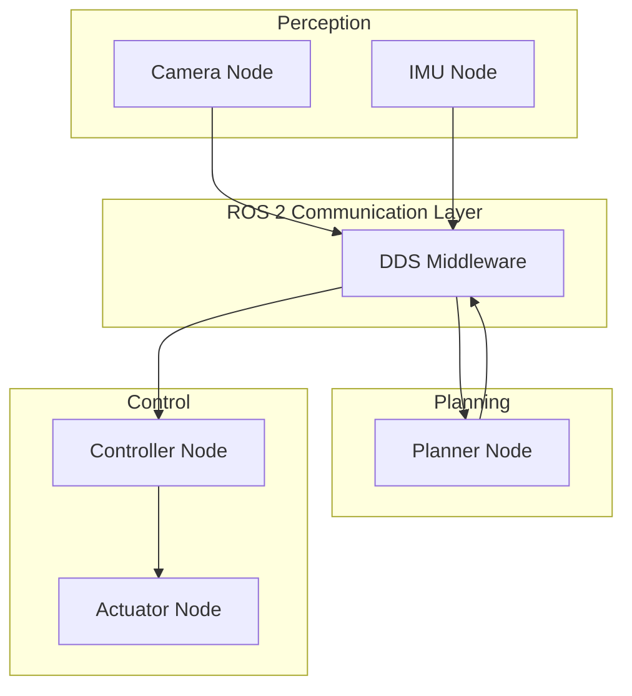

# Module 1: The Robotic Nervous System (ROS 2)

**Duration**: Weeks 1-2
**Prerequisites**: Python 3.10+, Ubuntu 22.04, Basic Linux CLI

---

## Overview

This module teaches ROS 2 as the communication infrastructure for humanoid robots. Like the human nervous system carries signals between brain, sensors, and muscles, ROS 2 carries messages between perception, planning, and actuation components.

## Learning Objectives

By completing this module, you will be able to:

1. Explain ROS 2 architecture and the DDS communication model
2. Create and build ROS 2 packages using colcon
3. Implement publisher and subscriber nodes in Python
4. Design and use custom message types
5. Implement services and actions
6. Create robot descriptions using URDF and XACRO
7. Write launch files for multi-node systems
8. Use lifecycle nodes for safe robot state management
9. Debug ROS 2 systems using CLI tools

## Chapters

| Chapter | Title | Duration |
|---------|-------|----------|
| 1 | [ROS 2 Foundations](chapters/ch01-ros2-foundations.md) | 3-4 hours |
| 2 | [Nodes, Topics, and Messages](chapters/ch02-nodes-topics-messages.md) | 4-5 hours |
| 3 | [Services and Actions](chapters/ch03-services-actions.md) | 4-5 hours |
| 4 | [Robot Description with URDF/XACRO](chapters/ch04-urdf-xacro.md) | 5-6 hours |
| 5 | [Launch Files and Parameters](chapters/ch05-launch-parameters.md) | 3-4 hours |
| 6 | [Lifecycle Nodes and Safety](chapters/ch06-lifecycle-safety.md) | 3-4 hours |
| 7 | [Debugging and Tools](chapters/ch07-debugging-tools.md) | 2-3 hours |

## Code Examples

All code examples are in the `code/` directory:

```
code/
├── humanoid_msgs/          # Custom message definitions
├── humanoid_description/   # URDF and visualization
├── humanoid_control/       # Control nodes
└── humanoid_bringup/       # Launch files
```

## Exercises

Practice exercises are in the `exercises/` directory.

## Architecture Overview



---

**Governed by**: `specs/constitution.md` v1.0.0
