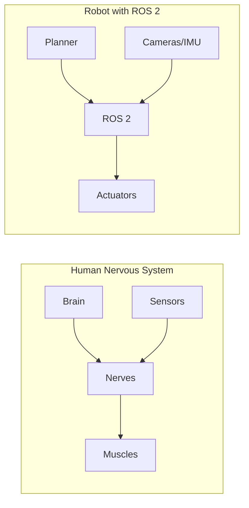
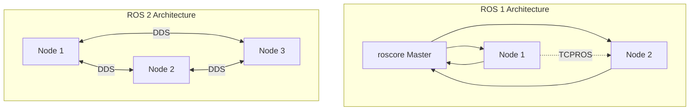
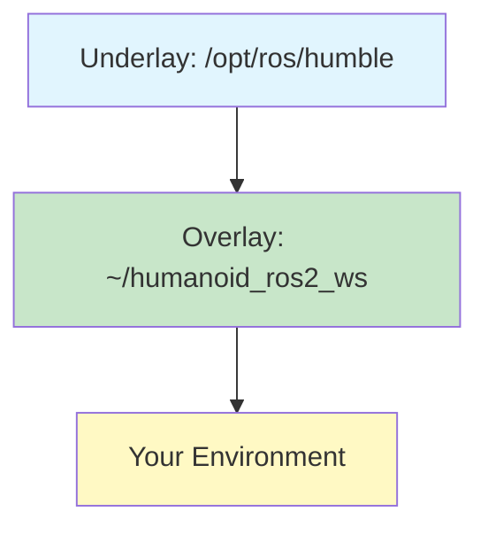
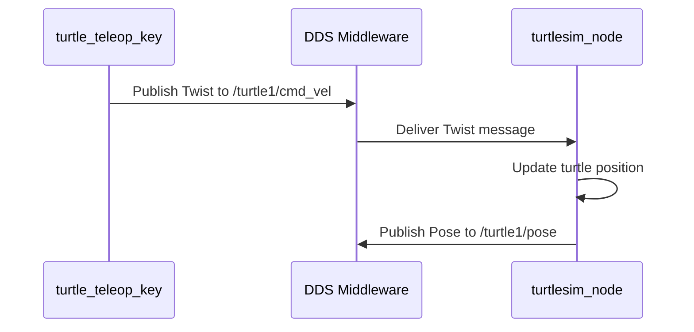
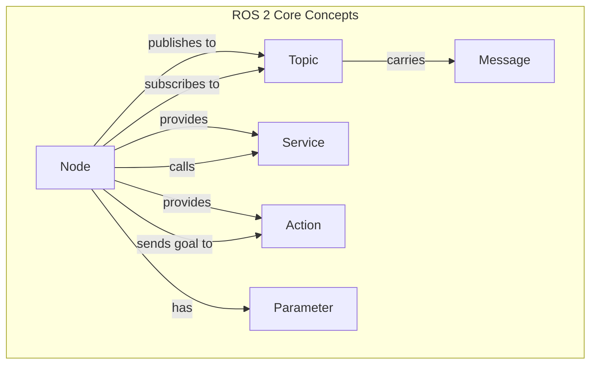

# Chapter 1: ROS 2 Foundations

**Duration**: 3-4 hours
**Difficulty**: Beginner

---

## Learning Objectives

After completing this chapter, you will be able to:

- Explain what ROS 2 is and why it exists
- Describe the differences between ROS 1 and ROS 2
- Install ROS 2 Humble on Ubuntu 22.04
- Create and build a ROS 2 workspace
- Use basic ROS 2 CLI tools

---

## 1.1 What is ROS 2?

**ROS 2** (Robot Operating System 2) is a set of software libraries and tools for building robot applications. Despite its name, ROS 2 is not an operating system. It is middleware that provides:

- **Communication infrastructure**: Message passing between processes
- **Hardware abstraction**: Standard interfaces for sensors and actuators
- **Package management**: Reusable software components
- **Tools**: Visualization, debugging, and simulation

### The Nervous System Analogy

Think of ROS 2 as the nervous system of a robot:



| Human | Robot | ROS 2 Component |
|-------|-------|-----------------|
| Brain | Planning algorithms | Nodes |
| Nerves | Communication | Topics, Services |
| Sensory signals | Sensor data | Messages |
| Motor commands | Joint commands | Messages |

### Why ROS 2 for Humanoid Robots?

Humanoid robots are complex systems with many sensors and actuators that must work together. ROS 2 provides:

1. **Modularity**: Each body part can be a separate node
2. **Real-time support**: Critical for balance and safety
3. **Multi-platform**: Runs on various hardware
4. **Industry adoption**: Used by Boston Dynamics, NVIDIA, and others

---

## 1.2 ROS 2 vs ROS 1

ROS 2 is a complete rewrite of ROS 1, addressing limitations discovered over years of use.

| Feature | ROS 1 | ROS 2 |
|---------|-------|-------|
| Communication | Custom (TCPROS) | DDS standard |
| Master node | Required (roscore) | Not required |
| Real-time | Limited support | Built-in support |
| Security | None | DDS security |
| Platforms | Linux only | Linux, Windows, macOS |
| Python | Python 2/3 | Python 3 only |

### DDS: The Communication Foundation

ROS 2 uses **DDS (Data Distribution Service)**, an industry standard for real-time communication.



Key DDS benefits:

- **No single point of failure**: No master node required
- **Quality of Service (QoS)**: Control reliability, latency, history
- **Discovery**: Nodes find each other automatically
- **Security**: Encrypted communication optional

---

## 1.3 Installing ROS 2 Humble

ROS 2 Humble Hawksbill is a Long Term Support (LTS) release, supported until 2027.

### System Requirements

- Ubuntu 22.04 LTS (Jammy Jellyfish)
- 4 GB RAM minimum (8 GB recommended)
- 20 GB disk space

### Installation Steps

**Step 1: Set locale**

```bash
locale  # Check for UTF-8

sudo apt update && sudo apt install locales
sudo locale-gen en_US en_US.UTF-8
sudo update-locale LC_ALL=en_US.UTF-8 LANG=en_US.UTF-8
export LANG=en_US.UTF-8
```

**Step 2: Add ROS 2 repository**

```bash
sudo apt install software-properties-common
sudo add-apt-repository universe

sudo apt update && sudo apt install curl -y
sudo curl -sSL https://raw.githubusercontent.com/ros/rosdistro/master/ros.key -o /usr/share/keyrings/ros-archive-keyring.gpg

echo "deb [arch=$(dpkg --print-architecture) signed-by=/usr/share/keyrings/ros-archive-keyring.gpg] http://packages.ros.org/ros2/ubuntu $(. /etc/os-release && echo $UBUNTU_CODENAME) main" | sudo tee /etc/apt/sources.list.d/ros2.list > /dev/null
```

**Step 3: Install ROS 2**

```bash
sudo apt update
sudo apt upgrade

# Desktop install (recommended) - includes RViz, demos
sudo apt install ros-humble-desktop

# Development tools
sudo apt install ros-dev-tools
```

**Step 4: Source the setup file**

```bash
# Add to ~/.bashrc for automatic sourcing
echo "source /opt/ros/humble/setup.bash" >> ~/.bashrc
source ~/.bashrc
```

**Step 5: Verify installation**

```bash
ros2 --version
# Expected output: ros2 0.9.x or similar
```

---

## 1.4 ROS 2 Workspace

A **workspace** is a directory containing ROS 2 packages. The standard build tool is **colcon**.

### Workspace Structure

```
humanoid_ros2_ws/           # Workspace root
├── src/                    # Source packages (you edit these)
│   ├── package_1/
│   └── package_2/
├── build/                  # Build artifacts (auto-generated)
├── install/                # Installed packages (auto-generated)
└── log/                    # Build logs (auto-generated)
```

### Creating Your First Workspace

```bash
# Create workspace directory
mkdir -p ~/humanoid_ros2_ws/src
cd ~/humanoid_ros2_ws

# Build empty workspace (initializes structure)
colcon build

# Source the workspace
source install/setup.bash
```

### The Overlay Concept

ROS 2 uses **overlays** to combine multiple workspaces:



- **Underlay**: Base ROS 2 installation (`/opt/ros/humble`)
- **Overlay**: Your custom packages (`~/humanoid_ros2_ws`)

When you source your workspace, packages in the overlay override those in the underlay.

---

## 1.5 Your First ROS 2 Demo: Turtlesim

Turtlesim is a simple simulator for learning ROS 2 concepts.

### Running Turtlesim

**Terminal 1: Start the simulator**

```bash
ros2 run turtlesim turtlesim_node
```

A window appears with a turtle in the center.

**Terminal 2: Control the turtle**

```bash
ros2 run turtlesim turtle_teleop_key
```

Use arrow keys to move the turtle.

### What Just Happened?



Two nodes are communicating:
1. `turtle_teleop_key` publishes velocity commands
2. `turtlesim_node` subscribes and moves the turtle

---

## 1.6 ROS 2 CLI Tools

The `ros2` command-line interface provides tools for introspection and debugging.

### Node Commands

```bash
# List running nodes
ros2 node list
# Output: /turtlesim

# Get info about a node
ros2 node info /turtlesim
# Shows publishers, subscribers, services, actions
```

### Topic Commands

```bash
# List all topics
ros2 topic list
# Output:
# /turtle1/cmd_vel
# /turtle1/pose
# ...

# Show topic info
ros2 topic info /turtle1/cmd_vel
# Type: geometry_msgs/msg/Twist
# Publisher count: 1
# Subscription count: 1

# Echo messages on a topic
ros2 topic echo /turtle1/pose

# Publish a message
ros2 topic pub /turtle1/cmd_vel geometry_msgs/msg/Twist \
  "{linear: {x: 2.0}, angular: {z: 1.0}}"
```

### Service Commands

```bash
# List services
ros2 service list

# Call a service
ros2 service call /clear std_srvs/srv/Empty
```

### Interface Commands

```bash
# Show message definition
ros2 interface show geometry_msgs/msg/Twist
# Output:
# Vector3  linear
# Vector3  angular

# List all interfaces
ros2 interface list
```

---

## 1.7 ROS 2 Concepts Summary



| Concept | Purpose | Communication |
|---------|---------|---------------|
| **Node** | Unit of computation | N/A |
| **Topic** | Publish/subscribe channel | Asynchronous |
| **Message** | Data structure | N/A |
| **Service** | Request/response | Synchronous |
| **Action** | Long-running task | Asynchronous with feedback |
| **Parameter** | Node configuration | N/A |

---

## Hands-On Exercises

### Exercise 1.1: Verify Installation

1. Open a terminal and run:
   ```bash
   ros2 doctor
   ```
2. Fix any warnings or errors reported.

**Expected output**: All checks pass.

### Exercise 1.2: Explore Turtlesim

1. Run turtlesim and teleop as shown above.
2. In a new terminal, list all topics.
3. Echo the `/turtle1/pose` topic.
4. What fields does the Pose message have?

**Record your answers**:
- Number of topics: ____
- Pose message fields: ____

### Exercise 1.3: Command Line Publishing

1. With turtlesim running, publish a velocity command:
   ```bash
   ros2 topic pub --once /turtle1/cmd_vel geometry_msgs/msg/Twist \
     "{linear: {x: 1.0, y: 0.0, z: 0.0}, angular: {x: 0.0, y: 0.0, z: 0.5}}"
   ```
2. Observe the turtle's movement.
3. Modify the command to make the turtle:
   - Move backward
   - Spin in place
   - Move in a circle

### Exercise 1.4: Create a Workspace

1. Create a new workspace:
   ```bash
   mkdir -p ~/my_ros2_ws/src
   cd ~/my_ros2_ws
   colcon build
   source install/setup.bash
   ```
2. Verify with:
   ```bash
   echo $COLCON_PREFIX_PATH
   ```

**Expected output**: Path includes `~/my_ros2_ws/install`

---

## Summary

In this chapter, you learned:

- ROS 2 is middleware for robot communication, not an operating system
- ROS 2 uses DDS for decentralized, real-time communication
- The workspace contains source, build, install, and log directories
- CLI tools (`ros2 node`, `ros2 topic`, etc.) help explore running systems
- Nodes communicate via topics, services, and actions

## Next Chapter

In [Chapter 2](ch02-nodes-topics-messages.md), you will create your own ROS 2 nodes and define custom messages for humanoid robot control.

---

## Quick Reference

```bash
# Environment
source /opt/ros/humble/setup.bash
source ~/humanoid_ros2_ws/install/setup.bash

# Build
cd ~/humanoid_ros2_ws
colcon build
colcon build --packages-select <package_name>

# Introspection
ros2 node list
ros2 topic list
ros2 topic echo <topic>
ros2 topic info <topic>
ros2 service list
ros2 interface show <type>

# Running
ros2 run <package> <executable>
```
