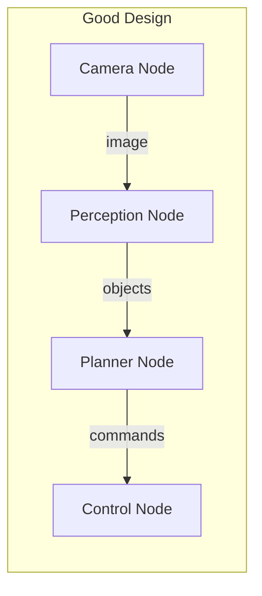
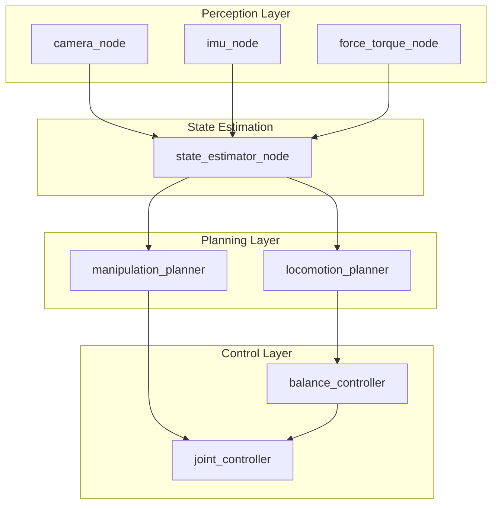
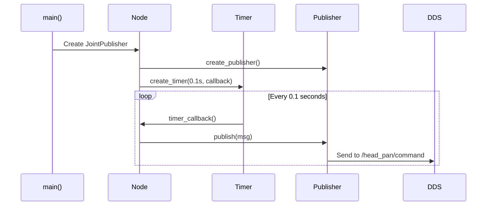
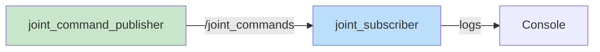

# Chapter 2: Nodes, Topics, and Messages

**Duration**: 4-5 hours
**Difficulty**: Beginner-Intermediate

---

## Learning Objectives

After completing this chapter, you will be able to:

- Create a ROS 2 Python package
- Write publisher and subscriber nodes
- Define custom message types
- Understand Quality of Service (QoS) settings
- Build and run multi-node systems

---

## 2.1 Understanding Nodes

A **node** is the fundamental unit of computation in ROS 2. Each node:

- Performs a specific task
- Runs as a separate process
- Communicates with other nodes via topics, services, or actions

### Node Design Principles



| Principle | Description |
|-----------|-------------|
| Single responsibility | One node, one task |
| Loose coupling | Communicate via standard interfaces |
| Reusability | Nodes can be used in different robots |

### Humanoid Robot Node Architecture



---

## 2.2 Creating a ROS 2 Python Package

### Package Structure

A ROS 2 Python package has this structure:

```
humanoid_control/
├── humanoid_control/           # Python module (same name as package)
│   ├── __init__.py
│   ├── joint_publisher.py
│   └── joint_subscriber.py
├── resource/
│   └── humanoid_control       # Marker file (empty)
├── test/
├── package.xml                # Package metadata
├── setup.py                   # Python build configuration
└── setup.cfg                  # Entry point configuration
```

### Creating the Package

```bash
cd ~/humanoid_ros2_ws/src

# Create Python package
ros2 pkg create --build-type ament_python humanoid_control

# Verify structure
ls humanoid_control/
```

### package.xml

The `package.xml` declares dependencies:

```xml
<?xml version="1.0"?>
<?xml-model href="http://download.ros.org/schema/package_format3.xsd" schematypens="http://www.w3.org/2001/XMLSchema"?>
<package format="3">
  <name>humanoid_control</name>
  <version>0.1.0</version>
  <description>Control nodes for humanoid robot</description>
  <maintainer email="you@example.com">Your Name</maintainer>
  <license>Apache-2.0</license>

  <depend>rclpy</depend>
  <depend>std_msgs</depend>
  <depend>geometry_msgs</depend>
  <depend>humanoid_msgs</depend>

  <test_depend>ament_copyright</test_depend>
  <test_depend>ament_flake8</test_depend>
  <test_depend>ament_pep257</test_depend>
  <test_depend>python3-pytest</test_depend>

  <export>
    <build_type>ament_python</build_type>
  </export>
</package>
```

### setup.py

The `setup.py` configures the Python package:

```python
from setuptools import find_packages, setup

package_name = 'humanoid_control'

setup(
    name=package_name,
    version='0.1.0',
    packages=find_packages(exclude=['test']),
    data_files=[
        ('share/ament_index/resource_index/packages',
            ['resource/' + package_name]),
        ('share/' + package_name, ['package.xml']),
    ],
    install_requires=['setuptools'],
    zip_safe=True,
    maintainer='Your Name',
    maintainer_email='you@example.com',
    description='Control nodes for humanoid robot',
    license='Apache-2.0',
    tests_require=['pytest'],
    entry_points={
        'console_scripts': [
            'joint_publisher = humanoid_control.joint_publisher:main',
            'joint_subscriber = humanoid_control.joint_subscriber:main',
        ],
    },
)
```

---

## 2.3 Writing a Publisher Node

A publisher node sends messages to a topic.

### Basic Publisher: joint_publisher.py

```python
#!/usr/bin/env python3
"""
Joint command publisher for humanoid robot.

This node publishes joint position commands at a fixed rate.
"""

import rclpy
from rclpy.node import Node
from std_msgs.msg import Float64
import math


class JointPublisher(Node):
    """Publishes sinusoidal joint commands for testing."""

    def __init__(self) -> None:
        super().__init__('joint_publisher')

        # Create publisher
        # Arguments: message type, topic name, queue size
        self.publisher = self.create_publisher(
            Float64,
            '/head_pan/command',
            10
        )

        # Create timer for periodic publishing
        # Arguments: period in seconds, callback function
        timer_period = 0.1  # 10 Hz
        self.timer = self.create_timer(timer_period, self.timer_callback)

        # State
        self.time = 0.0

        self.get_logger().info('Joint publisher started')

    def timer_callback(self) -> None:
        """Called periodically to publish joint commands."""
        # Generate sinusoidal motion
        msg = Float64()
        msg.data = 0.5 * math.sin(self.time)  # +/- 0.5 radians

        # Publish
        self.publisher.publish(msg)

        # Log occasionally
        if int(self.time * 10) % 10 == 0:
            self.get_logger().info(f'Publishing: {msg.data:.3f} rad')

        self.time += 0.1


def main(args=None) -> None:
    """Entry point."""
    rclpy.init(args=args)

    node = JointPublisher()

    try:
        rclpy.spin(node)
    except KeyboardInterrupt:
        pass
    finally:
        node.destroy_node()
        rclpy.shutdown()


if __name__ == '__main__':
    main()
```

### Publisher Anatomy



---

## 2.4 Writing a Subscriber Node

A subscriber node receives messages from a topic.

### Basic Subscriber: joint_subscriber.py

```python
#!/usr/bin/env python3
"""
Joint state subscriber for humanoid robot.

This node subscribes to joint commands and logs them.
"""

import rclpy
from rclpy.node import Node
from std_msgs.msg import Float64


class JointSubscriber(Node):
    """Subscribes to joint commands and logs them."""

    def __init__(self) -> None:
        super().__init__('joint_subscriber')

        # Create subscription
        self.subscription = self.create_subscription(
            Float64,
            '/head_pan/command',
            self.command_callback,
            10
        )

        # Track statistics
        self.message_count = 0

        self.get_logger().info('Joint subscriber started')

    def command_callback(self, msg: Float64) -> None:
        """Called when a message is received."""
        self.message_count += 1

        self.get_logger().info(
            f'Received command #{self.message_count}: {msg.data:.3f} rad'
        )


def main(args=None) -> None:
    """Entry point."""
    rclpy.init(args=args)

    node = JointSubscriber()

    try:
        rclpy.spin(node)
    except KeyboardInterrupt:
        pass
    finally:
        node.destroy_node()
        rclpy.shutdown()


if __name__ == '__main__':
    main()
```

---

## 2.5 Custom Message Types

Standard messages (`std_msgs`, `geometry_msgs`) cover many cases, but robots often need custom messages.

### Creating the humanoid_msgs Package

```bash
cd ~/humanoid_ros2_ws/src

# Create CMake package for messages
ros2 pkg create --build-type ament_cmake humanoid_msgs
```

### Directory Structure

```
humanoid_msgs/
├── msg/
│   ├── JointCommand.msg
│   ├── JointState.msg
│   └── RobotState.msg
├── srv/
│   └── GetJointLimits.srv
├── action/
│   └── MoveToPosition.action
├── CMakeLists.txt
└── package.xml
```

### JointCommand.msg

```
# Command for a single joint
# Used to send position, velocity, or effort targets

string joint_name           # Name of the joint (e.g., "head_pan")
float64 position            # Target position in radians
float64 velocity            # Target velocity in rad/s
float64 effort              # Target effort (torque) in Nm
builtin_interfaces/Time stamp  # Timestamp of command
```

### JointState.msg

```
# State of multiple joints
# Similar to sensor_msgs/JointState but simplified

string[] joint_names        # Names of joints
float64[] positions         # Current positions in radians
float64[] velocities        # Current velocities in rad/s
float64[] efforts           # Current efforts in Nm
builtin_interfaces/Time stamp  # Timestamp of reading
```

### RobotState.msg

```
# Complete state of the humanoid robot

std_msgs/Header header

# Joint information
humanoid_msgs/JointState joint_state

# Base pose and velocity
geometry_msgs/Pose base_pose      # Position and orientation
geometry_msgs/Twist base_twist    # Linear and angular velocity

# Safety status
bool emergency_stop               # True if e-stop is active
```

### CMakeLists.txt for Messages

```cmake
cmake_minimum_required(VERSION 3.8)
project(humanoid_msgs)

if(CMAKE_COMPILER_IS_GNUCXX OR CMAKE_CXX_COMPILER_ID MATCHES "Clang")
  add_compile_options(-Wall -Wextra -Wpedantic)
endif()

# Find dependencies
find_package(ament_cmake REQUIRED)
find_package(builtin_interfaces REQUIRED)
find_package(std_msgs REQUIRED)
find_package(geometry_msgs REQUIRED)
find_package(rosidl_default_generators REQUIRED)

# Generate interfaces
rosidl_generate_interfaces(${PROJECT_NAME}
  "msg/JointCommand.msg"
  "msg/JointState.msg"
  "msg/RobotState.msg"
  "srv/GetJointLimits.srv"
  "action/MoveToPosition.action"
  DEPENDENCIES builtin_interfaces std_msgs geometry_msgs
)

ament_package()
```

### package.xml for Messages

```xml
<?xml version="1.0"?>
<package format="3">
  <name>humanoid_msgs</name>
  <version>0.1.0</version>
  <description>Custom messages for humanoid robot</description>
  <maintainer email="you@example.com">Your Name</maintainer>
  <license>Apache-2.0</license>

  <buildtool_depend>ament_cmake</buildtool_depend>
  <buildtool_depend>rosidl_default_generators</buildtool_depend>

  <depend>builtin_interfaces</depend>
  <depend>std_msgs</depend>
  <depend>geometry_msgs</depend>

  <exec_depend>rosidl_default_runtime</exec_depend>

  <member_of_group>rosidl_interface_packages</member_of_group>

  <export>
    <build_type>ament_cmake</build_type>
  </export>
</package>
```

### Building and Verifying Messages

```bash
cd ~/humanoid_ros2_ws
colcon build --packages-select humanoid_msgs
source install/setup.bash

# Verify messages are available
ros2 interface show humanoid_msgs/msg/JointCommand
```

---

## 2.6 Using Custom Messages

### Updated Publisher with Custom Message

```python
#!/usr/bin/env python3
"""
Joint command publisher using custom message type.
"""

import rclpy
from rclpy.node import Node
from humanoid_msgs.msg import JointCommand
from builtin_interfaces.msg import Time
import math


class JointCommandPublisher(Node):
    """Publishes joint commands using custom message."""

    def __init__(self) -> None:
        super().__init__('joint_command_publisher')

        # Declare parameters
        self.declare_parameter('joint_name', 'head_pan')
        self.declare_parameter('publish_rate', 10.0)
        self.declare_parameter('amplitude', 0.5)

        # Get parameters
        self.joint_name = self.get_parameter('joint_name').value
        rate = self.get_parameter('publish_rate').value
        self.amplitude = self.get_parameter('amplitude').value

        # Create publisher
        self.publisher = self.create_publisher(
            JointCommand,
            '/joint_commands',
            10
        )

        # Timer
        self.timer = self.create_timer(1.0 / rate, self.publish_command)
        self.time = 0.0

        self.get_logger().info(
            f'Publishing commands for {self.joint_name} at {rate} Hz'
        )

    def publish_command(self) -> None:
        """Publish a joint command."""
        msg = JointCommand()

        # Fill message fields
        msg.joint_name = self.joint_name
        msg.position = self.amplitude * math.sin(self.time)
        msg.velocity = self.amplitude * math.cos(self.time)
        msg.effort = 0.0

        # Set timestamp
        now = self.get_clock().now()
        msg.stamp = now.to_msg()

        self.publisher.publish(msg)
        self.time += 0.1


def main(args=None) -> None:
    rclpy.init(args=args)
    node = JointCommandPublisher()

    try:
        rclpy.spin(node)
    except KeyboardInterrupt:
        pass
    finally:
        node.destroy_node()
        rclpy.shutdown()


if __name__ == '__main__':
    main()
```

---

## 2.7 Quality of Service (QoS)

QoS policies control message delivery behavior.

### Common QoS Profiles

```python
from rclpy.qos import QoSProfile, ReliabilityPolicy, HistoryPolicy, DurabilityPolicy

# Sensor data: best effort, keep last
sensor_qos = QoSProfile(
    reliability=ReliabilityPolicy.BEST_EFFORT,
    history=HistoryPolicy.KEEP_LAST,
    depth=5
)

# Control commands: reliable
control_qos = QoSProfile(
    reliability=ReliabilityPolicy.RELIABLE,
    history=HistoryPolicy.KEEP_LAST,
    depth=10
)

# Parameters: reliable, transient local (late joiners get last value)
param_qos = QoSProfile(
    reliability=ReliabilityPolicy.RELIABLE,
    durability=DurabilityPolicy.TRANSIENT_LOCAL,
    history=HistoryPolicy.KEEP_LAST,
    depth=1
)
```

### QoS Policy Reference

| Policy | Options | Use Case |
|--------|---------|----------|
| **Reliability** | RELIABLE, BEST_EFFORT | Control vs sensor data |
| **Durability** | VOLATILE, TRANSIENT_LOCAL | Late-joining subscribers |
| **History** | KEEP_LAST, KEEP_ALL | Buffer management |
| **Depth** | Integer | Queue size |

### Using QoS in Publishers/Subscribers

```python
from rclpy.qos import qos_profile_sensor_data

# Subscriber with sensor QoS
self.subscription = self.create_subscription(
    JointState,
    '/joint_states',
    self.callback,
    qos_profile_sensor_data  # Built-in profile
)
```

---

## 2.8 Complete Example: Humanoid Joint System



### Running the System

**Terminal 1: Build and source**
```bash
cd ~/humanoid_ros2_ws
colcon build
source install/setup.bash
```

**Terminal 2: Run publisher**
```bash
ros2 run humanoid_control joint_command_publisher
```

**Terminal 3: Run subscriber**
```bash
ros2 run humanoid_control joint_subscriber
```

**Terminal 4: Inspect**
```bash
ros2 topic list
ros2 topic echo /joint_commands
ros2 topic hz /joint_commands
```

---

## Hands-On Exercises

### Exercise 2.1: Create a Package

1. Create a new package `my_humanoid_test`:
   ```bash
   cd ~/humanoid_ros2_ws/src
   ros2 pkg create --build-type ament_python my_humanoid_test
   ```
2. Add a simple publisher node
3. Build and run it

### Exercise 2.2: Multi-Joint Publisher

Modify the publisher to:
1. Publish commands for multiple joints: `head_pan`, `left_shoulder_pitch`, `right_shoulder_pitch`
2. Each joint moves with a different frequency
3. Use an array message or multiple publishers

### Exercise 2.3: Message Statistics Node

Create a node that:
1. Subscribes to `/joint_commands`
2. Tracks: message count, average rate, min/max values
3. Publishes statistics to `/joint_stats` every second

### Exercise 2.4: Custom Message

1. Add a new message `JointError.msg`:
   ```
   string joint_name
   float64 position_error
   float64 velocity_error
   builtin_interfaces/Time stamp
   ```
2. Create a node that computes error between commanded and actual (simulated)

---

## Summary

In this chapter, you learned:

- Nodes are independent processes that perform specific tasks
- Publishers send messages to topics
- Subscribers receive messages from topics
- Custom messages define robot-specific data structures
- QoS policies control delivery behavior

## Next Chapter

In [Chapter 3](ch03-services-actions.md), you will learn about services for synchronous communication and actions for long-running tasks.

---

## Quick Reference

```python
# Publisher
self.publisher = self.create_publisher(MsgType, 'topic', 10)
self.publisher.publish(msg)

# Subscriber
self.subscription = self.create_subscription(
    MsgType, 'topic', callback, 10)

# Timer
self.timer = self.create_timer(period, callback)

# Parameters
self.declare_parameter('name', default_value)
value = self.get_parameter('name').value

# Logging
self.get_logger().info('message')
self.get_logger().warn('warning')
self.get_logger().error('error')
```
