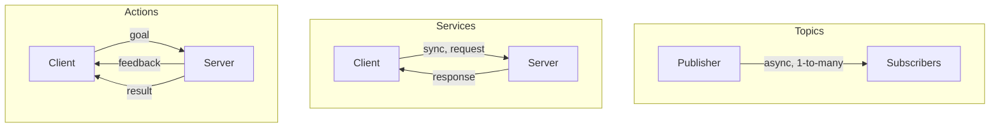
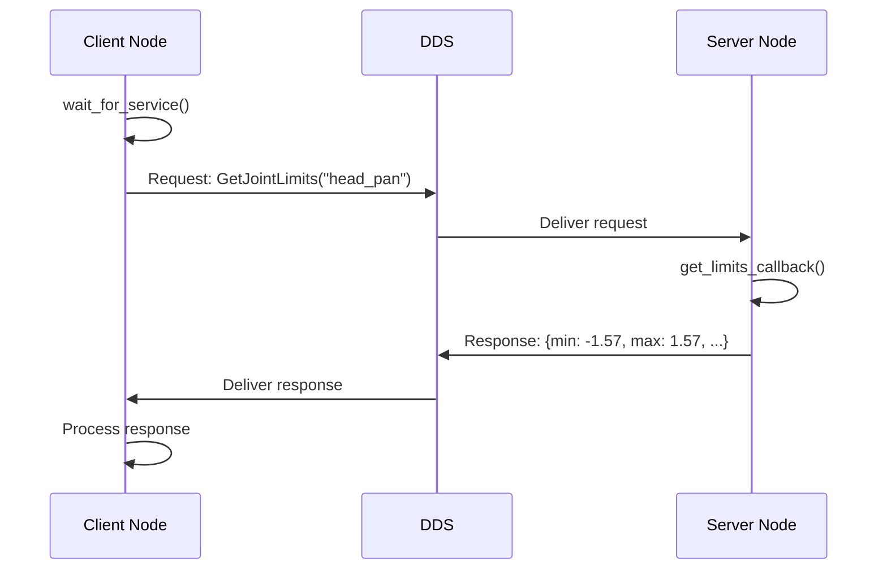
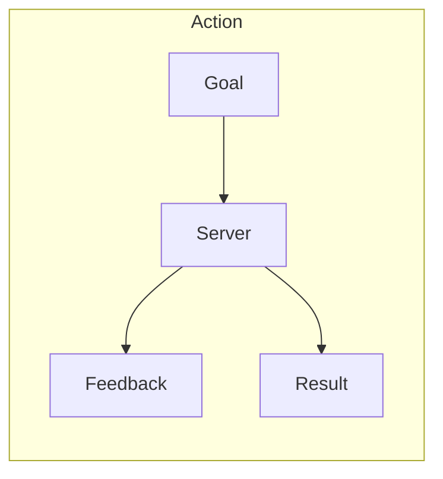
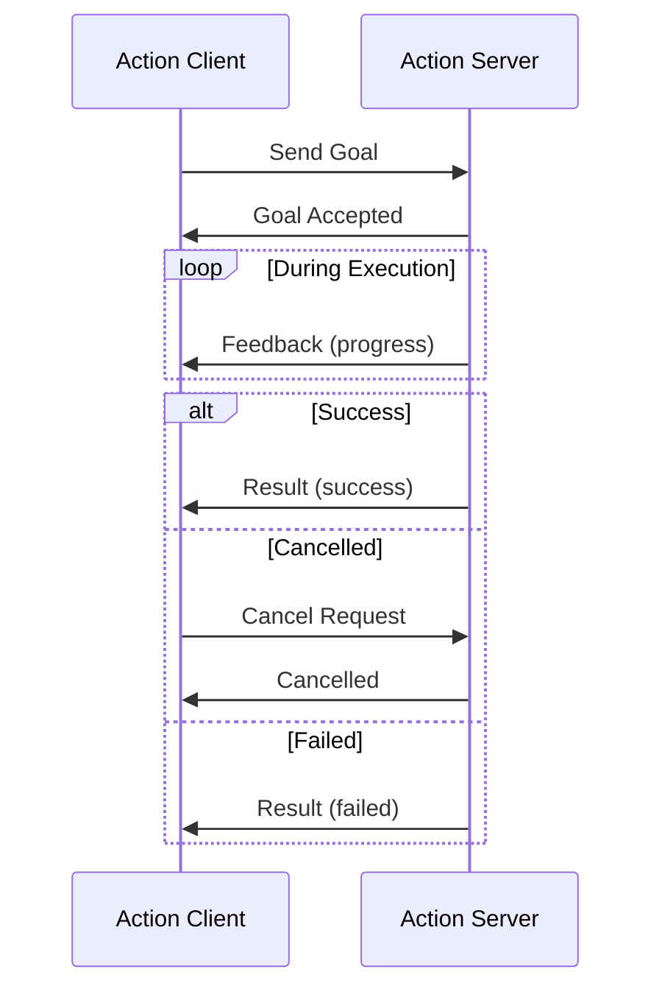
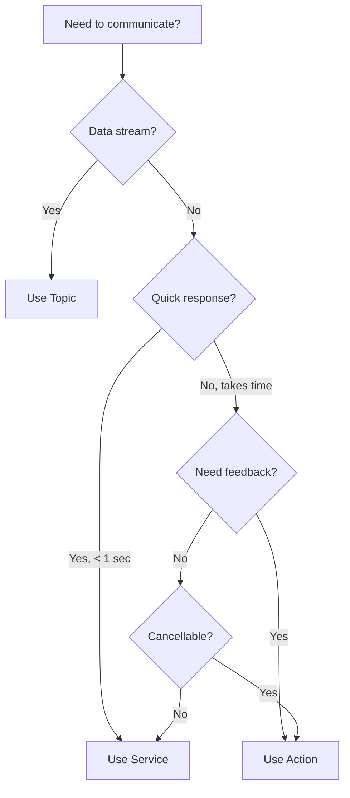

# Chapter 3: Services and Actions

**Duration**: 4-5 hours
**Difficulty**: Intermediate

---

## Learning Objectives

After completing this chapter, you will be able to:

- Explain when to use services vs topics
- Define and implement ROS 2 services
- Create service clients for synchronous calls
- Define and implement ROS 2 actions
- Handle action feedback and cancellation
- Choose the right communication pattern for each task

---

## 3.1 Communication Patterns

ROS 2 provides three main communication patterns:



| Pattern | Use Case | Blocking? | Feedback? |
|---------|----------|-----------|-----------|
| **Topic** | Continuous data streams | No | No |
| **Service** | Quick request/response | Yes | No |
| **Action** | Long-running tasks | No | Yes |

### Humanoid Robot Examples

| Task | Pattern | Reason |
|------|---------|--------|
| Stream joint states | Topic | Continuous, 100 Hz |
| Get joint limits | Service | Quick query, one-time |
| Move arm to position | Action | Takes time, need progress |
| Emergency stop | Topic | Must not block |
| Calibrate sensors | Action | Long process, cancellable |

---

## 3.2 Services

A **service** provides synchronous request/response communication.

### Service Definition

Services are defined in `.srv` files with request and response sections:

**srv/GetJointLimits.srv**
```
# Request
string joint_name
---
# Response
float64 min_position
float64 max_position
float64 max_velocity
float64 max_effort
bool success
string message
```

**srv/SetJointPosition.srv**
```
# Request
string joint_name
float64 position
float64 max_velocity
---
# Response
bool success
string message
```

### Service Server

```python
#!/usr/bin/env python3
"""
Joint limits service server.

Provides joint limit information for the humanoid robot.
"""

import rclpy
from rclpy.node import Node
from humanoid_msgs.srv import GetJointLimits


class JointLimitsServer(Node):
    """Service server that returns joint limits."""

    # Joint limits configuration
    JOINT_LIMITS = {
        'head_pan': {
            'min_position': -1.57,
            'max_position': 1.57,
            'max_velocity': 2.0,
            'max_effort': 10.0
        },
        'left_shoulder_pitch': {
            'min_position': -3.14,
            'max_position': 1.57,
            'max_velocity': 1.5,
            'max_effort': 50.0
        },
        'left_elbow': {
            'min_position': 0.0,
            'max_position': 2.5,
            'max_velocity': 2.0,
            'max_effort': 30.0
        },
        # Add more joints as needed
    }

    def __init__(self) -> None:
        super().__init__('joint_limits_server')

        # Create service
        self.service = self.create_service(
            GetJointLimits,
            '/get_joint_limits',
            self.get_limits_callback
        )

        self.get_logger().info('Joint limits service ready')

    def get_limits_callback(
        self,
        request: GetJointLimits.Request,
        response: GetJointLimits.Response
    ) -> GetJointLimits.Response:
        """Handle service request."""

        joint_name = request.joint_name
        self.get_logger().info(f'Received request for: {joint_name}')

        if joint_name in self.JOINT_LIMITS:
            limits = self.JOINT_LIMITS[joint_name]
            response.min_position = limits['min_position']
            response.max_position = limits['max_position']
            response.max_velocity = limits['max_velocity']
            response.max_effort = limits['max_effort']
            response.success = True
            response.message = f'Limits for {joint_name}'
        else:
            response.success = False
            response.message = f'Unknown joint: {joint_name}'

        return response


def main(args=None) -> None:
    rclpy.init(args=args)
    node = JointLimitsServer()

    try:
        rclpy.spin(node)
    except KeyboardInterrupt:
        pass
    finally:
        node.destroy_node()
        rclpy.shutdown()


if __name__ == '__main__':
    main()
```

### Service Client

```python
#!/usr/bin/env python3
"""
Joint limits service client.

Queries joint limits from the service server.
"""

import sys
import rclpy
from rclpy.node import Node
from humanoid_msgs.srv import GetJointLimits


class JointLimitsClient(Node):
    """Service client that queries joint limits."""

    def __init__(self) -> None:
        super().__init__('joint_limits_client')

        # Create client
        self.client = self.create_client(
            GetJointLimits,
            '/get_joint_limits'
        )

        # Wait for service to be available
        while not self.client.wait_for_service(timeout_sec=1.0):
            self.get_logger().info('Waiting for service...')

    def send_request(self, joint_name: str) -> GetJointLimits.Response:
        """Send request and wait for response."""
        request = GetJointLimits.Request()
        request.joint_name = joint_name

        # Call service (blocking)
        future = self.client.call_async(request)
        rclpy.spin_until_future_complete(self, future)

        return future.result()


def main(args=None) -> None:
    rclpy.init(args=args)

    client = JointLimitsClient()

    # Get joint name from command line or use default
    joint_name = sys.argv[1] if len(sys.argv) > 1 else 'head_pan'

    response = client.send_request(joint_name)

    if response.success:
        print(f'\nJoint: {joint_name}')
        print(f'  Position: [{response.min_position:.2f}, {response.max_position:.2f}] rad')
        print(f'  Max velocity: {response.max_velocity:.2f} rad/s')
        print(f'  Max effort: {response.max_effort:.2f} Nm')
    else:
        print(f'Error: {response.message}')

    client.destroy_node()
    rclpy.shutdown()


if __name__ == '__main__':
    main()
```

### Service Communication Flow



### Testing Services via CLI

```bash
# List services
ros2 service list

# Show service type
ros2 service type /get_joint_limits

# Call service from command line
ros2 service call /get_joint_limits humanoid_msgs/srv/GetJointLimits \
  "{joint_name: 'head_pan'}"
```

---

## 3.3 Actions

An **action** is for long-running tasks that need feedback and can be cancelled.

### Action Components



| Component | Purpose |
|-----------|---------|
| **Goal** | What to achieve |
| **Feedback** | Progress updates during execution |
| **Result** | Final outcome when complete |

### Action Definition

**action/MoveToPosition.action**
```
# Goal - what to achieve
string joint_name
float64 target_position
float64 max_velocity
---
# Result - final outcome
float64 final_position
float64 error
bool success
string message
---
# Feedback - progress updates
float64 current_position
float64 remaining_distance
float64 elapsed_time
```

### Action Server

```python
#!/usr/bin/env python3
"""
Move to position action server.

Moves a joint to a target position with feedback.
"""

import time
import rclpy
from rclpy.node import Node
from rclpy.action import ActionServer, CancelResponse, GoalResponse
from rclpy.callback_groups import ReentrantCallbackGroup
from humanoid_msgs.action import MoveToPosition


class MoveActionServer(Node):
    """Action server for moving joints to target positions."""

    def __init__(self) -> None:
        super().__init__('move_action_server')

        # Simulated joint positions
        self.joint_positions = {
            'head_pan': 0.0,
            'left_shoulder_pitch': 0.0,
            'left_elbow': 0.0,
        }

        # Create action server
        self._action_server = ActionServer(
            self,
            MoveToPosition,
            '/move_to_position',
            execute_callback=self.execute_callback,
            goal_callback=self.goal_callback,
            cancel_callback=self.cancel_callback,
            callback_group=ReentrantCallbackGroup()
        )

        self.get_logger().info('Move action server ready')

    def goal_callback(self, goal_request) -> GoalResponse:
        """Accept or reject a goal."""
        joint_name = goal_request.joint_name

        if joint_name not in self.joint_positions:
            self.get_logger().warn(f'Unknown joint: {joint_name}')
            return GoalResponse.REJECT

        self.get_logger().info(
            f'Accepted goal: {joint_name} -> {goal_request.target_position:.2f}'
        )
        return GoalResponse.ACCEPT

    def cancel_callback(self, goal_handle) -> CancelResponse:
        """Accept or reject a cancel request."""
        self.get_logger().info('Received cancel request')
        return CancelResponse.ACCEPT

    async def execute_callback(self, goal_handle):
        """Execute the action."""
        self.get_logger().info('Executing goal...')

        joint_name = goal_handle.request.joint_name
        target = goal_handle.request.target_position
        max_vel = goal_handle.request.max_velocity

        current = self.joint_positions[joint_name]
        start_time = time.time()

        # Simulate motion
        feedback_msg = MoveToPosition.Feedback()
        rate = 0.05  # 20 Hz

        while abs(target - current) > 0.01:
            # Check for cancellation
            if goal_handle.is_cancel_requested:
                goal_handle.canceled()
                result = MoveToPosition.Result()
                result.final_position = current
                result.success = False
                result.message = 'Cancelled'
                return result

            # Simulate motion step
            direction = 1.0 if target > current else -1.0
            step = min(max_vel * rate, abs(target - current))
            current += direction * step

            # Update simulated position
            self.joint_positions[joint_name] = current

            # Publish feedback
            feedback_msg.current_position = current
            feedback_msg.remaining_distance = abs(target - current)
            feedback_msg.elapsed_time = time.time() - start_time
            goal_handle.publish_feedback(feedback_msg)

            time.sleep(rate)

        # Success
        goal_handle.succeed()

        result = MoveToPosition.Result()
        result.final_position = current
        result.error = abs(target - current)
        result.success = True
        result.message = 'Motion complete'

        self.get_logger().info(
            f'Goal succeeded: {joint_name} at {current:.3f}'
        )

        return result


def main(args=None) -> None:
    rclpy.init(args=args)
    node = MoveActionServer()

    try:
        rclpy.spin(node)
    except KeyboardInterrupt:
        pass
    finally:
        node.destroy_node()
        rclpy.shutdown()


if __name__ == '__main__':
    main()
```

### Action Client

```python
#!/usr/bin/env python3
"""
Move to position action client.

Sends goals and displays feedback.
"""

import sys
import rclpy
from rclpy.node import Node
from rclpy.action import ActionClient
from humanoid_msgs.action import MoveToPosition


class MoveActionClient(Node):
    """Action client for moving joints."""

    def __init__(self) -> None:
        super().__init__('move_action_client')

        self._action_client = ActionClient(
            self,
            MoveToPosition,
            '/move_to_position'
        )

    def send_goal(
        self,
        joint_name: str,
        target_position: float,
        max_velocity: float = 1.0
    ) -> None:
        """Send a goal and wait for result."""

        # Wait for server
        self.get_logger().info('Waiting for action server...')
        self._action_client.wait_for_server()

        # Create goal
        goal_msg = MoveToPosition.Goal()
        goal_msg.joint_name = joint_name
        goal_msg.target_position = target_position
        goal_msg.max_velocity = max_velocity

        self.get_logger().info(
            f'Sending goal: {joint_name} -> {target_position:.2f}'
        )

        # Send goal with feedback callback
        send_goal_future = self._action_client.send_goal_async(
            goal_msg,
            feedback_callback=self.feedback_callback
        )
        send_goal_future.add_done_callback(self.goal_response_callback)

    def goal_response_callback(self, future) -> None:
        """Handle goal acceptance/rejection."""
        goal_handle = future.result()

        if not goal_handle.accepted:
            self.get_logger().error('Goal rejected')
            return

        self.get_logger().info('Goal accepted')

        # Get result
        result_future = goal_handle.get_result_async()
        result_future.add_done_callback(self.result_callback)

    def feedback_callback(self, feedback_msg) -> None:
        """Handle feedback during execution."""
        feedback = feedback_msg.feedback
        self.get_logger().info(
            f'Feedback: pos={feedback.current_position:.3f}, '
            f'remaining={feedback.remaining_distance:.3f}, '
            f'time={feedback.elapsed_time:.2f}s'
        )

    def result_callback(self, future) -> None:
        """Handle final result."""
        result = future.result().result

        if result.success:
            self.get_logger().info(
                f'Success! Final position: {result.final_position:.3f}, '
                f'error: {result.error:.4f}'
            )
        else:
            self.get_logger().warn(f'Failed: {result.message}')

        rclpy.shutdown()


def main(args=None) -> None:
    rclpy.init(args=args)

    client = MoveActionClient()

    # Parse command line: joint_name target_position [max_velocity]
    joint = sys.argv[1] if len(sys.argv) > 1 else 'head_pan'
    target = float(sys.argv[2]) if len(sys.argv) > 2 else 1.0
    velocity = float(sys.argv[3]) if len(sys.argv) > 3 else 0.5

    client.send_goal(joint, target, velocity)

    rclpy.spin(client)


if __name__ == '__main__':
    main()
```

### Action Communication Flow



### Testing Actions via CLI

```bash
# List actions
ros2 action list

# Show action type
ros2 action type /move_to_position

# Send goal
ros2 action send_goal /move_to_position humanoid_msgs/action/MoveToPosition \
  "{joint_name: 'head_pan', target_position: 1.0, max_velocity: 0.5}" \
  --feedback
```

---

## 3.4 Choosing the Right Pattern

### Decision Flowchart



### Pattern Selection Table

| Scenario | Pattern | Reason |
|----------|---------|--------|
| Joint state at 100 Hz | Topic | Continuous stream |
| Camera images | Topic | High-rate data |
| Get robot parameters | Service | Quick query |
| Check battery level | Service | Quick query |
| Move arm to position | Action | Long-running, need progress |
| Walk to waypoint | Action | Long-running, cancellable |
| Execute trajectory | Action | Need feedback, cancellable |
| Emergency stop | Topic | Must not block, broadcast |

---

## 3.5 Error Handling

### Service Error Handling

```python
def send_request(self, joint_name: str):
    """Send request with error handling."""
    if not self.client.service_is_ready():
        self.get_logger().error('Service not available')
        return None

    request = GetJointLimits.Request()
    request.joint_name = joint_name

    try:
        future = self.client.call_async(request)
        rclpy.spin_until_future_complete(self, future, timeout_sec=5.0)

        if future.done():
            return future.result()
        else:
            self.get_logger().error('Service call timed out')
            return None

    except Exception as e:
        self.get_logger().error(f'Service call failed: {e}')
        return None
```

### Action Error Handling

```python
async def execute_callback(self, goal_handle):
    """Execute with error handling."""
    try:
        # ... execution logic ...

        if some_error_condition:
            goal_handle.abort()
            result = MoveToPosition.Result()
            result.success = False
            result.message = 'Error: joint limit exceeded'
            return result

    except Exception as e:
        self.get_logger().error(f'Execution failed: {e}')
        goal_handle.abort()
        result = MoveToPosition.Result()
        result.success = False
        result.message = str(e)
        return result
```

---

## Hands-On Exercises

### Exercise 3.1: Implement SetJointPosition Service

1. Create a service server for `SetJointPosition`
2. Validate the requested position against limits
3. Return success/failure with appropriate message

### Exercise 3.2: Batch Joint Query Client

Create a client that:
1. Queries limits for all joints in a list
2. Displays results in a formatted table
3. Handles unknown joints gracefully

### Exercise 3.3: Trajectory Action

1. Define `ExecuteTrajectory.action` with waypoints
2. Implement server that interpolates between waypoints
3. Publish feedback with progress percentage
4. Support cancellation mid-trajectory

### Exercise 3.4: Action with Timeout

Modify the action client to:
1. Set a timeout for goal completion
2. Cancel the goal if timeout expires
3. Report timeout vs normal completion

---

## Summary

In this chapter, you learned:

- Services are for quick request/response operations
- Actions are for long-running tasks with feedback
- Use goal/feedback/result pattern for actions
- Handle errors and cancellation properly
- Choose the right pattern based on requirements

## Next Chapter

In [Chapter 4](ch04-urdf-xacro.md), you will create robot descriptions using URDF and XACRO.

---

## Quick Reference

```python
# Service Server
self.service = self.create_service(SrvType, 'name', callback)

# Service Client
self.client = self.create_client(SrvType, 'name')
future = self.client.call_async(request)

# Action Server
ActionServer(self, ActionType, 'name',
             execute_callback=...,
             goal_callback=...,
             cancel_callback=...)

# Action Client
ActionClient(self, ActionType, 'name')
self._action_client.send_goal_async(goal, feedback_callback=...)
```

```bash
# CLI
ros2 service call /name pkg/srv/Type "{field: value}"
ros2 action send_goal /name pkg/action/Type "{...}" --feedback
```
