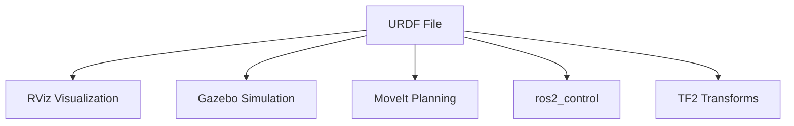
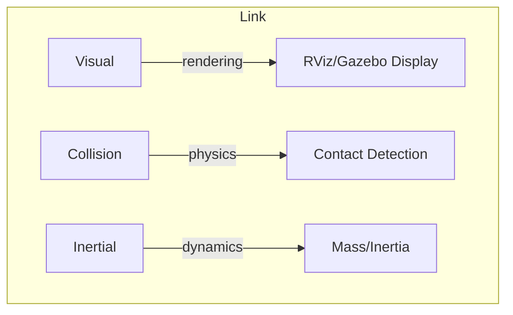
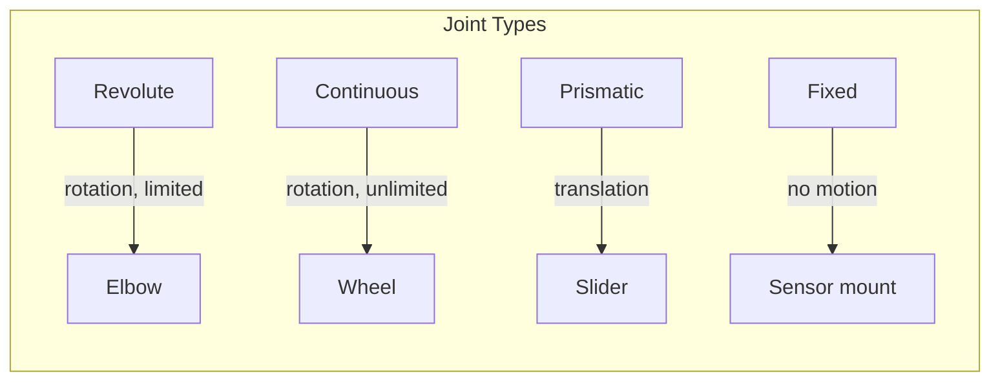
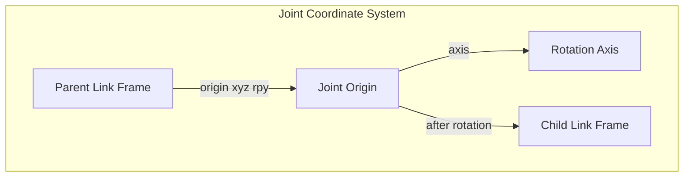
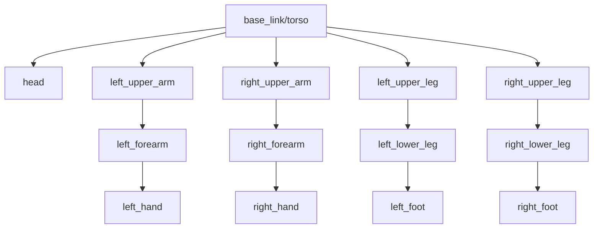

# Chapter 4: Robot Description with URDF/XACRO

**Duration**: 5-6 hours
**Difficulty**: Intermediate

---

## Learning Objectives

After completing this chapter, you will be able to:

- Explain the purpose and structure of URDF files
- Create links with visual, collision, and inertial properties
- Define joints and their limits
- Use XACRO for macros and parameters
- Visualize robots in RViz2
- Debug common URDF errors

---

## 4.1 Introduction to URDF

**URDF** (Unified Robot Description Format) is an XML format for describing robot geometry, kinematics, and dynamics.

### Why URDF?



A single URDF file enables:
- Visualization in RViz2
- Physics simulation in Gazebo
- Motion planning with MoveIt2
- Transform computation with TF2

### URDF Structure Overview

```xml
<?xml version="1.0"?>
<robot name="humanoid">
  <!-- Links define rigid bodies -->
  <link name="base_link">
    <visual>...</visual>
    <collision>...</collision>
    <inertial>...</inertial>
  </link>

  <!-- Joints connect links -->
  <joint name="joint1" type="revolute">
    <parent link="base_link"/>
    <child link="link1"/>
    <origin xyz="0 0 0.5" rpy="0 0 0"/>
    <axis xyz="0 0 1"/>
    <limit lower="-1.57" upper="1.57" effort="10" velocity="1"/>
  </joint>

  <link name="link1">...</link>
</robot>
```

---

## 4.2 Links

A **link** represents a rigid body in the robot.

### Link Components



| Component | Purpose | Used By |
|-----------|---------|---------|
| **Visual** | Display geometry | RViz, Gazebo rendering |
| **Collision** | Contact detection | Gazebo physics |
| **Inertial** | Mass and inertia | Gazebo dynamics |

### Visual Element

```xml
<link name="torso">
  <visual>
    <!-- Position/rotation relative to link origin -->
    <origin xyz="0 0 0" rpy="0 0 0"/>

    <!-- Geometry: box, cylinder, sphere, or mesh -->
    <geometry>
      <box size="0.3 0.2 0.5"/>  <!-- x y z dimensions -->
    </geometry>

    <!-- Appearance -->
    <material name="silver">
      <color rgba="0.7 0.7 0.7 1.0"/>
    </material>
  </visual>
</link>
```

### Geometry Types

```xml
<!-- Box -->
<geometry>
  <box size="0.3 0.2 0.5"/>  <!-- width depth height -->
</geometry>

<!-- Cylinder -->
<geometry>
  <cylinder radius="0.05" length="0.3"/>
</geometry>

<!-- Sphere -->
<geometry>
  <sphere radius="0.1"/>
</geometry>

<!-- Mesh file -->
<geometry>
  <mesh filename="package://humanoid_description/meshes/torso.stl"
        scale="0.001 0.001 0.001"/>
</geometry>
```

### Collision Element

Usually simplified geometry for faster computation:

```xml
<collision>
  <origin xyz="0 0 0" rpy="0 0 0"/>
  <geometry>
    <!-- Often a bounding box instead of detailed mesh -->
    <box size="0.32 0.22 0.52"/>
  </geometry>
</collision>
```

### Inertial Element

Mass and moments of inertia for dynamics:

```xml
<inertial>
  <origin xyz="0 0 0" rpy="0 0 0"/>
  <mass value="5.0"/>  <!-- kg -->
  <inertia
    ixx="0.1" ixy="0" ixz="0"
    iyy="0.1" iyz="0"
    izz="0.05"/>
</inertial>
```

### Inertia Formulas

| Shape | Ixx | Iyy | Izz |
|-------|-----|-----|-----|
| Box (w,d,h) | m(d²+h²)/12 | m(w²+h²)/12 | m(w²+d²)/12 |
| Cylinder (r,l) | m(3r²+l²)/12 | m(3r²+l²)/12 | mr²/2 |
| Sphere (r) | 2mr²/5 | 2mr²/5 | 2mr²/5 |

---

## 4.3 Joints

A **joint** connects two links and defines their relative motion.

### Joint Types



| Type | Motion | Limits | Use Case |
|------|--------|--------|----------|
| **revolute** | Rotation | Yes | Most joints |
| **continuous** | Rotation | No | Wheels |
| **prismatic** | Translation | Yes | Linear actuators |
| **fixed** | None | N/A | Rigid attachment |
| **floating** | 6-DOF | No | Base link |
| **planar** | 2D translation | No | Special cases |

### Revolute Joint Example

```xml
<joint name="left_shoulder_pitch" type="revolute">
  <!-- Parent and child links -->
  <parent link="torso"/>
  <child link="left_upper_arm"/>

  <!-- Joint position relative to parent -->
  <origin xyz="0.15 0.1 0.2" rpy="0 0 0"/>

  <!-- Rotation axis (in joint frame) -->
  <axis xyz="0 1 0"/>  <!-- Pitch: Y-axis -->

  <!-- Motion limits -->
  <limit
    lower="-3.14"      <!-- min position (rad) -->
    upper="1.57"       <!-- max position (rad) -->
    effort="50.0"      <!-- max torque (Nm) -->
    velocity="2.0"     <!-- max velocity (rad/s) -->
  />

  <!-- Optional dynamics -->
  <dynamics damping="0.5" friction="0.1"/>
</joint>
```

### Understanding Joint Frames



The `origin` specifies where the joint is located in the parent frame.
The `axis` specifies the rotation/translation direction.

---

## 4.4 Building a Humanoid URDF

### Humanoid Structure



### Complete Torso URDF

```xml
<?xml version="1.0"?>
<robot name="humanoid" xmlns:xacro="http://www.ros.org/wiki/xacro">

  <!-- Materials -->
  <material name="silver">
    <color rgba="0.7 0.7 0.7 1.0"/>
  </material>

  <material name="dark_grey">
    <color rgba="0.3 0.3 0.3 1.0"/>
  </material>

  <!-- Base Link (Torso) -->
  <link name="base_link">
    <visual>
      <origin xyz="0 0 0.25" rpy="0 0 0"/>
      <geometry>
        <box size="0.3 0.2 0.5"/>
      </geometry>
      <material name="silver"/>
    </visual>

    <collision>
      <origin xyz="0 0 0.25" rpy="0 0 0"/>
      <geometry>
        <box size="0.3 0.2 0.5"/>
      </geometry>
    </collision>

    <inertial>
      <origin xyz="0 0 0.25" rpy="0 0 0"/>
      <mass value="10.0"/>
      <inertia
        ixx="0.29" ixy="0" ixz="0"
        iyy="0.35" iyz="0"
        izz="0.11"/>
    </inertial>
  </link>

  <!-- Head -->
  <link name="head">
    <visual>
      <origin xyz="0 0 0.075" rpy="0 0 0"/>
      <geometry>
        <sphere radius="0.1"/>
      </geometry>
      <material name="dark_grey"/>
    </visual>

    <collision>
      <origin xyz="0 0 0.075" rpy="0 0 0"/>
      <geometry>
        <sphere radius="0.1"/>
      </geometry>
    </collision>

    <inertial>
      <origin xyz="0 0 0.075" rpy="0 0 0"/>
      <mass value="2.0"/>
      <inertia
        ixx="0.008" ixy="0" ixz="0"
        iyy="0.008" iyz="0"
        izz="0.008"/>
    </inertial>
  </link>

  <!-- Head Joint -->
  <joint name="head_pan" type="revolute">
    <parent link="base_link"/>
    <child link="head"/>
    <origin xyz="0 0 0.55" rpy="0 0 0"/>
    <axis xyz="0 0 1"/>
    <limit lower="-1.57" upper="1.57" effort="10" velocity="2"/>
  </joint>

</robot>
```

---

## 4.5 XACRO: XML Macros

**XACRO** extends URDF with macros, parameters, and math.

### Why XACRO?

| Problem | XACRO Solution |
|---------|----------------|
| Repetitive code | Macros |
| Magic numbers | Parameters |
| Left/right symmetry | Parameterized macros |
| Complex math | Expressions |

### Basic XACRO Features

```xml
<?xml version="1.0"?>
<robot xmlns:xacro="http://www.ros.org/wiki/xacro" name="humanoid">

  <!-- Properties (constants) -->
  <xacro:property name="torso_height" value="0.5"/>
  <xacro:property name="torso_width" value="0.3"/>
  <xacro:property name="torso_mass" value="10.0"/>

  <!-- Math expressions -->
  <xacro:property name="torso_half_height" value="${torso_height/2}"/>

  <!-- Use in geometry -->
  <link name="base_link">
    <visual>
      <origin xyz="0 0 ${torso_half_height}" rpy="0 0 0"/>
      <geometry>
        <box size="${torso_width} 0.2 ${torso_height}"/>
      </geometry>
    </visual>
  </link>

</robot>
```

### XACRO Macros

```xml
<!-- Define a reusable macro -->
<xacro:macro name="cylinder_inertia" params="mass radius length">
  <inertial>
    <mass value="${mass}"/>
    <inertia
      ixx="${mass*(3*radius*radius + length*length)/12}"
      ixy="0" ixz="0"
      iyy="${mass*(3*radius*radius + length*length)/12}"
      iyz="0"
      izz="${mass*radius*radius/2}"/>
  </inertial>
</xacro:macro>

<!-- Use the macro -->
<link name="upper_arm">
  <xacro:cylinder_inertia mass="2.0" radius="0.04" length="0.25"/>
</link>
```

### Parameterized Arm Macro

```xml
<!-- arm.xacro -->
<xacro:macro name="arm" params="prefix parent reflect">
  <!--
    prefix: "left" or "right"
    parent: parent link name
    reflect: 1 for left, -1 for right
  -->

  <!-- Upper arm -->
  <link name="${prefix}_upper_arm">
    <visual>
      <origin xyz="0 0 -0.125" rpy="0 0 0"/>
      <geometry>
        <cylinder radius="0.04" length="0.25"/>
      </geometry>
      <material name="silver"/>
    </visual>
    <collision>
      <origin xyz="0 0 -0.125" rpy="0 0 0"/>
      <geometry>
        <cylinder radius="0.04" length="0.25"/>
      </geometry>
    </collision>
    <xacro:cylinder_inertia mass="2.0" radius="0.04" length="0.25"/>
  </link>

  <!-- Shoulder pitch joint -->
  <joint name="${prefix}_shoulder_pitch" type="revolute">
    <parent link="${parent}"/>
    <child link="${prefix}_upper_arm"/>
    <origin xyz="${reflect*0.15} 0 0.4" rpy="0 0 0"/>
    <axis xyz="0 1 0"/>
    <limit lower="-3.14" upper="1.57" effort="50" velocity="2"/>
  </joint>

  <!-- Forearm -->
  <link name="${prefix}_forearm">
    <visual>
      <origin xyz="0 0 -0.1" rpy="0 0 0"/>
      <geometry>
        <cylinder radius="0.03" length="0.2"/>
      </geometry>
      <material name="dark_grey"/>
    </visual>
    <collision>
      <origin xyz="0 0 -0.1" rpy="0 0 0"/>
      <geometry>
        <cylinder radius="0.03" length="0.2"/>
      </geometry>
    </collision>
    <xacro:cylinder_inertia mass="1.5" radius="0.03" length="0.2"/>
  </link>

  <!-- Elbow joint -->
  <joint name="${prefix}_elbow" type="revolute">
    <parent link="${prefix}_upper_arm"/>
    <child link="${prefix}_forearm"/>
    <origin xyz="0 0 -0.25" rpy="0 0 0"/>
    <axis xyz="0 1 0"/>
    <limit lower="0" upper="2.5" effort="30" velocity="2"/>
  </joint>

</xacro:macro>

<!-- Instantiate left and right arms -->
<xacro:arm prefix="left" parent="base_link" reflect="1"/>
<xacro:arm prefix="right" parent="base_link" reflect="-1"/>
```

### Include Files

```xml
<!-- humanoid.urdf.xacro (main file) -->
<?xml version="1.0"?>
<robot xmlns:xacro="http://www.ros.org/wiki/xacro" name="humanoid">

  <!-- Include component files -->
  <xacro:include filename="$(find humanoid_description)/urdf/materials.xacro"/>
  <xacro:include filename="$(find humanoid_description)/urdf/properties.xacro"/>
  <xacro:include filename="$(find humanoid_description)/urdf/macros/inertia.xacro"/>
  <xacro:include filename="$(find humanoid_description)/urdf/macros/arm.xacro"/>
  <xacro:include filename="$(find humanoid_description)/urdf/macros/leg.xacro"/>

  <!-- Torso -->
  <xacro:include filename="$(find humanoid_description)/urdf/links/torso.xacro"/>

  <!-- Head -->
  <xacro:include filename="$(find humanoid_description)/urdf/links/head.xacro"/>

  <!-- Arms -->
  <xacro:arm prefix="left" parent="base_link" reflect="1"/>
  <xacro:arm prefix="right" parent="base_link" reflect="-1"/>

  <!-- Legs -->
  <xacro:leg prefix="left" parent="base_link" reflect="1"/>
  <xacro:leg prefix="right" parent="base_link" reflect="-1"/>

</robot>
```

---

## 4.6 Visualization in RViz2

### Robot State Publisher

The `robot_state_publisher` node:
1. Reads URDF
2. Subscribes to `/joint_states`
3. Publishes transforms to `/tf`

```mermaid
graph LR
    URDF[URDF File] --> RSP[robot_state_publisher]
    JS[/joint_states] --> RSP
    RSP --> TF[/tf]
    TF --> RViz[RViz2]
```

### Launch File for Visualization

```python
# display.launch.py
from launch import LaunchDescription
from launch_ros.actions import Node
from launch.substitutions import Command
from ament_index_python.packages import get_package_share_directory
import os


def generate_launch_description():
    pkg_dir = get_package_share_directory('humanoid_description')

    # Process XACRO to URDF
    xacro_file = os.path.join(pkg_dir, 'urdf', 'humanoid.urdf.xacro')
    robot_description = Command(['xacro ', xacro_file])

    return LaunchDescription([
        # Robot state publisher
        Node(
            package='robot_state_publisher',
            executable='robot_state_publisher',
            parameters=[{'robot_description': robot_description}]
        ),

        # Joint state publisher GUI
        Node(
            package='joint_state_publisher_gui',
            executable='joint_state_publisher_gui'
        ),

        # RViz2
        Node(
            package='rviz2',
            executable='rviz2',
            arguments=['-d', os.path.join(pkg_dir, 'rviz', 'display.rviz')]
        ),
    ])
```

### Running Visualization

```bash
# Build
cd ~/humanoid_ros2_ws
colcon build --packages-select humanoid_description
source install/setup.bash

# Launch
ros2 launch humanoid_description display.launch.py
```

### RViz2 Configuration

Add these displays:
1. **RobotModel**: Shows the robot
2. **TF**: Shows coordinate frames
3. **Grid**: Reference ground plane

---

## 4.7 Debugging URDF

### Validation with check_urdf

```bash
# Generate URDF from XACRO
cd ~/humanoid_ros2_ws/src/humanoid_description/urdf
xacro humanoid.urdf.xacro > humanoid.urdf

# Validate
check_urdf humanoid.urdf
```

**Expected output:**
```
robot name is: humanoid
---------- Successfully Parsed XML ---------------
root Link: base_link has 5 child(ren)
    child(1):  head
    child(2):  left_upper_arm
        child(1):  left_forearm
    child(3):  right_upper_arm
        child(1):  right_forearm
    child(4):  left_upper_leg
        child(1):  left_lower_leg
    child(5):  right_upper_leg
        child(1):  right_lower_leg
```

### Common Errors

| Error | Cause | Fix |
|-------|-------|-----|
| "Multiple parents" | Link has two parent joints | Check joint parent/child |
| "No link found" | Typo in link name | Verify spelling |
| "Invalid joint" | Missing required element | Add limit, axis, etc. |
| "Zero mass" | No inertial element | Add mass and inertia |

### Visualize TF Tree

```bash
# View transform tree
ros2 run tf2_tools view_frames

# Opens PDF showing link/joint hierarchy
```

---

## Hands-On Exercises

### Exercise 4.1: Add Hands

1. Create a `hand.xacro` macro
2. Add visual geometry (box or mesh)
3. Connect to forearm with fixed joint
4. Visualize in RViz2

### Exercise 4.2: Complete Leg Macro

Create `leg.xacro` with:
- `upper_leg` link
- `lower_leg` link
- `foot` link
- `hip_pitch`, `knee`, `ankle` joints

### Exercise 4.3: Add Sensors

1. Add a camera link to the head
2. Add IMU link to the torso
3. Use fixed joints to attach them
4. Visualize sensor frames in RViz2

### Exercise 4.4: Mesh Import

1. Download a robot mesh (STL or DAE)
2. Create a link using the mesh
3. Set appropriate scale
4. Add collision geometry (simplified)

---

## Summary

In this chapter, you learned:

- URDF describes robot geometry, kinematics, and dynamics
- Links have visual, collision, and inertial components
- Joints connect links and define motion
- XACRO adds macros, parameters, and includes
- `robot_state_publisher` computes transforms from joint states
- `check_urdf` validates URDF files

## Next Chapter

In [Chapter 5](ch05-launch-parameters.md), you will learn about launch files for starting multi-node systems.

---

## Quick Reference

```xml
<!-- Link template -->
<link name="link_name">
  <visual>
    <origin xyz="0 0 0" rpy="0 0 0"/>
    <geometry><box size="x y z"/></geometry>
    <material name="color"/>
  </visual>
  <collision>...</collision>
  <inertial>
    <mass value="1.0"/>
    <inertia ixx="0.1" ixy="0" ixz="0" iyy="0.1" iyz="0" izz="0.1"/>
  </inertial>
</link>

<!-- Joint template -->
<joint name="joint_name" type="revolute">
  <parent link="parent"/>
  <child link="child"/>
  <origin xyz="x y z" rpy="r p y"/>
  <axis xyz="0 0 1"/>
  <limit lower="-1.57" upper="1.57" effort="10" velocity="1"/>
</joint>

<!-- XACRO -->
<xacro:property name="var" value="1.0"/>
<xacro:macro name="macro_name" params="param1 param2">...</xacro:macro>
<xacro:include filename="file.xacro"/>
```

```bash
# Commands
xacro input.xacro > output.urdf
check_urdf robot.urdf
ros2 launch humanoid_description display.launch.py
```
