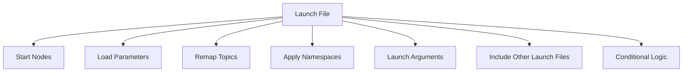
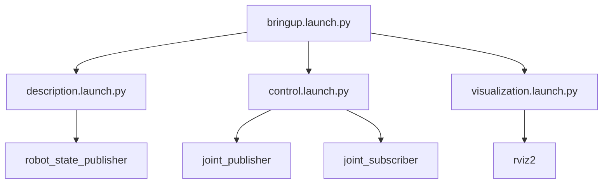

# Chapter 5: Launch Files and Parameters

**Duration**: 3-4 hours
**Difficulty**: Intermediate

---

## Learning Objectives

After completing this chapter, you will be able to:

- Write Python launch files for ROS 2
- Launch multiple nodes from a single command
- Use launch arguments for configuration
- Load parameters from YAML files
- Apply namespacing and remapping
- Create conditional launch logic

---

## 5.1 Introduction to Launch Files

**Launch files** start multiple nodes and configure them with a single command.

### Why Launch Files?

Without launch files:
```bash
# Terminal 1
ros2 run humanoid_control joint_publisher
# Terminal 2
ros2 run humanoid_control joint_subscriber
# Terminal 3
ros2 run robot_state_publisher robot_state_publisher
# Terminal 4
ros2 run rviz2 rviz2
```

With launch files:
```bash
ros2 launch humanoid_bringup simulation.launch.py
```

### Launch File Capabilities



---

## 5.2 Basic Launch File Structure

ROS 2 launch files are Python scripts.

### Minimal Launch File

```python
# minimal.launch.py
from launch import LaunchDescription
from launch_ros.actions import Node


def generate_launch_description():
    """Generate launch description."""
    return LaunchDescription([
        Node(
            package='humanoid_control',
            executable='joint_publisher',
            name='joint_publisher'
        ),
    ])
```

### Running Launch Files

```bash
# From package
ros2 launch humanoid_bringup minimal.launch.py

# From file path
ros2 launch /path/to/minimal.launch.py
```

### Node Configuration

```python
Node(
    package='humanoid_control',          # Package name
    executable='joint_publisher',        # Entry point name
    name='my_publisher',                 # Node name (overrides default)
    namespace='robot1',                  # Namespace prefix
    output='screen',                     # Output to terminal
    parameters=[{'rate': 10.0}],         # Node parameters
    remappings=[                         # Topic remapping
        ('/joint_commands', '/robot1/joint_commands')
    ],
    arguments=['--ros-args', '--log-level', 'debug'],
)
```

---

## 5.3 Launch Arguments

Launch arguments allow runtime configuration.

### Declaring Arguments

```python
from launch import LaunchDescription
from launch.actions import DeclareLaunchArgument
from launch.substitutions import LaunchConfiguration
from launch_ros.actions import Node


def generate_launch_description():
    # Declare arguments
    use_sim_arg = DeclareLaunchArgument(
        'use_sim',
        default_value='true',
        description='Use simulation time'
    )

    robot_name_arg = DeclareLaunchArgument(
        'robot_name',
        default_value='humanoid',
        description='Name of the robot'
    )

    # Use arguments
    use_sim = LaunchConfiguration('use_sim')
    robot_name = LaunchConfiguration('robot_name')

    return LaunchDescription([
        use_sim_arg,
        robot_name_arg,

        Node(
            package='humanoid_control',
            executable='joint_publisher',
            name='joint_publisher',
            parameters=[{
                'use_sim_time': use_sim,
                'robot_name': robot_name,
            }]
        ),
    ])
```

### Passing Arguments

```bash
# Use defaults
ros2 launch humanoid_bringup simulation.launch.py

# Override arguments
ros2 launch humanoid_bringup simulation.launch.py use_sim:=false robot_name:=my_robot

# List available arguments
ros2 launch humanoid_bringup simulation.launch.py --show-args
```

---

## 5.4 Parameters

Parameters configure node behavior at runtime.

### Inline Parameters

```python
Node(
    package='humanoid_control',
    executable='joint_publisher',
    parameters=[
        {'rate': 10.0},
        {'joint_name': 'head_pan'},
        {'amplitude': 0.5},
    ]
)
```

### Parameter File (YAML)

**config/joint_publisher.yaml**
```yaml
joint_publisher:
  ros__parameters:
    rate: 10.0
    joint_name: "head_pan"
    amplitude: 0.5
    limits:
      min: -1.57
      max: 1.57
```

### Loading Parameters from File

```python
import os
from ament_index_python.packages import get_package_share_directory

def generate_launch_description():
    pkg_dir = get_package_share_directory('humanoid_bringup')
    params_file = os.path.join(pkg_dir, 'config', 'joint_publisher.yaml')

    return LaunchDescription([
        Node(
            package='humanoid_control',
            executable='joint_publisher',
            parameters=[params_file]
        ),
    ])
```

### Multiple Parameter Sources

```python
Node(
    package='humanoid_control',
    executable='joint_controller',
    parameters=[
        params_file,                    # From file
        {'override_param': 'value'},    # Inline override
    ]
)
```

---

## 5.5 Namespacing and Remapping

### Namespaces

Namespaces prefix all topics, services, and parameters:

```python
Node(
    package='humanoid_control',
    executable='joint_publisher',
    namespace='left_arm',  # Prefix with /left_arm
)
```

Topics become:
- `/left_arm/joint_commands` instead of `/joint_commands`

### Remapping

Remapping redirects topic names:

```python
Node(
    package='humanoid_control',
    executable='joint_publisher',
    remappings=[
        ('joint_commands', 'arm/commands'),      # Relative
        ('/old_topic', '/new_topic'),            # Absolute
    ]
)
```

### Multi-Robot Example

```python
def generate_launch_description():
    robots = ['robot1', 'robot2']
    nodes = []

    for robot in robots:
        nodes.append(
            Node(
                package='humanoid_control',
                executable='joint_publisher',
                namespace=robot,
                name='joint_publisher',
            )
        )

    return LaunchDescription(nodes)
```

Result:
- `/robot1/joint_commands`
- `/robot2/joint_commands`

---

## 5.6 Including Other Launch Files

### Include Action

```python
from launch.actions import IncludeLaunchDescription
from launch.launch_description_sources import PythonLaunchDescriptionSource
import os

def generate_launch_description():
    pkg_dir = get_package_share_directory('humanoid_description')

    return LaunchDescription([
        IncludeLaunchDescription(
            PythonLaunchDescriptionSource(
                os.path.join(pkg_dir, 'launch', 'display.launch.py')
            ),
            launch_arguments={
                'use_sim': 'true',
            }.items()
        ),
    ])
```

### Launch File Hierarchy



---

## 5.7 Conditional Logic

### If/Unless Conditions

```python
from launch.conditions import IfCondition, UnlessCondition

def generate_launch_description():
    use_rviz = LaunchConfiguration('use_rviz')

    return LaunchDescription([
        DeclareLaunchArgument('use_rviz', default_value='true'),

        Node(
            package='rviz2',
            executable='rviz2',
            condition=IfCondition(use_rviz)  # Only if use_rviz=true
        ),

        Node(
            package='rqt_graph',
            executable='rqt_graph',
            condition=UnlessCondition(use_rviz)  # Only if use_rviz=false
        ),
    ])
```

### Substitutions for Logic

```python
from launch.substitutions import PythonExpression

Node(
    package='humanoid_control',
    executable='controller',
    parameters=[{
        'mode': PythonExpression([
            "'simulation' if '", use_sim, "' == 'true' else 'hardware'"
        ])
    }]
)
```

---

## 5.8 Complete Humanoid Launch File

```python
# simulation.launch.py
"""
Launch file for humanoid robot simulation.

Launches robot state publisher, control nodes, and visualization.
"""

import os
from launch import LaunchDescription
from launch.actions import DeclareLaunchArgument, IncludeLaunchDescription
from launch.conditions import IfCondition
from launch.substitutions import Command, LaunchConfiguration
from launch.launch_description_sources import PythonLaunchDescriptionSource
from launch_ros.actions import Node
from ament_index_python.packages import get_package_share_directory


def generate_launch_description():
    # Package directories
    description_pkg = get_package_share_directory('humanoid_description')
    control_pkg = get_package_share_directory('humanoid_control')
    bringup_pkg = get_package_share_directory('humanoid_bringup')

    # Launch arguments
    use_sim_time_arg = DeclareLaunchArgument(
        'use_sim_time',
        default_value='true',
        description='Use simulation clock'
    )

    use_rviz_arg = DeclareLaunchArgument(
        'use_rviz',
        default_value='true',
        description='Launch RViz2'
    )

    use_joint_gui_arg = DeclareLaunchArgument(
        'use_joint_gui',
        default_value='true',
        description='Launch joint state publisher GUI'
    )

    # Get launch configurations
    use_sim_time = LaunchConfiguration('use_sim_time')
    use_rviz = LaunchConfiguration('use_rviz')
    use_joint_gui = LaunchConfiguration('use_joint_gui')

    # Robot description
    xacro_file = os.path.join(description_pkg, 'urdf', 'humanoid.urdf.xacro')
    robot_description = Command(['xacro ', xacro_file])

    # Parameter files
    control_params = os.path.join(bringup_pkg, 'config', 'control.yaml')

    # Nodes
    robot_state_publisher = Node(
        package='robot_state_publisher',
        executable='robot_state_publisher',
        parameters=[{
            'robot_description': robot_description,
            'use_sim_time': use_sim_time,
        }],
        output='screen'
    )

    joint_state_publisher = Node(
        package='joint_state_publisher',
        executable='joint_state_publisher',
        condition=UnlessCondition(use_joint_gui)
    )

    joint_state_publisher_gui = Node(
        package='joint_state_publisher_gui',
        executable='joint_state_publisher_gui',
        condition=IfCondition(use_joint_gui)
    )

    joint_publisher = Node(
        package='humanoid_control',
        executable='joint_publisher',
        parameters=[control_params, {'use_sim_time': use_sim_time}],
        output='screen'
    )

    rviz_config = os.path.join(description_pkg, 'rviz', 'display.rviz')
    rviz2 = Node(
        package='rviz2',
        executable='rviz2',
        arguments=['-d', rviz_config],
        condition=IfCondition(use_rviz),
        output='screen'
    )

    return LaunchDescription([
        # Arguments
        use_sim_time_arg,
        use_rviz_arg,
        use_joint_gui_arg,

        # Nodes
        robot_state_publisher,
        joint_state_publisher,
        joint_state_publisher_gui,
        joint_publisher,
        rviz2,
    ])
```

### Configuration File

**config/control.yaml**
```yaml
joint_publisher:
  ros__parameters:
    rate: 50.0
    joints:
      - head_pan
      - left_shoulder_pitch
      - left_elbow
      - right_shoulder_pitch
      - right_elbow

joint_limits_server:
  ros__parameters:
    joints:
      head_pan:
        min: -1.57
        max: 1.57
        velocity: 2.0
        effort: 10.0
      left_shoulder_pitch:
        min: -3.14
        max: 1.57
        velocity: 1.5
        effort: 50.0
```

---

## 5.9 Launch File Organization

### Recommended Structure

```
humanoid_bringup/
├── launch/
│   ├── simulation.launch.py      # Full simulation
│   ├── hardware.launch.py        # Real robot
│   ├── control.launch.py         # Control nodes only
│   └── visualization.launch.py   # RViz only
├── config/
│   ├── control.yaml
│   ├── simulation.yaml
│   └── hardware.yaml
└── package.xml
```

### Installing Launch Files

**setup.py**
```python
from setuptools import setup
import os
from glob import glob

package_name = 'humanoid_bringup'

setup(
    name=package_name,
    version='0.1.0',
    packages=[package_name],
    data_files=[
        ('share/ament_index/resource_index/packages',
            ['resource/' + package_name]),
        ('share/' + package_name, ['package.xml']),
        # Install launch files
        (os.path.join('share', package_name, 'launch'),
            glob('launch/*.launch.py')),
        # Install config files
        (os.path.join('share', package_name, 'config'),
            glob('config/*.yaml')),
    ],
    install_requires=['setuptools'],
    zip_safe=True,
    entry_points={
        'console_scripts': [],
    },
)
```

---

## Hands-On Exercises

### Exercise 5.1: Basic Launch File

Create a launch file that:
1. Starts `joint_publisher` and `joint_subscriber`
2. Sets the publish rate to 20 Hz via parameter
3. Test with `ros2 launch`

### Exercise 5.2: Multi-Robot Launch

Create a launch file that:
1. Accepts `num_robots` argument (default: 2)
2. Launches `joint_publisher` for each robot in a loop
3. Each robot has its own namespace

### Exercise 5.3: Conditional Visualization

Create a launch file with:
1. `mode` argument: "simulation" or "hardware"
2. Launch RViz only in simulation mode
3. Load different parameters for each mode

### Exercise 5.4: Full System Launch

Create `humanoid.launch.py` that includes:
1. `description.launch.py` (URDF)
2. `control.launch.py` (nodes)
3. `visualization.launch.py` (RViz)

Pass arguments through include statements.

---

## Summary

In this chapter, you learned:

- Launch files start multiple nodes with one command
- Arguments allow runtime configuration
- Parameters can be inline or loaded from YAML
- Namespaces and remapping organize topics
- Include actions compose launch files
- Conditions enable/disable nodes dynamically

## Next Chapter

In [Chapter 6](ch06-lifecycle-safety.md), you will learn about lifecycle nodes for safe robot state management.

---

## Quick Reference

```python
# Basic node
Node(package='pkg', executable='exe', name='name')

# With parameters
Node(..., parameters=[{'key': 'value'}, 'file.yaml'])

# With namespace and remapping
Node(..., namespace='ns', remappings=[('old', 'new')])

# Launch argument
DeclareLaunchArgument('arg', default_value='val')
LaunchConfiguration('arg')

# Include
IncludeLaunchDescription(
    PythonLaunchDescriptionSource('path/to/file.launch.py'),
    launch_arguments={'arg': 'val'}.items()
)

# Conditions
condition=IfCondition(LaunchConfiguration('flag'))
condition=UnlessCondition(LaunchConfiguration('flag'))
```

```bash
# Run
ros2 launch package launch_file.launch.py
ros2 launch package launch_file.launch.py arg:=value

# Show arguments
ros2 launch package launch_file.launch.py --show-args
```
