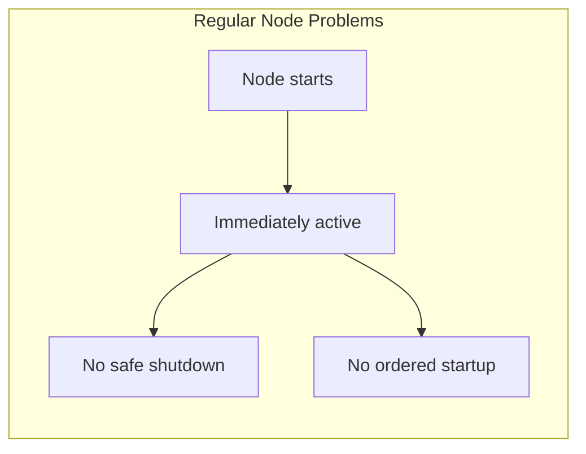
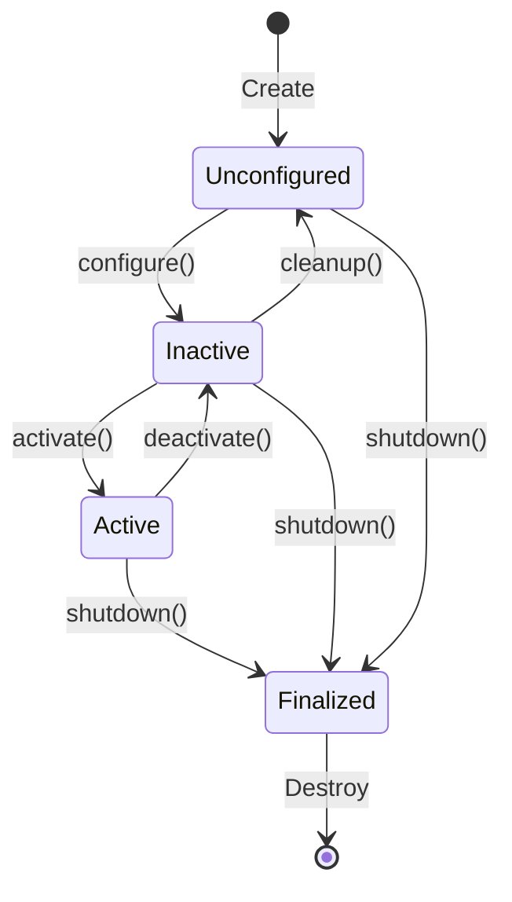
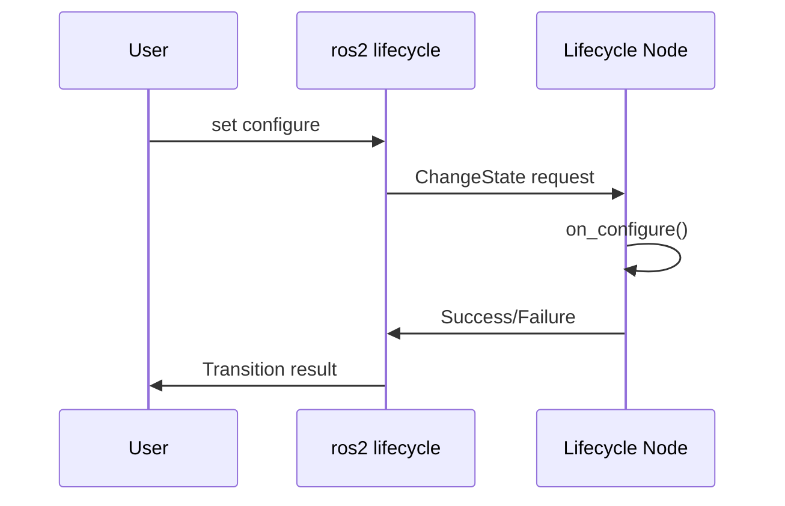
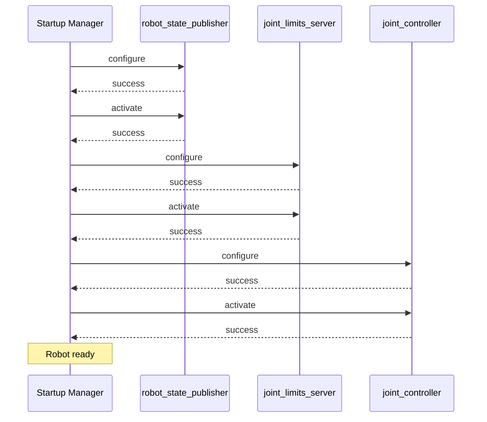

# Chapter 6: Lifecycle Nodes and Safety

**Duration**: 3-4 hours
**Difficulty**: Intermediate-Advanced

---

## Learning Objectives

After completing this chapter, you will be able to:

- Explain the lifecycle node state machine
- Implement lifecycle callbacks in Python
- Manage node state transitions
- Implement watchdog timers for safety
- Design emergency stop systems
- Create safe startup and shutdown sequences

---

## 6.1 Why Lifecycle Nodes?

Regular nodes start immediately and have no managed states. This causes problems:



For humanoid robots, we need:
- **Safe startup**: Configure before moving
- **Controlled activation**: Start control only when ready
- **Safe shutdown**: Stop safely when requested
- **Recovery**: Handle failures gracefully

---

## 6.2 Lifecycle State Machine

Lifecycle nodes follow a standard state machine:



### States

| State | Description | Robot Example |
|-------|-------------|---------------|
| **Unconfigured** | Created but not configured | Node exists |
| **Inactive** | Configured, not processing | Ready to move |
| **Active** | Processing data | Controlling joints |
| **Finalized** | Shutting down | Stopping |

### Transitions

| Transition | From | To | Purpose |
|------------|------|-----|---------|
| `configure` | Unconfigured | Inactive | Load params, validate |
| `cleanup` | Inactive | Unconfigured | Release resources |
| `activate` | Inactive | Active | Start processing |
| `deactivate` | Active | Inactive | Stop processing |
| `shutdown` | Any | Finalized | Final cleanup |

---

## 6.3 Implementing a Lifecycle Node

### Basic Structure

```python
#!/usr/bin/env python3
"""
Lifecycle-managed joint controller.

Demonstrates proper lifecycle management for robot control.
"""

import rclpy
from rclpy.lifecycle import Node as LifecycleNode
from rclpy.lifecycle import State, TransitionCallbackReturn
from std_msgs.msg import Float64
from humanoid_msgs.msg import JointCommand


class LifecycleJointController(LifecycleNode):
    """Lifecycle-managed joint controller."""

    def __init__(self) -> None:
        super().__init__('lifecycle_joint_controller')

        # Declare parameters (available in all states)
        self.declare_parameter('joint_name', 'head_pan')
        self.declare_parameter('control_rate', 100.0)
        self.declare_parameter('max_velocity', 1.0)

        # Initialize attributes (will be set in configure)
        self.publisher = None
        self.subscription = None
        self.timer = None
        self.current_position = 0.0
        self.target_position = 0.0

        self.get_logger().info('Controller created (unconfigured)')

    # =========================================
    # Lifecycle Callbacks
    # =========================================

    def on_configure(self, state: State) -> TransitionCallbackReturn:
        """
        Configure the node.

        Called when transitioning from Unconfigured to Inactive.
        Load parameters, create publishers/subscribers (but don't activate).
        """
        self.get_logger().info('Configuring...')

        try:
            # Get parameters
            self.joint_name = self.get_parameter('joint_name').value
            self.control_rate = self.get_parameter('control_rate').value
            self.max_velocity = self.get_parameter('max_velocity').value

            # Create publisher (inactive)
            self.publisher = self.create_lifecycle_publisher(
                Float64,
                f'/{self.joint_name}/command',
                10
            )

            # Create subscription
            self.subscription = self.create_subscription(
                JointCommand,
                '/joint_commands',
                self.command_callback,
                10
            )

            self.get_logger().info(
                f'Configured for joint: {self.joint_name}'
            )
            return TransitionCallbackReturn.SUCCESS

        except Exception as e:
            self.get_logger().error(f'Configuration failed: {e}')
            return TransitionCallbackReturn.FAILURE

    def on_activate(self, state: State) -> TransitionCallbackReturn:
        """
        Activate the node.

        Called when transitioning from Inactive to Active.
        Start processing, enable control.
        """
        self.get_logger().info('Activating...')

        try:
            # Create control timer
            period = 1.0 / self.control_rate
            self.timer = self.create_timer(period, self.control_loop)

            # Reset state
            self.current_position = 0.0
            self.target_position = 0.0

            self.get_logger().info('Controller active')
            return TransitionCallbackReturn.SUCCESS

        except Exception as e:
            self.get_logger().error(f'Activation failed: {e}')
            return TransitionCallbackReturn.FAILURE

    def on_deactivate(self, state: State) -> TransitionCallbackReturn:
        """
        Deactivate the node.

        Called when transitioning from Active to Inactive.
        Stop processing, hold position.
        """
        self.get_logger().info('Deactivating...')

        try:
            # Cancel timer
            if self.timer:
                self.timer.cancel()
                self.timer = None

            # Hold current position (don't command motion)
            self.get_logger().info(
                f'Holding position: {self.current_position:.3f}'
            )

            return TransitionCallbackReturn.SUCCESS

        except Exception as e:
            self.get_logger().error(f'Deactivation failed: {e}')
            return TransitionCallbackReturn.FAILURE

    def on_cleanup(self, state: State) -> TransitionCallbackReturn:
        """
        Clean up the node.

        Called when transitioning from Inactive to Unconfigured.
        Release resources.
        """
        self.get_logger().info('Cleaning up...')

        try:
            # Destroy publisher
            if self.publisher:
                self.destroy_publisher(self.publisher)
                self.publisher = None

            # Destroy subscription
            if self.subscription:
                self.destroy_subscription(self.subscription)
                self.subscription = None

            return TransitionCallbackReturn.SUCCESS

        except Exception as e:
            self.get_logger().error(f'Cleanup failed: {e}')
            return TransitionCallbackReturn.FAILURE

    def on_shutdown(self, state: State) -> TransitionCallbackReturn:
        """
        Shutdown the node.

        Called when transitioning to Finalized.
        Final cleanup before destruction.
        """
        self.get_logger().info('Shutting down...')

        # Ensure everything is cleaned up
        self.on_deactivate(state)
        self.on_cleanup(state)

        return TransitionCallbackReturn.SUCCESS

    # =========================================
    # Processing Callbacks
    # =========================================

    def command_callback(self, msg: JointCommand) -> None:
        """Handle incoming joint commands."""
        if msg.joint_name == self.joint_name:
            self.target_position = msg.position

    def control_loop(self) -> None:
        """Main control loop (only runs when active)."""
        # Simple P controller
        error = self.target_position - self.current_position
        velocity = min(abs(error), self.max_velocity)

        if error > 0:
            self.current_position += velocity / self.control_rate
        elif error < 0:
            self.current_position -= velocity / self.control_rate

        # Publish command
        msg = Float64()
        msg.data = self.current_position
        self.publisher.publish(msg)


def main(args=None) -> None:
    rclpy.init(args=args)

    node = LifecycleJointController()

    try:
        rclpy.spin(node)
    except KeyboardInterrupt:
        pass
    finally:
        node.destroy_node()
        rclpy.shutdown()


if __name__ == '__main__':
    main()
```

---

## 6.4 Managing Lifecycle State

### Command Line Control

```bash
# List lifecycle nodes
ros2 lifecycle nodes

# Get current state
ros2 lifecycle get /lifecycle_joint_controller

# Trigger transitions
ros2 lifecycle set /lifecycle_joint_controller configure
ros2 lifecycle set /lifecycle_joint_controller activate
ros2 lifecycle set /lifecycle_joint_controller deactivate
ros2 lifecycle set /lifecycle_joint_controller cleanup
ros2 lifecycle set /lifecycle_joint_controller shutdown

# List available transitions
ros2 lifecycle list /lifecycle_joint_controller
```

### Lifecycle Communication Flow



### Programmatic Control

```python
from lifecycle_msgs.srv import ChangeState, GetState
from lifecycle_msgs.msg import Transition

class LifecycleManager(Node):
    """Manages lifecycle of other nodes."""

    def __init__(self):
        super().__init__('lifecycle_manager')

        self.change_state_client = self.create_client(
            ChangeState,
            '/lifecycle_joint_controller/change_state'
        )

    def configure_node(self):
        """Configure the managed node."""
        request = ChangeState.Request()
        request.transition.id = Transition.TRANSITION_CONFIGURE

        future = self.change_state_client.call_async(request)
        rclpy.spin_until_future_complete(self, future)

        return future.result().success
```

---

## 6.5 Watchdog Timer

A **watchdog** monitors communication and triggers safety actions on failure.

```python
#!/usr/bin/env python3
"""
Watchdog node for safety monitoring.

Monitors heartbeat topics and triggers emergency stop on timeout.
"""

import rclpy
from rclpy.node import Node
from std_msgs.msg import Bool, Empty
from rclpy.qos import QoSProfile, ReliabilityPolicy


class WatchdogNode(Node):
    """Monitors communication health and triggers e-stop."""

    def __init__(self) -> None:
        super().__init__('watchdog')

        # Parameters
        self.declare_parameter('timeout_sec', 0.5)
        self.declare_parameter('heartbeat_topic', '/heartbeat')

        self.timeout = self.get_parameter('timeout_sec').value
        heartbeat_topic = self.get_parameter('heartbeat_topic').value

        # State
        self.last_heartbeat = self.get_clock().now()
        self.estop_active = False

        # Publishers
        self.estop_pub = self.create_publisher(
            Bool,
            '/emergency_stop',
            QoSProfile(
                reliability=ReliabilityPolicy.RELIABLE,
                depth=1
            )
        )

        # Subscribers
        self.heartbeat_sub = self.create_subscription(
            Empty,
            heartbeat_topic,
            self.heartbeat_callback,
            10
        )

        # Watchdog timer
        self.watchdog_timer = self.create_timer(0.1, self.check_timeout)

        self.get_logger().info(
            f'Watchdog started (timeout: {self.timeout}s)'
        )

    def heartbeat_callback(self, msg: Empty) -> None:
        """Reset timeout on heartbeat."""
        self.last_heartbeat = self.get_clock().now()

        # Clear e-stop if previously triggered
        if self.estop_active:
            self.estop_active = False
            self.publish_estop(False)
            self.get_logger().info('Heartbeat restored, e-stop cleared')

    def check_timeout(self) -> None:
        """Check for heartbeat timeout."""
        elapsed = (self.get_clock().now() - self.last_heartbeat).nanoseconds / 1e9

        if elapsed > self.timeout and not self.estop_active:
            self.estop_active = True
            self.publish_estop(True)
            self.get_logger().error(
                f'HEARTBEAT TIMEOUT ({elapsed:.2f}s) - E-STOP TRIGGERED'
            )

    def publish_estop(self, active: bool) -> None:
        """Publish emergency stop state."""
        msg = Bool()
        msg.data = active
        self.estop_pub.publish(msg)


def main(args=None) -> None:
    rclpy.init(args=args)
    node = WatchdogNode()

    try:
        rclpy.spin(node)
    except KeyboardInterrupt:
        pass
    finally:
        node.destroy_node()
        rclpy.shutdown()


if __name__ == '__main__':
    main()
```

---

## 6.6 Emergency Stop System

### E-Stop Architecture

```mermaid
graph TB
    subgraph "E-Stop Sources"
        HW[Hardware Button]
        SW[Software Watchdog]
        OP[Operator Command]
    end

    subgraph "E-Stop Handler"
        ES[/emergency_stop topic]
    end

    subgraph "Responders"
        C1[Joint Controller 1]
        C2[Joint Controller 2]
        LC[Locomotion Controller]
    end

    HW --> ES
    SW --> ES
    OP --> ES

    ES --> C1
    ES --> C2
    ES --> LC
```

### E-Stop Responder

```python
class EStopResponder(LifecycleNode):
    """Node that responds to emergency stop."""

    def __init__(self):
        super().__init__('estop_responder')

        self.estop_sub = self.create_subscription(
            Bool,
            '/emergency_stop',
            self.estop_callback,
            QoSProfile(reliability=ReliabilityPolicy.RELIABLE, depth=1)
        )

    def estop_callback(self, msg: Bool) -> None:
        """Handle emergency stop."""
        if msg.data:
            self.get_logger().warn('E-STOP RECEIVED - Deactivating')
            # Trigger deactivation
            self.trigger_deactivate()
        else:
            self.get_logger().info('E-STOP cleared')

    def trigger_deactivate(self) -> None:
        """Request deactivation."""
        # In a lifecycle node, request state change
        # This would typically be done via lifecycle services
        pass
```

### E-Stop Best Practices

| Practice | Description |
|----------|-------------|
| Hardware first | Physical e-stop bypasses software |
| Fail-safe | Default to stopped state |
| Redundancy | Multiple e-stop sources |
| Latching | Require explicit reset |
| Logging | Record all e-stop events |

---

## 6.7 Safe Startup Sequence

### Ordered Startup with Lifecycle Manager

```python
#!/usr/bin/env python3
"""
Lifecycle manager for ordered robot startup.
"""

import rclpy
from rclpy.node import Node
from lifecycle_msgs.srv import ChangeState, GetState
from lifecycle_msgs.msg import Transition, State
import time


class StartupManager(Node):
    """Manages ordered startup of lifecycle nodes."""

    def __init__(self):
        super().__init__('startup_manager')

        # Nodes to manage in order
        self.managed_nodes = [
            '/robot_state_publisher',
            '/joint_limits_server',
            '/lifecycle_joint_controller',
        ]

        # Create clients for each node
        self.clients = {}
        for node_name in self.managed_nodes:
            self.clients[node_name] = {
                'change_state': self.create_client(
                    ChangeState,
                    f'{node_name}/change_state'
                ),
                'get_state': self.create_client(
                    GetState,
                    f'{node_name}/get_state'
                )
            }

    def startup_sequence(self) -> bool:
        """Execute ordered startup."""
        self.get_logger().info('Starting robot startup sequence...')

        for node_name in self.managed_nodes:
            self.get_logger().info(f'Configuring {node_name}...')

            if not self.transition_node(node_name, Transition.TRANSITION_CONFIGURE):
                self.get_logger().error(f'Failed to configure {node_name}')
                return False

            self.get_logger().info(f'Activating {node_name}...')

            if not self.transition_node(node_name, Transition.TRANSITION_ACTIVATE):
                self.get_logger().error(f'Failed to activate {node_name}')
                return False

            self.get_logger().info(f'{node_name} is active')

        self.get_logger().info('Startup sequence complete!')
        return True

    def transition_node(self, node_name: str, transition_id: int) -> bool:
        """Transition a node to a new state."""
        client = self.clients[node_name]['change_state']

        if not client.wait_for_service(timeout_sec=5.0):
            self.get_logger().error(f'Service not available: {node_name}')
            return False

        request = ChangeState.Request()
        request.transition.id = transition_id

        future = client.call_async(request)
        rclpy.spin_until_future_complete(self, future, timeout_sec=10.0)

        if future.result() is not None:
            return future.result().success
        return False

    def shutdown_sequence(self) -> bool:
        """Execute ordered shutdown (reverse order)."""
        self.get_logger().info('Starting shutdown sequence...')

        for node_name in reversed(self.managed_nodes):
            self.get_logger().info(f'Deactivating {node_name}...')
            self.transition_node(node_name, Transition.TRANSITION_DEACTIVATE)

            self.get_logger().info(f'Cleaning up {node_name}...')
            self.transition_node(node_name, Transition.TRANSITION_CLEANUP)

        self.get_logger().info('Shutdown sequence complete')
        return True
```

### Startup Sequence Diagram



---

## Hands-On Exercises

### Exercise 6.1: Basic Lifecycle Node

1. Create a lifecycle node that logs state transitions
2. Test transitions via CLI
3. Observe behavior on success and failure

### Exercise 6.2: Lifecycle Publisher

1. Convert `joint_publisher` to a lifecycle node
2. Only publish when active
3. Hold last value when deactivated

### Exercise 6.3: Watchdog with Recovery

Extend the watchdog to:
1. Attempt to restart nodes after timeout
2. Count restart attempts
3. Give up after 3 failures

### Exercise 6.4: Complete Safety System

Create a system with:
1. Lifecycle controller
2. Watchdog node
3. E-stop responder
4. Startup manager

Test the complete startup/shutdown sequence.

---

## Summary

In this chapter, you learned:

- Lifecycle nodes have managed states for safe operation
- Transitions are: configure, activate, deactivate, cleanup, shutdown
- Watchdogs monitor communication health
- E-stop systems provide safety mechanisms
- Startup managers ensure ordered initialization

## Next Chapter

In [Chapter 7](ch07-debugging-tools.md), you will learn about debugging ROS 2 systems.

---

## Quick Reference

```python
# Lifecycle node
from rclpy.lifecycle import Node as LifecycleNode
from rclpy.lifecycle import TransitionCallbackReturn

class MyNode(LifecycleNode):
    def on_configure(self, state): ...
    def on_activate(self, state): ...
    def on_deactivate(self, state): ...
    def on_cleanup(self, state): ...
    def on_shutdown(self, state): ...

# Return values
TransitionCallbackReturn.SUCCESS
TransitionCallbackReturn.FAILURE
TransitionCallbackReturn.ERROR
```

```bash
# CLI
ros2 lifecycle nodes
ros2 lifecycle get /node
ros2 lifecycle set /node configure
ros2 lifecycle set /node activate
ros2 lifecycle list /node
```
