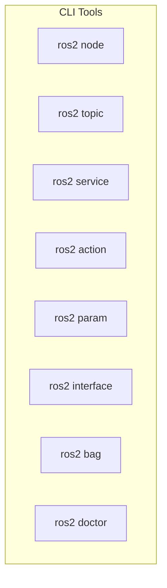
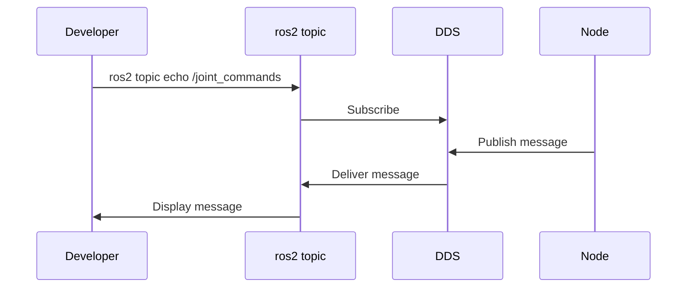
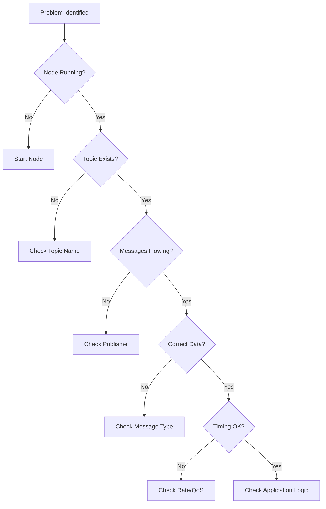

# Chapter 7: Debugging and Tools

**Duration**: 2-3 hours
**Difficulty**: Beginner-Intermediate

---

## Learning Objectives

After completing this chapter, you will be able to:

- Use ROS 2 CLI tools for system introspection
- Record and playback data with ros2 bag
- Visualize system architecture with rqt tools
- Debug common ROS 2 problems
- Monitor system performance
- Apply systematic debugging strategies

---

## 7.1 ROS 2 CLI Tools Overview



---

## 7.2 Node Introspection

### Listing Nodes

```bash
# List all running nodes
ros2 node list
# Output:
# /joint_publisher
# /joint_subscriber
# /robot_state_publisher
```

### Node Information

```bash
# Detailed node info
ros2 node info /joint_publisher

# Output:
# /joint_publisher
#   Subscribers:
#     /parameter_events: rcl_interfaces/msg/ParameterEvent
#   Publishers:
#     /joint_commands: humanoid_msgs/msg/JointCommand
#     /parameter_events: rcl_interfaces/msg/ParameterEvent
#     /rosout: rcl_interfaces/msg/Log
#   Service Servers:
#     /joint_publisher/describe_parameters: ...
#     /joint_publisher/get_parameters: ...
#   Service Clients:
#
#   Action Servers:
#
#   Action Clients:
```

---

## 7.3 Topic Debugging

### Topic Commands

```bash
# List all topics
ros2 topic list

# With types
ros2 topic list -t

# Topic info
ros2 topic info /joint_commands
# Type: humanoid_msgs/msg/JointCommand
# Publisher count: 1
# Subscription count: 1

# Echo messages (real-time)
ros2 topic echo /joint_commands

# Echo once
ros2 topic echo /joint_commands --once

# Echo with formatting
ros2 topic echo /joint_commands --csv
ros2 topic echo /joint_commands --field position

# Message rate
ros2 topic hz /joint_commands
# average rate: 10.002
#     min: 0.098s max: 0.102s std dev: 0.001s

# Bandwidth
ros2 topic bw /joint_commands

# Publish from CLI
ros2 topic pub /joint_commands humanoid_msgs/msg/JointCommand \
  "{joint_name: 'head_pan', position: 0.5, velocity: 0.0, effort: 0.0}"

# Publish once
ros2 topic pub --once /joint_commands humanoid_msgs/msg/JointCommand \
  "{joint_name: 'head_pan', position: 0.5}"

# Publish at rate
ros2 topic pub --rate 10 /joint_commands humanoid_msgs/msg/JointCommand \
  "{joint_name: 'head_pan', position: 0.5}"
```

### Topic Debugging Diagram



---

## 7.4 Service and Action Debugging

### Service Commands

```bash
# List services
ros2 service list

# Service type
ros2 service type /get_joint_limits

# Call service
ros2 service call /get_joint_limits humanoid_msgs/srv/GetJointLimits \
  "{joint_name: 'head_pan'}"

# Find services by type
ros2 service find humanoid_msgs/srv/GetJointLimits
```

### Action Commands

```bash
# List actions
ros2 action list

# Action info
ros2 action info /move_to_position

# Send goal
ros2 action send_goal /move_to_position humanoid_msgs/action/MoveToPosition \
  "{joint_name: 'head_pan', target_position: 1.0, max_velocity: 0.5}"

# Send goal with feedback
ros2 action send_goal /move_to_position humanoid_msgs/action/MoveToPosition \
  "{joint_name: 'head_pan', target_position: 1.0, max_velocity: 0.5}" \
  --feedback
```

---

## 7.5 Parameter Inspection

```bash
# List all parameters for a node
ros2 param list /joint_publisher

# Get parameter value
ros2 param get /joint_publisher rate

# Set parameter
ros2 param set /joint_publisher rate 20.0

# Dump all parameters to file
ros2 param dump /joint_publisher > params.yaml

# Load parameters from file
ros2 param load /joint_publisher params.yaml

# Describe parameter
ros2 param describe /joint_publisher rate
```

---

## 7.6 Interface Inspection

```bash
# List all interfaces
ros2 interface list

# Filter by type
ros2 interface list -m  # messages
ros2 interface list -s  # services
ros2 interface list -a  # actions

# Show interface definition
ros2 interface show humanoid_msgs/msg/JointCommand

# Show with comments
ros2 interface show geometry_msgs/msg/Twist

# Find package interfaces
ros2 interface package humanoid_msgs
```

---

## 7.7 ROS 2 Bag: Record and Playback

### Recording Data

```bash
# Record all topics
ros2 bag record -a

# Record specific topics
ros2 bag record /joint_commands /joint_states

# Record with output directory
ros2 bag record -o my_recording /joint_commands

# Record for duration
ros2 bag record /joint_commands --duration 60

# Record with compression
ros2 bag record /joint_commands --compression-mode file
```

### Bag Information

```bash
# Bag info
ros2 bag info my_recording/

# Output:
# Files:             my_recording_0.db3
# Bag size:          1.2 MB
# Storage id:        sqlite3
# Duration:          30.5s
# Messages:          305
# Topic information:
#   Topic: /joint_commands | Type: humanoid_msgs/msg/JointCommand | Count: 305
```

### Playback

```bash
# Play bag
ros2 bag play my_recording/

# Play at different speed
ros2 bag play my_recording/ --rate 0.5  # Half speed
ros2 bag play my_recording/ --rate 2.0  # Double speed

# Loop playback
ros2 bag play my_recording/ --loop

# Play specific topics
ros2 bag play my_recording/ --topics /joint_commands

# Start from offset
ros2 bag play my_recording/ --start-offset 10

# Remap topics during playback
ros2 bag play my_recording/ --remap /joint_commands:=/replayed_commands
```

### Bag Recording Diagram

```mermaid
graph LR
    subgraph "Recording"
        N1[Node 1] --> T1[/topic_1]
        N2[Node 2] --> T2[/topic_2]
        T1 --> B[ros2 bag record]
        T2 --> B
        B --> F[bag_file.db3]
    end

    subgraph "Playback"
        F2[bag_file.db3] --> P[ros2 bag play]
        P --> T1P[/topic_1]
        P --> T2P[/topic_2]
    end
```

---

## 7.8 RQT Tools

### rqt_graph: System Visualization

```bash
# Launch graph visualizer
ros2 run rqt_graph rqt_graph
```

Shows nodes and topic connections:

```mermaid
graph LR
    JP[/joint_publisher] -->|/joint_commands| JS[/joint_subscriber]
    JP -->|/rosout| RL[/rosout]
    RSP[/robot_state_publisher] -->|/tf| TF[TF Tree]
```

### rqt_console: Log Viewer

```bash
# Launch log viewer
ros2 run rqt_console rqt_console
```

Features:
- Filter by severity (DEBUG, INFO, WARN, ERROR, FATAL)
- Filter by node
- Search messages
- Pause/resume

### rqt_plot: Data Plotting

```bash
# Launch plotter
ros2 run rqt_plot rqt_plot

# Plot specific topic field
ros2 run rqt_plot rqt_plot /joint_commands/position
```

### rqt: Combined Dashboard

```bash
# Launch rqt with all plugins
rqt
```

Add plugins from Plugins menu:
- Topics > Topic Monitor
- Services > Service Caller
- Visualization > Plot
- Logging > Console

---

## 7.9 System Diagnostics

### ros2 doctor

```bash
# Run system check
ros2 doctor

# Output:
# All 5 checks passed

# Verbose output
ros2 doctor --report
```

### Common Issues Detected

| Issue | Cause | Fix |
|-------|-------|-----|
| Network warning | Multiple network interfaces | Set ROS_DOMAIN_ID |
| QoS mismatch | Incompatible QoS settings | Match publisher/subscriber QoS |
| No publishers | Topic has no publishers | Start publisher node |
| Time jump | System clock changed | Use sim time consistently |

---

## 7.10 Common Debugging Scenarios

### Scenario 1: Node Not Receiving Messages

```bash
# 1. Check if topic exists
ros2 topic list | grep joint_commands

# 2. Check if publisher is publishing
ros2 topic hz /joint_commands

# 3. Check topic info
ros2 topic info /joint_commands

# 4. Check QoS compatibility
ros2 topic info /joint_commands --verbose

# 5. Verify message type matches
ros2 interface show humanoid_msgs/msg/JointCommand
```

**Common causes:**
- Topic name mismatch (typo)
- QoS incompatibility
- Namespace issues
- Node not started

### Scenario 2: Service Call Times Out

```bash
# 1. Check if service exists
ros2 service list | grep get_joint_limits

# 2. Check service type
ros2 service type /get_joint_limits

# 3. Try calling with verbose
ros2 service call /get_joint_limits humanoid_msgs/srv/GetJointLimits \
  "{joint_name: 'head_pan'}" --verbose
```

**Common causes:**
- Service server not running
- Service name mismatch
- Server crashed during call
- Request type mismatch

### Scenario 3: Transform Not Available

```bash
# 1. List all frames
ros2 run tf2_tools view_frames

# 2. Echo specific transform
ros2 run tf2_ros tf2_echo base_link head

# 3. Monitor TF
ros2 run tf2_ros tf2_monitor

# 4. Check URDF
ros2 topic echo /robot_description --once
```

**Common causes:**
- Joint state publisher not running
- URDF missing joint
- Frame name mismatch

### Scenario 4: High Latency

```bash
# 1. Check message timing
ros2 topic delay /joint_commands

# 2. Check CPU usage
top -p $(pgrep -f joint_publisher)

# 3. Check network
ros2 doctor --report | grep -A5 "Network"

# 4. Profile with verbose logging
ros2 run humanoid_control joint_publisher \
  --ros-args --log-level debug
```

---

## 7.11 Debugging Checklist



### Quick Debug Commands

```bash
# System overview
ros2 node list && ros2 topic list && ros2 service list

# Check specific communication
ros2 topic info /topic_name --verbose
ros2 topic hz /topic_name
ros2 topic echo /topic_name --once

# Node health
ros2 node info /node_name

# Parameter check
ros2 param list /node_name
ros2 param get /node_name param_name

# Transform check
ros2 run tf2_ros tf2_echo frame1 frame2
```

---

## Hands-On Exercises

### Exercise 7.1: Topic Investigation

1. Start `joint_publisher` and `joint_subscriber`
2. Use CLI tools to:
   - List all topics
   - Check message rate
   - Echo messages
   - Verify subscriber is receiving

### Exercise 7.2: Record and Replay

1. Record `/joint_commands` for 30 seconds
2. Stop all nodes
3. Play back the recording
4. Verify messages appear on topic

### Exercise 7.3: Find the Bug

A buggy node is provided at `humanoid_control/buggy_node.py`:

```python
#!/usr/bin/env python3
"""
Buggy node for debugging exercise.

Contains intentional bugs for students to find.
"""

import rclpy
from rclpy.node import Node
from std_msgs.msg import Float64


class BuggyNode(Node):
    def __init__(self):
        super().__init__('buggy_node')

        # Bug 1: Wrong topic name
        self.publisher = self.create_publisher(
            Float64,
            '/joitn_commands',  # Typo!
            10
        )

        # Bug 2: Timer never fires (period = 0)
        self.timer = self.create_timer(0, self.callback)

        # Bug 3: Subscription callback has wrong signature
        self.subscription = self.create_subscription(
            Float64,
            '/feedback',
            self.feedback_callback,
            10
        )

    def callback(self):
        msg = Float64()
        msg.data = 1.0
        self.publisher.publish(msg)

    # Bug 3: Missing 'msg' parameter
    def feedback_callback(self):
        self.get_logger().info('Received feedback')


def main():
    rclpy.init()
    node = BuggyNode()
    rclpy.spin(node)
    rclpy.shutdown()


if __name__ == '__main__':
    main()
```

**Tasks:**
1. Run the node and observe errors
2. Use debugging tools to identify issues
3. List all bugs found
4. Fix the bugs

### Exercise 7.4: Performance Profiling

1. Run the full simulation launch
2. Monitor message rates for all topics
3. Identify any topics with inconsistent rates
4. Use `rqt_plot` to visualize joint positions

---

## Summary

In this chapter, you learned:

- CLI tools provide powerful introspection capabilities
- `ros2 bag` records and plays back data
- RQT tools visualize system architecture and data
- Systematic debugging follows a checklist approach
- Common issues have identifiable patterns

## Module Complete!

Congratulations! You have completed Module 1: The Robotic Nervous System.

You can now:
- Create ROS 2 packages and nodes
- Define custom messages, services, and actions
- Build robot descriptions with URDF/XACRO
- Write launch files for system startup
- Implement lifecycle nodes for safety
- Debug ROS 2 systems effectively

**Next**: [Module 2: Digital Twin - Gazebo & Unity](../../module-2/README.md)

---

## Quick Reference

```bash
# Nodes
ros2 node list
ros2 node info /node

# Topics
ros2 topic list
ros2 topic echo /topic
ros2 topic hz /topic
ros2 topic pub /topic type "{data}"

# Services
ros2 service list
ros2 service call /service type "{request}"

# Actions
ros2 action list
ros2 action send_goal /action type "{goal}" --feedback

# Parameters
ros2 param list /node
ros2 param get /node param
ros2 param set /node param value

# Bag
ros2 bag record /topic1 /topic2
ros2 bag info bag_dir/
ros2 bag play bag_dir/

# Tools
ros2 doctor
rqt_graph
rqt_console
rqt_plot
```
