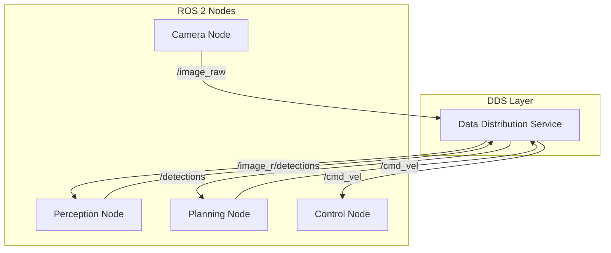
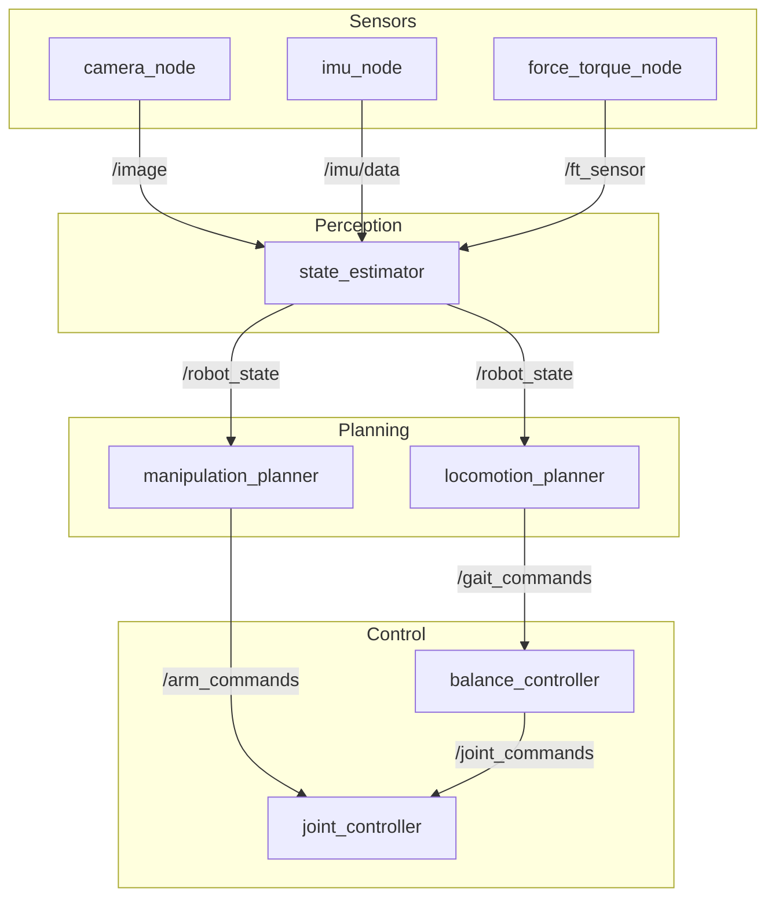
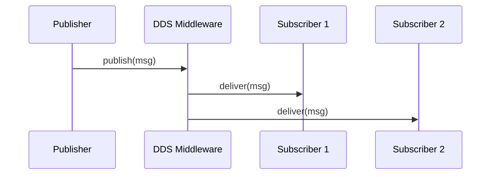
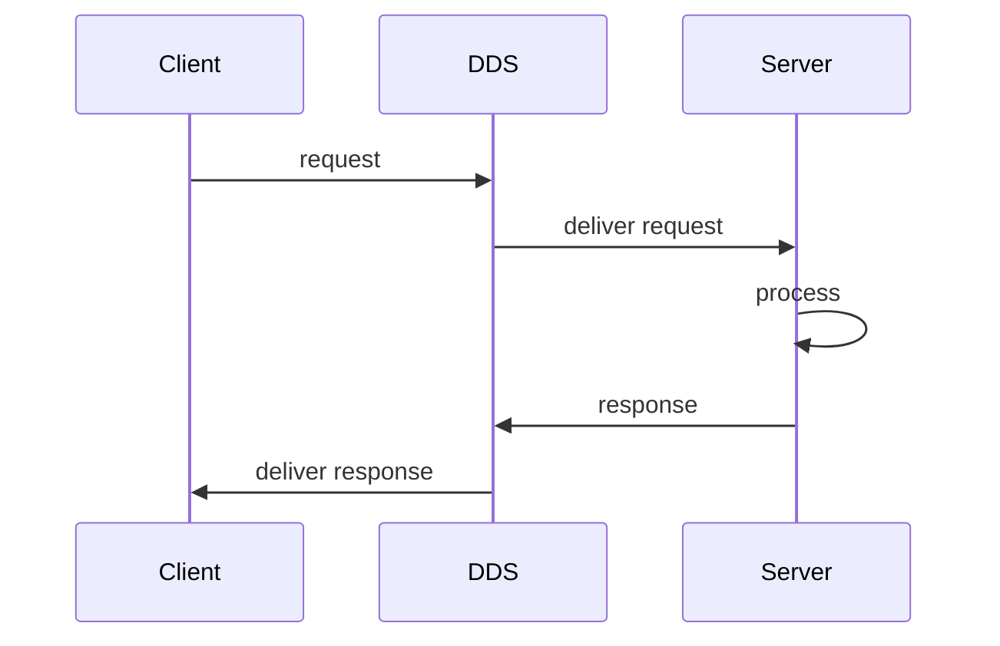
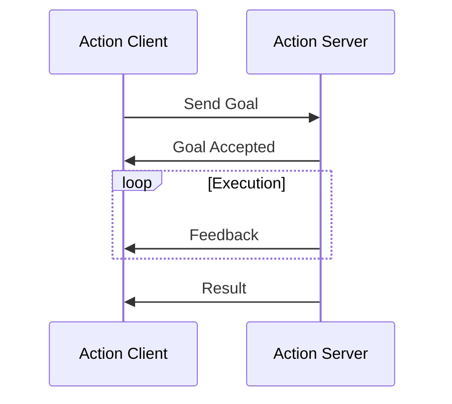
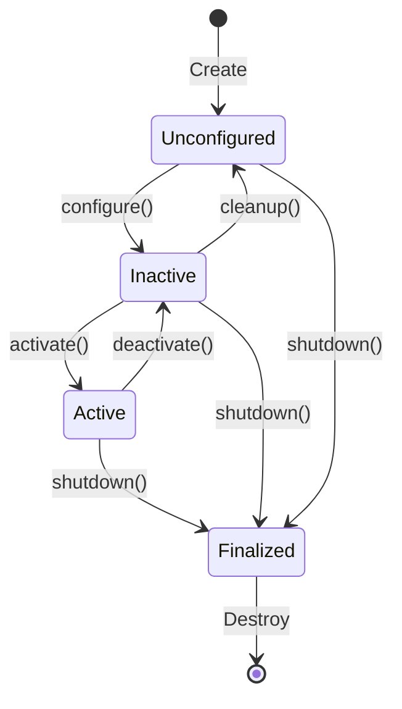
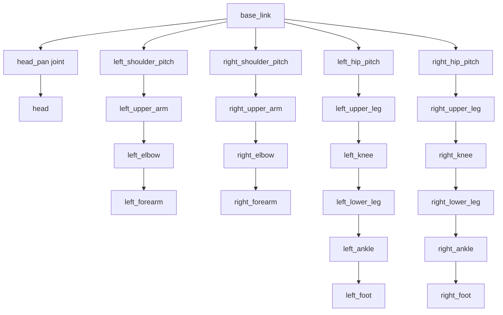
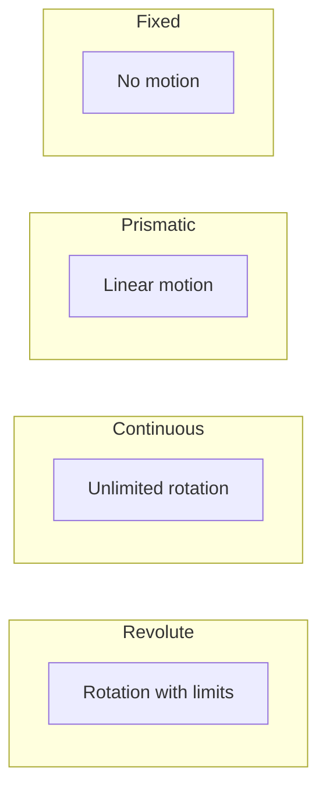
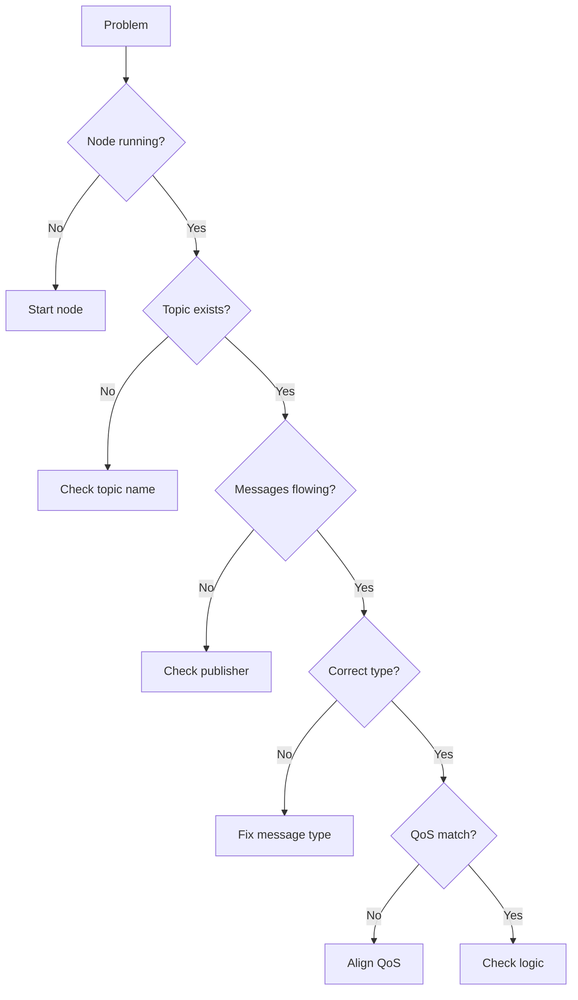
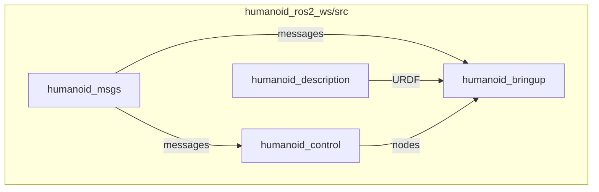

# Module 1 Diagrams

All diagrams use Mermaid syntax for rendering in GitHub/GitLab/documentation tools.

## Architecture Diagrams

### ROS 2 Communication Model



### Humanoid Robot Node Graph



## Communication Pattern Diagrams

### Topic (Publish/Subscribe)



### Service (Request/Response)



### Action (Long-Running Task)



## Lifecycle State Machine



## URDF Structure

### Link and Joint Hierarchy



### Joint Types



## Debugging Flowchart



## Package Structure



## Rendering

These diagrams render automatically in:
- GitHub README files
- GitLab documentation
- Notion pages
- MkDocs with mermaid plugin
- Docusaurus

For PDF export, use:
```bash
# Install mermaid-cli
npm install -g @mermaid-js/mermaid-cli

# Convert to PNG
mmdc -i diagram.mmd -o diagram.png
```
