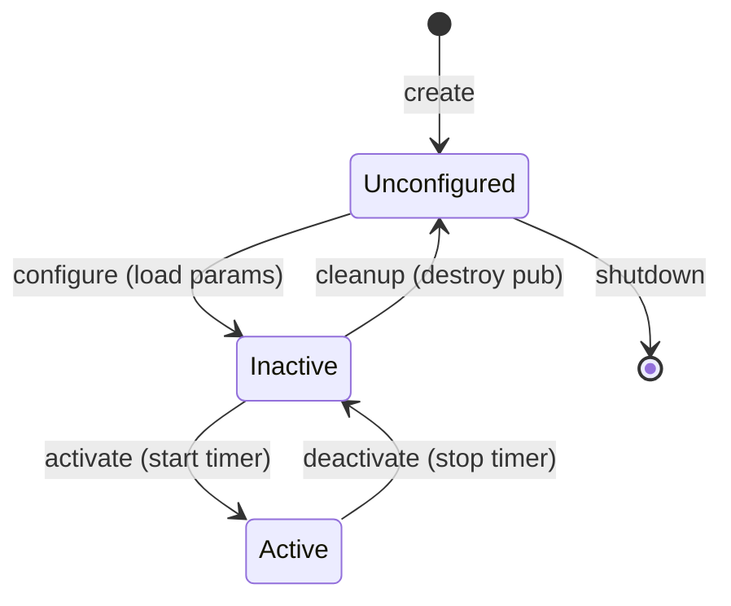

# Exercise 6.1: Lifecycle Publisher

**Chapter**: 6 - Lifecycle Nodes and Safety
**Difficulty**: Advanced
**Time**: 60 minutes

---

## Objective

Convert a regular publisher node to a lifecycle node with proper state management, demonstrating safe startup and shutdown behavior.

## Requirements

1. Create a lifecycle node that:
   - Only publishes when in ACTIVE state
   - Loads parameters in `on_configure`
   - Starts publishing in `on_activate`
   - Stops publishing in `on_deactivate`
   - Releases resources in `on_cleanup`

2. Add safety features:
   - Validate parameters during configuration
   - Hold last position when deactivating
   - Log all state transitions

3. Test state transitions via CLI

## Starter Code

```python
#!/usr/bin/env python3
"""
Lifecycle publisher - Exercise 6.1

Convert this regular node to a lifecycle node.
"""

import rclpy
from rclpy.lifecycle import Node as LifecycleNode
from rclpy.lifecycle import State, TransitionCallbackReturn
from std_msgs.msg import Float64


class LifecyclePublisherExercise(LifecycleNode):
    def __init__(self):
        super().__init__('lifecycle_publisher_exercise')

        # Declare parameters
        self.declare_parameter('topic_name', '/output')
        self.declare_parameter('publish_rate', 10.0)

        # Initialize to None (set in on_configure)
        self.publisher = None
        self.timer = None
        self.value = 0.0

        self.get_logger().info('Node created (UNCONFIGURED)')

    def on_configure(self, state: State) -> TransitionCallbackReturn:
        """
        TODO: Implement configuration
        - Get parameters
        - Validate parameters
        - Create lifecycle publisher
        """
        self.get_logger().info('Configuring...')

        # Your code here

        return TransitionCallbackReturn.SUCCESS

    def on_activate(self, state: State) -> TransitionCallbackReturn:
        """
        TODO: Implement activation
        - Create timer
        - Start publishing
        """
        self.get_logger().info('Activating...')

        # Your code here

        return TransitionCallbackReturn.SUCCESS

    def on_deactivate(self, state: State) -> TransitionCallbackReturn:
        """
        TODO: Implement deactivation
        - Cancel timer
        - Hold last value
        """
        self.get_logger().info('Deactivating...')

        # Your code here

        return TransitionCallbackReturn.SUCCESS

    def on_cleanup(self, state: State) -> TransitionCallbackReturn:
        """
        TODO: Implement cleanup
        - Destroy publisher
        - Reset state
        """
        self.get_logger().info('Cleaning up...')

        # Your code here

        return TransitionCallbackReturn.SUCCESS

    def on_shutdown(self, state: State) -> TransitionCallbackReturn:
        """Handle shutdown from any state."""
        self.get_logger().info('Shutting down...')
        return TransitionCallbackReturn.SUCCESS

    def publish_callback(self):
        """Publish incrementing value."""
        msg = Float64()
        msg.data = self.value
        self.publisher.publish(msg)
        self.value += 0.1


def main():
    rclpy.init()
    node = LifecyclePublisherExercise()
    rclpy.spin(node)
    node.destroy_node()
    rclpy.shutdown()


if __name__ == '__main__':
    main()
```

## Testing Procedure

```bash
# Terminal 1: Run the node
ros2 run humanoid_control lifecycle_publisher_exercise

# Terminal 2: Check initial state
ros2 lifecycle get /lifecycle_publisher_exercise
# Expected: unconfigured

# Configure the node
ros2 lifecycle set /lifecycle_publisher_exercise configure
# Expected: logs show "Configuring..."
ros2 lifecycle get /lifecycle_publisher_exercise
# Expected: inactive

# Check topic exists but no messages
ros2 topic echo /output
# Should show nothing (not publishing yet)

# Activate the node
ros2 lifecycle set /lifecycle_publisher_exercise activate
# Expected: logs show "Activating..."

# Now topic should have messages
ros2 topic echo /output
# Should show incrementing values

# Deactivate
ros2 lifecycle set /lifecycle_publisher_exercise deactivate
# Expected: logs show "Deactivating...", messages stop

# Cleanup
ros2 lifecycle set /lifecycle_publisher_exercise cleanup
# Expected: logs show "Cleaning up...", back to unconfigured
```

## Verification Checklist

- [ ] Node starts in UNCONFIGURED state
- [ ] `on_configure` loads parameters and creates publisher
- [ ] `on_activate` starts timer and publishing
- [ ] `on_deactivate` stops publishing
- [ ] `on_cleanup` destroys publisher
- [ ] Invalid parameters cause FAILURE in configure
- [ ] All transitions logged

## State Diagram



---

## Bonus Challenges

1. **Error recovery**: Return FAILURE from on_activate if parameter invalid, handle in state machine
2. **Watchdog integration**: Add heartbeat subscription that deactivates if timeout
3. **Multi-node coordination**: Create lifecycle manager that coordinates multiple nodes
