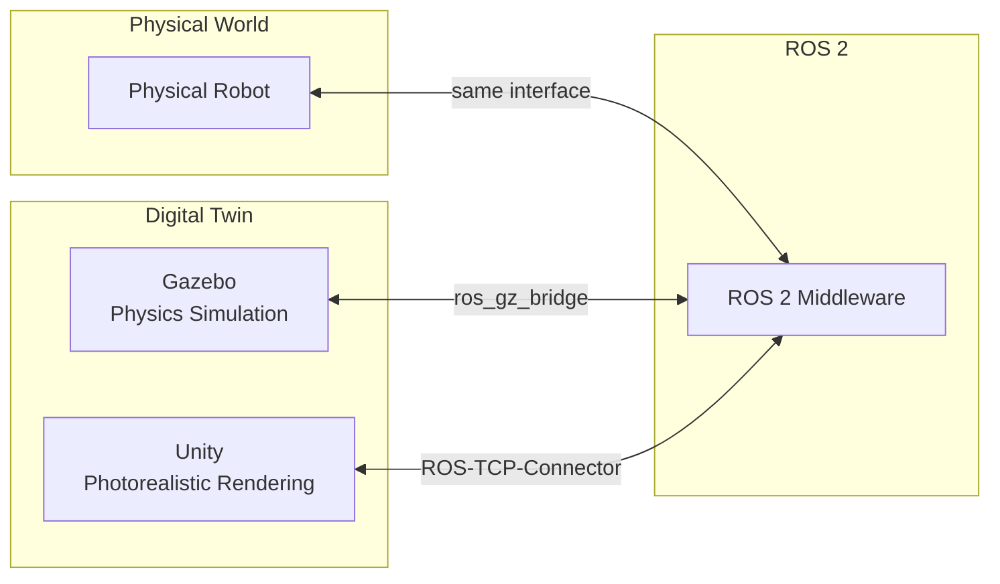

# Module 2: Digital Twin – Gazebo & Unity

**Duration**: Weeks 3-4
**Prerequisites**: Module 1 (ROS 2 Nervous System)

---

## Overview

This module teaches simulation-first development using Gazebo for physics simulation and Unity for high-fidelity rendering. You will create virtual humanoids that mirror physical robot behavior, enabling safe testing before hardware deployment.

A **digital twin** is a virtual replica that:
- Matches physical robot kinematics and dynamics
- Simulates sensors (cameras, IMU, force/torque)
- Responds to the same ROS 2 interfaces as real hardware
- Enables rapid iteration without hardware risk

## Learning Objectives

By completing this module, you will be able to:

1. Explain digital twin concepts and simulation-first development
2. Configure Gazebo worlds with physics properties
3. Spawn and control robots in Gazebo via ROS 2
4. Implement sensor plugins (camera, IMU, force/torque)
5. Tune physics parameters for realistic behavior
6. Set up Unity with ROS 2 TCP Connector
7. Create photorealistic environments in Unity
8. Stream synthetic sensor data for AI training
9. Implement domain randomization

## Chapters

| Chapter | Title | Duration |
|---------|-------|----------|
| 1 | [Digital Twin Fundamentals](chapters/ch01-digital-twin-fundamentals.md) | 2-3 hours |
| 2 | [Gazebo World Setup](chapters/ch02-gazebo-world-setup.md) | 4-5 hours |
| 3 | [Spawning Robots in Gazebo](chapters/ch03-spawning-robots.md) | 4-5 hours |
| 4 | [Sensor Simulation](chapters/ch04-sensor-simulation.md) | 5-6 hours |
| 5 | [Physics Tuning](chapters/ch05-physics-tuning.md) | 3-4 hours |
| 6 | [Unity Setup and ROS 2 Bridge](chapters/ch06-unity-setup.md) | 4-5 hours |
| 7 | [Photorealistic Environments](chapters/ch07-photorealistic-environments.md) | 4-5 hours |
| 8 | [Synthetic Sensor Data](chapters/ch08-synthetic-sensor-data.md) | 4-5 hours |
| 9 | [Domain Randomization](chapters/ch09-domain-randomization.md) | 3-4 hours |
| 10 | [Integration and Debugging](chapters/ch10-integration-debugging.md) | 2-3 hours |

## Code Examples

All code examples are in the `code/` directory:

```
code/
├── humanoid_gazebo/        # Gazebo worlds, models, launch
├── humanoid_sensors/       # Sensor configurations
├── humanoid_unity/         # Unity bridge launch
└── unity_scripts/          # Unity C# scripts
```

## Architecture Overview



## Simulation Stack

| Layer | Gazebo | Unity |
|-------|--------|-------|
| **Physics** | ODE/Bullet/DART | PhysX (optional) |
| **Rendering** | OGRE2 | HDRP |
| **Sensors** | Native plugins | Custom scripts |
| **ROS Bridge** | ros_gz_bridge | ROS-TCP-Connector |
| **Use Case** | Physics accuracy | Visual fidelity |

---

**Governed by**: `specs/constitution.md` v1.0.0
