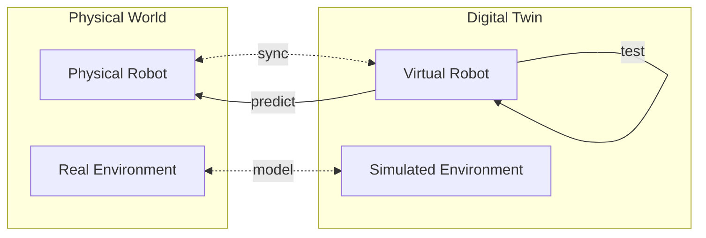
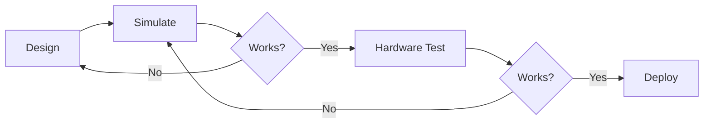
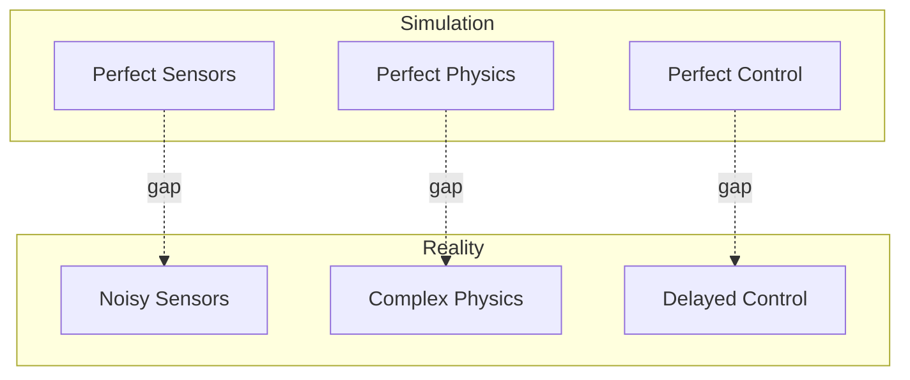
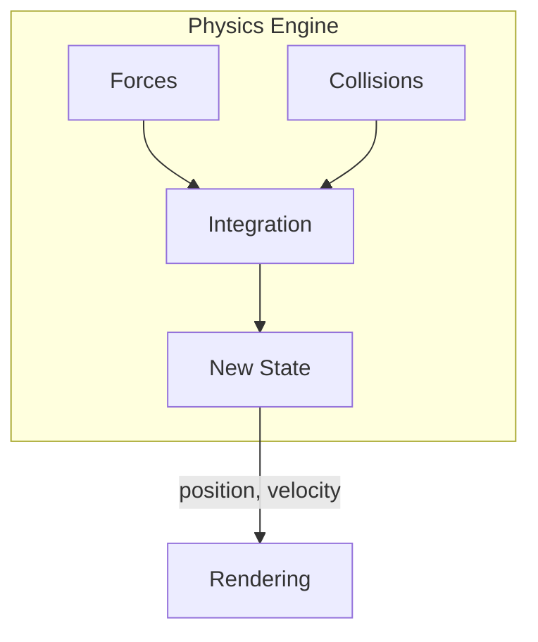
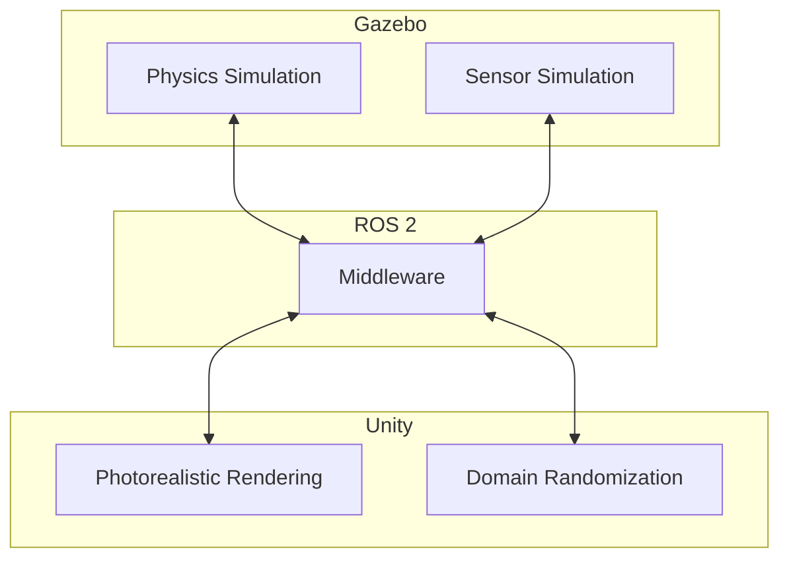

# Chapter 1: Digital Twin Fundamentals

**Duration**: 2-3 hours
**Difficulty**: Beginner

---

## Learning Objectives

After completing this chapter, you will be able to:

- Define what a digital twin is and its benefits
- Explain simulation-first development philosophy
- Compare physics simulation vs rendering engines
- Choose between Gazebo and Unity for different tasks
- Understand real-time factor and its implications

---

## 1.1 What is a Digital Twin?

A **digital twin** is a virtual replica of a physical system that:
- Mirrors the physical system's behavior
- Updates in real-time or near-real-time
- Enables testing, prediction, and optimization



### Digital Twin vs Simulation

| Aspect | Traditional Simulation | Digital Twin |
|--------|----------------------|--------------|
| Purpose | One-time analysis | Continuous monitoring |
| Data flow | One direction | Bidirectional |
| Updates | Static model | Dynamic, real-time |
| Connection | Offline | Connected to physical |

### Benefits for Humanoid Robotics

1. **Safety**: Test dangerous maneuvers without hardware risk
2. **Speed**: Iterate faster than real-time
3. **Cost**: No hardware wear during development
4. **Reproducibility**: Exact scenario repetition
5. **Scale**: Run thousands of parallel simulations

---

## 1.2 Simulation-First Development

The **simulation-first** approach means:

> Every robot behavior is validated in simulation before deployment to physical hardware.



### Why Simulation First?

| Problem | Without Simulation | With Simulation |
|---------|-------------------|-----------------|
| Falls | Damaged hardware | No damage |
| Collisions | Broken parts | Virtual reset |
| Edge cases | Hard to test | Easy to create |
| Iteration | Hours/days | Minutes |

### The Sim-to-Real Gap

The **sim-to-real gap** is the difference between simulated and real behavior:



**Bridging the gap:**
- Add sensor noise models
- Randomize physics parameters
- Include actuator delays
- Use domain randomization

---

## 1.3 Physics Simulation vs Rendering

Two main simulation components serve different purposes:

### Physics Engine

Computes forces, collisions, and dynamics.



**Physics engines:**
- **ODE**: Open Dynamics Engine, stable, widely used
- **Bullet**: Game-focused, fast
- **DART**: Accurate, research-focused
- **MuJoCo**: Contact-rich, ML-focused

### Rendering Engine

Generates visual output from scene state.

**Rendering pipelines:**
- **Rasterization**: Fast, game-quality (Unity, Unreal)
- **Ray tracing**: Accurate lighting, slower
- **HDRP**: High Definition Render Pipeline (Unity)

### When to Use Each

| Task | Physics Priority | Rendering Priority |
|------|-----------------|-------------------|
| Control testing | High | Low |
| Walking stability | High | Low |
| Vision AI training | Medium | High |
| Manipulation | High | Medium |
| Human interaction | Medium | High |

---

## 1.4 Gazebo vs Unity

### Gazebo (gz-sim)

**Strengths:**
- Native ROS 2 integration
- Accurate physics simulation
- Sensor plugin ecosystem
- SDF world format

**Best for:**
- Control algorithm development
- Sensor simulation
- Physics-accurate testing
- ROS 2 integration testing

### Unity

**Strengths:**
- Photorealistic rendering (HDRP)
- Large asset ecosystem
- Cross-platform
- Active ML-Agents community

**Best for:**
- Vision model training
- Synthetic data generation
- Domain randomization
- Human-in-the-loop interfaces

### Comparison Table

| Feature | Gazebo | Unity |
|---------|--------|-------|
| Physics accuracy | Excellent | Good |
| Visual quality | Good | Excellent |
| ROS integration | Native | Plugin |
| Learning curve | Moderate | Moderate |
| Cost | Free | Free (personal) |
| Headless mode | Yes | Yes |

### Using Both Together



---

## 1.5 Real-Time Factor

The **real-time factor (RTF)** is the ratio of simulation time to wall-clock time:

```
RTF = Simulation Time / Wall-Clock Time
```

| RTF | Meaning |
|-----|---------|
| 1.0 | Real-time (1 sim second = 1 real second) |
| 0.5 | Half speed (1 sim second = 2 real seconds) |
| 2.0 | Double speed (1 sim second = 0.5 real seconds) |

### RTF Implications

**RTF < 1.0 (slower than real-time):**
- Complex physics can't keep up
- May cause control instability
- Solution: Simplify models, reduce timestep

**RTF > 1.0 (faster than real-time):**
- Useful for training (more experience per hour)
- Requires headless mode
- Not always achievable with complex scenes

### Measuring RTF in Gazebo

```bash
# Check real-time factor
gz sim --verbose

# In simulation statistics:
# Real-time factor: 1.00
```

### Factors Affecting RTF

| Factor | Impact | Solution |
|--------|--------|----------|
| Physics timestep | Smaller = slower | Balance accuracy/speed |
| Collision complexity | More = slower | Simplified collision geometry |
| Sensor count | More = slower | Reduce update rates |
| Rendering | Heavy = slower | Disable visualization |

---

## 1.6 Installing Gazebo Harmonic

Gazebo Harmonic (gz-sim) is the modern Gazebo version for ROS 2 Humble.

### Installation on Ubuntu 22.04

```bash
# Add Gazebo repository
sudo wget https://packages.osrfoundation.org/gazebo.gpg -O /usr/share/keyrings/pkgs-osrf-archive-keyring.gpg
echo "deb [arch=$(dpkg --print-architecture) signed-by=/usr/share/keyrings/pkgs-osrf-archive-keyring.gpg] http://packages.osrfoundation.org/gazebo/ubuntu-stable $(lsb_release -cs) main" | sudo tee /etc/apt/sources.list.d/gazebo-stable.list > /dev/null

# Install Gazebo Harmonic
sudo apt update
sudo apt install gz-harmonic

# Install ROS 2 - Gazebo integration
sudo apt install ros-humble-ros-gz
```

### Verify Installation

```bash
# Check version
gz sim --version
# Gazebo Sim, version 8.x.x

# Run demo world
gz sim shapes.sdf
```

### First Gazebo Session

```bash
# Launch empty world
gz sim empty.sdf

# Controls:
# - Left-click drag: Rotate view
# - Right-click drag: Pan view
# - Scroll: Zoom
# - Space: Pause/play
```

---

## Hands-On Exercises

### Exercise 1.1: Explore Gazebo Demo Worlds

1. Launch the shapes demo:
   ```bash
   gz sim shapes.sdf
   ```
2. Observe physics: drop objects, watch collisions
3. Check RTF in the bottom status bar
4. Pause simulation, move objects, resume

### Exercise 1.2: Measure Real-Time Factor

1. Launch an empty world:
   ```bash
   gz sim empty.sdf --verbose
   ```
2. Record the RTF value
3. Add 10 box models (Insert > Box)
4. Record new RTF value
5. What's the impact of more objects?

### Exercise 1.3: Compare Physics Engines

Research question: What are the tradeoffs between ODE, Bullet, and DART physics engines?

Create a comparison table with:
- Accuracy
- Speed
- Best use cases

---

## Summary

In this chapter, you learned:

- Digital twins are virtual replicas that mirror physical systems
- Simulation-first development tests behavior before hardware
- Physics engines compute dynamics; rendering engines create visuals
- Gazebo excels at physics; Unity excels at rendering
- Real-time factor measures simulation speed vs wall-clock time

## Next Chapter

In [Chapter 2](ch02-gazebo-world-setup.md), you will create Gazebo worlds with proper physics configuration for humanoid simulation.

---

## Quick Reference

```bash
# Install Gazebo
sudo apt install gz-harmonic ros-humble-ros-gz

# Run Gazebo
gz sim world.sdf
gz sim world.sdf --verbose
gz sim world.sdf --headless-rendering

# Check version
gz sim --version

# List available worlds
gz sim --list
```

| Term | Definition |
|------|------------|
| Digital Twin | Virtual replica of physical system |
| RTF | Real-time factor: sim time / wall time |
| SDF | Simulation Description Format |
| ros_gz_bridge | ROS 2 - Gazebo message bridge |
