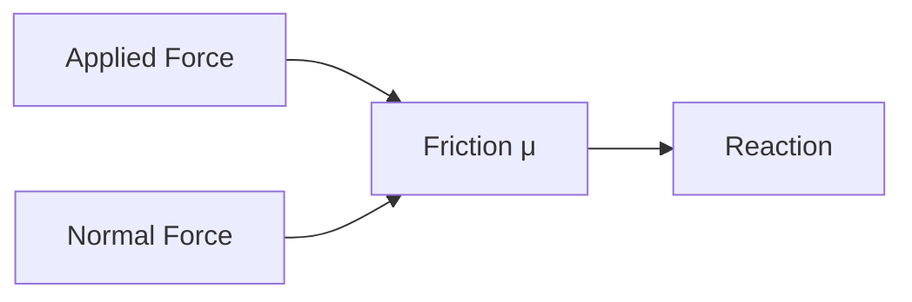
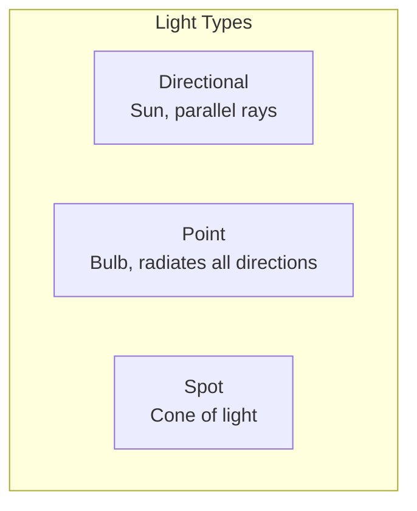
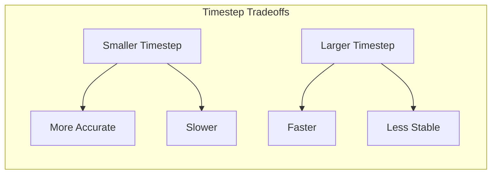

# Chapter 2: Gazebo World Setup

**Duration**: 4-5 hours
**Difficulty**: Intermediate

---

## Learning Objectives

After completing this chapter, you will be able to:

- Understand SDF world file structure
- Create ground planes with friction properties
- Configure lighting for simulation
- Set physics engine parameters
- Tune timestep for stability

---

## 2.1 SDF World Format

**SDF (Simulation Description Format)** is the native format for Gazebo worlds and models.

### Basic World Structure

```xml
<?xml version="1.0"?>
<sdf version="1.9">
  <world name="humanoid_world">

    <!-- Physics configuration -->
    <physics type="ode">
      <max_step_size>0.001</max_step_size>
      <real_time_factor>1.0</real_time_factor>
    </physics>

    <!-- Lighting -->
    <light type="directional" name="sun">
      <!-- ... -->
    </light>

    <!-- Ground plane -->
    <model name="ground_plane">
      <!-- ... -->
    </model>

    <!-- Plugins -->
    <plugin filename="gz-sim-physics-system" name="gz::sim::systems::Physics"/>

  </world>
</sdf>
```

### SDF vs URDF

| Feature | SDF | URDF |
|---------|-----|------|
| Purpose | Simulation worlds | Robot description |
| Scope | World + models | Single robot |
| Physics | Full configuration | Limited |
| Sensors | Native support | Gazebo tags |
| ROS | Gazebo native | ROS native |

---

## 2.2 Ground Plane with Friction

The ground plane is critical for stable humanoid simulation.

### Basic Ground Plane

```xml
<model name="ground_plane">
  <static>true</static>
  <link name="link">
    <collision name="collision">
      <geometry>
        <plane>
          <normal>0 0 1</normal>
          <size>100 100</size>
        </plane>
      </geometry>
      <surface>
        <friction>
          <ode>
            <mu>1.0</mu>
            <mu2>1.0</mu2>
          </ode>
        </friction>
        <contact>
          <ode>
            <kp>1e6</kp>
            <kd>100</kd>
          </ode>
        </contact>
      </surface>
    </collision>
    <visual name="visual">
      <geometry>
        <plane>
          <normal>0 0 1</normal>
          <size>100 100</size>
        </plane>
      </geometry>
      <material>
        <ambient>0.8 0.8 0.8 1</ambient>
        <diffuse>0.8 0.8 0.8 1</diffuse>
      </material>
    </visual>
  </link>
</model>
```

### Friction Parameters



| Parameter | Description | Typical Value |
|-----------|-------------|---------------|
| `mu` | Primary friction coefficient | 0.5 - 1.5 |
| `mu2` | Secondary friction coefficient | Same as mu |
| `kp` | Contact stiffness | 1e5 - 1e7 |
| `kd` | Contact damping | 10 - 1000 |

### Friction Values for Different Surfaces

| Surface | μ (friction) |
|---------|-------------|
| Rubber on concrete | 1.0 - 1.5 |
| Rubber on wood | 0.7 - 0.9 |
| Metal on metal | 0.3 - 0.5 |
| Ice | 0.01 - 0.05 |

---

## 2.3 Lighting Configuration

Proper lighting affects both visualization and simulated cameras.

### Directional Light (Sun)

```xml
<light type="directional" name="sun">
  <cast_shadows>true</cast_shadows>
  <pose>0 0 10 0 0 0</pose>
  <diffuse>0.8 0.8 0.8 1</diffuse>
  <specular>0.2 0.2 0.2 1</specular>
  <direction>-0.5 0.1 -0.9</direction>
</light>
```

### Ambient Light

```xml
<scene>
  <ambient>0.4 0.4 0.4 1</ambient>
  <background>0.7 0.7 0.7 1</background>
  <shadows>true</shadows>
</scene>
```

### Light Types



| Type | Use Case | Shadows |
|------|----------|---------|
| Directional | Sun, outdoor | Yes |
| Point | Indoor lights | Optional |
| Spot | Focused lighting | Yes |

---

## 2.4 Physics Engine Configuration

Physics configuration determines simulation accuracy and speed.

### Physics Block

```xml
<physics type="ode">
  <!-- Timestep: smaller = more accurate, slower -->
  <max_step_size>0.001</max_step_size>

  <!-- Target real-time factor -->
  <real_time_factor>1.0</real_time_factor>

  <!-- Real-time update rate (Hz) -->
  <real_time_update_rate>1000</real_time_update_rate>

  <!-- ODE-specific settings -->
  <ode>
    <solver>
      <type>quick</type>
      <iters>50</iters>
      <sor>1.3</sor>
    </solver>
    <constraints>
      <cfm>0.0</cfm>
      <erp>0.2</erp>
      <contact_max_correcting_vel>100</contact_max_correcting_vel>
      <contact_surface_layer>0.001</contact_surface_layer>
    </constraints>
  </ode>
</physics>
```

### Physics Parameters Explained

| Parameter | Description | Impact |
|-----------|-------------|--------|
| `max_step_size` | Integration timestep | Accuracy vs speed |
| `real_time_factor` | Target RTF | Simulation speed |
| `iters` | Solver iterations | Constraint accuracy |
| `sor` | Successive over-relaxation | Convergence speed |
| `cfm` | Constraint force mixing | Joint softness |
| `erp` | Error reduction parameter | Position correction |

### Choosing Timestep



| Robot Type | Recommended Timestep |
|------------|---------------------|
| Humanoid (walking) | 0.001s (1ms) |
| Arm manipulation | 0.002s (2ms) |
| Simple mobile robot | 0.005s (5ms) |

---

## 2.5 Required Plugins

Gazebo plugins provide essential functionality.

### System Plugins

```xml
<!-- Physics system (required) -->
<plugin
  filename="gz-sim-physics-system"
  name="gz::sim::systems::Physics">
</plugin>

<!-- User commands (spawn, delete) -->
<plugin
  filename="gz-sim-user-commands-system"
  name="gz::sim::systems::UserCommands">
</plugin>

<!-- Scene broadcaster (visualization) -->
<plugin
  filename="gz-sim-scene-broadcaster-system"
  name="gz::sim::systems::SceneBroadcaster">
</plugin>

<!-- Sensor system (cameras, IMU, etc.) -->
<plugin
  filename="gz-sim-sensors-system"
  name="gz::sim::systems::Sensors">
  <render_engine>ogre2</render_engine>
</plugin>

<!-- Contact system -->
<plugin
  filename="gz-sim-contact-system"
  name="gz::sim::systems::Contact">
</plugin>
```

---

## 2.6 Complete Humanoid World

### humanoid_world.sdf

```xml
<?xml version="1.0"?>
<sdf version="1.9">
  <world name="humanoid_world">

    <!-- Physics -->
    <physics type="ode">
      <max_step_size>0.001</max_step_size>
      <real_time_factor>1.0</real_time_factor>
      <real_time_update_rate>1000</real_time_update_rate>
      <ode>
        <solver>
          <type>quick</type>
          <iters>50</iters>
          <sor>1.3</sor>
        </solver>
        <constraints>
          <cfm>0.0</cfm>
          <erp>0.2</erp>
          <contact_max_correcting_vel>100</contact_max_correcting_vel>
          <contact_surface_layer>0.001</contact_surface_layer>
        </constraints>
      </ode>
    </physics>

    <!-- Scene settings -->
    <scene>
      <ambient>0.4 0.4 0.4 1</ambient>
      <background>0.7 0.85 1.0 1</background>
      <shadows>true</shadows>
    </scene>

    <!-- Sun light -->
    <light type="directional" name="sun">
      <cast_shadows>true</cast_shadows>
      <pose>0 0 10 0 0 0</pose>
      <diffuse>0.8 0.8 0.8 1</diffuse>
      <specular>0.2 0.2 0.2 1</specular>
      <attenuation>
        <range>1000</range>
        <constant>0.9</constant>
        <linear>0.01</linear>
        <quadratic>0.001</quadratic>
      </attenuation>
      <direction>-0.5 0.1 -0.9</direction>
    </light>

    <!-- Ground plane -->
    <model name="ground_plane">
      <static>true</static>
      <link name="link">
        <collision name="collision">
          <geometry>
            <plane>
              <normal>0 0 1</normal>
              <size>100 100</size>
            </plane>
          </geometry>
          <surface>
            <friction>
              <ode>
                <mu>1.0</mu>
                <mu2>1.0</mu2>
              </ode>
            </friction>
            <contact>
              <ode>
                <kp>1e6</kp>
                <kd>100</kd>
              </ode>
            </contact>
          </surface>
        </collision>
        <visual name="visual">
          <geometry>
            <plane>
              <normal>0 0 1</normal>
              <size>100 100</size>
            </plane>
          </geometry>
          <material>
            <ambient>0.8 0.8 0.8 1</ambient>
            <diffuse>0.8 0.8 0.8 1</diffuse>
            <specular>0.1 0.1 0.1 1</specular>
          </material>
        </visual>
      </link>
    </model>

    <!-- Gravity -->
    <gravity>0 0 -9.81</gravity>

    <!-- Magnetic field -->
    <magnetic_field>5.5645e-6 22.8758e-6 -42.3884e-6</magnetic_field>

    <!-- Required plugins -->
    <plugin
      filename="gz-sim-physics-system"
      name="gz::sim::systems::Physics">
    </plugin>

    <plugin
      filename="gz-sim-user-commands-system"
      name="gz::sim::systems::UserCommands">
    </plugin>

    <plugin
      filename="gz-sim-scene-broadcaster-system"
      name="gz::sim::systems::SceneBroadcaster">
    </plugin>

    <plugin
      filename="gz-sim-sensors-system"
      name="gz::sim::systems::Sensors">
      <render_engine>ogre2</render_engine>
    </plugin>

    <plugin
      filename="gz-sim-contact-system"
      name="gz::sim::systems::Contact">
    </plugin>

  </world>
</sdf>
```

---

## 2.7 Launch File for Gazebo

### gazebo.launch.py

```python
#!/usr/bin/env python3
"""
Launch Gazebo with humanoid world.
"""

import os

from launch import LaunchDescription
from launch.actions import DeclareLaunchArgument, IncludeLaunchDescription
from launch.conditions import IfCondition
from launch.substitutions import LaunchConfiguration
from launch.launch_description_sources import PythonLaunchDescriptionSource
from launch_ros.actions import Node
from ament_index_python.packages import get_package_share_directory


def generate_launch_description():
    pkg_dir = get_package_share_directory('humanoid_gazebo')
    gz_sim_share = get_package_share_directory('ros_gz_sim')

    # World file
    world_file = os.path.join(pkg_dir, 'worlds', 'humanoid_world.sdf')

    # Launch arguments
    use_sim_time_arg = DeclareLaunchArgument(
        'use_sim_time',
        default_value='true',
        description='Use simulation time'
    )

    headless_arg = DeclareLaunchArgument(
        'headless',
        default_value='false',
        description='Run headless (no GUI)'
    )

    # Gazebo simulator
    gz_sim = IncludeLaunchDescription(
        PythonLaunchDescriptionSource(
            os.path.join(gz_sim_share, 'launch', 'gz_sim.launch.py')
        ),
        launch_arguments={
            'gz_args': f'-r {world_file}',
        }.items()
    )

    # Clock bridge (Gazebo -> ROS)
    clock_bridge = Node(
        package='ros_gz_bridge',
        executable='parameter_bridge',
        arguments=['/clock@rosgraph_msgs/msg/Clock[gz.msgs.Clock'],
        output='screen'
    )

    return LaunchDescription([
        use_sim_time_arg,
        headless_arg,
        gz_sim,
        clock_bridge,
    ])
```

---

## Hands-On Exercises

### Exercise 2.1: Create Empty World

1. Create `empty.sdf` with just physics and ground plane
2. Launch with `gz sim empty.sdf`
3. Verify RTF is close to 1.0

### Exercise 2.2: Experiment with Friction

1. Create a world with a ramp (inclined plane)
2. Add a box at the top
3. Vary `mu` from 0.1 to 1.5
4. Document at which `mu` the box starts sliding

### Exercise 2.3: Timestep Effects

1. Create a world with a falling object
2. Test timesteps: 0.01s, 0.005s, 0.001s, 0.0005s
3. Measure: fall time, final position, RTF
4. What's the best tradeoff for humanoid simulation?

---

## Summary

In this chapter, you learned:

- SDF is the native format for Gazebo worlds
- Ground plane friction is critical for walking stability
- Physics parameters control accuracy vs speed
- Proper lighting affects cameras and visualization
- Required plugins enable physics, sensors, and interaction

## Next Chapter

In [Chapter 3](ch03-spawning-robots.md), you will spawn the humanoid robot in Gazebo and control it via ROS 2.

---

## Quick Reference

```xml
<!-- Friction -->
<surface>
  <friction><ode><mu>1.0</mu></ode></friction>
  <contact><ode><kp>1e6</kp><kd>100</kd></ode></contact>
</surface>

<!-- Physics -->
<physics type="ode">
  <max_step_size>0.001</max_step_size>
  <real_time_factor>1.0</real_time_factor>
</physics>

<!-- Light -->
<light type="directional" name="sun">
  <direction>-0.5 0.1 -0.9</direction>
</light>
```

```bash
# Launch world
gz sim humanoid_world.sdf

# With ROS 2
ros2 launch humanoid_gazebo gazebo.launch.py
```
