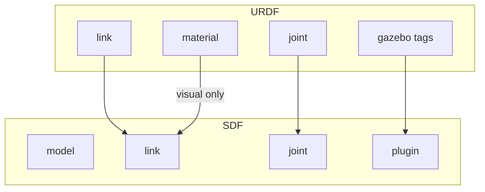
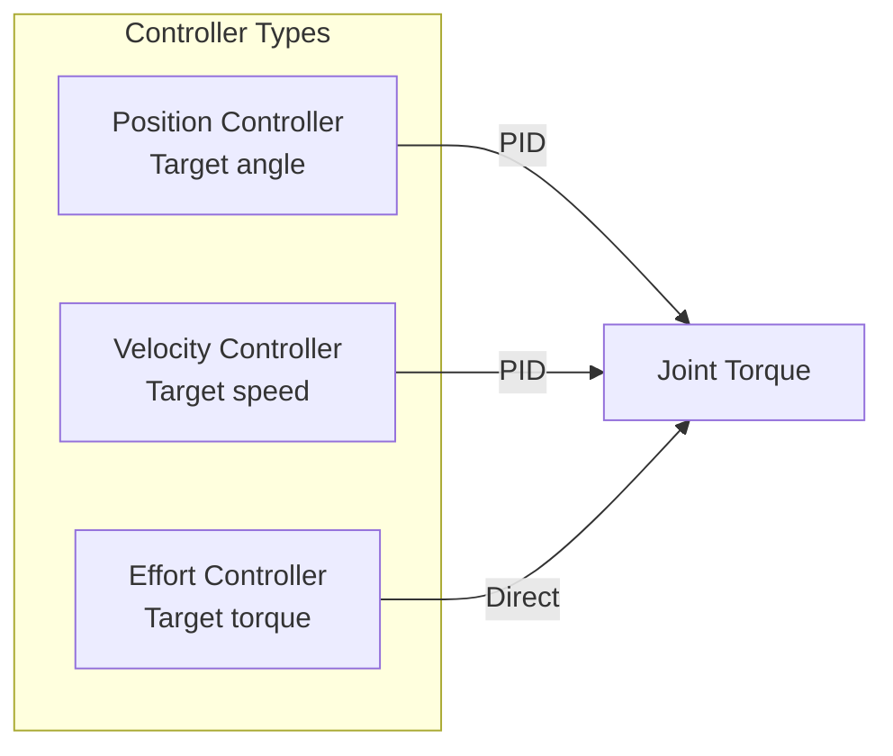
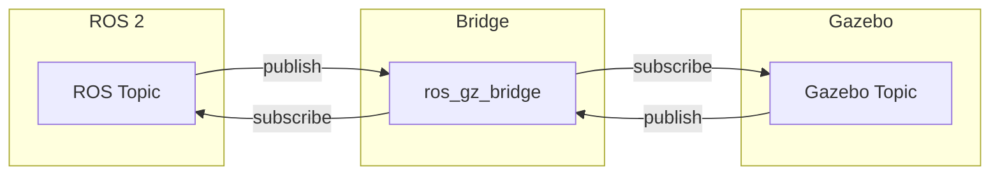

# Chapter 3: Spawning Robots in Gazebo

**Duration**: 4-5 hours
**Difficulty**: Intermediate

---

## Learning Objectives

After completing this chapter, you will be able to:

- Convert URDF to SDF format
- Spawn robots using ros_gz_bridge
- Configure joint controllers
- Send commands via ROS 2 topics
- Verify robot state feedback

---

## 3.1 URDF to SDF Conversion

Gazebo uses SDF format, but ROS 2 robots are described in URDF. Understanding conversion is essential.

### Automatic Conversion

Gazebo can automatically convert URDF at spawn time:

```bash
# Spawn URDF model in Gazebo
ros2 run ros_gz_sim create -file robot.urdf -name humanoid
```

### Manual Conversion

For debugging or optimization, convert manually:

```bash
# Convert URDF to SDF
gz sdf -p robot.urdf > robot.sdf

# Validate SDF
gz sdf -k robot.sdf
```

### Key Differences



| Feature | URDF | SDF |
|---------|------|-----|
| Root element | `<robot>` | `<model>` |
| Physics | `<gazebo>` tags | Native |
| Sensors | Gazebo plugins | Native |
| Multiple robots | No | Yes |
| World definition | No | Yes |

---

## 3.2 Spawning with ros_gz_sim

### Basic Spawn Command

```bash
# Spawn from file
ros2 run ros_gz_sim create \
    -file /path/to/robot.urdf \
    -name humanoid \
    -x 0 -y 0 -z 1.0

# Spawn from topic (robot_description)
ros2 run ros_gz_sim create \
    -topic robot_description \
    -name humanoid \
    -z 1.0
```

### Spawn Service

```bash
# Using service call
ros2 service call /world/humanoid_world/create \
    ros_gz_interfaces/srv/SpawnEntity \
    "{name: 'humanoid', sdf: '$(cat robot.sdf)'}"
```

### spawn_robot.launch.py

```python
#!/usr/bin/env python3
"""
Launch file to spawn humanoid robot in Gazebo.
"""

import os

from launch import LaunchDescription
from launch.actions import DeclareLaunchArgument, ExecuteProcess
from launch.substitutions import LaunchConfiguration, Command
from launch_ros.actions import Node
from ament_index_python.packages import get_package_share_directory


def generate_launch_description():
    pkg_description = get_package_share_directory('humanoid_description')
    pkg_gazebo = get_package_share_directory('humanoid_gazebo')

    # URDF file path
    urdf_file = os.path.join(pkg_description, 'urdf', 'humanoid.urdf.xacro')

    # Process XACRO
    robot_description = Command(['xacro ', urdf_file])

    # Launch arguments
    use_sim_time = DeclareLaunchArgument(
        'use_sim_time',
        default_value='true',
        description='Use simulation time'
    )

    spawn_x = DeclareLaunchArgument('x', default_value='0.0')
    spawn_y = DeclareLaunchArgument('y', default_value='0.0')
    spawn_z = DeclareLaunchArgument('z', default_value='1.0')

    # Robot state publisher
    robot_state_publisher = Node(
        package='robot_state_publisher',
        executable='robot_state_publisher',
        name='robot_state_publisher',
        output='screen',
        parameters=[{
            'robot_description': robot_description,
            'use_sim_time': LaunchConfiguration('use_sim_time')
        }]
    )

    # Spawn robot in Gazebo
    spawn_robot = Node(
        package='ros_gz_sim',
        executable='create',
        arguments=[
            '-topic', 'robot_description',
            '-name', 'humanoid',
            '-x', LaunchConfiguration('x'),
            '-y', LaunchConfiguration('y'),
            '-z', LaunchConfiguration('z'),
        ],
        output='screen'
    )

    return LaunchDescription([
        use_sim_time,
        spawn_x,
        spawn_y,
        spawn_z,
        robot_state_publisher,
        spawn_robot,
    ])
```

---

## 3.3 Joint Controllers

Joint controllers translate ROS 2 commands into Gazebo forces/positions.

### Gazebo Joint Controller Plugin

Add to URDF (inside `<gazebo>` tags):

```xml
<gazebo>
  <plugin
    filename="gz-sim-joint-position-controller-system"
    name="gz::sim::systems::JointPositionController">
    <joint_name>left_hip_pitch</joint_name>
    <topic>left_hip_pitch/cmd</topic>
    <p_gain>100</p_gain>
    <i_gain>0.1</i_gain>
    <d_gain>10</d_gain>
  </plugin>
</gazebo>
```

### Controller Types



| Controller | Use Case | Plugin |
|------------|----------|--------|
| Position | Precise poses | `JointPositionController` |
| Velocity | Smooth motion | `JointVelocityController` |
| Effort | Force control | `JointController` (effort) |

### Multi-Joint Controller

For controlling all joints together:

```xml
<gazebo>
  <plugin
    filename="gz-sim-joint-trajectory-controller-system"
    name="gz::sim::systems::JointTrajectoryController">
    <joint_name>left_hip_pitch</joint_name>
    <joint_name>left_hip_roll</joint_name>
    <joint_name>left_knee</joint_name>
    <joint_name>left_ankle_pitch</joint_name>
    <joint_name>left_ankle_roll</joint_name>
    <joint_name>right_hip_pitch</joint_name>
    <joint_name>right_hip_roll</joint_name>
    <joint_name>right_knee</joint_name>
    <joint_name>right_ankle_pitch</joint_name>
    <joint_name>right_ankle_roll</joint_name>
    <joint_name>left_shoulder</joint_name>
    <joint_name>left_elbow</joint_name>
    <joint_name>right_shoulder</joint_name>
    <joint_name>right_elbow</joint_name>
  </plugin>
</gazebo>
```

---

## 3.4 ros_gz_bridge Configuration

The bridge connects ROS 2 topics to Gazebo topics.

### Bridge Types



### Bridge Syntax

```
/topic@ros_type[gz.msgs.GzType     # ROS -> Gazebo
/topic@ros_type]gz.msgs.GzType     # Gazebo -> ROS
/topic@ros_type@gz.msgs.GzType     # Bidirectional
```

### Common Bridges

```yaml
# bridge_config.yaml
---
- ros_topic_name: "/clock"
  gz_topic_name: "/clock"
  ros_type_name: "rosgraph_msgs/msg/Clock"
  gz_type_name: "gz.msgs.Clock"
  direction: GZ_TO_ROS

- ros_topic_name: "/joint_states"
  gz_topic_name: "/world/humanoid_world/model/humanoid/joint_state"
  ros_type_name: "sensor_msgs/msg/JointState"
  gz_type_name: "gz.msgs.Model"
  direction: GZ_TO_ROS

- ros_topic_name: "/cmd_vel"
  gz_topic_name: "/model/humanoid/cmd_vel"
  ros_type_name: "geometry_msgs/msg/Twist"
  gz_type_name: "gz.msgs.Twist"
  direction: ROS_TO_GZ
```

### Bridge Launch

```python
# In launch file
bridge = Node(
    package='ros_gz_bridge',
    executable='parameter_bridge',
    arguments=[
        '/clock@rosgraph_msgs/msg/Clock[gz.msgs.Clock',
        '/joint_states@sensor_msgs/msg/JointState[gz.msgs.Model',
        '/left_hip_pitch/cmd@std_msgs/msg/Float64]gz.msgs.Double',
    ],
    parameters=[{'use_sim_time': True}],
    output='screen'
)
```

---

## 3.5 Sending Joint Commands

### Position Command Node

```python
#!/usr/bin/env python3
"""
Send position commands to Gazebo joints.
"""

import rclpy
from rclpy.node import Node
from std_msgs.msg import Float64
import math


class JointCommander(Node):
    """Send sine wave commands to joints."""

    def __init__(self):
        super().__init__('joint_commander')

        # Joint command publishers
        self.joints = [
            'left_hip_pitch',
            'left_knee',
            'right_hip_pitch',
            'right_knee',
        ]

        self.publishers = {}
        for joint in self.joints:
            self.publishers[joint] = self.create_publisher(
                Float64,
                f'/{joint}/cmd',
                10
            )

        # Timer for periodic commands
        self.timer = self.create_timer(0.01, self.send_commands)
        self.start_time = self.get_clock().now()

        self.get_logger().info('Joint commander started')

    def send_commands(self):
        """Send sinusoidal joint commands."""
        elapsed = (self.get_clock().now() - self.start_time).nanoseconds / 1e9

        # Simple walking-like motion
        amplitude = 0.3  # radians
        frequency = 0.5  # Hz

        phase = 2 * math.pi * frequency * elapsed

        commands = {
            'left_hip_pitch': amplitude * math.sin(phase),
            'left_knee': -amplitude * abs(math.sin(phase)),
            'right_hip_pitch': amplitude * math.sin(phase + math.pi),
            'right_knee': -amplitude * abs(math.sin(phase + math.pi)),
        }

        for joint, position in commands.items():
            msg = Float64()
            msg.data = position
            self.publishers[joint].publish(msg)


def main(args=None):
    rclpy.init(args=args)
    node = JointCommander()

    try:
        rclpy.spin(node)
    except KeyboardInterrupt:
        pass
    finally:
        node.destroy_node()
        rclpy.shutdown()


if __name__ == '__main__':
    main()
```

### Trajectory Command

For coordinated motion, use trajectory messages:

```python
#!/usr/bin/env python3
"""
Send trajectory commands to Gazebo joints.
"""

import rclpy
from rclpy.node import Node
from trajectory_msgs.msg import JointTrajectory, JointTrajectoryPoint
from builtin_interfaces.msg import Duration


class TrajectoryCommander(Node):
    """Send joint trajectories."""

    def __init__(self):
        super().__init__('trajectory_commander')

        self.publisher = self.create_publisher(
            JointTrajectory,
            '/joint_trajectory',
            10
        )

        # Send initial trajectory after 2 seconds
        self.create_timer(2.0, self.send_trajectory)

    def send_trajectory(self):
        """Send a simple stand-up trajectory."""
        msg = JointTrajectory()
        msg.joint_names = [
            'left_hip_pitch', 'left_knee',
            'right_hip_pitch', 'right_knee',
        ]

        # Point 1: Crouch
        point1 = JointTrajectoryPoint()
        point1.positions = [-0.5, 1.0, -0.5, 1.0]
        point1.time_from_start = Duration(sec=1, nanosec=0)

        # Point 2: Stand
        point2 = JointTrajectoryPoint()
        point2.positions = [0.0, 0.0, 0.0, 0.0]
        point2.time_from_start = Duration(sec=2, nanosec=0)

        msg.points = [point1, point2]

        self.publisher.publish(msg)
        self.get_logger().info('Trajectory sent')


def main(args=None):
    rclpy.init(args=args)
    node = TrajectoryCommander()
    rclpy.spin(node)
    node.destroy_node()
    rclpy.shutdown()


if __name__ == '__main__':
    main()
```

---

## 3.6 Joint State Feedback

### Subscribing to Joint States

```python
#!/usr/bin/env python3
"""
Subscribe to joint states from Gazebo.
"""

import rclpy
from rclpy.node import Node
from sensor_msgs.msg import JointState


class JointStateMonitor(Node):
    """Monitor joint states from simulation."""

    def __init__(self):
        super().__init__('joint_state_monitor')

        self.subscription = self.create_subscription(
            JointState,
            '/joint_states',
            self.joint_state_callback,
            10
        )

        self.get_logger().info('Joint state monitor started')

    def joint_state_callback(self, msg: JointState):
        """Process incoming joint state."""
        self.get_logger().info(
            f'Received {len(msg.name)} joint states'
        )

        for i, name in enumerate(msg.name):
            pos = msg.position[i] if i < len(msg.position) else 0.0
            vel = msg.velocity[i] if i < len(msg.velocity) else 0.0
            eff = msg.effort[i] if i < len(msg.effort) else 0.0

            self.get_logger().debug(
                f'{name}: pos={pos:.3f}, vel={vel:.3f}, eff={eff:.3f}'
            )


def main(args=None):
    rclpy.init(args=args)
    node = JointStateMonitor()
    rclpy.spin(node)
    node.destroy_node()
    rclpy.shutdown()


if __name__ == '__main__':
    main()
```

---

## 3.7 Complete Spawn Launch File

### humanoid_spawn.launch.py

```python
#!/usr/bin/env python3
"""
Complete launch file for spawning humanoid in Gazebo with controllers.
"""

import os

from launch import LaunchDescription
from launch.actions import (
    DeclareLaunchArgument,
    IncludeLaunchDescription,
    GroupAction,
)
from launch.conditions import IfCondition
from launch.substitutions import LaunchConfiguration, Command, PathJoinSubstitution
from launch.launch_description_sources import PythonLaunchDescriptionSource
from launch_ros.actions import Node
from ament_index_python.packages import get_package_share_directory


def generate_launch_description():
    # Package directories
    pkg_description = get_package_share_directory('humanoid_description')
    pkg_gazebo = get_package_share_directory('humanoid_gazebo')
    gz_sim_share = get_package_share_directory('ros_gz_sim')

    # File paths
    urdf_file = os.path.join(pkg_description, 'urdf', 'humanoid.urdf.xacro')
    world_file = os.path.join(pkg_gazebo, 'worlds', 'humanoid_world.sdf')

    # Process XACRO
    robot_description = Command(['xacro ', urdf_file])

    # Launch arguments
    use_sim_time = DeclareLaunchArgument(
        'use_sim_time',
        default_value='true'
    )

    headless = DeclareLaunchArgument(
        'headless',
        default_value='false',
        description='Run simulation headless'
    )

    # Gazebo simulation
    gazebo = IncludeLaunchDescription(
        PythonLaunchDescriptionSource(
            os.path.join(gz_sim_share, 'launch', 'gz_sim.launch.py')
        ),
        launch_arguments={
            'gz_args': f'-r {world_file}',
        }.items()
    )

    # Robot state publisher
    robot_state_publisher = Node(
        package='robot_state_publisher',
        executable='robot_state_publisher',
        parameters=[{
            'robot_description': robot_description,
            'use_sim_time': LaunchConfiguration('use_sim_time'),
        }],
        output='screen'
    )

    # Spawn robot
    spawn_robot = Node(
        package='ros_gz_sim',
        executable='create',
        arguments=[
            '-topic', 'robot_description',
            '-name', 'humanoid',
            '-z', '1.0',
        ],
        output='screen'
    )

    # Bridge for clock and joint states
    bridge = Node(
        package='ros_gz_bridge',
        executable='parameter_bridge',
        arguments=[
            '/clock@rosgraph_msgs/msg/Clock[gz.msgs.Clock',
            '/joint_states@sensor_msgs/msg/JointState[gz.msgs.Model',
        ],
        parameters=[{'use_sim_time': True}],
        output='screen'
    )

    # Joint state broadcaster (ros2_control)
    joint_state_broadcaster = Node(
        package='controller_manager',
        executable='spawner',
        arguments=['joint_state_broadcaster'],
        parameters=[{'use_sim_time': True}],
        output='screen'
    )

    return LaunchDescription([
        use_sim_time,
        headless,
        gazebo,
        robot_state_publisher,
        spawn_robot,
        bridge,
    ])
```

---

## Hands-On Exercises

### Exercise 3.1: Spawn Humanoid

1. Create the launch file structure:
   ```bash
   mkdir -p humanoid_gazebo/launch
   ```

2. Copy `humanoid_spawn.launch.py`

3. Launch:
   ```bash
   ros2 launch humanoid_gazebo humanoid_spawn.launch.py
   ```

4. Verify robot appears in Gazebo

### Exercise 3.2: Joint Control

1. Create a node that:
   - Subscribes to `/joint_states`
   - Publishes to individual joint command topics
   - Implements a simple crouch motion

2. Test the motion in simulation

### Exercise 3.3: Bridge Configuration

1. List all available Gazebo topics:
   ```bash
   gz topic -l
   ```

2. Create a bridge for:
   - All joint commands
   - IMU data (if available)
   - Clock synchronization

3. Verify with `ros2 topic list`

---

## Summary

In this chapter, you learned:

- URDF can be converted to SDF for Gazebo
- ros_gz_sim spawns robots from URDF or topics
- Joint controllers translate ROS 2 commands to Gazebo
- ros_gz_bridge connects ROS 2 and Gazebo topics
- Joint state feedback enables closed-loop control

## Next Chapter

In [Chapter 4](ch04-sensor-simulation.md), you will add simulated sensors (camera, IMU, force/torque) to the humanoid.

---

## Quick Reference

```bash
# Spawn robot
ros2 run ros_gz_sim create -topic robot_description -name humanoid -z 1.0

# List Gazebo topics
gz topic -l

# Echo Gazebo topic
gz topic -e -t /joint_states

# Bridge syntax
/topic@ros_type[gz.msgs.GzType   # GZ -> ROS
/topic@ros_type]gz.msgs.GzType   # ROS -> GZ
/topic@ros_type@gz.msgs.GzType   # Bidirectional

# Convert URDF to SDF
gz sdf -p robot.urdf > robot.sdf
```

| Component | Purpose |
|-----------|---------|
| ros_gz_sim | Spawn models in Gazebo |
| ros_gz_bridge | Topic/service bridging |
| JointPositionController | PID position control |
| JointTrajectoryController | Multi-joint trajectories |
