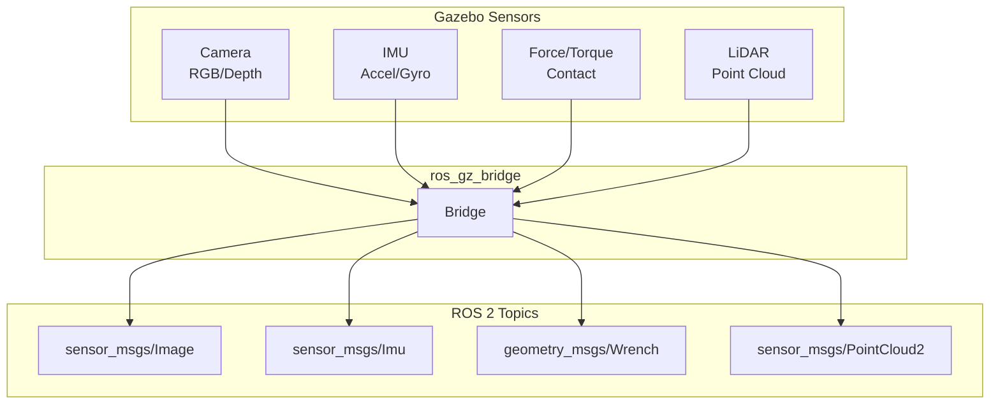
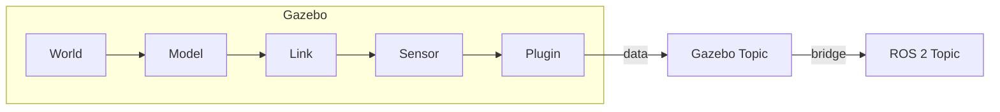
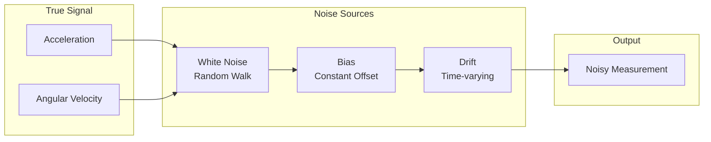

# Chapter 4: Sensor Simulation

**Duration**: 5-6 hours
**Difficulty**: Intermediate

---

## Learning Objectives

After completing this chapter, you will be able to:

- Add camera sensors with configurable parameters
- Implement IMU sensors with realistic noise
- Configure force/torque sensors for foot contact
- Bridge sensor data to ROS 2 topics
- Visualize sensor data in RViz

---

## 4.1 Sensor Simulation Overview

Sensors in Gazebo simulate real hardware behavior including noise, delay, and physical limitations.



### Sensor Plugin Architecture



---

## 4.2 Camera Sensor

### Adding Camera to URDF

```xml
<!-- In humanoid.urdf.xacro -->
<link name="head_camera_link">
  <visual>
    <geometry>
      <box size="0.02 0.05 0.02"/>
    </geometry>
    <material name="black"/>
  </visual>
  <inertial>
    <mass value="0.1"/>
    <inertia ixx="0.001" ixy="0" ixz="0" iyy="0.001" iyz="0" izz="0.001"/>
  </inertial>
</link>

<joint name="head_camera_joint" type="fixed">
  <parent link="head"/>
  <child link="head_camera_link"/>
  <origin xyz="0.05 0 0" rpy="0 0 0"/>
</joint>

<!-- Gazebo camera sensor -->
<gazebo reference="head_camera_link">
  <sensor name="head_camera" type="camera">
    <always_on>true</always_on>
    <update_rate>30</update_rate>
    <visualize>true</visualize>
    <topic>head_camera/image_raw</topic>

    <camera name="head_camera">
      <horizontal_fov>1.047</horizontal_fov>
      <image>
        <width>640</width>
        <height>480</height>
        <format>R8G8B8</format>
      </image>
      <clip>
        <near>0.1</near>
        <far>100</far>
      </clip>
      <noise>
        <type>gaussian</type>
        <mean>0.0</mean>
        <stddev>0.007</stddev>
      </noise>
    </camera>
  </sensor>
</gazebo>
```

### Camera Parameters

| Parameter | Description | Typical Value |
|-----------|-------------|---------------|
| `update_rate` | Frames per second | 30 Hz |
| `horizontal_fov` | Field of view (radians) | 1.047 (60°) |
| `width` x `height` | Image resolution | 640x480 |
| `format` | Pixel format | R8G8B8 |
| `noise.stddev` | Gaussian noise | 0.007 |

### Depth Camera

```xml
<gazebo reference="head_camera_link">
  <sensor name="depth_camera" type="depth_camera">
    <always_on>true</always_on>
    <update_rate>30</update_rate>
    <topic>depth_camera</topic>

    <camera name="depth_camera">
      <horizontal_fov>1.047</horizontal_fov>
      <image>
        <width>640</width>
        <height>480</height>
        <format>R_FLOAT32</format>
      </image>
      <clip>
        <near>0.1</near>
        <far>10.0</far>
      </clip>
    </camera>
  </sensor>
</gazebo>
```

### Camera Bridge Configuration

```python
# Camera image bridge
camera_bridge = Node(
    package='ros_gz_bridge',
    executable='parameter_bridge',
    arguments=[
        '/head_camera/image_raw@sensor_msgs/msg/Image[gz.msgs.Image',
        '/head_camera/camera_info@sensor_msgs/msg/CameraInfo[gz.msgs.CameraInfo',
        '/depth_camera/depth_image@sensor_msgs/msg/Image[gz.msgs.Image',
        '/depth_camera/points@sensor_msgs/msg/PointCloud2[gz.msgs.PointCloudPacked',
    ],
    output='screen'
)
```

---

## 4.3 IMU Sensor

The IMU (Inertial Measurement Unit) provides acceleration and angular velocity data.

### Adding IMU to URDF

```xml
<!-- IMU link in torso -->
<link name="imu_link">
  <inertial>
    <mass value="0.01"/>
    <inertia ixx="0.0001" ixy="0" ixz="0" iyy="0.0001" iyz="0" izz="0.0001"/>
  </inertial>
</link>

<joint name="imu_joint" type="fixed">
  <parent link="torso"/>
  <child link="imu_link"/>
  <origin xyz="0 0 0" rpy="0 0 0"/>
</joint>

<!-- Gazebo IMU sensor -->
<gazebo reference="imu_link">
  <sensor name="imu_sensor" type="imu">
    <always_on>true</always_on>
    <update_rate>100</update_rate>
    <visualize>false</visualize>
    <topic>imu/data</topic>

    <imu>
      <angular_velocity>
        <x>
          <noise type="gaussian">
            <mean>0.0</mean>
            <stddev>0.01</stddev>
          </noise>
        </x>
        <y>
          <noise type="gaussian">
            <mean>0.0</mean>
            <stddev>0.01</stddev>
          </noise>
        </y>
        <z>
          <noise type="gaussian">
            <mean>0.0</mean>
            <stddev>0.01</stddev>
          </noise>
        </z>
      </angular_velocity>

      <linear_acceleration>
        <x>
          <noise type="gaussian">
            <mean>0.0</mean>
            <stddev>0.1</stddev>
          </noise>
        </x>
        <y>
          <noise type="gaussian">
            <mean>0.0</mean>
            <stddev>0.1</stddev>
          </noise>
        </y>
        <z>
          <noise type="gaussian">
            <mean>0.0</mean>
            <stddev>0.1</stddev>
          </noise>
        </z>
      </linear_acceleration>
    </imu>
  </sensor>
</gazebo>
```

### IMU Noise Model



| Noise Type | Description | Typical Value |
|------------|-------------|---------------|
| Gaussian | Random noise | stddev 0.01-0.1 |
| Bias | Constant offset | 0.001 rad/s |
| Random walk | Accumulating drift | 0.0001 rad/s² |

### IMU Bridge

```python
imu_bridge = Node(
    package='ros_gz_bridge',
    executable='parameter_bridge',
    arguments=[
        '/imu/data@sensor_msgs/msg/Imu[gz.msgs.IMU',
    ],
    output='screen'
)
```

---

## 4.4 Force/Torque Sensors

Force/torque sensors measure contact forces, essential for balance control.

### Adding F/T Sensor to Foot

```xml
<!-- Force/torque sensor in ankle joint -->
<gazebo reference="left_ankle_pitch">
  <sensor name="left_foot_ft" type="force_torque">
    <always_on>true</always_on>
    <update_rate>100</update_rate>
    <visualize>true</visualize>
    <topic>left_foot/ft</topic>

    <force_torque>
      <frame>child</frame>
      <measure_direction>child_to_parent</measure_direction>
    </force_torque>
  </sensor>
</gazebo>

<gazebo reference="right_ankle_pitch">
  <sensor name="right_foot_ft" type="force_torque">
    <always_on>true</always_on>
    <update_rate>100</update_rate>
    <visualize>true</visualize>
    <topic>right_foot/ft</topic>

    <force_torque>
      <frame>child</frame>
      <measure_direction>child_to_parent</measure_direction>
    </force_torque>
  </sensor>
</gazebo>
```

### Contact Sensor Alternative

For detecting ground contact (boolean):

```xml
<gazebo reference="left_foot">
  <sensor name="left_foot_contact" type="contact">
    <always_on>true</always_on>
    <update_rate>100</update_rate>
    <contact>
      <collision>left_foot_collision</collision>
    </contact>
  </sensor>
</gazebo>
```

### F/T Data Processing

```python
#!/usr/bin/env python3
"""
Process force/torque data for balance control.
"""

import rclpy
from rclpy.node import Node
from geometry_msgs.msg import WrenchStamped
import numpy as np


class FootForceMonitor(Node):
    """Monitor foot contact forces."""

    def __init__(self):
        super().__init__('foot_force_monitor')

        # Subscribers for both feet
        self.left_sub = self.create_subscription(
            WrenchStamped,
            '/left_foot/ft',
            self.left_callback,
            10
        )

        self.right_sub = self.create_subscription(
            WrenchStamped,
            '/right_foot/ft',
            self.right_callback,
            10
        )

        self.left_force = np.zeros(3)
        self.right_force = np.zeros(3)

        # Publisher for center of pressure
        self.cop_timer = self.create_timer(0.01, self.compute_cop)

        self.get_logger().info('Foot force monitor started')

    def left_callback(self, msg: WrenchStamped):
        """Store left foot force."""
        self.left_force = np.array([
            msg.wrench.force.x,
            msg.wrench.force.y,
            msg.wrench.force.z,
        ])

    def right_callback(self, msg: WrenchStamped):
        """Store right foot force."""
        self.right_force = np.array([
            msg.wrench.force.x,
            msg.wrench.force.y,
            msg.wrench.force.z,
        ])

    def compute_cop(self):
        """Compute center of pressure."""
        total_z = self.left_force[2] + self.right_force[2]

        if abs(total_z) > 1.0:  # Threshold for contact
            # Weight distribution
            left_weight = self.left_force[2] / total_z
            right_weight = self.right_force[2] / total_z

            self.get_logger().info(
                f'Weight: L={left_weight:.2f}, R={right_weight:.2f}'
            )
        else:
            self.get_logger().warn('No ground contact detected')


def main(args=None):
    rclpy.init(args=args)
    node = FootForceMonitor()
    rclpy.spin(node)
    node.destroy_node()
    rclpy.shutdown()


if __name__ == '__main__':
    main()
```

---

## 4.5 Complete Sensor Configuration

### sensors.urdf.xacro

```xml
<?xml version="1.0"?>
<robot xmlns:xacro="http://www.ros.org/wiki/xacro">

  <!-- Camera macro -->
  <xacro:macro name="camera_sensor" params="name parent *origin fov:=1.047 width:=640 height:=480 rate:=30">
    <link name="${name}_link">
      <visual>
        <geometry>
          <box size="0.02 0.04 0.02"/>
        </geometry>
      </visual>
      <inertial>
        <mass value="0.1"/>
        <inertia ixx="0.001" ixy="0" ixz="0" iyy="0.001" iyz="0" izz="0.001"/>
      </inertial>
    </link>

    <joint name="${name}_joint" type="fixed">
      <parent link="${parent}"/>
      <child link="${name}_link"/>
      <xacro:insert_block name="origin"/>
    </joint>

    <gazebo reference="${name}_link">
      <sensor name="${name}" type="camera">
        <always_on>true</always_on>
        <update_rate>${rate}</update_rate>
        <visualize>true</visualize>
        <topic>${name}/image_raw</topic>
        <camera name="${name}">
          <horizontal_fov>${fov}</horizontal_fov>
          <image>
            <width>${width}</width>
            <height>${height}</height>
            <format>R8G8B8</format>
          </image>
          <clip>
            <near>0.1</near>
            <far>100</far>
          </clip>
          <noise>
            <type>gaussian</type>
            <mean>0.0</mean>
            <stddev>0.007</stddev>
          </noise>
        </camera>
      </sensor>
    </gazebo>
  </xacro:macro>

  <!-- IMU macro -->
  <xacro:macro name="imu_sensor" params="name parent *origin rate:=100 accel_noise:=0.1 gyro_noise:=0.01">
    <link name="${name}_link">
      <inertial>
        <mass value="0.01"/>
        <inertia ixx="0.0001" ixy="0" ixz="0" iyy="0.0001" iyz="0" izz="0.0001"/>
      </inertial>
    </link>

    <joint name="${name}_joint" type="fixed">
      <parent link="${parent}"/>
      <child link="${name}_link"/>
      <xacro:insert_block name="origin"/>
    </joint>

    <gazebo reference="${name}_link">
      <sensor name="${name}" type="imu">
        <always_on>true</always_on>
        <update_rate>${rate}</update_rate>
        <topic>${name}/data</topic>
        <imu>
          <angular_velocity>
            <x><noise type="gaussian"><mean>0</mean><stddev>${gyro_noise}</stddev></noise></x>
            <y><noise type="gaussian"><mean>0</mean><stddev>${gyro_noise}</stddev></noise></y>
            <z><noise type="gaussian"><mean>0</mean><stddev>${gyro_noise}</stddev></noise></z>
          </angular_velocity>
          <linear_acceleration>
            <x><noise type="gaussian"><mean>0</mean><stddev>${accel_noise}</stddev></noise></x>
            <y><noise type="gaussian"><mean>0</mean><stddev>${accel_noise}</stddev></noise></y>
            <z><noise type="gaussian"><mean>0</mean><stddev>${accel_noise}</stddev></noise></z>
          </linear_acceleration>
        </imu>
      </sensor>
    </gazebo>
  </xacro:macro>

  <!-- Force/Torque macro -->
  <xacro:macro name="ft_sensor" params="name joint rate:=100">
    <gazebo reference="${joint}">
      <sensor name="${name}" type="force_torque">
        <always_on>true</always_on>
        <update_rate>${rate}</update_rate>
        <visualize>true</visualize>
        <topic>${name}/wrench</topic>
        <force_torque>
          <frame>child</frame>
          <measure_direction>child_to_parent</measure_direction>
        </force_torque>
      </sensor>
    </gazebo>
  </xacro:macro>

</robot>
```

### Using Sensor Macros

```xml
<?xml version="1.0"?>
<robot name="humanoid" xmlns:xacro="http://www.ros.org/wiki/xacro">

  <!-- Include sensor definitions -->
  <xacro:include filename="sensors.urdf.xacro"/>

  <!-- Include base humanoid -->
  <xacro:include filename="humanoid_base.urdf.xacro"/>

  <!-- Add head camera -->
  <xacro:camera_sensor name="head_camera" parent="head">
    <origin xyz="0.05 0 0" rpy="0 0 0"/>
  </xacro:camera_sensor>

  <!-- Add torso IMU -->
  <xacro:imu_sensor name="torso_imu" parent="torso" rate="100">
    <origin xyz="0 0 0" rpy="0 0 0"/>
  </xacro:imu_sensor>

  <!-- Add foot F/T sensors -->
  <xacro:ft_sensor name="left_foot_ft" joint="left_ankle_pitch"/>
  <xacro:ft_sensor name="right_foot_ft" joint="right_ankle_pitch"/>

</robot>
```

---

## 4.6 Sensor Bridge Launch File

### sensors_bridge.launch.py

```python
#!/usr/bin/env python3
"""
Launch file for sensor bridges.
"""

from launch import LaunchDescription
from launch_ros.actions import Node


def generate_launch_description():
    # Camera bridge
    camera_bridge = Node(
        package='ros_gz_bridge',
        executable='parameter_bridge',
        name='camera_bridge',
        arguments=[
            '/head_camera/image_raw@sensor_msgs/msg/Image[gz.msgs.Image',
            '/head_camera/camera_info@sensor_msgs/msg/CameraInfo[gz.msgs.CameraInfo',
        ],
        parameters=[{'use_sim_time': True}],
        output='screen'
    )

    # IMU bridge
    imu_bridge = Node(
        package='ros_gz_bridge',
        executable='parameter_bridge',
        name='imu_bridge',
        arguments=[
            '/torso_imu/data@sensor_msgs/msg/Imu[gz.msgs.IMU',
        ],
        parameters=[{'use_sim_time': True}],
        output='screen'
    )

    # Force/Torque bridge
    ft_bridge = Node(
        package='ros_gz_bridge',
        executable='parameter_bridge',
        name='ft_bridge',
        arguments=[
            '/left_foot_ft/wrench@geometry_msgs/msg/WrenchStamped[gz.msgs.Wrench',
            '/right_foot_ft/wrench@geometry_msgs/msg/WrenchStamped[gz.msgs.Wrench',
        ],
        parameters=[{'use_sim_time': True}],
        output='screen'
    )

    # Image republisher for compressed topics
    image_republisher = Node(
        package='image_transport',
        executable='republish',
        name='image_republisher',
        arguments=['raw', 'compressed'],
        remappings=[
            ('in', '/head_camera/image_raw'),
            ('out', '/head_camera/image_compressed'),
        ],
        parameters=[{'use_sim_time': True}],
        output='screen'
    )

    return LaunchDescription([
        camera_bridge,
        imu_bridge,
        ft_bridge,
        image_republisher,
    ])
```

---

## 4.7 Visualizing Sensor Data

### RViz Configuration

```yaml
# sensors.rviz
Panels:
  - Class: rviz_common/Displays
Visualization Manager:
  Displays:
    - Class: rviz_default_plugins/RobotModel
      Description Topic:
        Value: /robot_description
      Name: RobotModel

    - Class: rviz_default_plugins/Image
      Name: Head Camera
      Topic:
        Value: /head_camera/image_raw

    - Class: rviz_default_plugins/Imu
      Name: IMU
      Topic:
        Value: /torso_imu/data
      Enabled: true

    - Class: rviz_default_plugins/Wrench
      Name: Left Foot Force
      Topic:
        Value: /left_foot_ft/wrench
      Force Arrow Scale: 0.01
      Torque Arrow Scale: 0.01

    - Class: rviz_default_plugins/Wrench
      Name: Right Foot Force
      Topic:
        Value: /right_foot_ft/wrench
      Force Arrow Scale: 0.01
      Torque Arrow Scale: 0.01
```

### Launch RViz with Sensors

```bash
# Launch simulation with sensors
ros2 launch humanoid_gazebo humanoid_spawn.launch.py

# In another terminal, launch sensor bridges
ros2 launch humanoid_sensors sensors_bridge.launch.py

# Visualize in RViz
rviz2 -d sensors.rviz
```

---

## Hands-On Exercises

### Exercise 4.1: Add Camera Sensor

1. Add a camera to the humanoid head
2. Configure 640x480 at 30 Hz
3. Bridge to ROS 2
4. View in RViz

### Exercise 4.2: Implement IMU Processing

1. Create a node that subscribes to IMU data
2. Compute orientation from accelerometer/gyroscope
3. Publish as tf2 transform
4. Visualize orientation in RViz

### Exercise 4.3: Balance Detection

1. Subscribe to both foot F/T sensors
2. Detect single-foot support vs double support
3. Compute center of pressure
4. Publish balance state as custom message

---

## Summary

In this chapter, you learned:

- Camera sensors simulate RGB and depth vision
- IMU sensors provide acceleration and angular velocity with noise
- Force/torque sensors measure contact forces
- ros_gz_bridge connects Gazebo sensors to ROS 2
- Sensor data enables balance control and perception

## Next Chapter

In [Chapter 5](ch05-physics-tuning.md), you will tune physics parameters for stable humanoid simulation.

---

## Quick Reference

```xml
<!-- Camera -->
<sensor name="cam" type="camera">
  <update_rate>30</update_rate>
  <camera><horizontal_fov>1.047</horizontal_fov></camera>
</sensor>

<!-- IMU -->
<sensor name="imu" type="imu">
  <update_rate>100</update_rate>
  <imu><!-- noise config --></imu>
</sensor>

<!-- Force/Torque -->
<sensor name="ft" type="force_torque">
  <update_rate>100</update_rate>
  <force_torque><frame>child</frame></force_torque>
</sensor>
```

```bash
# Bridge examples
/camera/image@sensor_msgs/msg/Image[gz.msgs.Image
/imu/data@sensor_msgs/msg/Imu[gz.msgs.IMU
/ft/wrench@geometry_msgs/msg/WrenchStamped[gz.msgs.Wrench
```

| Sensor | ROS 2 Message | Rate |
|--------|---------------|------|
| Camera | sensor_msgs/Image | 30 Hz |
| IMU | sensor_msgs/Imu | 100 Hz |
| F/T | geometry_msgs/WrenchStamped | 100 Hz |
