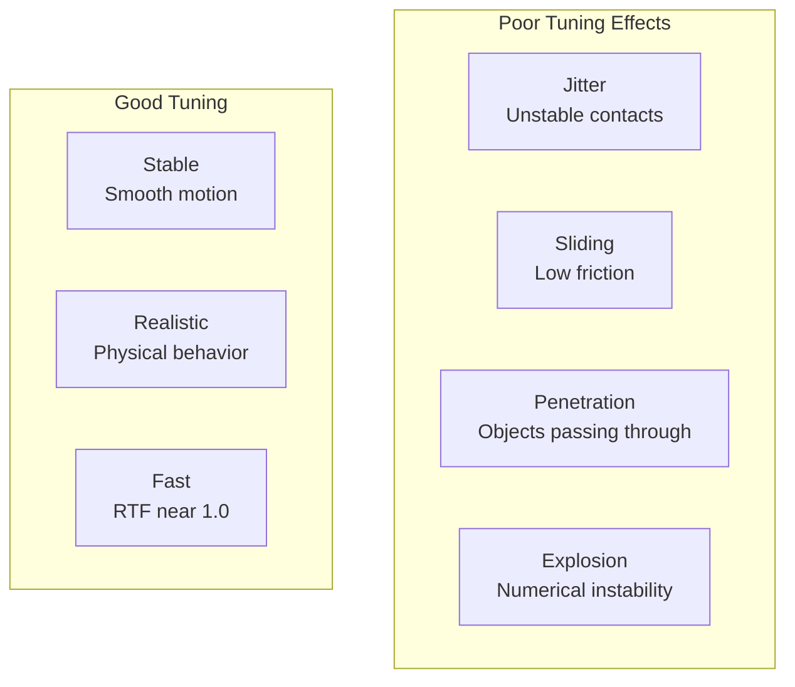
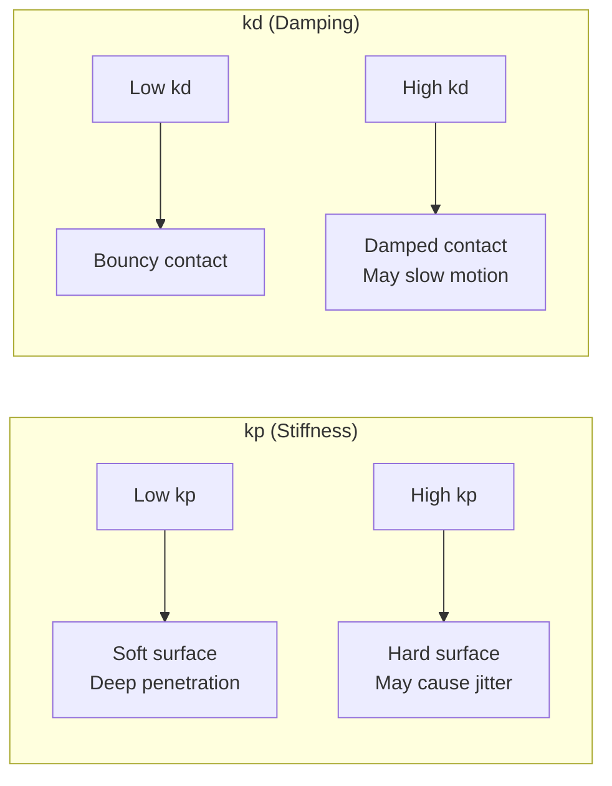
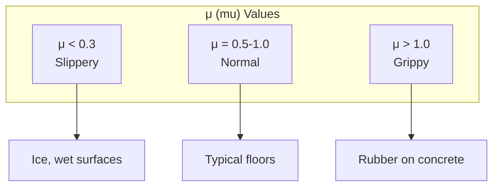
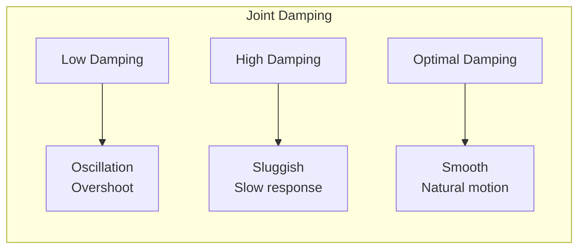
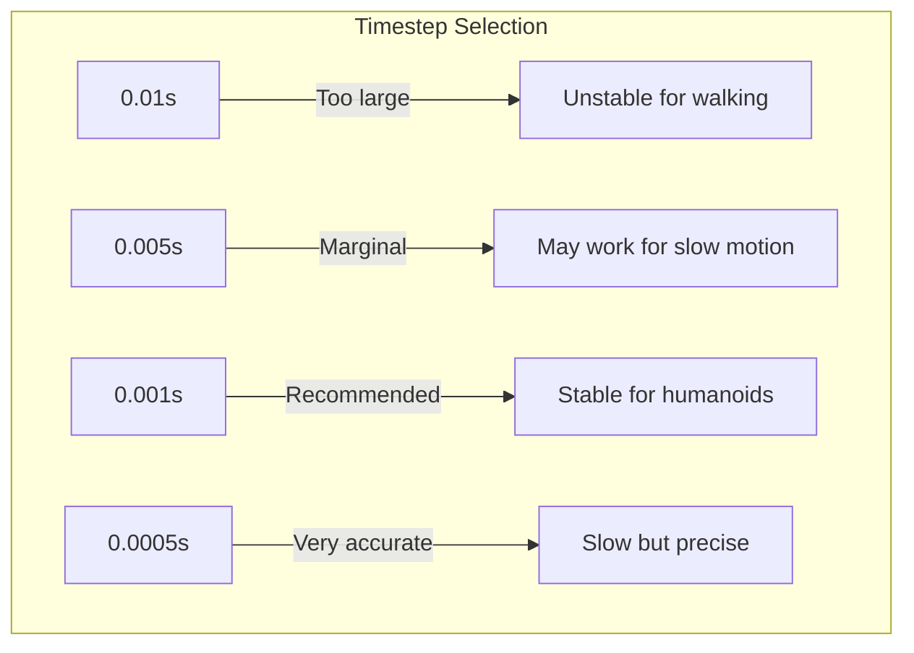
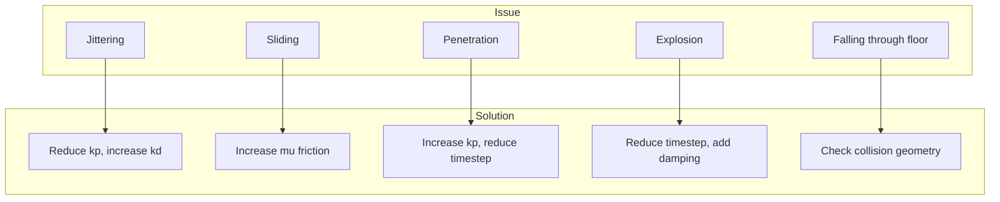

# Chapter 5: Physics Tuning

**Duration**: 3-4 hours
**Difficulty**: Intermediate-Advanced

---

## Learning Objectives

After completing this chapter, you will be able to:

- Tune contact parameters for stable foot-ground interaction
- Configure joint damping and friction
- Balance physics accuracy vs simulation speed
- Debug common physics issues
- Verify simulation stability

---

## 5.1 Physics Tuning Overview

Physics tuning is critical for realistic humanoid behavior. Poor tuning leads to:



### Tuning Goals

| Goal | Description | Metrics |
|------|-------------|---------|
| Stability | No jitter or explosion | Visual inspection |
| Realism | Matches physical behavior | Comparison tests |
| Performance | Real-time capable | RTF ≥ 0.8 |
| Robustness | Works across scenarios | Stress testing |

---

## 5.2 Contact Parameters

Contact parameters control how surfaces interact.

### Contact Stiffness and Damping

```xml
<surface>
  <contact>
    <ode>
      <!-- Stiffness: Higher = harder surface -->
      <kp>1000000</kp>  <!-- 1e6 N/m -->

      <!-- Damping: Higher = more energy absorption -->
      <kd>100</kd>  <!-- N·s/m -->

      <!-- Maximum correcting velocity -->
      <max_vel>100</max_vel>

      <!-- Minimum contact depth -->
      <min_depth>0.001</min_depth>
    </ode>
  </contact>
</surface>
```

### Parameter Effects



### Recommended Values

| Surface Type | kp | kd | Notes |
|--------------|-----|-----|-------|
| Concrete/Hard | 1e6 - 1e7 | 100 - 1000 | Humanoid feet |
| Rubber | 1e5 - 1e6 | 500 - 2000 | More damping |
| Soft/Carpet | 1e4 - 1e5 | 1000 - 5000 | Energy absorbing |
| Default | 1e6 | 100 | Good starting point |

---

## 5.3 Friction Configuration

Friction prevents sliding and enables walking.

### Friction Parameters

```xml
<surface>
  <friction>
    <ode>
      <!-- Primary friction (along contact normal) -->
      <mu>1.0</mu>

      <!-- Secondary friction (perpendicular) -->
      <mu2>1.0</mu2>

      <!-- Slip velocities -->
      <slip1>0.0</slip1>
      <slip2>0.0</slip2>

      <!-- Friction direction -->
      <fdir1>0 0 1</fdir1>
    </ode>
  </friction>
</surface>
```

### Friction Coefficient Selection



| Material Pair | μ (friction) |
|---------------|--------------|
| Rubber on concrete | 1.0 - 1.5 |
| Rubber on wood | 0.7 - 0.9 |
| Metal on metal | 0.3 - 0.5 |
| Plastic on plastic | 0.2 - 0.4 |
| Ice | 0.01 - 0.05 |

### Humanoid Foot Friction

For stable walking, foot friction should be high enough to prevent sliding:

```xml
<!-- Left foot collision with friction -->
<collision name="left_foot_collision">
  <geometry>
    <box>
      <size>0.2 0.1 0.02</size>
    </box>
  </geometry>
  <surface>
    <friction>
      <ode>
        <mu>1.2</mu>
        <mu2>1.2</mu2>
      </ode>
    </friction>
    <contact>
      <ode>
        <kp>1e6</kp>
        <kd>100</kd>
      </ode>
    </contact>
  </surface>
</collision>
```

---

## 5.4 Joint Configuration

Joints require proper damping and limits for realistic motion.

### Joint Damping

```xml
<joint name="left_knee" type="revolute">
  <parent link="left_thigh"/>
  <child link="left_shin"/>
  <axis xyz="0 1 0"/>
  <limit lower="-0.1" upper="2.5" effort="100" velocity="10"/>
  <dynamics damping="1.0" friction="0.1"/>
</joint>
```

### Dynamics Parameters

| Parameter | Description | Typical Value |
|-----------|-------------|---------------|
| `damping` | Velocity-proportional resistance | 0.5 - 5.0 N·m·s/rad |
| `friction` | Static friction in joint | 0.0 - 0.5 N·m |
| `effort` | Maximum torque | 50 - 200 N·m |
| `velocity` | Maximum velocity | 5 - 15 rad/s |

### Damping Effects



### Tuning Joint Damping

```python
#!/usr/bin/env python3
"""
Script to tune joint damping interactively.
"""

import rclpy
from rclpy.node import Node
from rcl_interfaces.msg import SetParametersResult
from rcl_interfaces.srv import SetParameters
from rcl_interfaces.msg import Parameter, ParameterValue, ParameterType


class DampingTuner(Node):
    """Interactive joint damping tuner."""

    def __init__(self):
        super().__init__('damping_tuner')

        # Joints to tune
        self.joints = [
            'left_hip_pitch',
            'left_knee',
            'left_ankle_pitch',
        ]

        # Current damping values
        self.damping = {joint: 1.0 for joint in self.joints}

        # Create parameters
        for joint in self.joints:
            self.declare_parameter(f'{joint}_damping', 1.0)

        # Parameter callback
        self.add_on_set_parameters_callback(self.parameter_callback)

        self.get_logger().info('Damping tuner ready. Adjust parameters:')
        for joint in self.joints:
            self.get_logger().info(f'  ros2 param set /damping_tuner {joint}_damping 2.0')

    def parameter_callback(self, params):
        """Handle parameter updates."""
        for param in params:
            for joint in self.joints:
                if param.name == f'{joint}_damping':
                    self.damping[joint] = param.value
                    self.get_logger().info(
                        f'{joint} damping set to {param.value}'
                    )
                    # TODO: Apply to simulation via service
        return SetParametersResult(successful=True)


def main(args=None):
    rclpy.init(args=args)
    node = DampingTuner()
    rclpy.spin(node)
    node.destroy_node()
    rclpy.shutdown()


if __name__ == '__main__':
    main()
```

---

## 5.5 Solver Configuration

The physics solver affects accuracy and speed.

### ODE Solver Parameters

```xml
<physics type="ode">
  <max_step_size>0.001</max_step_size>
  <real_time_factor>1.0</real_time_factor>
  <real_time_update_rate>1000</real_time_update_rate>

  <ode>
    <solver>
      <!-- Solver type: quick (fast) or world (accurate) -->
      <type>quick</type>

      <!-- Solver iterations: more = accurate, slower -->
      <iters>50</iters>

      <!-- Successive over-relaxation: 1.0-1.3 -->
      <sor>1.3</sor>

      <!-- Preconditioning iterations -->
      <precon_iters>0</precon_iters>
    </solver>

    <constraints>
      <!-- Constraint force mixing: 0 = hard, >0 = soft -->
      <cfm>0.0</cfm>

      <!-- Error reduction parameter: 0-1, position correction -->
      <erp>0.2</erp>

      <!-- Maximum correcting velocity -->
      <contact_max_correcting_vel>100</contact_max_correcting_vel>

      <!-- Surface layer for contact -->
      <contact_surface_layer>0.001</contact_surface_layer>
    </constraints>
  </ode>
</physics>
```

### Solver Parameter Effects

| Parameter | Low Value | High Value |
|-----------|-----------|------------|
| `iters` | Fast, less accurate | Slow, more accurate |
| `sor` | Slower convergence | Faster, may diverge |
| `cfm` | Hard constraints | Soft constraints |
| `erp` | Slow correction | Fast correction, jittery |

### Choosing Timestep



| Timestep | RTF Impact | Use Case |
|----------|------------|----------|
| 0.01s | Very fast | Simple mobile robots |
| 0.005s | Fast | Manipulation, slow walking |
| 0.001s | Moderate | Humanoid walking |
| 0.0005s | Slow | High-speed impacts |

---

## 5.6 Debugging Physics Issues

### Common Issues and Solutions



### Jittering Contacts

**Symptoms**: Robot vibrates at rest, unstable standing

**Causes**:
- kp too high
- Timestep too large
- Multiple collision shapes overlapping

**Solutions**:
```xml
<!-- Reduce stiffness, increase damping -->
<contact>
  <ode>
    <kp>500000</kp>  <!-- Reduced from 1e6 -->
    <kd>500</kd>     <!-- Increased from 100 -->
  </ode>
</contact>
```

### Sliding Feet

**Symptoms**: Robot slides when standing or walking

**Causes**:
- Friction coefficient too low
- Ground plane friction not set

**Solutions**:
```xml
<!-- Increase friction on both foot and ground -->
<friction>
  <ode>
    <mu>1.5</mu>
    <mu2>1.5</mu2>
  </ode>
</friction>
```

### Falling Through Ground

**Symptoms**: Robot falls through floor at spawn

**Causes**:
- Missing collision geometry
- Ground plane normal incorrect
- Spawn height too low

**Solutions**:
```bash
# Spawn higher
ros2 run ros_gz_sim create -z 1.5 ...

# Verify ground normal in SDF
<plane><normal>0 0 1</normal></plane>
```

---

## 5.7 Stability Testing

### Drop Test

```python
#!/usr/bin/env python3
"""
Physics stability drop test.
"""

import rclpy
from rclpy.node import Node
from sensor_msgs.msg import JointState
from geometry_msgs.msg import Pose
import numpy as np


class DropTest(Node):
    """Test robot stability after drop."""

    def __init__(self):
        super().__init__('drop_test')

        self.subscription = self.create_subscription(
            JointState,
            '/joint_states',
            self.joint_callback,
            10
        )

        self.position_history = []
        self.test_duration = 10.0  # seconds
        self.start_time = None

        self.get_logger().info('Drop test started. Robot should stabilize within 10 seconds.')

    def joint_callback(self, msg: JointState):
        """Monitor joint positions for stability."""
        if self.start_time is None:
            self.start_time = self.get_clock().now()

        elapsed = (self.get_clock().now() - self.start_time).nanoseconds / 1e9

        if elapsed > self.test_duration:
            self.analyze_stability()
            rclpy.shutdown()
            return

        # Store positions
        self.position_history.append(list(msg.position))

    def analyze_stability(self):
        """Analyze if robot stabilized."""
        positions = np.array(self.position_history)

        # Check last 2 seconds for stability
        last_samples = positions[-200:]  # Assuming 100 Hz

        if len(last_samples) < 100:
            self.get_logger().error('Not enough data for analysis')
            return

        # Compute variance
        variance = np.var(last_samples, axis=0)
        max_variance = np.max(variance)

        if max_variance < 0.001:
            self.get_logger().info(f'PASS: Robot stabilized. Max variance: {max_variance:.6f}')
        else:
            self.get_logger().warn(f'FAIL: Robot unstable. Max variance: {max_variance:.6f}')


def main(args=None):
    rclpy.init(args=args)
    node = DropTest()
    rclpy.spin(node)


if __name__ == '__main__':
    main()
```

### Walking Stability Test

```python
#!/usr/bin/env python3
"""
Walking stability test.
"""

import rclpy
from rclpy.node import Node
from sensor_msgs.msg import Imu
from geometry_msgs.msg import WrenchStamped
import numpy as np


class WalkingTest(Node):
    """Test walking stability metrics."""

    def __init__(self):
        super().__init__('walking_test')

        self.imu_sub = self.create_subscription(
            Imu, '/torso_imu/data', self.imu_callback, 10
        )

        self.left_ft_sub = self.create_subscription(
            WrenchStamped, '/left_foot_ft/wrench', self.left_ft_callback, 10
        )

        self.right_ft_sub = self.create_subscription(
            WrenchStamped, '/right_foot_ft/wrench', self.right_ft_callback, 10
        )

        self.orientation_history = []
        self.left_force_history = []
        self.right_force_history = []

        self.timer = self.create_timer(5.0, self.report_metrics)

    def imu_callback(self, msg: Imu):
        """Record orientation."""
        self.orientation_history.append([
            msg.orientation.x,
            msg.orientation.y,
            msg.orientation.z,
            msg.orientation.w,
        ])

    def left_ft_callback(self, msg: WrenchStamped):
        """Record left foot force."""
        self.left_force_history.append(msg.wrench.force.z)

    def right_ft_callback(self, msg: WrenchStamped):
        """Record right foot force."""
        self.right_force_history.append(msg.wrench.force.z)

    def report_metrics(self):
        """Report stability metrics."""
        if len(self.orientation_history) < 100:
            return

        orientations = np.array(self.orientation_history[-500:])
        orientation_var = np.var(orientations, axis=0)

        left_forces = np.array(self.left_force_history[-500:])
        right_forces = np.array(self.right_force_history[-500:])

        self.get_logger().info('=== Walking Stability Metrics ===')
        self.get_logger().info(f'Orientation variance: {np.sum(orientation_var):.6f}')
        self.get_logger().info(f'Left foot force: mean={np.mean(left_forces):.1f}N, std={np.std(left_forces):.1f}N')
        self.get_logger().info(f'Right foot force: mean={np.mean(right_forces):.1f}N, std={np.std(right_forces):.1f}N')


def main(args=None):
    rclpy.init(args=args)
    node = WalkingTest()
    rclpy.spin(node)


if __name__ == '__main__':
    main()
```

---

## Hands-On Exercises

### Exercise 5.1: Tune Ground Contact

1. Start with default kp=1e6, kd=100
2. Drop robot from 0.5m height
3. Observe settling behavior
4. Adjust parameters until smooth landing

### Exercise 5.2: Friction Testing

1. Place robot on inclined plane (10°)
2. Test friction values from 0.3 to 1.5
3. Find minimum μ where robot doesn't slide
4. Document results

### Exercise 5.3: Solver Comparison

1. Run simulation with `iters=10` and `iters=100`
2. Compare RTF and stability
3. Find optimal iterations for your hardware

---

## Summary

In this chapter, you learned:

- Contact stiffness (kp) and damping (kd) control surface interaction
- Friction coefficients must be set on both contacting surfaces
- Joint damping prevents oscillation
- Solver iterations trade accuracy for speed
- Systematic testing validates physics configuration

## Next Chapter

In [Chapter 6](ch06-unity-setup.md), you will set up Unity with ROS 2 for photorealistic simulation.

---

## Quick Reference

```xml
<!-- Contact -->
<contact>
  <ode><kp>1e6</kp><kd>100</kd></ode>
</contact>

<!-- Friction -->
<friction>
  <ode><mu>1.0</mu><mu2>1.0</mu2></ode>
</friction>

<!-- Joint dynamics -->
<dynamics damping="1.0" friction="0.1"/>

<!-- Physics solver -->
<ode>
  <solver><type>quick</type><iters>50</iters></solver>
  <constraints><cfm>0</cfm><erp>0.2</erp></constraints>
</ode>
```

| Issue | Likely Cause | Fix |
|-------|--------------|-----|
| Jitter | High kp | Reduce kp, increase kd |
| Sliding | Low μ | Increase friction |
| Slow | High iters | Reduce iterations |
| Unstable | Large timestep | Reduce max_step_size |
