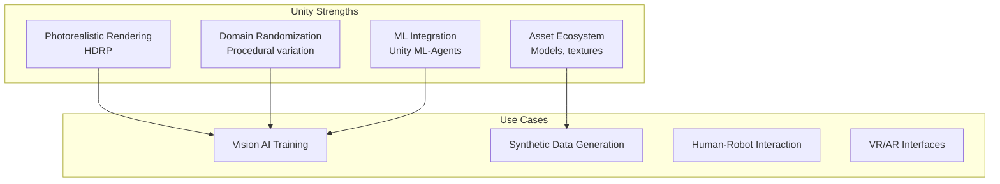
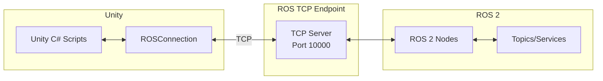

# Chapter 6: Unity Setup and ROS 2 Bridge

**Duration**: 4-5 hours
**Difficulty**: Intermediate

---

## Learning Objectives

After completing this chapter, you will be able to:

- Install Unity and ROS-TCP-Connector
- Configure Unity for robotics simulation
- Establish bidirectional ROS 2 communication
- Import robot models from URDF
- Synchronize simulation time

---

## 6.1 Why Unity for Robotics?

Unity complements Gazebo by providing:



### When to Use Unity vs Gazebo

| Task | Gazebo | Unity |
|------|--------|-------|
| Physics accuracy | Best | Good |
| Visual quality | Good | Best |
| ROS integration | Native | Plugin |
| Vision AI training | Limited | Best |
| Domain randomization | Basic | Advanced |
| Performance profiling | Good | Good |

---

## 6.2 Installing Unity

### Unity Hub Installation

```bash
# Download Unity Hub (from unity.com)
# Install Unity 2022.3 LTS or newer

# Required modules:
# - Linux Build Support (IL2CPP) [for Linux]
# - Windows Build Support [for Windows]
```

### Create Robotics Project

1. Open Unity Hub
2. Click "New Project"
3. Select "3D (HDRP)" template
4. Name: `HumanoidSimulation`
5. Click "Create Project"

### Install Required Packages

Using Package Manager (Window > Package Manager):

1. Click "+" > "Add package from git URL"
2. Add these packages:
   ```
   https://github.com/Unity-Technologies/ROS-TCP-Connector.git?path=/com.unity.robotics.ros-tcp-connector
   https://github.com/Unity-Technologies/URDF-Importer.git?path=/com.unity.robotics.urdf-importer
   ```

---

## 6.3 ROS-TCP-Connector Setup

### Architecture



### Install ROS TCP Endpoint

```bash
# In ROS 2 workspace
cd ~/ros2_ws/src
git clone https://github.com/Unity-Technologies/ROS-TCP-Endpoint.git

# Build
cd ~/ros2_ws
colcon build --packages-select ros_tcp_endpoint
source install/setup.bash
```

### Configure Unity Connection

In Unity:
1. Go to Robotics > ROS Settings
2. Set:
   - Protocol: ROS2
   - ROS IP Address: 127.0.0.1
   - ROS Port: 10000

### Launch TCP Endpoint

```bash
# Terminal 1: Launch ROS TCP endpoint
ros2 run ros_tcp_endpoint default_server_endpoint --ros-args -p ROS_IP:=0.0.0.0

# Terminal 2: Verify connection
ros2 topic list
```

---

## 6.4 URDF Import

### Import Robot Model

1. In Unity: Assets > Import Robot from URDF
2. Select `humanoid.urdf.xacro` (or processed URDF)
3. Configure import settings:
   - Axis Type: Z Up (convert from ROS)
   - Mesh Decomposer: VHACD
   - Convex Decomposer: VHACD

### URDF Importer Settings

```csharp
// UrdfImporterSettings.cs
using Unity.Robotics.UrdfImporter;

public class ImportSettings
{
    public static void ConfigureImport()
    {
        var settings = UrdfRobotExtensions.GetDefaultRuntimeUrdfImporterSettings();

        // Coordinate system conversion
        settings.ChosenAxis = ImportSettings.axisType.zAxis;

        // Collision mesh generation
        settings.convexMethod = ImportSettings.convexDecomposer.vHACD;

        // Physics settings
        settings.UseGravity = true;
        settings.SetRigidbodyMass = true;
    }
}
```

### Post-Import Adjustments

After importing, you may need to adjust:

1. **Joint limits**: Verify limits match URDF
2. **Collision meshes**: Check for proper convex decomposition
3. **Materials**: Assign visual materials
4. **Mass/Inertia**: Verify physics properties

---

## 6.5 Publishing and Subscribing

### Publisher Script

```csharp
// JointStatePublisher.cs
using UnityEngine;
using Unity.Robotics.ROSTCPConnector;
using RosMessageTypes.Sensor;
using System.Collections.Generic;

public class JointStatePublisher : MonoBehaviour
{
    public string topicName = "/joint_states";
    public float publishRate = 50f; // Hz

    private ROSConnection ros;
    private ArticulationBody[] joints;
    private float timeElapsed;
    private float publishInterval;

    void Start()
    {
        ros = ROSConnection.GetOrCreateInstance();
        ros.RegisterPublisher<JointStateMsg>(topicName);

        // Find all articulation joints
        joints = GetComponentsInChildren<ArticulationBody>();

        publishInterval = 1f / publishRate;
    }

    void FixedUpdate()
    {
        timeElapsed += Time.fixedDeltaTime;

        if (timeElapsed >= publishInterval)
        {
            PublishJointStates();
            timeElapsed = 0f;
        }
    }

    void PublishJointStates()
    {
        var msg = new JointStateMsg();

        var names = new List<string>();
        var positions = new List<double>();
        var velocities = new List<double>();
        var efforts = new List<double>();

        foreach (var joint in joints)
        {
            if (joint.jointType != ArticulationJointType.FixedJoint)
            {
                names.Add(joint.name);
                positions.Add(joint.jointPosition[0]);
                velocities.Add(joint.jointVelocity[0]);
                efforts.Add(joint.jointForce[0]);
            }
        }

        msg.name = names.ToArray();
        msg.position = positions.ToArray();
        msg.velocity = velocities.ToArray();
        msg.effort = efforts.ToArray();

        ros.Publish(topicName, msg);
    }
}
```

### Subscriber Script

```csharp
// JointCommandSubscriber.cs
using UnityEngine;
using Unity.Robotics.ROSTCPConnector;
using RosMessageTypes.Trajectory;

public class JointCommandSubscriber : MonoBehaviour
{
    public string topicName = "/joint_trajectory";

    private ROSConnection ros;
    private ArticulationBody[] joints;
    private Dictionary<string, ArticulationBody> jointMap;

    void Start()
    {
        ros = ROSConnection.GetOrCreateInstance();
        ros.Subscribe<JointTrajectoryMsg>(topicName, TrajectoryCallback);

        // Build joint name -> body map
        jointMap = new Dictionary<string, ArticulationBody>();
        joints = GetComponentsInChildren<ArticulationBody>();

        foreach (var joint in joints)
        {
            jointMap[joint.name] = joint;
        }
    }

    void TrajectoryCallback(JointTrajectoryMsg msg)
    {
        if (msg.points.Length == 0) return;

        // Apply first point (simple implementation)
        var point = msg.points[0];

        for (int i = 0; i < msg.joint_names.Length; i++)
        {
            string jointName = msg.joint_names[i];
            if (jointMap.TryGetValue(jointName, out var joint))
            {
                var drive = joint.xDrive;
                drive.target = (float)point.positions[i] * Mathf.Rad2Deg;
                joint.xDrive = drive;
            }
        }
    }
}
```

---

## 6.6 Time Synchronization

### Clock Publisher

```csharp
// ClockPublisher.cs
using UnityEngine;
using Unity.Robotics.ROSTCPConnector;
using RosMessageTypes.Rosgraph;

public class ClockPublisher : MonoBehaviour
{
    public string topicName = "/clock";
    public float publishRate = 100f;

    private ROSConnection ros;
    private float timeElapsed;

    void Start()
    {
        ros = ROSConnection.GetOrCreateInstance();
        ros.RegisterPublisher<ClockMsg>(topicName);
    }

    void FixedUpdate()
    {
        timeElapsed += Time.fixedDeltaTime;

        if (timeElapsed >= 1f / publishRate)
        {
            PublishClock();
            timeElapsed = 0f;
        }
    }

    void PublishClock()
    {
        var msg = new ClockMsg();

        // Convert Unity time to ROS time
        double totalSeconds = Time.fixedTimeAsDouble;
        int secs = (int)totalSeconds;
        uint nsecs = (uint)((totalSeconds - secs) * 1e9);

        msg.clock.sec = secs;
        msg.clock.nanosec = nsecs;

        ros.Publish(topicName, msg);
    }
}
```

### Using Simulation Time

```csharp
// TimeManager.cs
using UnityEngine;
using Unity.Robotics.ROSTCPConnector;
using RosMessageTypes.Builtin;

public class TimeManager : MonoBehaviour
{
    public bool useSimTime = true;
    public float timeScale = 1.0f;

    void Start()
    {
        if (useSimTime)
        {
            // Set fixed timestep for physics
            Time.fixedDeltaTime = 0.001f; // 1ms like Gazebo
            Time.timeScale = timeScale;
        }
    }

    public static TimeMsg GetCurrentTime()
    {
        var msg = new TimeMsg();
        double totalSeconds = Time.fixedTimeAsDouble;
        msg.sec = (int)totalSeconds;
        msg.nanosec = (uint)((totalSeconds - msg.sec) * 1e9);
        return msg;
    }
}
```

---

## 6.7 Complete Unity Scene Setup

### Scene Hierarchy

```
HumanoidSimulation (Scene)
├── Main Camera
├── Directional Light
├── Ground Plane
├── ROSConnection (with ROSConnection component)
├── TimeManager
├── Humanoid (imported from URDF)
│   ├── JointStatePublisher
│   ├── JointCommandSubscriber
│   └── [Robot Links...]
└── Environment
    └── [Objects...]
```

### ROSConnection Prefab Setup

1. Create empty GameObject "ROSConnection"
2. Add ROSConnection component
3. Configure:
   - ROS IP: 127.0.0.1
   - ROS Port: 10000
   - Protocol: ROS2

### humanoid_unity.launch.py

```python
#!/usr/bin/env python3
"""
Launch ROS TCP endpoint for Unity connection.
"""

from launch import LaunchDescription
from launch_ros.actions import Node
from launch.actions import DeclareLaunchArgument
from launch.substitutions import LaunchConfiguration


def generate_launch_description():
    # Launch arguments
    ros_ip = DeclareLaunchArgument(
        'ros_ip',
        default_value='0.0.0.0',
        description='ROS IP address'
    )

    ros_port = DeclareLaunchArgument(
        'ros_port',
        default_value='10000',
        description='ROS TCP port'
    )

    # TCP endpoint
    tcp_endpoint = Node(
        package='ros_tcp_endpoint',
        executable='default_server_endpoint',
        name='ros_tcp_endpoint',
        parameters=[{
            'ROS_IP': LaunchConfiguration('ros_ip'),
            'ROS_TCP_PORT': LaunchConfiguration('ros_port'),
        }],
        output='screen'
    )

    # Joint state republisher (if needed)
    joint_state_relay = Node(
        package='topic_tools',
        executable='relay',
        name='joint_state_relay',
        arguments=['/unity/joint_states', '/joint_states'],
        output='screen'
    )

    return LaunchDescription([
        ros_ip,
        ros_port,
        tcp_endpoint,
        joint_state_relay,
    ])
```

---

## 6.8 Testing the Connection

### Verify Topics

```bash
# Terminal 1: Launch TCP endpoint
ros2 launch humanoid_unity unity_bridge.launch.py

# Terminal 2: Start Unity simulation (Play button)

# Terminal 3: Check topics
ros2 topic list

# Expected output:
# /clock
# /joint_states
# /joint_trajectory
# /rosout

# Echo joint states
ros2 topic echo /joint_states
```

### Send Test Command

```bash
# Send trajectory command
ros2 topic pub /joint_trajectory trajectory_msgs/msg/JointTrajectory \
  "{joint_names: ['left_hip_pitch'], points: [{positions: [0.5], time_from_start: {sec: 1}}]}"
```

### Connection Troubleshooting

| Issue | Cause | Solution |
|-------|-------|----------|
| No connection | Firewall | Allow port 10000 |
| Topics not visible | TCP endpoint not running | Start endpoint first |
| Deserialization error | Message type mismatch | Regenerate message files |
| Lag | Network latency | Use localhost |

---

## Hands-On Exercises

### Exercise 6.1: Basic Setup

1. Install Unity 2022.3 LTS
2. Create new HDRP project
3. Install ROS-TCP-Connector
4. Connect to ROS TCP endpoint
5. Verify connection with topic list

### Exercise 6.2: Import Humanoid

1. Import humanoid URDF
2. Adjust physics settings
3. Add JointStatePublisher
4. Verify joint_states topic in ROS 2

### Exercise 6.3: Bidirectional Control

1. Add JointCommandSubscriber
2. Send trajectory from ROS 2
3. Observe robot movement in Unity
4. Verify position feedback

---

## Summary

In this chapter, you learned:

- Unity provides photorealistic rendering for robotics
- ROS-TCP-Connector bridges Unity and ROS 2
- URDF Importer converts robot models
- Publishers/Subscribers enable topic communication
- Time synchronization ensures consistent simulation

## Next Chapter

In [Chapter 7](ch07-photorealistic-environments.md), you will create photorealistic environments using Unity HDRP.

---

## Quick Reference

```bash
# Launch TCP endpoint
ros2 run ros_tcp_endpoint default_server_endpoint --ros-args -p ROS_IP:=0.0.0.0

# Verify connection
ros2 topic list

# Echo Unity topics
ros2 topic echo /joint_states
```

```csharp
// Publisher
ros.RegisterPublisher<MsgType>(topicName);
ros.Publish(topicName, msg);

// Subscriber
ros.Subscribe<MsgType>(topicName, callback);
```

| Component | Purpose |
|-----------|---------|
| ROSConnection | Manages TCP connection |
| URDF Importer | Converts robot models |
| ros_tcp_endpoint | ROS 2 TCP server |
| ArticulationBody | Unity physics joints |
