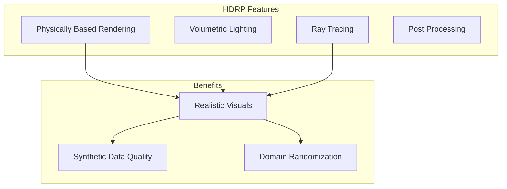
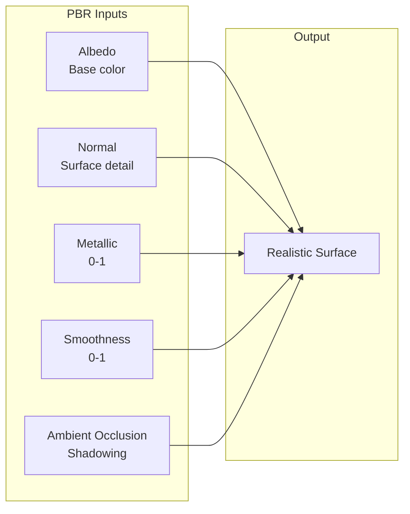
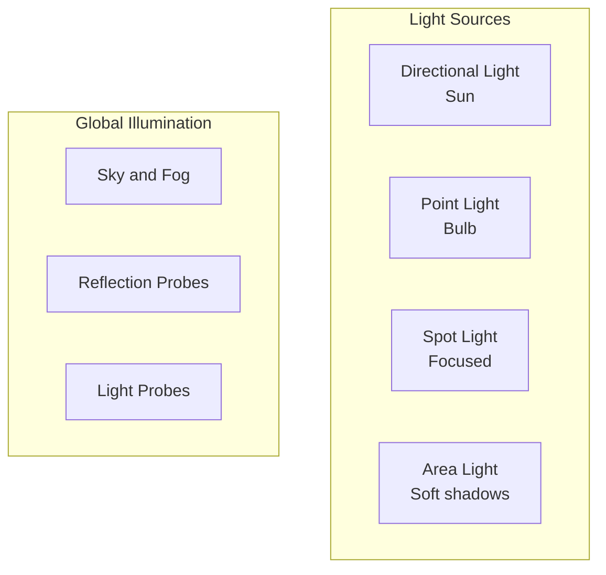

# Chapter 7: Photorealistic Environments

**Duration**: 4-5 hours
**Difficulty**: Intermediate

---

## Learning Objectives

After completing this chapter, you will be able to:

- Configure Unity HDRP for realistic rendering
- Create physically-based materials
- Set up realistic lighting
- Add environmental effects
- Optimize rendering performance

---

## 7.1 HDRP Overview

High Definition Render Pipeline (HDRP) provides photorealistic graphics.



### HDRP vs Built-in vs URP

| Feature | Built-in | URP | HDRP |
|---------|----------|-----|------|
| Visual Quality | Good | Good | Excellent |
| Performance | Fast | Fast | Heavy |
| Ray Tracing | No | Limited | Yes |
| Use Case | Simple | Mobile | Photorealism |

---

## 7.2 HDRP Configuration

### Volume Settings

1. Create Volume: GameObject > Volume > Global Volume
2. Add Volume Profile
3. Configure overrides:

```
Global Volume
├── Exposure
│   ├── Mode: Automatic
│   └── Compensation: 0
├── Bloom
│   ├── Intensity: 0.2
│   └── Threshold: 0.8
├── Ambient Occlusion
│   ├── Intensity: 1.0
│   └── Radius: 2.0
├── Screen Space Reflection
│   ├── Quality: High
│   └── Max Ray Steps: 64
└── Color Adjustments
    ├── Post Exposure: 0
    └── Contrast: 10
```

### Quality Settings

Edit > Project Settings > Quality:

```
HDRP Quality Settings
├── Rendering
│   ├── Lit Shader Mode: Both
│   └── Motion Vectors: Camera and Objects
├── Lighting
│   ├── Screen Space Shadows: On
│   └── Screen Space Ambient Occlusion: On
├── Shadow
│   ├── Shadow Resolution: 2048
│   └── Shadow Cascades: 4
└── Post-processing
    ├── Grading LUT Size: 32
    └── Screen Resolution: Full
```

---

## 7.3 Physically Based Materials

### PBR Material Properties



### Creating Materials

```csharp
// MaterialSetup.cs
using UnityEngine;

public class MaterialSetup : MonoBehaviour
{
    public void CreateFloorMaterial()
    {
        // Create HDRP Lit material
        var material = new Material(Shader.Find("HDRP/Lit"));

        // Albedo (base color)
        material.SetColor("_BaseColor", new Color(0.5f, 0.5f, 0.5f));

        // Metallic and smoothness
        material.SetFloat("_Metallic", 0.0f);
        material.SetFloat("_Smoothness", 0.3f);

        // Normal map scale
        material.SetFloat("_NormalScale", 1.0f);

        // Ambient occlusion
        material.SetFloat("_AORemapMin", 0.0f);
        material.SetFloat("_AORemapMax", 1.0f);

        // Apply to floor
        GetComponent<Renderer>().material = material;
    }
}
```

### Common Material Types

| Surface | Metallic | Smoothness | Notes |
|---------|----------|------------|-------|
| Concrete | 0.0 | 0.1-0.3 | Rough, matte |
| Polished metal | 1.0 | 0.8-0.95 | Reflective |
| Rubber | 0.0 | 0.2-0.4 | Robot feet |
| Plastic | 0.0 | 0.4-0.7 | Robot body |
| Wood | 0.0 | 0.3-0.5 | Environment |

---

## 7.4 Lighting Setup

### Light Types in HDRP



### Sun Light Configuration

```csharp
// SunLightSetup.cs
using UnityEngine;
using UnityEngine.Rendering.HighDefinition;

public class SunLightSetup : MonoBehaviour
{
    void Start()
    {
        var light = GetComponent<Light>();
        var hdLight = GetComponent<HDAdditionalLightData>();

        // Light settings
        light.type = LightType.Directional;
        light.color = new Color(1.0f, 0.95f, 0.9f); // Warm sunlight
        light.intensity = 100000; // Lux for outdoor

        // HDRP settings
        hdLight.EnableShadows(true);
        hdLight.SetShadowResolution(2048);

        // Sun angle (afternoon)
        transform.rotation = Quaternion.Euler(45f, 30f, 0f);
    }
}
```

### Indoor Lighting

```csharp
// IndoorLightingSetup.cs
using UnityEngine;
using UnityEngine.Rendering.HighDefinition;

public class IndoorLightingSetup : MonoBehaviour
{
    public void SetupAreaLight()
    {
        var lightObj = new GameObject("AreaLight");
        var light = lightObj.AddComponent<Light>();
        var hdLight = lightObj.AddComponent<HDAdditionalLightData>();

        // Configure as area light
        light.type = LightType.Rectangle;
        light.intensity = 500; // Lumens
        light.color = Color.white;

        // Area size
        hdLight.SetAreaLightSize(new Vector2(1f, 0.5f));

        // Soft shadows
        hdLight.EnableShadows(true);

        // Position
        lightObj.transform.position = new Vector3(0, 3, 0);
        lightObj.transform.rotation = Quaternion.Euler(90, 0, 0);
    }
}
```

---

## 7.5 Environment Effects

### Sky and Atmosphere

```csharp
// SkySetup.cs
using UnityEngine;
using UnityEngine.Rendering;
using UnityEngine.Rendering.HighDefinition;

public class SkySetup : MonoBehaviour
{
    public Volume globalVolume;

    void Start()
    {
        var profile = globalVolume.profile;

        // Physical sky
        if (profile.TryGet<PhysicallyBasedSky>(out var sky))
        {
            sky.active = true;
            sky.planetaryRadius.value = 6378100; // Earth radius
            sky.atmosphereThickness.value = 1.0f;
        }

        // Volumetric fog
        if (profile.TryGet<Fog>(out var fog))
        {
            fog.active = true;
            fog.enabled.value = true;
            fog.meanFreePath.value = 200f; // Visibility distance
            fog.baseHeight.value = 0f;
            fog.maximumHeight.value = 50f;
        }
    }
}
```

### Reflection Probes

```csharp
// ReflectionProbeSetup.cs
using UnityEngine;
using UnityEngine.Rendering.HighDefinition;

public class ReflectionProbeSetup : MonoBehaviour
{
    public void CreateReflectionProbe(Vector3 position, Vector3 size)
    {
        var probeObj = new GameObject("ReflectionProbe");
        probeObj.transform.position = position;

        var probe = probeObj.AddComponent<ReflectionProbe>();
        probe.mode = UnityEngine.Rendering.ReflectionProbeMode.Realtime;
        probe.refreshMode = UnityEngine.Rendering.ReflectionProbeRefreshMode.EveryFrame;
        probe.size = size;
        probe.resolution = 256;

        var hdProbe = probeObj.AddComponent<HDAdditionalReflectionData>();
        // Additional HDRP settings
    }
}
```

---

## 7.6 Environment Prefabs

### Indoor Lab Environment

```csharp
// LabEnvironment.cs
using UnityEngine;

public class LabEnvironment : MonoBehaviour
{
    [Header("Room Dimensions")]
    public float width = 10f;
    public float length = 15f;
    public float height = 3f;

    [Header("Materials")]
    public Material floorMaterial;
    public Material wallMaterial;
    public Material ceilingMaterial;

    void Start()
    {
        CreateRoom();
        SetupLighting();
    }

    void CreateRoom()
    {
        // Floor
        var floor = GameObject.CreatePrimitive(PrimitiveType.Plane);
        floor.name = "Floor";
        floor.transform.localScale = new Vector3(width / 10f, 1, length / 10f);
        floor.GetComponent<Renderer>().material = floorMaterial;

        // Ceiling
        var ceiling = GameObject.CreatePrimitive(PrimitiveType.Plane);
        ceiling.name = "Ceiling";
        ceiling.transform.position = new Vector3(0, height, 0);
        ceiling.transform.rotation = Quaternion.Euler(180, 0, 0);
        ceiling.transform.localScale = new Vector3(width / 10f, 1, length / 10f);
        ceiling.GetComponent<Renderer>().material = ceilingMaterial;

        // Walls
        CreateWall("NorthWall", new Vector3(0, height/2, length/2),
                   new Vector3(width, height, 0.1f));
        CreateWall("SouthWall", new Vector3(0, height/2, -length/2),
                   new Vector3(width, height, 0.1f));
        CreateWall("EastWall", new Vector3(width/2, height/2, 0),
                   new Vector3(0.1f, height, length));
        CreateWall("WestWall", new Vector3(-width/2, height/2, 0),
                   new Vector3(0.1f, height, length));
    }

    void CreateWall(string name, Vector3 position, Vector3 scale)
    {
        var wall = GameObject.CreatePrimitive(PrimitiveType.Cube);
        wall.name = name;
        wall.transform.position = position;
        wall.transform.localScale = scale;
        wall.GetComponent<Renderer>().material = wallMaterial;
    }

    void SetupLighting()
    {
        // Ceiling lights
        for (int x = -1; x <= 1; x += 2)
        {
            for (int z = -1; z <= 1; z += 2)
            {
                var lightObj = new GameObject($"CeilingLight_{x}_{z}");
                lightObj.transform.position = new Vector3(
                    x * width / 4f, height - 0.1f, z * length / 4f
                );

                var light = lightObj.AddComponent<Light>();
                light.type = LightType.Rectangle;
                light.intensity = 800;
                light.color = new Color(1f, 0.98f, 0.95f);
            }
        }
    }
}
```

### Outdoor Environment

```csharp
// OutdoorEnvironment.cs
using UnityEngine;
using UnityEngine.Rendering;
using UnityEngine.Rendering.HighDefinition;

public class OutdoorEnvironment : MonoBehaviour
{
    public Volume globalVolume;

    void Start()
    {
        CreateTerrain();
        SetupSky();
        SetupSunlight();
    }

    void CreateTerrain()
    {
        // Ground plane
        var ground = GameObject.CreatePrimitive(PrimitiveType.Plane);
        ground.name = "Ground";
        ground.transform.localScale = new Vector3(100, 1, 100);

        // Apply grass/concrete material
        var material = new Material(Shader.Find("HDRP/Lit"));
        material.SetColor("_BaseColor", new Color(0.4f, 0.45f, 0.4f));
        material.SetFloat("_Smoothness", 0.2f);
        ground.GetComponent<Renderer>().material = material;
    }

    void SetupSky()
    {
        var profile = globalVolume.profile;

        // Add physically based sky
        if (!profile.Has<PhysicallyBasedSky>())
        {
            profile.Add<PhysicallyBasedSky>();
        }

        if (profile.TryGet<PhysicallyBasedSky>(out var sky))
        {
            sky.active = true;
        }
    }

    void SetupSunlight()
    {
        var sun = new GameObject("Sun");
        var light = sun.AddComponent<Light>();
        sun.AddComponent<HDAdditionalLightData>();

        light.type = LightType.Directional;
        light.intensity = 100000; // Lux
        light.color = new Color(1f, 0.95f, 0.9f);

        sun.transform.rotation = Quaternion.Euler(50f, 30f, 0f);
    }
}
```

---

## 7.7 Performance Optimization

### LOD (Level of Detail)

```csharp
// LODSetup.cs
using UnityEngine;

public class LODSetup : MonoBehaviour
{
    public void SetupLOD(GameObject obj)
    {
        var lodGroup = obj.AddComponent<LODGroup>();

        var lods = new LOD[3];

        // High detail (close)
        lods[0] = new LOD(0.5f, new Renderer[] { GetHighDetailRenderer() });

        // Medium detail
        lods[1] = new LOD(0.2f, new Renderer[] { GetMediumDetailRenderer() });

        // Low detail (far)
        lods[2] = new LOD(0.05f, new Renderer[] { GetLowDetailRenderer() });

        lodGroup.SetLODs(lods);
    }

    Renderer GetHighDetailRenderer() => null; // Placeholder
    Renderer GetMediumDetailRenderer() => null;
    Renderer GetLowDetailRenderer() => null;
}
```

### Occlusion Culling

1. Window > Rendering > Occlusion Culling
2. Mark static objects as "Occluder Static" and "Occludee Static"
3. Bake occlusion data

### Quality Presets

```csharp
// QualityManager.cs
using UnityEngine;

public class QualityManager : MonoBehaviour
{
    public enum QualityPreset { Low, Medium, High, Ultra }

    public void SetQuality(QualityPreset preset)
    {
        switch (preset)
        {
            case QualityPreset.Low:
                QualitySettings.SetQualityLevel(0);
                Screen.SetResolution(1280, 720, true);
                break;

            case QualityPreset.Medium:
                QualitySettings.SetQualityLevel(1);
                Screen.SetResolution(1920, 1080, true);
                break;

            case QualityPreset.High:
                QualitySettings.SetQualityLevel(2);
                Screen.SetResolution(2560, 1440, true);
                break;

            case QualityPreset.Ultra:
                QualitySettings.SetQualityLevel(3);
                Screen.SetResolution(3840, 2160, true);
                break;
        }
    }
}
```

---

## Hands-On Exercises

### Exercise 7.1: Create Lab Environment

1. Create indoor lab room (10m x 15m x 3m)
2. Add PBR materials (concrete floor, white walls)
3. Set up ceiling lights
4. Place humanoid robot in center

### Exercise 7.2: Outdoor Scene

1. Create outdoor terrain
2. Configure HDRP sky and sun
3. Add volumetric fog
4. Test different times of day

### Exercise 7.3: Material Library

1. Create 5 PBR materials:
   - Concrete
   - Metal
   - Rubber
   - Plastic
   - Wood
2. Apply to environment objects
3. Compare visual quality

---

## Summary

In this chapter, you learned:

- HDRP provides photorealistic rendering
- PBR materials use physically accurate properties
- Proper lighting is essential for realism
- Environment effects add atmosphere
- Performance optimization enables real-time rendering

## Next Chapter

In [Chapter 8](ch08-synthetic-sensor-data.md), you will stream synthetic camera data from Unity to ROS 2.

---

## Quick Reference

```csharp
// Create HDRP material
var mat = new Material(Shader.Find("HDRP/Lit"));
mat.SetFloat("_Metallic", 0.0f);
mat.SetFloat("_Smoothness", 0.5f);

// Configure light
light.type = LightType.Directional;
light.intensity = 100000; // Lux

// HDRP volume override
profile.TryGet<PhysicallyBasedSky>(out var sky);
```

| Material Property | Range | Description |
|-------------------|-------|-------------|
| Metallic | 0-1 | Metal vs non-metal |
| Smoothness | 0-1 | Rough vs mirror |
| Normal Scale | 0-2 | Surface detail intensity |
