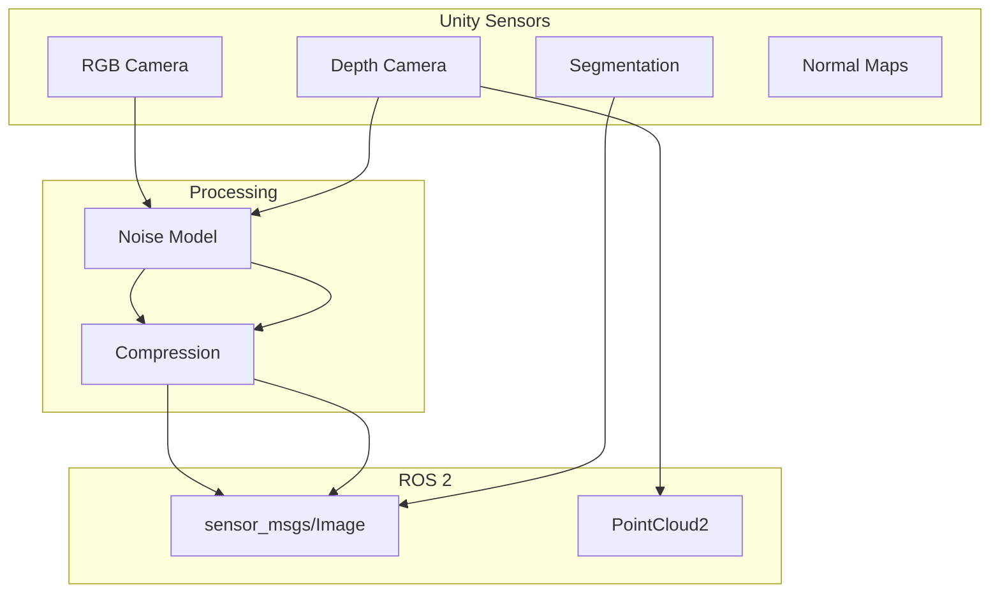

# Chapter 8: Synthetic Sensor Data

**Duration**: 4-5 hours
**Difficulty**: Intermediate

---

## Learning Objectives

After completing this chapter, you will be able to:

- Stream camera images from Unity to ROS 2
- Generate depth images for perception
- Create semantic segmentation masks
- Simulate sensor noise and artifacts
- Record datasets for AI training

---

## 8.1 Synthetic Data Overview

Synthetic data from simulation enables AI training without real-world data collection.



### Benefits of Synthetic Data

| Aspect | Real Data | Synthetic Data |
|--------|-----------|----------------|
| Cost | High | Low |
| Labels | Manual | Automatic |
| Variety | Limited | Unlimited |
| Edge cases | Rare | On-demand |
| Privacy | Concerns | None |

---

## 8.2 RGB Camera Publisher

### Camera Setup

```csharp
// RGBCameraPublisher.cs
using UnityEngine;
using Unity.Robotics.ROSTCPConnector;
using RosMessageTypes.Sensor;
using System;

public class RGBCameraPublisher : MonoBehaviour
{
    [Header("Camera Settings")]
    public Camera targetCamera;
    public int width = 640;
    public int height = 480;
    public float publishRate = 30f;

    [Header("ROS Settings")]
    public string topicName = "/camera/image_raw";
    public string frameId = "camera_link";

    private ROSConnection ros;
    private RenderTexture renderTexture;
    private Texture2D texture2D;
    private float timeElapsed;
    private uint sequenceId;

    void Start()
    {
        ros = ROSConnection.GetOrCreateInstance();
        ros.RegisterPublisher<ImageMsg>(topicName);

        // Create render texture
        renderTexture = new RenderTexture(width, height, 24, RenderTextureFormat.ARGB32);
        targetCamera.targetTexture = renderTexture;

        // Create texture for reading pixels
        texture2D = new Texture2D(width, height, TextureFormat.RGB24, false);
    }

    void Update()
    {
        timeElapsed += Time.deltaTime;

        if (timeElapsed >= 1f / publishRate)
        {
            PublishImage();
            timeElapsed = 0f;
        }
    }

    void PublishImage()
    {
        // Render camera
        targetCamera.Render();

        // Read pixels
        RenderTexture.active = renderTexture;
        texture2D.ReadPixels(new Rect(0, 0, width, height), 0, 0);
        texture2D.Apply();
        RenderTexture.active = null;

        // Get raw bytes (flip vertically for ROS convention)
        byte[] rawData = texture2D.GetRawTextureData();
        byte[] flippedData = FlipImageVertically(rawData, width, height, 3);

        // Create ROS message
        var msg = new ImageMsg
        {
            header = new RosMessageTypes.Std.HeaderMsg
            {
                seq = sequenceId++,
                stamp = TimeManager.GetCurrentTime(),
                frame_id = frameId
            },
            height = (uint)height,
            width = (uint)width,
            encoding = "rgb8",
            is_bigendian = 0,
            step = (uint)(width * 3),
            data = flippedData
        };

        ros.Publish(topicName, msg);
    }

    byte[] FlipImageVertically(byte[] data, int width, int height, int channels)
    {
        byte[] flipped = new byte[data.Length];
        int rowSize = width * channels;

        for (int y = 0; y < height; y++)
        {
            int srcRow = y * rowSize;
            int dstRow = (height - 1 - y) * rowSize;
            Array.Copy(data, srcRow, flipped, dstRow, rowSize);
        }

        return flipped;
    }

    void OnDestroy()
    {
        if (renderTexture != null)
            renderTexture.Release();
    }
}
```

### Camera Info Publisher

```csharp
// CameraInfoPublisher.cs
using UnityEngine;
using Unity.Robotics.ROSTCPConnector;
using RosMessageTypes.Sensor;

public class CameraInfoPublisher : MonoBehaviour
{
    public Camera targetCamera;
    public string topicName = "/camera/camera_info";
    public string frameId = "camera_link";
    public int width = 640;
    public int height = 480;

    private ROSConnection ros;
    private CameraInfoMsg cameraInfoMsg;

    void Start()
    {
        ros = ROSConnection.GetOrCreateInstance();
        ros.RegisterPublisher<CameraInfoMsg>(topicName);

        // Build camera info message
        cameraInfoMsg = BuildCameraInfo();
    }

    CameraInfoMsg BuildCameraInfo()
    {
        float fov = targetCamera.fieldOfView * Mathf.Deg2Rad;
        float fy = height / (2f * Mathf.Tan(fov / 2f));
        float fx = fy; // Assume square pixels
        float cx = width / 2f;
        float cy = height / 2f;

        return new CameraInfoMsg
        {
            header = new RosMessageTypes.Std.HeaderMsg { frame_id = frameId },
            height = (uint)height,
            width = (uint)width,
            distortion_model = "plumb_bob",
            d = new double[] { 0, 0, 0, 0, 0 }, // No distortion
            k = new double[] { fx, 0, cx, 0, fy, cy, 0, 0, 1 },
            r = new double[] { 1, 0, 0, 0, 1, 0, 0, 0, 1 },
            p = new double[] { fx, 0, cx, 0, 0, fy, cy, 0, 0, 0, 1, 0 }
        };
    }

    public void PublishCameraInfo()
    {
        cameraInfoMsg.header.stamp = TimeManager.GetCurrentTime();
        ros.Publish(topicName, cameraInfoMsg);
    }
}
```

---

## 8.3 Depth Camera

### Depth Shader

```hlsl
// DepthShader.shader
Shader "Custom/DepthCapture"
{
    SubShader
    {
        Tags { "RenderType"="Opaque" }

        Pass
        {
            CGPROGRAM
            #pragma vertex vert
            #pragma fragment frag
            #include "UnityCG.cginc"

            struct appdata
            {
                float4 vertex : POSITION;
            };

            struct v2f
            {
                float4 pos : SV_POSITION;
                float depth : TEXCOORD0;
            };

            float _MaxDepth;

            v2f vert(appdata v)
            {
                v2f o;
                o.pos = UnityObjectToClipPos(v.vertex);

                // Linear depth
                o.depth = -UnityObjectToViewPos(v.vertex).z;
                return o;
            }

            float4 frag(v2f i) : SV_Target
            {
                float normalizedDepth = i.depth / _MaxDepth;
                return float4(normalizedDepth, normalizedDepth, normalizedDepth, 1);
            }
            ENDCG
        }
    }
}
```

### Depth Publisher

```csharp
// DepthCameraPublisher.cs
using UnityEngine;
using Unity.Robotics.ROSTCPConnector;
using RosMessageTypes.Sensor;
using System;

public class DepthCameraPublisher : MonoBehaviour
{
    [Header("Camera Settings")]
    public Camera depthCamera;
    public int width = 640;
    public int height = 480;
    public float maxDepth = 10f;
    public float publishRate = 30f;

    [Header("ROS Settings")]
    public string topicName = "/camera/depth/image_raw";
    public string frameId = "camera_depth_link";

    private ROSConnection ros;
    private RenderTexture depthTexture;
    private Texture2D readTexture;
    private Material depthMaterial;
    private float timeElapsed;

    void Start()
    {
        ros = ROSConnection.GetOrCreateInstance();
        ros.RegisterPublisher<ImageMsg>(topicName);

        // Setup depth rendering
        depthTexture = new RenderTexture(width, height, 24, RenderTextureFormat.RFloat);
        depthCamera.targetTexture = depthTexture;
        depthCamera.depthTextureMode = DepthTextureMode.Depth;

        readTexture = new Texture2D(width, height, TextureFormat.RFloat, false);

        // Create depth material
        depthMaterial = new Material(Shader.Find("Custom/DepthCapture"));
        depthMaterial.SetFloat("_MaxDepth", maxDepth);
    }

    void Update()
    {
        timeElapsed += Time.deltaTime;

        if (timeElapsed >= 1f / publishRate)
        {
            PublishDepth();
            timeElapsed = 0f;
        }
    }

    void PublishDepth()
    {
        // Render with depth shader
        depthCamera.RenderWithShader(depthMaterial.shader, "");

        // Read depth values
        RenderTexture.active = depthTexture;
        readTexture.ReadPixels(new Rect(0, 0, width, height), 0, 0);
        readTexture.Apply();
        RenderTexture.active = null;

        // Convert to 16-bit depth (mm)
        byte[] depthData = ConvertToDepth16(readTexture);

        var msg = new ImageMsg
        {
            header = new RosMessageTypes.Std.HeaderMsg
            {
                stamp = TimeManager.GetCurrentTime(),
                frame_id = frameId
            },
            height = (uint)height,
            width = (uint)width,
            encoding = "16UC1",
            is_bigendian = 0,
            step = (uint)(width * 2),
            data = depthData
        };

        ros.Publish(topicName, msg);
    }

    byte[] ConvertToDepth16(Texture2D tex)
    {
        Color[] pixels = tex.GetPixels();
        byte[] data = new byte[width * height * 2];

        for (int i = 0; i < pixels.Length; i++)
        {
            // Convert normalized depth to mm
            ushort depthMm = (ushort)(pixels[i].r * maxDepth * 1000f);

            // Little endian
            data[i * 2] = (byte)(depthMm & 0xFF);
            data[i * 2 + 1] = (byte)((depthMm >> 8) & 0xFF);
        }

        return data;
    }
}
```

---

## 8.4 Semantic Segmentation

### Segmentation Setup

```csharp
// SemanticSegmentation.cs
using UnityEngine;
using Unity.Robotics.ROSTCPConnector;
using RosMessageTypes.Sensor;
using System.Collections.Generic;

public class SemanticSegmentation : MonoBehaviour
{
    [Header("Camera Settings")]
    public Camera segCamera;
    public int width = 640;
    public int height = 480;
    public float publishRate = 10f;

    [Header("Class Colors")]
    public Color backgroundColor = Color.black;
    public Color robotColor = Color.red;
    public Color floorColor = Color.green;
    public Color obstacleColor = Color.blue;
    public Color humanColor = Color.yellow;

    [Header("ROS Settings")]
    public string topicName = "/camera/semantic";

    private ROSConnection ros;
    private RenderTexture segTexture;
    private Texture2D readTexture;
    private Dictionary<string, Color> classColors;
    private Dictionary<string, Material> classMaterials;

    void Start()
    {
        ros = ROSConnection.GetOrCreateInstance();
        ros.RegisterPublisher<ImageMsg>(topicName);

        // Setup segmentation texture
        segTexture = new RenderTexture(width, height, 24);
        segCamera.targetTexture = segTexture;
        segCamera.clearFlags = CameraClearFlags.SolidColor;
        segCamera.backgroundColor = backgroundColor;

        readTexture = new Texture2D(width, height, TextureFormat.RGB24, false);

        // Setup class colors
        classColors = new Dictionary<string, Color>
        {
            { "Robot", robotColor },
            { "Floor", floorColor },
            { "Obstacle", obstacleColor },
            { "Human", humanColor }
        };

        // Create materials for each class
        classMaterials = new Dictionary<string, Material>();
        foreach (var kvp in classColors)
        {
            var mat = new Material(Shader.Find("Unlit/Color"));
            mat.color = kvp.Value;
            classMaterials[kvp.Key] = mat;
        }

        // Apply materials to tagged objects
        ApplySegmentationMaterials();
    }

    void ApplySegmentationMaterials()
    {
        foreach (var kvp in classMaterials)
        {
            var objects = GameObject.FindGameObjectsWithTag(kvp.Key);
            foreach (var obj in objects)
            {
                var renderer = obj.GetComponent<Renderer>();
                if (renderer != null)
                {
                    // Store original material and apply segmentation
                    // (Implementation depends on rendering approach)
                }
            }
        }
    }

    void Update()
    {
        // Publish at specified rate
        // Similar to RGB camera publisher
    }
}
```

### Label Definitions

```csharp
// LabelDefinitions.cs
using UnityEngine;
using System;

[Serializable]
public class SemanticLabel
{
    public string className;
    public int classId;
    public Color color;
}

[CreateAssetMenu(fileName = "LabelDefinitions", menuName = "Robotics/Label Definitions")]
public class LabelDefinitions : ScriptableObject
{
    public SemanticLabel[] labels = new SemanticLabel[]
    {
        new SemanticLabel { className = "Background", classId = 0, color = Color.black },
        new SemanticLabel { className = "Robot", classId = 1, color = Color.red },
        new SemanticLabel { className = "Floor", classId = 2, color = Color.green },
        new SemanticLabel { className = "Wall", classId = 3, color = Color.blue },
        new SemanticLabel { className = "Obstacle", classId = 4, color = Color.cyan },
        new SemanticLabel { className = "Human", classId = 5, color = Color.yellow },
        new SemanticLabel { className = "Object", classId = 6, color = Color.magenta }
    };

    public Color GetColor(string className)
    {
        foreach (var label in labels)
        {
            if (label.className == className)
                return label.color;
        }
        return Color.black;
    }

    public int GetClassId(string className)
    {
        foreach (var label in labels)
        {
            if (label.className == className)
                return label.classId;
        }
        return 0;
    }
}
```

---

## 8.5 Noise Simulation

### Camera Noise Model

```csharp
// CameraNoiseModel.cs
using UnityEngine;

public class CameraNoiseModel : MonoBehaviour
{
    [Header("Noise Parameters")]
    [Range(0, 0.1f)]
    public float gaussianNoise = 0.01f;

    [Range(0, 0.01f)]
    public float saltPepperNoise = 0.001f;

    [Header("Lens Effects")]
    public bool enableVignette = true;
    public float vignetteIntensity = 0.3f;

    public bool enableChromaticAberration = true;
    public float aberrationIntensity = 0.01f;

    public byte[] ApplyNoise(byte[] imageData, int width, int height, int channels)
    {
        byte[] noisy = new byte[imageData.Length];

        for (int i = 0; i < imageData.Length; i++)
        {
            float value = imageData[i] / 255f;

            // Gaussian noise
            value += RandomGaussian() * gaussianNoise;

            // Salt and pepper noise
            float rand = Random.value;
            if (rand < saltPepperNoise / 2)
                value = 0f;
            else if (rand < saltPepperNoise)
                value = 1f;

            // Clamp and convert back
            noisy[i] = (byte)(Mathf.Clamp01(value) * 255);
        }

        return noisy;
    }

    float RandomGaussian()
    {
        // Box-Muller transform
        float u1 = 1f - Random.value;
        float u2 = 1f - Random.value;
        return Mathf.Sqrt(-2f * Mathf.Log(u1)) * Mathf.Sin(2f * Mathf.PI * u2);
    }

    public void ApplyVignette(byte[] imageData, int width, int height, int channels)
    {
        if (!enableVignette) return;

        float cx = width / 2f;
        float cy = height / 2f;
        float maxDist = Mathf.Sqrt(cx * cx + cy * cy);

        for (int y = 0; y < height; y++)
        {
            for (int x = 0; x < width; x++)
            {
                float dist = Mathf.Sqrt((x - cx) * (x - cx) + (y - cy) * (y - cy));
                float vignette = 1f - (dist / maxDist) * vignetteIntensity;

                int idx = (y * width + x) * channels;
                for (int c = 0; c < channels; c++)
                {
                    imageData[idx + c] = (byte)(imageData[idx + c] * vignette);
                }
            }
        }
    }
}
```

### Depth Noise Model

```csharp
// DepthNoiseModel.cs
using UnityEngine;

public class DepthNoiseModel : MonoBehaviour
{
    [Header("Noise Parameters")]
    public float baseNoise = 0.005f;  // 5mm base noise
    public float distanceScale = 0.01f;  // Noise increases with distance

    [Header("Invalid Depth")]
    public float minDepth = 0.1f;
    public float maxDepth = 10f;

    public ushort[] ApplyNoise(ushort[] depthData, int width, int height)
    {
        ushort[] noisy = new ushort[depthData.Length];

        for (int i = 0; i < depthData.Length; i++)
        {
            float depthM = depthData[i] / 1000f;

            // Skip invalid depths
            if (depthM < minDepth || depthM > maxDepth)
            {
                noisy[i] = 0;
                continue;
            }

            // Distance-dependent noise
            float noiseStd = baseNoise + distanceScale * depthM * depthM;
            float noise = RandomGaussian() * noiseStd;

            float noisyDepth = depthM + noise;
            noisy[i] = (ushort)(Mathf.Clamp(noisyDepth, 0, maxDepth) * 1000f);
        }

        return noisy;
    }

    float RandomGaussian()
    {
        float u1 = 1f - Random.value;
        float u2 = 1f - Random.value;
        return Mathf.Sqrt(-2f * Mathf.Log(u1)) * Mathf.Sin(2f * Mathf.PI * u2);
    }
}
```

---

## 8.6 Dataset Recording

### Data Recorder

```csharp
// DatasetRecorder.cs
using UnityEngine;
using System.IO;
using System;

public class DatasetRecorder : MonoBehaviour
{
    [Header("Recording Settings")]
    public string datasetPath = "Datasets/humanoid_sim";
    public float recordRate = 10f;
    public bool recording = false;

    [Header("Sensors")]
    public RGBCameraPublisher rgbCamera;
    public DepthCameraPublisher depthCamera;
    public SemanticSegmentation segCamera;

    private int frameCount;
    private string sessionPath;
    private StreamWriter metadataWriter;
    private float timeElapsed;

    public void StartRecording()
    {
        // Create session directory
        string timestamp = DateTime.Now.ToString("yyyyMMdd_HHmmss");
        sessionPath = Path.Combine(datasetPath, timestamp);
        Directory.CreateDirectory(Path.Combine(sessionPath, "rgb"));
        Directory.CreateDirectory(Path.Combine(sessionPath, "depth"));
        Directory.CreateDirectory(Path.Combine(sessionPath, "semantic"));

        // Create metadata file
        metadataWriter = new StreamWriter(
            Path.Combine(sessionPath, "metadata.csv")
        );
        metadataWriter.WriteLine("frame,timestamp,robot_x,robot_y,robot_z");

        frameCount = 0;
        recording = true;
        Debug.Log($"Recording started: {sessionPath}");
    }

    public void StopRecording()
    {
        recording = false;
        metadataWriter?.Close();
        Debug.Log($"Recording stopped: {frameCount} frames");
    }

    void Update()
    {
        if (!recording) return;

        timeElapsed += Time.deltaTime;

        if (timeElapsed >= 1f / recordRate)
        {
            RecordFrame();
            timeElapsed = 0f;
        }
    }

    void RecordFrame()
    {
        string frameId = frameCount.ToString("D6");

        // Save RGB
        SaveImage(rgbCamera.GetCurrentImage(),
                  Path.Combine(sessionPath, "rgb", $"{frameId}.png"));

        // Save Depth
        SaveDepth(depthCamera.GetCurrentDepth(),
                  Path.Combine(sessionPath, "depth", $"{frameId}.png"));

        // Save Semantic
        SaveImage(segCamera.GetCurrentMask(),
                  Path.Combine(sessionPath, "semantic", $"{frameId}.png"));

        // Write metadata
        Vector3 robotPos = GetRobotPosition();
        metadataWriter.WriteLine(
            $"{frameCount},{Time.time},{robotPos.x},{robotPos.y},{robotPos.z}"
        );

        frameCount++;
    }

    void SaveImage(Texture2D texture, string path)
    {
        byte[] png = texture.EncodeToPNG();
        File.WriteAllBytes(path, png);
    }

    void SaveDepth(Texture2D texture, string path)
    {
        // Save as 16-bit PNG
        byte[] png = texture.EncodeToPNG();
        File.WriteAllBytes(path, png);
    }

    Vector3 GetRobotPosition()
    {
        var robot = GameObject.FindWithTag("Robot");
        return robot != null ? robot.transform.position : Vector3.zero;
    }
}
```

### Dataset Format

```
Datasets/
└── humanoid_sim/
    └── 20260107_143022/
        ├── metadata.csv
        ├── rgb/
        │   ├── 000000.png
        │   ├── 000001.png
        │   └── ...
        ├── depth/
        │   ├── 000000.png
        │   └── ...
        └── semantic/
            ├── 000000.png
            └── ...
```

---

## Hands-On Exercises

### Exercise 8.1: RGB Streaming

1. Add RGBCameraPublisher to Unity camera
2. Configure 640x480 at 30 Hz
3. Verify with `ros2 topic echo /camera/image_raw`
4. View in RViz

### Exercise 8.2: Depth + RGB

1. Create depth camera alongside RGB
2. Stream both to ROS 2
3. Visualize depth colormap in RViz
4. Verify alignment

### Exercise 8.3: Record Dataset

1. Set up DatasetRecorder
2. Record 1000 frames
3. Verify PNG files saved
4. Load and visualize in Python

---

## Summary

In this chapter, you learned:

- RGB cameras publish Image messages to ROS 2
- Depth cameras provide distance information
- Semantic segmentation provides automatic labels
- Noise models simulate real sensor imperfections
- Dataset recording enables offline AI training

## Next Chapter

In [Chapter 9](ch09-domain-randomization.md), you will implement domain randomization for robust AI training.

---

## Quick Reference

```csharp
// Publish image
var msg = new ImageMsg {
    width = 640, height = 480,
    encoding = "rgb8",
    data = imageBytes
};
ros.Publish("/camera/image_raw", msg);

// Depth encoding
encoding = "16UC1";  // 16-bit unsigned, mm
encoding = "32FC1";  // 32-bit float, meters
```

| Topic | Message Type | Encoding |
|-------|--------------|----------|
| /camera/image_raw | sensor_msgs/Image | rgb8 |
| /camera/depth | sensor_msgs/Image | 16UC1 |
| /camera/semantic | sensor_msgs/Image | rgb8 |
