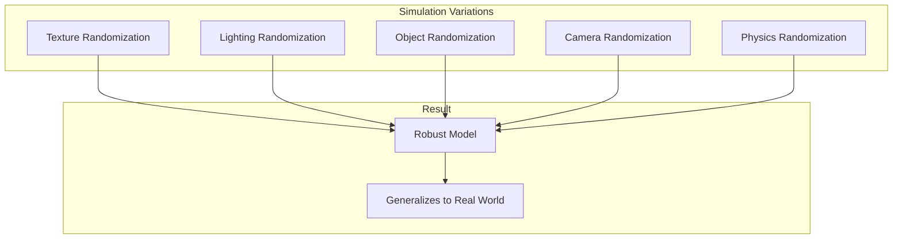
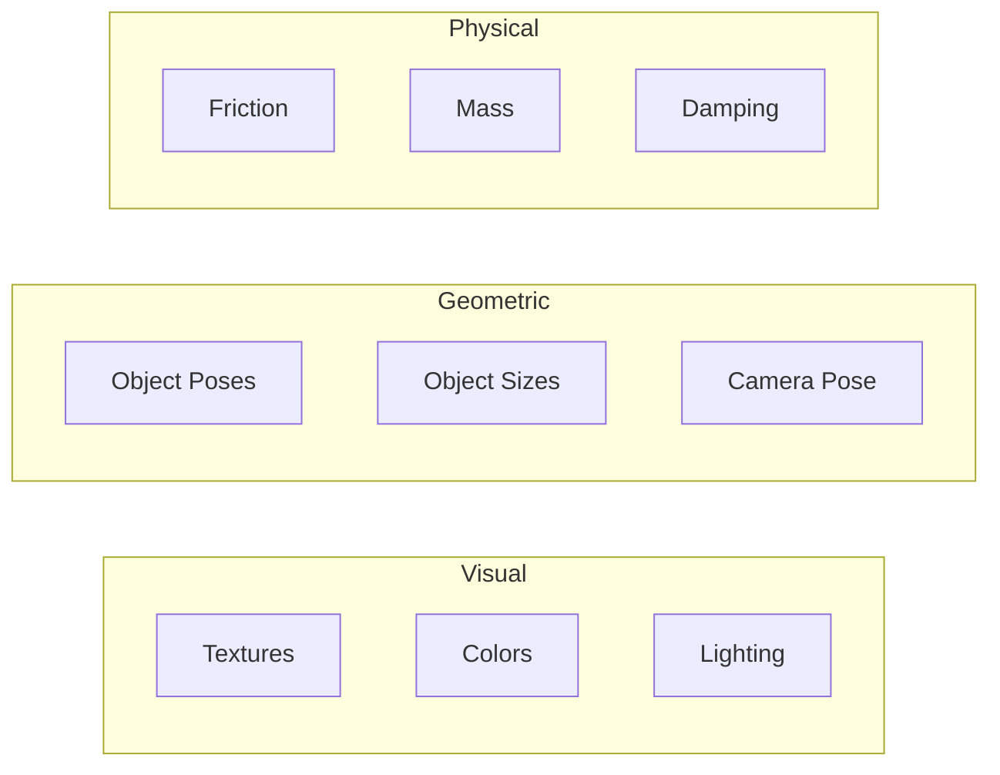

# Chapter 9: Domain Randomization

**Duration**: 3-4 hours
**Difficulty**: Intermediate-Advanced

---

## Learning Objectives

After completing this chapter, you will be able to:

- Understand domain randomization principles
- Randomize textures and materials
- Vary lighting conditions
- Add and randomize objects
- Trigger randomization via ROS 2

---

## 9.1 Domain Randomization Principles

Domain randomization trains AI to handle real-world variation by exposing it to diverse simulated conditions.



### Why Domain Randomization?

| Challenge | Without DR | With DR |
|-----------|-----------|---------|
| Unseen textures | Model fails | Model adapts |
| Different lighting | Brittle | Robust |
| Novel objects | Cannot handle | Generalizes |
| Sim-to-real gap | Large | Reduced |

### Randomization Categories



---

## 9.2 Texture Randomization

### Random Texture Generator

```csharp
// TextureRandomizer.cs
using UnityEngine;
using System.Collections.Generic;

public class TextureRandomizer : MonoBehaviour
{
    [Header("Settings")]
    public List<Renderer> targetRenderers;
    public Texture2D[] textureLibrary;
    public bool randomizeOnStart = true;

    [Header("Procedural Options")]
    public bool useProceduralTextures = true;
    public int proceduralSize = 256;

    void Start()
    {
        if (randomizeOnStart)
            Randomize();
    }

    public void Randomize()
    {
        foreach (var renderer in targetRenderers)
        {
            if (useProceduralTextures && Random.value > 0.5f)
            {
                renderer.material.mainTexture = GenerateProceduralTexture();
            }
            else if (textureLibrary.Length > 0)
            {
                int idx = Random.Range(0, textureLibrary.Length);
                renderer.material.mainTexture = textureLibrary[idx];
            }

            // Also randomize material properties
            RandomizeMaterialProperties(renderer.material);
        }
    }

    Texture2D GenerateProceduralTexture()
    {
        var texture = new Texture2D(proceduralSize, proceduralSize);

        // Random noise pattern
        int patternType = Random.Range(0, 4);

        switch (patternType)
        {
            case 0:
                GenerateNoiseTexture(texture);
                break;
            case 1:
                GenerateCheckerboardTexture(texture);
                break;
            case 2:
                GenerateGradientTexture(texture);
                break;
            case 3:
                GenerateStripeTexture(texture);
                break;
        }

        texture.Apply();
        return texture;
    }

    void GenerateNoiseTexture(Texture2D tex)
    {
        Color baseColor = Random.ColorHSV(0, 1, 0.3f, 0.7f, 0.3f, 0.7f);

        for (int y = 0; y < tex.height; y++)
        {
            for (int x = 0; x < tex.width; x++)
            {
                float noise = Mathf.PerlinNoise(x * 0.1f, y * 0.1f);
                Color c = baseColor * (0.5f + noise * 0.5f);
                tex.SetPixel(x, y, c);
            }
        }
    }

    void GenerateCheckerboardTexture(Texture2D tex)
    {
        Color color1 = Random.ColorHSV();
        Color color2 = Random.ColorHSV();
        int squareSize = Random.Range(8, 64);

        for (int y = 0; y < tex.height; y++)
        {
            for (int x = 0; x < tex.width; x++)
            {
                bool isEven = ((x / squareSize) + (y / squareSize)) % 2 == 0;
                tex.SetPixel(x, y, isEven ? color1 : color2);
            }
        }
    }

    void GenerateGradientTexture(Texture2D tex)
    {
        Color color1 = Random.ColorHSV();
        Color color2 = Random.ColorHSV();

        for (int y = 0; y < tex.height; y++)
        {
            float t = (float)y / tex.height;
            Color c = Color.Lerp(color1, color2, t);

            for (int x = 0; x < tex.width; x++)
            {
                tex.SetPixel(x, y, c);
            }
        }
    }

    void GenerateStripeTexture(Texture2D tex)
    {
        Color color1 = Random.ColorHSV();
        Color color2 = Random.ColorHSV();
        int stripeWidth = Random.Range(4, 32);

        for (int y = 0; y < tex.height; y++)
        {
            for (int x = 0; x < tex.width; x++)
            {
                bool isStripe = (x / stripeWidth) % 2 == 0;
                tex.SetPixel(x, y, isStripe ? color1 : color2);
            }
        }
    }

    void RandomizeMaterialProperties(Material mat)
    {
        // Random metallic
        mat.SetFloat("_Metallic", Random.Range(0f, 0.3f));

        // Random smoothness
        mat.SetFloat("_Smoothness", Random.Range(0.1f, 0.8f));

        // Random color tint
        mat.SetColor("_BaseColor", Random.ColorHSV(0, 1, 0.3f, 1f, 0.5f, 1f));
    }
}
```

---

## 9.3 Lighting Randomization

### Light Randomizer

```csharp
// LightRandomizer.cs
using UnityEngine;
using System.Collections.Generic;

public class LightRandomizer : MonoBehaviour
{
    [Header("Main Light")]
    public Light mainLight;

    [Header("Intensity Range")]
    public float minIntensity = 50000f;
    public float maxIntensity = 150000f;

    [Header("Color Temperature Range")]
    public float minTemperature = 4000f;  // Warm
    public float maxTemperature = 8000f;  // Cool

    [Header("Direction Range")]
    public float minElevation = 20f;
    public float maxElevation = 80f;
    public float minAzimuth = 0f;
    public float maxAzimuth = 360f;

    [Header("Additional Lights")]
    public List<Light> additionalLights;
    public bool randomizeAdditional = true;

    public void Randomize()
    {
        RandomizeMainLight();

        if (randomizeAdditional)
        {
            RandomizeAdditionalLights();
        }
    }

    void RandomizeMainLight()
    {
        if (mainLight == null) return;

        // Intensity
        mainLight.intensity = Random.Range(minIntensity, maxIntensity);

        // Color temperature
        float temp = Random.Range(minTemperature, maxTemperature);
        mainLight.color = Mathf.CorrelatedColorTemperatureToRGB(temp);

        // Direction
        float elevation = Random.Range(minElevation, maxElevation);
        float azimuth = Random.Range(minAzimuth, maxAzimuth);
        mainLight.transform.rotation = Quaternion.Euler(elevation, azimuth, 0);

        // Shadow
        mainLight.shadows = Random.value > 0.2f ?
            LightShadows.Soft : LightShadows.Hard;
    }

    void RandomizeAdditionalLights()
    {
        foreach (var light in additionalLights)
        {
            // Random on/off
            light.enabled = Random.value > 0.3f;

            if (light.enabled)
            {
                // Random intensity (relative to main)
                light.intensity = Random.Range(100f, 1000f);

                // Random color
                light.color = Random.ColorHSV(0, 1, 0.5f, 1f, 0.8f, 1f);
            }
        }
    }
}
```

### Ambient Light Randomizer

```csharp
// AmbientRandomizer.cs
using UnityEngine;
using UnityEngine.Rendering;
using UnityEngine.Rendering.HighDefinition;

public class AmbientRandomizer : MonoBehaviour
{
    public Volume globalVolume;

    [Header("Ambient Settings")]
    public float minAmbient = 0.2f;
    public float maxAmbient = 0.8f;

    [Header("Fog Settings")]
    public bool randomizeFog = true;
    public float fogProbability = 0.3f;

    public void Randomize()
    {
        var profile = globalVolume.profile;

        // Ambient color
        RenderSettings.ambientLight = Random.ColorHSV(0, 1, 0.1f, 0.3f, 0.3f, 0.8f);
        RenderSettings.ambientIntensity = Random.Range(minAmbient, maxAmbient);

        // Fog
        if (randomizeFog && profile.TryGet<Fog>(out var fog))
        {
            fog.enabled.value = Random.value < fogProbability;

            if (fog.enabled.value)
            {
                fog.meanFreePath.value = Random.Range(50f, 500f);
                fog.baseHeight.value = Random.Range(-5f, 5f);
                fog.maximumHeight.value = Random.Range(20f, 100f);
            }
        }
    }
}
```

---

## 9.4 Object Randomization

### Object Spawner

```csharp
// ObjectRandomizer.cs
using UnityEngine;
using System.Collections.Generic;

public class ObjectRandomizer : MonoBehaviour
{
    [Header("Object Prefabs")]
    public List<GameObject> objectPrefabs;

    [Header("Spawn Settings")]
    public int minObjects = 5;
    public int maxObjects = 20;

    [Header("Spawn Area")]
    public Vector3 spawnCenter = Vector3.zero;
    public Vector3 spawnSize = new Vector3(10, 0, 10);

    [Header("Size Randomization")]
    public float minScale = 0.5f;
    public float maxScale = 2.0f;

    private List<GameObject> spawnedObjects = new List<GameObject>();

    public void Randomize()
    {
        ClearObjects();
        SpawnRandomObjects();
    }

    void ClearObjects()
    {
        foreach (var obj in spawnedObjects)
        {
            if (obj != null)
                Destroy(obj);
        }
        spawnedObjects.Clear();
    }

    void SpawnRandomObjects()
    {
        int count = Random.Range(minObjects, maxObjects + 1);

        for (int i = 0; i < count; i++)
        {
            SpawnRandomObject();
        }
    }

    void SpawnRandomObject()
    {
        if (objectPrefabs.Count == 0) return;

        // Random prefab
        int prefabIdx = Random.Range(0, objectPrefabs.Count);
        var prefab = objectPrefabs[prefabIdx];

        // Random position
        Vector3 position = spawnCenter + new Vector3(
            Random.Range(-spawnSize.x / 2, spawnSize.x / 2),
            spawnSize.y,
            Random.Range(-spawnSize.z / 2, spawnSize.z / 2)
        );

        // Random rotation
        Quaternion rotation = Quaternion.Euler(0, Random.Range(0, 360), 0);

        // Spawn
        var obj = Instantiate(prefab, position, rotation);

        // Random scale
        float scale = Random.Range(minScale, maxScale);
        obj.transform.localScale = Vector3.one * scale;

        // Random color
        var renderer = obj.GetComponent<Renderer>();
        if (renderer != null)
        {
            renderer.material.color = Random.ColorHSV();
        }

        spawnedObjects.Add(obj);
    }
}
```

### Camera Pose Randomizer

```csharp
// CameraRandomizer.cs
using UnityEngine;

public class CameraRandomizer : MonoBehaviour
{
    [Header("Position Noise")]
    public float positionNoise = 0.1f;

    [Header("Rotation Noise")]
    public float rotationNoise = 2f;

    [Header("Intrinsics Randomization")]
    public bool randomizeFOV = true;
    public float minFOV = 50f;
    public float maxFOV = 70f;

    private Vector3 originalPosition;
    private Quaternion originalRotation;
    private float originalFOV;
    private Camera cam;

    void Start()
    {
        cam = GetComponent<Camera>();
        originalPosition = transform.position;
        originalRotation = transform.rotation;
        originalFOV = cam.fieldOfView;
    }

    public void Randomize()
    {
        // Position noise
        Vector3 posNoise = new Vector3(
            Random.Range(-positionNoise, positionNoise),
            Random.Range(-positionNoise, positionNoise),
            Random.Range(-positionNoise, positionNoise)
        );
        transform.position = originalPosition + posNoise;

        // Rotation noise
        Vector3 rotNoise = new Vector3(
            Random.Range(-rotationNoise, rotationNoise),
            Random.Range(-rotationNoise, rotationNoise),
            Random.Range(-rotationNoise, rotationNoise)
        );
        transform.rotation = originalRotation * Quaternion.Euler(rotNoise);

        // FOV randomization
        if (randomizeFOV)
        {
            cam.fieldOfView = Random.Range(minFOV, maxFOV);
        }
    }

    public void Reset()
    {
        transform.position = originalPosition;
        transform.rotation = originalRotation;
        cam.fieldOfView = originalFOV;
    }
}
```

---

## 9.5 Physics Randomization

### Physics Randomizer

```csharp
// PhysicsRandomizer.cs
using UnityEngine;
using System.Collections.Generic;

public class PhysicsRandomizer : MonoBehaviour
{
    [Header("Friction")]
    public List<Collider> frictionTargets;
    public float minFriction = 0.3f;
    public float maxFriction = 1.5f;

    [Header("Mass")]
    public List<Rigidbody> massTargets;
    public float massVariation = 0.2f;

    [Header("Joint Damping")]
    public List<ArticulationBody> jointTargets;
    public float dampingVariation = 0.3f;

    private Dictionary<Collider, float> originalFriction;
    private Dictionary<Rigidbody, float> originalMass;
    private Dictionary<ArticulationBody, float> originalDamping;

    void Start()
    {
        StoreOriginalValues();
    }

    void StoreOriginalValues()
    {
        originalFriction = new Dictionary<Collider, float>();
        foreach (var col in frictionTargets)
        {
            originalFriction[col] = col.material?.dynamicFriction ?? 0.5f;
        }

        originalMass = new Dictionary<Rigidbody, float>();
        foreach (var rb in massTargets)
        {
            originalMass[rb] = rb.mass;
        }

        originalDamping = new Dictionary<ArticulationBody, float>();
        foreach (var ab in jointTargets)
        {
            originalDamping[ab] = ab.linearDamping;
        }
    }

    public void Randomize()
    {
        RandomizeFriction();
        RandomizeMass();
        RandomizeDamping();
    }

    void RandomizeFriction()
    {
        foreach (var col in frictionTargets)
        {
            if (col.material == null)
            {
                col.material = new PhysicMaterial();
            }

            col.material.dynamicFriction = Random.Range(minFriction, maxFriction);
            col.material.staticFriction = col.material.dynamicFriction * 1.2f;
        }
    }

    void RandomizeMass()
    {
        foreach (var rb in massTargets)
        {
            float original = originalMass[rb];
            float variation = original * massVariation;
            rb.mass = original + Random.Range(-variation, variation);
        }
    }

    void RandomizeDamping()
    {
        foreach (var ab in jointTargets)
        {
            float original = originalDamping[ab];
            float variation = original * dampingVariation;
            ab.linearDamping = original + Random.Range(-variation, variation);
        }
    }
}
```

---

## 9.6 ROS 2 Randomization Service

### Randomization Manager

```csharp
// RandomizationManager.cs
using UnityEngine;
using Unity.Robotics.ROSTCPConnector;
using RosMessageTypes.Std;

public class RandomizationManager : MonoBehaviour
{
    [Header("Randomizers")]
    public TextureRandomizer textureRandomizer;
    public LightRandomizer lightRandomizer;
    public ObjectRandomizer objectRandomizer;
    public CameraRandomizer cameraRandomizer;
    public PhysicsRandomizer physicsRandomizer;

    [Header("ROS Settings")]
    public string serviceName = "/randomize_domain";

    private ROSConnection ros;

    void Start()
    {
        ros = ROSConnection.GetOrCreateInstance();
        ros.RegisterService<TriggerRequest, TriggerResponse>(serviceName);
        ros.ImplementService<TriggerRequest, TriggerResponse>(
            serviceName, HandleRandomizeRequest
        );

        Debug.Log($"Randomization service ready: {serviceName}");
    }

    TriggerResponse HandleRandomizeRequest(TriggerRequest request)
    {
        try
        {
            RandomizeAll();

            return new TriggerResponse
            {
                success = true,
                message = "Domain randomization applied"
            };
        }
        catch (System.Exception e)
        {
            return new TriggerResponse
            {
                success = false,
                message = e.Message
            };
        }
    }

    public void RandomizeAll()
    {
        Debug.Log("Applying domain randomization...");

        if (textureRandomizer != null)
            textureRandomizer.Randomize();

        if (lightRandomizer != null)
            lightRandomizer.Randomize();

        if (objectRandomizer != null)
            objectRandomizer.Randomize();

        if (cameraRandomizer != null)
            cameraRandomizer.Randomize();

        if (physicsRandomizer != null)
            physicsRandomizer.Randomize();

        Debug.Log("Domain randomization complete");
    }

    // Also support topic-based triggering
    public void SetupTopicTrigger()
    {
        ros.Subscribe<EmptyMsg>("/randomize_trigger", msg => RandomizeAll());
    }
}
```

### ROS 2 Client

```python
#!/usr/bin/env python3
"""
Domain randomization client for Unity.
"""

import rclpy
from rclpy.node import Node
from std_srvs.srv import Trigger
from std_msgs.msg import Empty


class DomainRandomizer(Node):
    """Trigger domain randomization in Unity."""

    def __init__(self):
        super().__init__('domain_randomizer')

        # Service client
        self.client = self.create_client(Trigger, '/randomize_domain')

        # Publisher for topic-based trigger
        self.publisher = self.create_publisher(Empty, '/randomize_trigger', 10)

        # Timer for periodic randomization
        self.timer = self.create_timer(30.0, self.randomize_callback)

        self.get_logger().info('Domain randomizer ready')

    def randomize_callback(self):
        """Trigger randomization periodically."""
        self.trigger_randomization()

    def trigger_randomization(self):
        """Call randomization service."""
        if not self.client.wait_for_service(timeout_sec=1.0):
            self.get_logger().warn('Randomization service not available')
            return

        request = Trigger.Request()
        future = self.client.call_async(request)
        future.add_done_callback(self.randomization_done)

    def randomization_done(self, future):
        """Handle randomization response."""
        try:
            response = future.result()
            if response.success:
                self.get_logger().info('Randomization applied')
            else:
                self.get_logger().warn(f'Randomization failed: {response.message}')
        except Exception as e:
            self.get_logger().error(f'Service call failed: {e}')


def main(args=None):
    rclpy.init(args=args)
    node = DomainRandomizer()
    rclpy.spin(node)
    node.destroy_node()
    rclpy.shutdown()


if __name__ == '__main__':
    main()
```

---

## Hands-On Exercises

### Exercise 9.1: Texture Randomization

1. Create TextureRandomizer component
2. Add 5 different floor textures
3. Trigger randomization 10 times
4. Observe visual variety

### Exercise 9.2: Full Randomization Pipeline

1. Set up all randomizers
2. Create ROS 2 trigger service
3. Call service every 30 seconds
4. Record 1000 frames with randomization

### Exercise 9.3: Measure Domain Gap

1. Train simple classifier on randomized data
2. Test on non-randomized data
3. Test on real images
4. Compare accuracy across domains

---

## Summary

In this chapter, you learned:

- Domain randomization improves sim-to-real transfer
- Textures, lighting, and objects can be randomized
- Physics randomization adds additional variation
- ROS 2 services trigger randomization
- Systematic randomization creates robust AI models

## Next Chapter

In [Chapter 10](ch10-integration-debugging.md), you will integrate Gazebo and Unity and debug common simulation issues.

---

## Quick Reference

```csharp
// Randomize all
textureRandomizer.Randomize();
lightRandomizer.Randomize();
objectRandomizer.Randomize();

// ROS service
ros.ImplementService<TriggerRequest, TriggerResponse>(
    "/randomize", HandleRequest
);
```

```bash
# Trigger randomization from ROS 2
ros2 service call /randomize_domain std_srvs/srv/Trigger
```

| Randomization | Parameters |
|---------------|------------|
| Texture | Color, pattern, scale |
| Lighting | Intensity, color, direction |
| Objects | Position, scale, count |
| Camera | Position, rotation, FOV |
| Physics | Friction, mass, damping |
