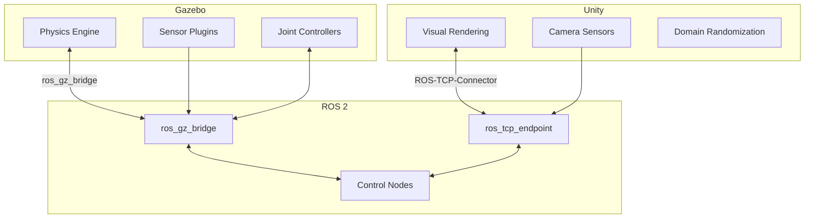
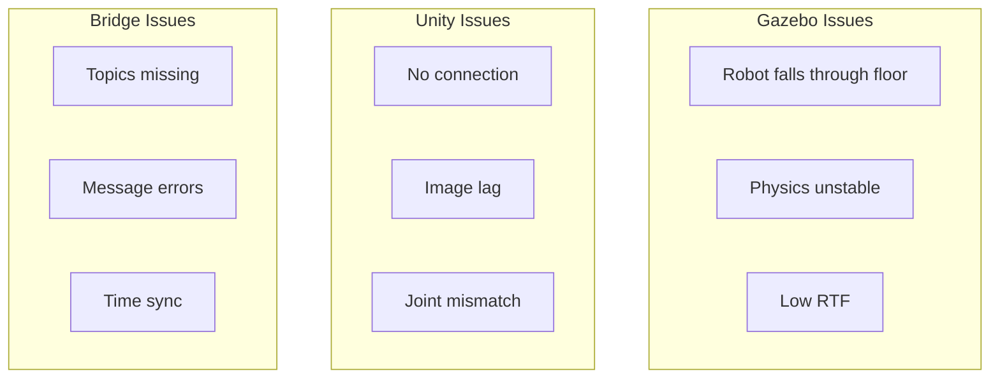

# Chapter 10: Integration and Debugging

**Duration**: 2-3 hours
**Difficulty**: Intermediate

---

## Learning Objectives

After completing this chapter, you will be able to:

- Launch combined Gazebo + Unity simulations
- Debug common integration issues
- Monitor simulation performance
- Troubleshoot ROS 2 bridge problems
- Validate digital twin behavior

---

## 10.1 Full Simulation Architecture

### Combined Pipeline



### When to Use Each Simulator

| Scenario | Gazebo | Unity | Both |
|----------|--------|-------|------|
| Control development | ✓ | | |
| Physics testing | ✓ | | |
| Vision AI training | | ✓ | |
| Full system validation | | | ✓ |
| Photorealistic rendering | | ✓ | |
| Sensor accuracy | ✓ | | |

---

## 10.2 Combined Launch File

### full_simulation.launch.py

```python
#!/usr/bin/env python3
"""
Launch complete Gazebo + Unity simulation pipeline.
"""

import os

from launch import LaunchDescription
from launch.actions import (
    DeclareLaunchArgument,
    IncludeLaunchDescription,
    GroupAction,
    TimerAction,
)
from launch.conditions import IfCondition
from launch.substitutions import LaunchConfiguration, PathJoinSubstitution
from launch.launch_description_sources import PythonLaunchDescriptionSource
from launch_ros.actions import Node
from ament_index_python.packages import get_package_share_directory


def generate_launch_description():
    # Package directories
    pkg_gazebo = get_package_share_directory('humanoid_gazebo')
    pkg_unity = get_package_share_directory('humanoid_unity')
    pkg_description = get_package_share_directory('humanoid_description')

    # Launch arguments
    use_gazebo = DeclareLaunchArgument(
        'use_gazebo', default_value='true',
        description='Launch Gazebo simulation'
    )

    use_unity = DeclareLaunchArgument(
        'use_unity', default_value='true',
        description='Launch Unity bridge'
    )

    use_rviz = DeclareLaunchArgument(
        'use_rviz', default_value='true',
        description='Launch RViz visualization'
    )

    # Gazebo simulation
    gazebo_launch = IncludeLaunchDescription(
        PythonLaunchDescriptionSource(
            os.path.join(pkg_gazebo, 'launch', 'humanoid_spawn.launch.py')
        ),
        condition=IfCondition(LaunchConfiguration('use_gazebo'))
    )

    # Unity TCP endpoint (delayed to ensure Gazebo is ready)
    unity_bridge = TimerAction(
        period=5.0,  # Wait 5 seconds for Gazebo
        actions=[
            IncludeLaunchDescription(
                PythonLaunchDescriptionSource(
                    os.path.join(pkg_unity, 'launch', 'unity_bridge.launch.py')
                ),
                condition=IfCondition(LaunchConfiguration('use_unity'))
            )
        ]
    )

    # RViz
    rviz_config = os.path.join(pkg_gazebo, 'rviz', 'simulation.rviz')
    rviz = Node(
        package='rviz2',
        executable='rviz2',
        name='rviz2',
        arguments=['-d', rviz_config],
        condition=IfCondition(LaunchConfiguration('use_rviz')),
        output='screen'
    )

    # Simulation monitor
    sim_monitor = Node(
        package='humanoid_gazebo',
        executable='simulation_monitor',
        name='simulation_monitor',
        output='screen'
    )

    return LaunchDescription([
        use_gazebo,
        use_unity,
        use_rviz,
        gazebo_launch,
        unity_bridge,
        rviz,
        sim_monitor,
    ])
```

---

## 10.3 Simulation Monitor

### Performance Monitoring Node

```python
#!/usr/bin/env python3
"""
Monitor simulation performance and health.
"""

import rclpy
from rclpy.node import Node
from rosgraph_msgs.msg import Clock
from sensor_msgs.msg import JointState, Image
from std_msgs.msg import Float64
import time


class SimulationMonitor(Node):
    """Monitor simulation health metrics."""

    def __init__(self):
        super().__init__('simulation_monitor')

        # Subscriptions
        self.clock_sub = self.create_subscription(
            Clock, '/clock', self.clock_callback, 10
        )
        self.joint_sub = self.create_subscription(
            JointState, '/joint_states', self.joint_callback, 10
        )
        self.image_sub = self.create_subscription(
            Image, '/camera/image_raw', self.image_callback, 10
        )

        # Publishers
        self.rtf_pub = self.create_publisher(Float64, '/simulation/rtf', 10)

        # Metrics
        self.last_sim_time = 0.0
        self.last_wall_time = time.time()
        self.joint_rate = 0.0
        self.image_rate = 0.0
        self.joint_count = 0
        self.image_count = 0

        # Timer for metrics calculation
        self.timer = self.create_timer(1.0, self.calculate_metrics)

        self.get_logger().info('Simulation monitor started')

    def clock_callback(self, msg: Clock):
        """Track simulation time."""
        sim_time = msg.clock.sec + msg.clock.nanosec * 1e-9
        wall_time = time.time()

        dt_sim = sim_time - self.last_sim_time
        dt_wall = wall_time - self.last_wall_time

        if dt_wall > 0.1:  # Update every 100ms
            rtf = dt_sim / dt_wall
            self.publish_rtf(rtf)

            self.last_sim_time = sim_time
            self.last_wall_time = wall_time

    def joint_callback(self, msg: JointState):
        """Count joint state messages."""
        self.joint_count += 1

    def image_callback(self, msg: Image):
        """Count image messages."""
        self.image_count += 1

    def calculate_metrics(self):
        """Calculate and log metrics."""
        self.joint_rate = self.joint_count
        self.image_rate = self.image_count

        self.get_logger().info(
            f'Joint rate: {self.joint_rate} Hz, '
            f'Image rate: {self.image_rate} Hz'
        )

        # Check for issues
        if self.joint_rate < 50:
            self.get_logger().warn('Low joint state rate!')

        if self.image_rate < 20:
            self.get_logger().warn('Low image rate!')

        # Reset counters
        self.joint_count = 0
        self.image_count = 0

    def publish_rtf(self, rtf: float):
        """Publish real-time factor."""
        msg = Float64()
        msg.data = rtf
        self.rtf_pub.publish(msg)

        if rtf < 0.8:
            self.get_logger().warn(f'Low RTF: {rtf:.2f}')


def main(args=None):
    rclpy.init(args=args)
    node = SimulationMonitor()
    rclpy.spin(node)
    node.destroy_node()
    rclpy.shutdown()


if __name__ == '__main__':
    main()
```

---

## 10.4 Common Issues and Solutions

### Issue Checklist



### Gazebo Troubleshooting

| Issue | Symptoms | Solution |
|-------|----------|----------|
| Falls through floor | Robot at z=0 or below | Check collision geometry, increase spawn height |
| Jittering | Vibrating at rest | Reduce contact kp, increase kd |
| Low RTF | RTF < 0.8 | Reduce solver iters, simplify collisions |
| No sensors | Topics empty | Check sensor plugins in URDF |
| No control | Joints don't move | Verify controller plugins |

### Unity Troubleshooting

| Issue | Symptoms | Solution |
|-------|----------|----------|
| No connection | Topics not visible | Start TCP endpoint first |
| Image lag | Delayed frames | Reduce resolution/rate |
| Wrong colors | BGR instead of RGB | Check encoding conversion |
| Missing joints | Partial model | Verify URDF import |
| Physics mismatch | Different behavior | Sync timestep settings |

### Bridge Troubleshooting

```bash
# Check if bridge is running
ros2 node list | grep bridge

# List bridged topics
ros2 topic list

# Check message flow
ros2 topic hz /joint_states
ros2 topic hz /camera/image_raw

# Debug message content
ros2 topic echo /joint_states --once
```

---

## 10.5 Debugging Tools

### Debug Launch Configuration

```python
#!/usr/bin/env python3
"""
Debug launch with verbose output.
"""

from launch import LaunchDescription
from launch.actions import DeclareLaunchArgument, SetEnvironmentVariable
from launch_ros.actions import Node


def generate_launch_description():
    # Enable verbose logging
    ros_log_level = SetEnvironmentVariable(
        'RCUTILS_LOGGING_SEVERITY_THRESHOLD', 'DEBUG'
    )

    # Gazebo verbose
    gz_verbose = SetEnvironmentVariable(
        'GZ_SIM_RESOURCE_PATH', '/path/to/models'
    )

    # Debug nodes
    topic_monitor = Node(
        package='ros2topic',
        executable='ros2',
        arguments=['topic', 'hz', '/joint_states'],
        output='screen'
    )

    return LaunchDescription([
        ros_log_level,
        gz_verbose,
        topic_monitor,
    ])
```

### Diagnostic Script

```python
#!/usr/bin/env python3
"""
Simulation diagnostic tool.
"""

import subprocess
import sys


def check_gazebo():
    """Check Gazebo status."""
    print("=== Gazebo Status ===")

    # Check process
    result = subprocess.run(
        ['pgrep', '-f', 'gz sim'],
        capture_output=True
    )
    if result.returncode == 0:
        print("✓ Gazebo running")
    else:
        print("✗ Gazebo not running")

    # Check topics
    result = subprocess.run(
        ['gz', 'topic', '-l'],
        capture_output=True, text=True
    )
    topics = result.stdout.strip().split('\n')
    print(f"  Gazebo topics: {len(topics)}")


def check_ros2():
    """Check ROS 2 status."""
    print("\n=== ROS 2 Status ===")

    # Check nodes
    result = subprocess.run(
        ['ros2', 'node', 'list'],
        capture_output=True, text=True
    )
    nodes = [n for n in result.stdout.strip().split('\n') if n]
    print(f"✓ Active nodes: {len(nodes)}")
    for node in nodes[:5]:
        print(f"  - {node}")

    # Check topics
    result = subprocess.run(
        ['ros2', 'topic', 'list'],
        capture_output=True, text=True
    )
    topics = [t for t in result.stdout.strip().split('\n') if t]
    print(f"✓ Active topics: {len(topics)}")


def check_bridges():
    """Check bridge status."""
    print("\n=== Bridge Status ===")

    # ros_gz_bridge
    result = subprocess.run(
        ['ros2', 'node', 'list'],
        capture_output=True, text=True
    )
    if 'parameter_bridge' in result.stdout:
        print("✓ ros_gz_bridge running")
    else:
        print("✗ ros_gz_bridge not found")

    # TCP endpoint
    if 'ros_tcp_endpoint' in result.stdout:
        print("✓ ros_tcp_endpoint running")
    else:
        print("✗ ros_tcp_endpoint not found")


def check_rates():
    """Check topic rates."""
    print("\n=== Topic Rates ===")

    topics_to_check = [
        '/clock',
        '/joint_states',
        '/camera/image_raw',
    ]

    for topic in topics_to_check:
        result = subprocess.run(
            ['ros2', 'topic', 'hz', topic, '-w', '5'],
            capture_output=True, text=True,
            timeout=6
        )
        if 'average rate' in result.stdout:
            # Extract rate
            for line in result.stdout.split('\n'):
                if 'average rate' in line:
                    print(f"  {topic}: {line.split(':')[1].strip()}")
                    break
        else:
            print(f"  {topic}: No messages")


def main():
    print("Simulation Diagnostic Tool")
    print("=" * 40)

    check_gazebo()
    check_ros2()
    check_bridges()

    try:
        check_rates()
    except subprocess.TimeoutExpired:
        print("  Rate check timed out")

    print("\n" + "=" * 40)
    print("Diagnostic complete")


if __name__ == '__main__':
    main()
```

---

## 10.6 Validation Tests

### Digital Twin Validation

```python
#!/usr/bin/env python3
"""
Validate digital twin behavior.
"""

import rclpy
from rclpy.node import Node
from sensor_msgs.msg import JointState
from geometry_msgs.msg import WrenchStamped
import numpy as np


class DigitalTwinValidator(Node):
    """Validate simulation matches expected behavior."""

    def __init__(self):
        super().__init__('digital_twin_validator')

        self.joint_sub = self.create_subscription(
            JointState, '/joint_states', self.joint_callback, 10
        )

        self.ft_sub = self.create_subscription(
            WrenchStamped, '/left_foot_ft/wrench', self.ft_callback, 10
        )

        self.tests_passed = 0
        self.tests_failed = 0

        # Run tests after 5 seconds
        self.create_timer(5.0, self.run_validation)

    def joint_callback(self, msg: JointState):
        """Store latest joint state."""
        self.latest_joints = msg

    def ft_callback(self, msg: WrenchStamped):
        """Store latest F/T reading."""
        self.latest_ft = msg

    def run_validation(self):
        """Run validation tests."""
        self.get_logger().info('Starting validation tests...')

        self.test_joint_count()
        self.test_joint_limits()
        self.test_gravity()

        self.get_logger().info(
            f'Validation complete: {self.tests_passed} passed, '
            f'{self.tests_failed} failed'
        )

    def test_joint_count(self):
        """Test correct number of joints."""
        expected_joints = 14

        if hasattr(self, 'latest_joints'):
            actual = len(self.latest_joints.name)
            if actual == expected_joints:
                self.get_logger().info(f'✓ Joint count: {actual}')
                self.tests_passed += 1
            else:
                self.get_logger().error(
                    f'✗ Joint count: expected {expected_joints}, got {actual}'
                )
                self.tests_failed += 1
        else:
            self.get_logger().error('✗ No joint states received')
            self.tests_failed += 1

    def test_joint_limits(self):
        """Test joints within limits."""
        if not hasattr(self, 'latest_joints'):
            return

        # Expected limits (simplified)
        limits = {
            'left_knee': (0.0, 2.5),
            'right_knee': (0.0, 2.5),
        }

        all_ok = True
        for joint_name, (lower, upper) in limits.items():
            if joint_name in self.latest_joints.name:
                idx = self.latest_joints.name.index(joint_name)
                pos = self.latest_joints.position[idx]

                if pos < lower or pos > upper:
                    self.get_logger().error(
                        f'✗ {joint_name} out of limits: {pos}'
                    )
                    all_ok = False

        if all_ok:
            self.get_logger().info('✓ All joints within limits')
            self.tests_passed += 1
        else:
            self.tests_failed += 1

    def test_gravity(self):
        """Test gravity effect on F/T sensor."""
        if hasattr(self, 'latest_ft'):
            fz = self.latest_ft.wrench.force.z

            # Expect negative force (supporting weight)
            if fz < -10:  # At least 10N
                self.get_logger().info(f'✓ Gravity detected: Fz={fz:.1f}N')
                self.tests_passed += 1
            else:
                self.get_logger().error(f'✗ No gravity: Fz={fz:.1f}N')
                self.tests_failed += 1
        else:
            self.get_logger().error('✗ No F/T data received')
            self.tests_failed += 1


def main(args=None):
    rclpy.init(args=args)
    node = DigitalTwinValidator()
    rclpy.spin(node)
    node.destroy_node()
    rclpy.shutdown()


if __name__ == '__main__':
    main()
```

---

## Hands-On Exercises

### Exercise 10.1: Combined Launch

1. Create full_simulation.launch.py
2. Launch Gazebo + Unity together
3. Verify both receive joint states
4. Check RTF in both simulators

### Exercise 10.2: Diagnostic Tool

1. Run simulation_diagnostic.py
2. Identify any issues
3. Fix bridge problems
4. Verify all tests pass

### Exercise 10.3: Validation Suite

1. Implement 5 additional validation tests
2. Test joint velocities
3. Test camera frame rate
4. Generate validation report

---

## Summary

In this chapter, you learned:

- Combined launch files coordinate Gazebo and Unity
- Simulation monitors track performance metrics
- Common issues have systematic solutions
- Diagnostic tools identify problems quickly
- Validation tests verify digital twin behavior

## Module Complete

Congratulations! You have completed Module 2: Digital Twin. You now know how to:

- Set up Gazebo worlds with physics
- Spawn and control robots via ROS 2
- Simulate sensors (camera, IMU, F/T)
- Configure Unity for photorealistic rendering
- Stream synthetic sensor data
- Apply domain randomization
- Debug and validate simulations

---

## Quick Reference

```bash
# Launch full simulation
ros2 launch humanoid_gazebo full_simulation.launch.py

# Check simulation health
ros2 topic hz /joint_states
ros2 topic hz /camera/image_raw
ros2 topic echo /simulation/rtf

# Debug
ros2 node list
ros2 topic list
gz topic -l
```

| Command | Purpose |
|---------|---------|
| `ros2 topic hz` | Check message rate |
| `ros2 topic echo` | View message content |
| `gz topic -e` | Echo Gazebo topic |
| `ros2 run rqt_graph rqt_graph` | Visualize node graph |
