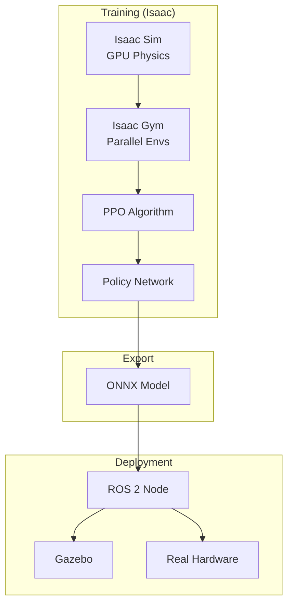
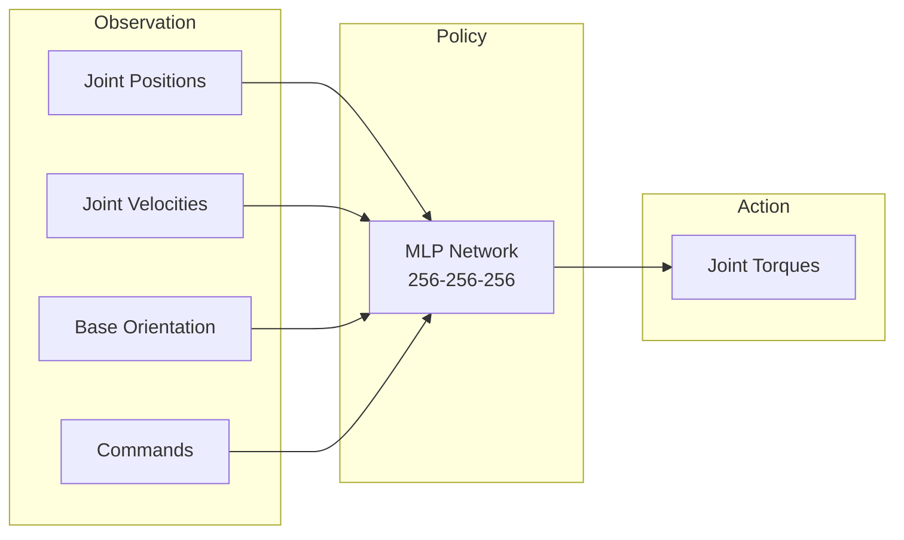

# Module 3: AI-Robot Brain – NVIDIA Isaac

**Duration**: Weeks 5-6
**Prerequisites**: Module 2 (Digital Twin – Gazebo & Unity)

---

## Overview

This module teaches how to deploy AI models on NVIDIA Isaac Sim for intelligent humanoid behavior. You will train reinforcement learning policies for locomotion using GPU-accelerated parallel simulation, then deploy trained policies to ROS 2 and Gazebo.

**NVIDIA Isaac** provides:
- GPU-accelerated physics simulation (PhysX)
- Massively parallel training environments (1000+ simultaneous)
- Reinforcement learning framework (Isaac Gym)
- Domain randomization at scale
- Sim-to-real transfer pipelines

## Learning Objectives

By completing this module, you will be able to:

1. Install and configure NVIDIA Isaac Sim
2. Explain GPU-accelerated physics simulation
3. Import humanoid robot into Isaac Sim
4. Configure Isaac Gym training environment
5. Train locomotion policy using PPO algorithm
6. Implement reward shaping for stable walking
7. Apply domain randomization during training
8. Export trained policy for deployment
9. Deploy policy to Gazebo simulation
10. Analyze sim-to-real gap and mitigation strategies

## Chapters

| Chapter | Title | Duration |
|---------|-------|----------|
| 1 | [Introduction to NVIDIA Isaac](chapters/ch01-introduction-isaac.md) | 3-4 hours |
| 2 | [Isaac Sim Environment Setup](chapters/ch02-isaac-sim-setup.md) | 4-5 hours |
| 3 | [Isaac Gym Fundamentals](chapters/ch03-isaac-gym-fundamentals.md) | 4-5 hours |
| 4 | [Humanoid Training Environment](chapters/ch04-humanoid-environment.md) | 5-6 hours |
| 5 | [Reward Design for Locomotion](chapters/ch05-reward-design.md) | 4-5 hours |
| 6 | [PPO Training](chapters/ch06-ppo-training.md) | 5-6 hours |
| 7 | [Domain Randomization](chapters/ch07-domain-randomization.md) | 4-5 hours |
| 8 | [Curriculum Learning](chapters/ch08-curriculum-learning.md) | 3-4 hours |
| 9 | [Policy Export and Deployment](chapters/ch09-policy-deployment.md) | 4-5 hours |
| 10 | [Sim-to-Real Analysis](chapters/ch10-sim-to-real.md) | 3-4 hours |

## Code Examples

All code examples are in the `code/` directory:

```
code/
├── humanoid_isaac/        # Isaac Sim integration
│   ├── envs/              # Training environments
│   ├── tasks/             # Task definitions
│   └── rewards/           # Reward components
├── humanoid_learning/     # RL training code
│   ├── algorithms/        # PPO implementation
│   ├── networks/          # Neural network architectures
│   └── configs/           # Training configurations
└── humanoid_policy/       # ROS 2 deployment
    ├── models/            # Exported ONNX models
    └── src/               # Policy inference node
```

## Architecture Overview



## Training Pipeline



## Hardware Requirements

| Component | Minimum | Recommended |
|-----------|---------|-------------|
| CPU | 8 cores | 16 cores |
| RAM | 32 GB | 64 GB |
| GPU | RTX 3060 (12GB) | RTX 4080 (16GB) |
| Storage | 100 GB SSD | 200 GB NVMe |
| CUDA | 11.8 | 12.0+ |

## Software Requirements

- Ubuntu 22.04
- NVIDIA Driver 525+
- CUDA Toolkit 11.8+
- NVIDIA Isaac Sim 2023.1+
- Isaac Gym Preview 4
- PyTorch 2.0+
- ROS 2 Humble

---

**Governed by**: `specs/constitution.md` v1.0.0
