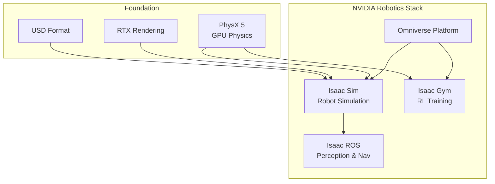
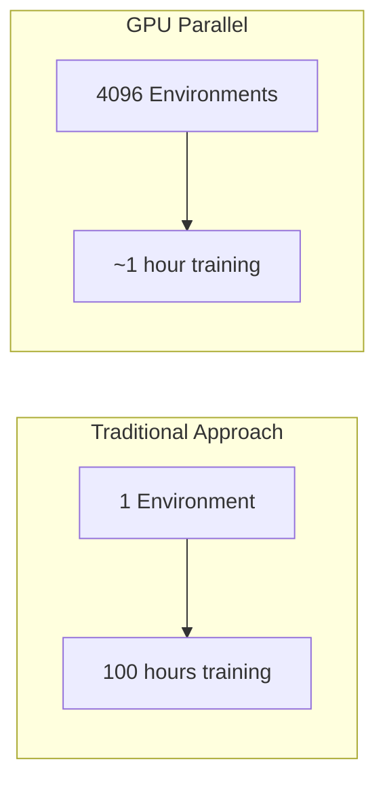
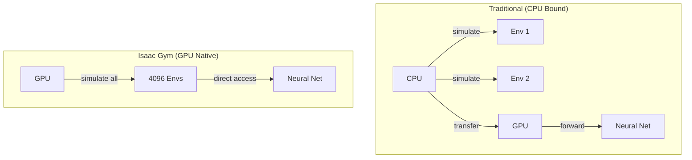
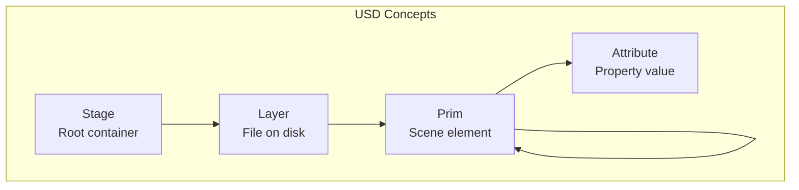
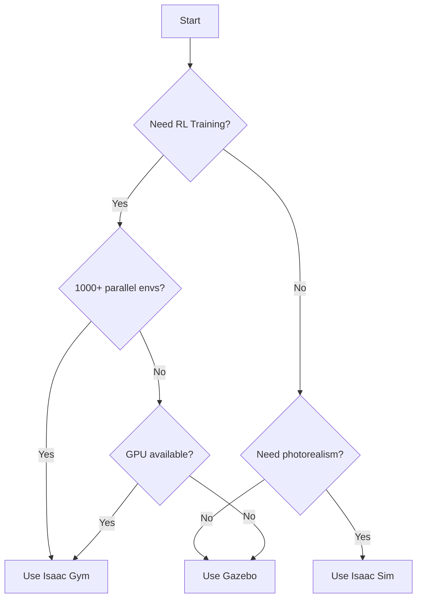

# Chapter 1: Introduction to NVIDIA Isaac

**Duration**: 3-4 hours
**Difficulty**: Beginner-Intermediate

---

## Learning Objectives

After completing this chapter, you will be able to:

- Explain the NVIDIA robotics ecosystem
- Differentiate Isaac Sim, Isaac Gym, and Isaac ROS
- Understand GPU-accelerated simulation benefits
- Install NVIDIA Isaac Sim
- Navigate the Isaac Sim interface

---

## 1.1 NVIDIA Robotics Ecosystem

NVIDIA provides a comprehensive platform for robotics development.



### Isaac Sim

**Isaac Sim** is NVIDIA's flagship robot simulation platform:

- Photorealistic rendering with RTX ray tracing
- GPU-accelerated PhysX physics
- USD-based scene format
- ROS/ROS 2 integration
- Synthetic data generation

### Isaac Gym

**Isaac Gym** is a high-performance RL training environment:

- Thousands of parallel environments
- End-to-end GPU training
- Direct tensor access
- Minimal CPU overhead
- Fast iteration cycles

### Isaac ROS

**Isaac ROS** provides GPU-accelerated perception:

- NVIDIA-optimized ROS 2 packages
- Hardware-accelerated SLAM
- DNN inference integration
- Sensor processing

### Comparison

| Feature | Isaac Sim | Isaac Gym | Gazebo |
|---------|-----------|-----------|--------|
| Physics | PhysX GPU | PhysX GPU | ODE/Bullet CPU |
| Parallel Envs | Limited | 1000s | Limited |
| Rendering | RTX | Minimal | OGRE |
| RL Training | Via Gym | Native | External |
| ROS Integration | Native | Limited | Native |

---

## 1.2 Why GPU-Accelerated Simulation?

### The Training Speed Problem

Training robot policies requires massive amounts of experience:



### Speed Comparison

| Approach | Environments | Steps/Second | Training Time |
|----------|--------------|--------------|---------------|
| CPU Single | 1 | ~1,000 | 100+ hours |
| CPU Parallel | 16 | ~16,000 | 6+ hours |
| GPU Parallel | 4096 | ~1,000,000 | < 1 hour |

### How Isaac Gym Achieves Speed



**Key innovations:**
1. Physics runs entirely on GPU
2. Observations stay in GPU memory
3. No CPU-GPU data transfer
4. Batch inference on same GPU

---

## 1.3 Installation

### System Requirements

```bash
# Check GPU
nvidia-smi
# Required: NVIDIA GPU with 12GB+ VRAM, Driver 525+

# Check CUDA
nvcc --version
# Required: CUDA 11.8+

# Check system
uname -a
# Required: Ubuntu 22.04
```

### Install Omniverse Launcher

1. Download from [NVIDIA Omniverse](https://www.nvidia.com/en-us/omniverse/)

2. Install the AppImage:
```bash
chmod +x omniverse-launcher-linux.AppImage
./omniverse-launcher-linux.AppImage
```

3. Log in with NVIDIA account

4. Install Nucleus (local server) when prompted

### Install Isaac Sim

1. Open Omniverse Launcher
2. Go to Exchange tab
3. Search for "Isaac Sim"
4. Click Install (Isaac Sim 2023.1.1 or later)
5. Wait for download (~15GB)

### Verify Installation

```bash
# Launch Isaac Sim
~/.local/share/ov/pkg/isaac_sim-2023.1.1/isaac-sim.sh

# Or via Omniverse Launcher: Library > Isaac Sim > Launch
```

### Install Isaac Gym

```bash
# Download Isaac Gym Preview 4
# From: https://developer.nvidia.com/isaac-gym

# Extract and install
cd isaacgym/python
pip install -e .

# Verify
python -c "from isaacgym import gymapi; print('Isaac Gym OK')"
```

---

## 1.4 Isaac Sim Interface

### Main Window Layout

```
┌─────────────────────────────────────────────────────────────┐
│  Menu Bar                                                    │
├──────────────┬───────────────────────────┬──────────────────┤
│              │                           │                  │
│   Stage      │      Viewport             │    Property      │
│   (Scene     │      (3D View)            │    (Inspector)   │
│   Hierarchy) │                           │                  │
│              │                           │                  │
├──────────────┴───────────────────────────┴──────────────────┤
│  Content Browser / Console / Timeline                        │
└─────────────────────────────────────────────────────────────┘
```

### Key Panels

| Panel | Purpose |
|-------|---------|
| Stage | Scene hierarchy (USD prims) |
| Viewport | 3D visualization |
| Property | Selected object properties |
| Content | Asset browser |
| Console | Python output/errors |

### Navigation Controls

| Action | Control |
|--------|---------|
| Orbit | Alt + Left Mouse |
| Pan | Alt + Middle Mouse |
| Zoom | Alt + Right Mouse / Scroll |
| Focus | F (on selected) |
| Play/Pause | Space |

---

## 1.5 First Isaac Sim Scene

### Load Sample Robot

1. File > Open
2. Navigate to: `omniverse://localhost/NVIDIA/Assets/Isaac/2023.1.1/Isaac/Robots/`
3. Select a robot (e.g., `Humanoid/humanoid.usd`)
4. Click Open

### Add Ground Plane

```python
# In Script Editor (Window > Script Editor)
from omni.isaac.core.utils.stage import add_reference_to_stage
from omni.isaac.core.utils.prims import create_prim

# Add ground plane
create_prim(
    prim_path="/World/GroundPlane",
    prim_type="Plane",
    attributes={"size": 100}
)
```

### Run Simulation

1. Click Play button (or press Space)
2. Observe robot falling under gravity
3. Click Stop to reset

### Python Scripting

```python
# Basic Isaac Sim script
from omni.isaac.core import World
from omni.isaac.core.robots import Robot

# Create world
world = World(stage_units_in_meters=1.0)

# Add ground
world.scene.add_default_ground_plane()

# Load robot
robot = world.scene.add(
    Robot(
        prim_path="/World/Humanoid",
        name="humanoid",
        usd_path="path/to/humanoid.usd"
    )
)

# Initialize
world.reset()

# Simulation loop
for i in range(1000):
    world.step(render=True)
```

---

## 1.6 USD (Universal Scene Description)

### What is USD?

**USD** is Pixar's scene description format, adopted by NVIDIA for Omniverse.



### USD vs URDF

| Aspect | URDF | USD |
|--------|------|-----|
| Format | XML | Binary/ASCII |
| Scope | Single robot | Full scene |
| Composition | Include | Reference/Payload |
| Physics | Gazebo tags | Native |
| Rendering | Basic | Photorealistic |

### Basic USD Operations

```python
from pxr import Usd, UsdGeom, UsdPhysics

# Open stage
stage = Usd.Stage.Open("scene.usd")

# Get prim
robot_prim = stage.GetPrimAtPath("/World/Robot")

# Read attribute
mass = robot_prim.GetAttribute("physics:mass").Get()

# Modify attribute
robot_prim.GetAttribute("physics:mass").Set(10.0)

# Save
stage.Save()
```

---

## 1.7 Isaac Sim Python API

### Core Classes

```python
from omni.isaac.core import World
from omni.isaac.core.robots import Robot
from omni.isaac.core.articulations import Articulation
from omni.isaac.core.prims import RigidPrim, GeometryPrim
from omni.isaac.core.utils.stage import add_reference_to_stage
```

### World Class

```python
# Create simulation world
world = World(
    stage_units_in_meters=1.0,
    physics_dt=1/120,  # Physics timestep
    rendering_dt=1/60  # Render timestep
)

# Add objects
world.scene.add(robot)
world.scene.add_default_ground_plane()

# Control simulation
world.reset()
world.step()
world.play()
world.pause()
world.stop()
```

### Articulation Class

```python
from omni.isaac.core.articulations import Articulation

# Create articulation (robot)
robot = Articulation(
    prim_path="/World/Robot",
    name="my_robot"
)

# Initialize
robot.initialize()

# Get state
positions = robot.get_joint_positions()
velocities = robot.get_joint_velocities()

# Set control
robot.set_joint_position_targets(target_positions)
robot.set_joint_velocity_targets(target_velocities)
robot.apply_action(ArticulationAction(joint_efforts=torques))
```

---

## 1.8 When to Use Isaac vs Gazebo

### Decision Matrix



### Use Isaac When:

- Training RL policies at scale
- Need thousands of parallel environments
- Photorealistic rendering required
- Synthetic data generation
- GPU resources available

### Use Gazebo When:

- ROS 2 native integration critical
- CPU-only systems
- Simple physics sufficient
- Existing Gazebo workflows
- Limited GPU memory

---

## Hands-On Exercises

### Exercise 1.1: Install Isaac Sim

1. Install Omniverse Launcher
2. Install Isaac Sim 2023.1.1
3. Launch and verify interface loads
4. Load sample robot scene

### Exercise 1.2: Navigate the Interface

1. Load humanoid robot
2. Practice navigation controls
3. Inspect robot in Property panel
4. Run physics simulation

### Exercise 1.3: Python Scripting

1. Open Script Editor
2. Create simple scene with code
3. Add robot and ground plane
4. Run simulation loop

---

## Summary

In this chapter, you learned:

- NVIDIA provides Isaac Sim, Isaac Gym, and Isaac ROS
- GPU acceleration enables 1000x faster training
- Isaac Sim uses USD format for scenes
- Python API provides programmatic control
- Choose Isaac for RL training at scale

## Next Chapter

In [Chapter 2](ch02-isaac-sim-setup.md), you will configure Isaac Sim for humanoid robot training.

---

## Quick Reference

```bash
# Launch Isaac Sim
~/.local/share/ov/pkg/isaac_sim-2023.1.1/isaac-sim.sh

# Isaac Sim Python
~/.local/share/ov/pkg/isaac_sim-2023.1.1/python.sh script.py

# Verify Isaac Gym
python -c "from isaacgym import gymapi"
```

```python
# Basic Isaac Sim
from omni.isaac.core import World
world = World()
world.scene.add_default_ground_plane()
world.reset()
world.step()
```

| Component | Purpose |
|-----------|---------|
| Isaac Sim | Full robot simulation |
| Isaac Gym | RL training framework |
| PhysX | GPU physics engine |
| USD | Scene description format |
