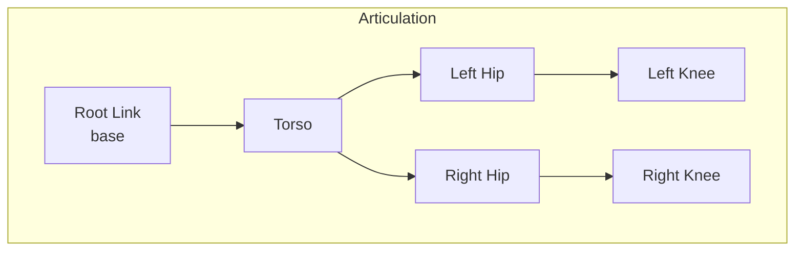

# Chapter 2: Isaac Sim Environment Setup

**Duration**: 4-5 hours
**Difficulty**: Intermediate

---

## Learning Objectives

After completing this chapter, you will be able to:

- Create Isaac Sim stages for training
- Convert URDF to USD format
- Configure articulation properties
- Set up GPU physics
- Add sensors to the robot

---

## 2.1 Creating an Isaac Sim Stage

### Stage Basics

A **Stage** is the root container for all scene elements in USD.

```python
from omni.isaac.core import World
from omni.isaac.core.utils.stage import create_new_stage

# Create new stage
create_new_stage()

# Create world with physics
world = World(
    stage_units_in_meters=1.0,
    physics_dt=1.0/120.0,
    rendering_dt=1.0/60.0
)

# Add ground plane
world.scene.add_default_ground_plane(
    z_position=0.0,
    name="ground_plane",
    prim_path="/World/GroundPlane",
    static_friction=1.0,
    dynamic_friction=1.0,
    restitution=0.0
)
```

### Physics Scene Configuration

```python
from omni.physx import get_physx_interface
from pxr import UsdPhysics, PhysxSchema

# Get physics scene
stage = omni.usd.get_context().get_stage()
physics_scene = UsdPhysics.Scene.Define(stage, "/World/PhysicsScene")

# Configure GPU physics
physx_scene = PhysxSchema.PhysxSceneAPI.Apply(physics_scene.GetPrim())
physx_scene.CreateEnableCCDAttr().Set(True)  # Continuous collision
physx_scene.CreateEnableGPUDynamicsAttr().Set(True)
physx_scene.CreateBroadphaseTypeAttr().Set("GPU")
physx_scene.CreateGpuMaxNumPartitionsAttr().Set(8)

# Set gravity
physics_scene.CreateGravityDirectionAttr().Set((0.0, 0.0, -1.0))
physics_scene.CreateGravityMagnitudeAttr().Set(9.81)
```

---

## 2.2 URDF to USD Conversion

### Using URDF Importer

```python
from omni.isaac.urdf import _urdf
from omni.isaac.core.utils.stage import add_reference_to_stage

# Configure importer
import_config = _urdf.ImportConfig()
import_config.merge_fixed_joints = False
import_config.fix_base = False
import_config.import_inertia_tensor = True
import_config.distance_scale = 1.0
import_config.density = 1000.0
import_config.default_drive_type = _urdf.UrdfJointTargetType.JOINT_DRIVE_POSITION
import_config.default_drive_strength = 1000.0
import_config.default_position_drive_damping = 100.0

# Import URDF
urdf_interface = _urdf.acquire_urdf_interface()
result = urdf_interface.parse_urdf(
    "path/to/humanoid.urdf",
    import_config
)

# Create USD
urdf_interface.import_robot(
    "path/to/humanoid.urdf",
    "/World/Humanoid",
    import_config,
    ""
)
```

### Import Configuration Options

| Option | Description | Default |
|--------|-------------|---------|
| `merge_fixed_joints` | Combine fixed links | False |
| `fix_base` | Lock base to world | False |
| `import_inertia_tensor` | Use URDF inertias | True |
| `distance_scale` | Unit conversion | 1.0 |
| `default_drive_type` | Position/Velocity | Position |
| `default_drive_strength` | Joint stiffness | 1000 |

### Manual USD Creation

```python
from pxr import Usd, UsdGeom, UsdPhysics, Gf

stage = Usd.Stage.CreateNew("humanoid.usd")

# Create root prim
UsdGeom.Xform.Define(stage, "/World")

# Create robot root
robot_prim = UsdGeom.Xform.Define(stage, "/World/Humanoid")

# Add physics articulation root
UsdPhysics.ArticulationRootAPI.Apply(robot_prim.GetPrim())

# Create link
torso = UsdGeom.Mesh.Define(stage, "/World/Humanoid/torso")
UsdPhysics.RigidBodyAPI.Apply(torso.GetPrim())
UsdPhysics.MassAPI.Apply(torso.GetPrim())
torso.GetPrim().GetAttribute("physics:mass").Set(10.0)

stage.Save()
```

---

## 2.3 Articulation Configuration

### Understanding Articulations

An **Articulation** is a kinematic tree of rigid bodies connected by joints.



### Configuring Joint Drives

```python
from pxr import UsdPhysics, PhysxSchema

# Get joint prim
joint_prim = stage.GetPrimAtPath("/World/Humanoid/left_hip_pitch")

# Add revolute joint
revolute = UsdPhysics.RevoluteJoint.Define(stage, joint_prim.GetPath())

# Set axis
revolute.CreateAxisAttr().Set("Y")

# Set limits (radians)
revolute.CreateLowerLimitAttr().Set(-1.57)
revolute.CreateUpperLimitAttr().Set(1.57)

# Configure drive
drive = UsdPhysics.DriveAPI.Apply(joint_prim, "angular")
drive.CreateTypeAttr().Set("force")
drive.CreateMaxForceAttr().Set(100.0)  # Max torque
drive.CreateDampingAttr().Set(10.0)
drive.CreateStiffnessAttr().Set(1000.0)
```

### Joint Drive Types

| Drive Type | Control Mode | Use Case |
|------------|--------------|----------|
| Position | Stiffness-based | Servo control |
| Velocity | Damping-based | Speed control |
| Force | Direct torque | RL training |

### Configuring for RL

For RL training, use **force/torque control**:

```python
# Configure for torque control
drive.CreateTypeAttr().Set("force")
drive.CreateStiffnessAttr().Set(0.0)  # No position control
drive.CreateDampingAttr().Set(0.0)    # No velocity control
drive.CreateMaxForceAttr().Set(100.0) # Torque limit
```

---

## 2.4 Physics Properties

### Link Mass and Inertia

```python
from pxr import UsdPhysics, Gf

# Get link prim
link_prim = stage.GetPrimAtPath("/World/Humanoid/torso")

# Apply mass API
mass_api = UsdPhysics.MassAPI.Apply(link_prim)
mass_api.CreateMassAttr().Set(10.0)  # kg

# Set center of mass
mass_api.CreateCenterOfMassAttr().Set(Gf.Vec3f(0, 0, 0.1))

# Set inertia tensor (diagonal)
mass_api.CreateDiagonalInertiaAttr().Set(Gf.Vec3f(0.1, 0.1, 0.05))
```

### Collision Properties

```python
from pxr import UsdPhysics, PhysxSchema

# Get collision prim
collision_prim = stage.GetPrimAtPath("/World/Humanoid/left_foot/collision")

# Apply collision API
collision = UsdPhysics.CollisionAPI.Apply(collision_prim)

# Configure contact properties
contact = PhysxSchema.PhysxContactReportAPI.Apply(collision_prim)
contact.CreateThresholdAttr().Set(0.0)

# Material properties
material = UsdPhysics.MaterialAPI.Apply(collision_prim)
material.CreateStaticFrictionAttr().Set(1.0)
material.CreateDynamicFrictionAttr().Set(1.0)
material.CreateRestitutionAttr().Set(0.0)
```

### Contact Offset Configuration

```python
# Configure collision geometry
rigid_body = PhysxSchema.PhysxRigidBodyAPI.Apply(link_prim)
rigid_body.CreateContactOffsetAttr().Set(0.02)  # 2cm contact margin
rigid_body.CreateRestOffsetAttr().Set(0.01)     # 1cm rest offset
```

---

## 2.5 Adding Sensors

### IMU Sensor

```python
from omni.isaac.sensor import IMUSensor

# Create IMU
imu = IMUSensor(
    prim_path="/World/Humanoid/torso/imu",
    name="torso_imu",
    frequency=100,  # Hz
    translation=np.array([0, 0, 0]),
    orientation=np.array([1, 0, 0, 0])  # quaternion
)

# Initialize
imu.initialize()

# Get reading
reading = imu.get_current_frame()
linear_acceleration = reading["lin_acc"]
angular_velocity = reading["ang_vel"]
orientation = reading["orientation"]
```

### Contact Sensor

```python
from omni.isaac.sensor import ContactSensor

# Create contact sensor on foot
contact_sensor = ContactSensor(
    prim_path="/World/Humanoid/left_foot/contact_sensor",
    name="left_foot_contact",
    frequency=100,
    translation=np.array([0, 0, -0.02]),
    min_threshold=0.0,
    max_threshold=1000000.0,
    radius=0.05
)

# Initialize
contact_sensor.initialize()

# Get contact data
contact_data = contact_sensor.get_current_frame()
in_contact = contact_data["in_contact"]
force = contact_data["force"]
```

### Camera Sensor

```python
from omni.isaac.sensor import Camera

# Create camera
camera = Camera(
    prim_path="/World/Humanoid/head/camera",
    name="head_camera",
    frequency=30,
    resolution=(224, 224),
    translation=np.array([0.1, 0, 0]),
    orientation=np.array([0.5, -0.5, 0.5, -0.5])
)

# Initialize
camera.initialize()

# Get image
rgba = camera.get_rgba()
depth = camera.get_depth()
```

---

## 2.6 Complete Setup Script

### humanoid_setup.py

```python
#!/usr/bin/env python3
"""
Set up humanoid robot in Isaac Sim for training.
"""

from omni.isaac.kit import SimulationApp

# Launch Isaac Sim
config = {
    "headless": False,
    "width": 1280,
    "height": 720,
}
simulation_app = SimulationApp(config)

from omni.isaac.core import World
from omni.isaac.core.articulations import Articulation
from omni.isaac.core.utils.stage import add_reference_to_stage
from omni.isaac.urdf import _urdf
import numpy as np


def setup_humanoid_scene():
    """Create complete training scene."""

    # Create world
    world = World(
        stage_units_in_meters=1.0,
        physics_dt=1.0/120.0,
        rendering_dt=1.0/60.0
    )

    # Add ground plane
    world.scene.add_default_ground_plane(
        z_position=0.0,
        static_friction=1.0,
        dynamic_friction=1.0,
        restitution=0.0
    )

    # Import humanoid from URDF
    import_config = _urdf.ImportConfig()
    import_config.fix_base = False
    import_config.default_drive_type = _urdf.UrdfJointTargetType.JOINT_DRIVE_NONE

    urdf_interface = _urdf.acquire_urdf_interface()
    urdf_interface.import_robot(
        "humanoid.urdf",
        "/World/Humanoid",
        import_config,
        ""
    )

    # Create articulation
    robot = world.scene.add(
        Articulation(
            prim_path="/World/Humanoid",
            name="humanoid"
        )
    )

    # Initialize world
    world.reset()

    return world, robot


def configure_joint_drives(robot):
    """Configure joints for torque control."""
    from pxr import UsdPhysics

    stage = omni.usd.get_context().get_stage()

    joint_names = [
        "left_hip_pitch", "left_hip_roll", "left_knee",
        "left_ankle_pitch", "left_ankle_roll",
        "right_hip_pitch", "right_hip_roll", "right_knee",
        "right_ankle_pitch", "right_ankle_roll",
        "left_shoulder", "left_elbow",
        "right_shoulder", "right_elbow"
    ]

    for joint_name in joint_names:
        joint_path = f"/World/Humanoid/{joint_name}"
        joint_prim = stage.GetPrimAtPath(joint_path)

        if joint_prim.IsValid():
            drive = UsdPhysics.DriveAPI.Apply(joint_prim, "angular")
            drive.CreateTypeAttr().Set("force")
            drive.CreateStiffnessAttr().Set(0.0)
            drive.CreateDampingAttr().Set(0.5)
            drive.CreateMaxForceAttr().Set(100.0)


def main():
    """Main setup function."""
    world, robot = setup_humanoid_scene()
    configure_joint_drives(robot)

    print(f"Robot DOFs: {robot.num_dof}")
    print(f"Joint names: {robot.dof_names}")

    # Run simulation
    while simulation_app.is_running():
        world.step(render=True)

    simulation_app.close()


if __name__ == "__main__":
    main()
```

---

## 2.7 Saving and Loading Assets

### Save as USD

```python
# Save current stage
omni.usd.get_context().save_as_stage("humanoid_configured.usd")

# Export specific prim
from pxr import Usd
stage = omni.usd.get_context().get_stage()
stage.Export("humanoid_configured.usd")
```

### Load USD Asset

```python
from omni.isaac.core.utils.stage import add_reference_to_stage

# Add as reference (recommended)
add_reference_to_stage(
    usd_path="humanoid_configured.usd",
    prim_path="/World/Humanoid"
)

# Or open as stage
omni.usd.get_context().open_stage("humanoid_configured.usd")
```

---

## Hands-On Exercises

### Exercise 2.1: Import Humanoid URDF

1. Use the URDF from Module 1
2. Convert to USD using URDF Importer
3. Verify all joints preserved
4. Save as `humanoid.usd`

### Exercise 2.2: Configure Joint Drives

1. Set all joints to torque control
2. Configure appropriate torque limits
3. Test by applying random torques
4. Verify smooth motion

### Exercise 2.3: Add Sensors

1. Add IMU to torso
2. Add contact sensors to both feet
3. Run simulation and read sensor data
4. Verify reasonable values

---

## Summary

In this chapter, you learned:

- Create Isaac Sim stages with GPU physics
- Convert URDF robots to USD format
- Configure articulation joints for RL
- Set physics properties (mass, friction)
- Add sensors (IMU, contact, camera)

## Next Chapter

In [Chapter 3](ch03-isaac-gym-fundamentals.md), you will learn Isaac Gym's parallel environment architecture.

---

## Quick Reference

```python
# URDF Import
from omni.isaac.urdf import _urdf
urdf_interface = _urdf.acquire_urdf_interface()
urdf_interface.import_robot(urdf_path, prim_path, config, "")

# Articulation
robot = Articulation(prim_path="/World/Robot")
robot.initialize()
positions = robot.get_joint_positions()
robot.apply_action(ArticulationAction(joint_efforts=torques))

# Joint Drive (torque control)
drive.CreateTypeAttr().Set("force")
drive.CreateStiffnessAttr().Set(0.0)
drive.CreateMaxForceAttr().Set(100.0)
```

| Property | Purpose | Typical Value |
|----------|---------|---------------|
| `max_force` | Torque limit | 50-200 Nm |
| `stiffness` | Position gain | 0 for torque ctrl |
| `damping` | Velocity gain | 0.1-1.0 |
