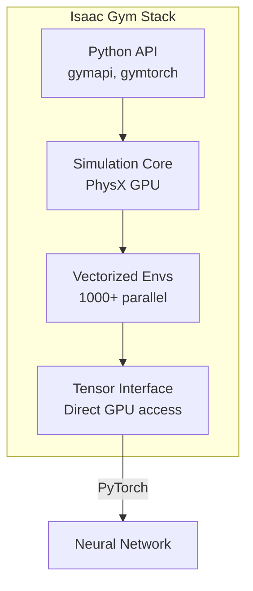

# Chapter 3: Isaac Gym Fundamentals

**Duration**: 4-5 hours
**Difficulty**: Intermediate

---

## Learning Objectives

After completing this chapter, you will be able to:

- Explain Isaac Gym architecture
- Create vectorized environments
- Use tensor-based observation/action API
- Implement parallel environment stepping
- Access GPU tensors directly

---

## 3.1 Isaac Gym Architecture

### Overview

**Isaac Gym** is a high-performance physics simulation platform designed for reinforcement learning:



### Key Features

| Feature | Description | Benefit |
|---------|-------------|---------|
| GPU Physics | PhysX 5 on GPU | 1000x faster than CPU |
| Vectorization | Parallel environments | Massive batch sizes |
| Tensor API | Direct GPU access | Zero copy overhead |
| End-to-End | Sim + NN on same GPU | No CPU-GPU transfer |

### Import Structure

```python
# Core imports
from isaacgym import gymapi
from isaacgym import gymutil
from isaacgym import gymtorch

import torch
import numpy as np
```

---

## 3.2 Creating a Gym Instance

### Basic Setup

```python
from isaacgym import gymapi

# Parse arguments
args = gymutil.parse_arguments(
    description="Basic Isaac Gym Example",
    custom_parameters=[
        {"name": "--num_envs", "type": int, "default": 64},
    ]
)

# Create gym instance
gym = gymapi.acquire_gym()

# Set simulation parameters
sim_params = gymapi.SimParams()
sim_params.dt = 1.0 / 120.0  # 120 Hz physics
sim_params.substeps = 2
sim_params.up_axis = gymapi.UP_AXIS_Z
sim_params.gravity = gymapi.Vec3(0.0, 0.0, -9.81)

# GPU physics settings
sim_params.physx.use_gpu = True
sim_params.physx.solver_type = 1  # TGS solver
sim_params.physx.num_position_iterations = 4
sim_params.physx.num_velocity_iterations = 1
sim_params.physx.contact_offset = 0.02
sim_params.physx.rest_offset = 0.001
sim_params.physx.bounce_threshold_velocity = 0.2

# Create simulation
sim = gym.create_sim(
    args.compute_device_id,  # GPU for compute
    args.graphics_device_id,  # GPU for graphics
    args.physics_engine,
    sim_params
)
```

### Physics Engine Options

```python
# PhysX (GPU-accelerated)
args.physics_engine = gymapi.SIM_PHYSX

# Flex (soft body, cloth)
args.physics_engine = gymapi.SIM_FLEX
```

### Simulation Parameters Reference

| Parameter | Purpose | Typical Value |
|-----------|---------|---------------|
| `dt` | Physics timestep | 1/60 to 1/240 |
| `substeps` | Steps per dt | 1-4 |
| `num_position_iterations` | Solver accuracy | 4-8 |
| `num_velocity_iterations` | Velocity solve | 1-2 |
| `contact_offset` | Collision margin | 0.01-0.02 |

---

## 3.3 Loading Assets

### Asset Options

```python
# Configure asset import
asset_options = gymapi.AssetOptions()
asset_options.fix_base_link = False  # Floating base
asset_options.flip_visual_attachments = False
asset_options.use_mesh_materials = True
asset_options.mesh_normal_mode = gymapi.COMPUTE_PER_VERTEX
asset_options.override_com = True
asset_options.override_inertia = True
asset_options.vhacd_enabled = False  # Convex decomposition
asset_options.default_dof_drive_mode = gymapi.DOF_MODE_EFFORT
asset_options.angular_damping = 0.01
asset_options.linear_damping = 0.01
asset_options.max_angular_velocity = 100.0
asset_options.max_linear_velocity = 100.0
asset_options.armature = 0.01  # Joint regularization

# Load URDF asset
humanoid_asset = gym.load_asset(
    sim,
    "assets/humanoid/",  # Asset root
    "humanoid.urdf",     # Asset file
    asset_options
)
```

### Asset Properties

```python
# Get asset properties
num_bodies = gym.get_asset_rigid_body_count(humanoid_asset)
num_joints = gym.get_asset_joint_count(humanoid_asset)
num_dofs = gym.get_asset_dof_count(humanoid_asset)

print(f"Bodies: {num_bodies}, Joints: {num_joints}, DOFs: {num_dofs}")

# Get DOF properties
dof_props = gym.get_asset_dof_properties(humanoid_asset)
for i, prop in enumerate(dof_props):
    print(f"DOF {i}: lower={prop['lower']:.2f}, upper={prop['upper']:.2f}")
```

### Drive Modes

| Mode | Description | Use Case |
|------|-------------|----------|
| `DOF_MODE_NONE` | No actuation | Passive joints |
| `DOF_MODE_POS` | Position control | Servo control |
| `DOF_MODE_VEL` | Velocity control | Speed control |
| `DOF_MODE_EFFORT` | Torque control | RL training |

---

## 3.4 Creating Environments

### Environment Grid

```python
# Environment spacing
num_envs = 1024
envs_per_row = 32
env_spacing = 2.0

# Calculate grid
env_lower = gymapi.Vec3(-env_spacing, -env_spacing, 0.0)
env_upper = gymapi.Vec3(env_spacing, env_spacing, env_spacing)

# Create environments
envs = []
actors = []

for i in range(num_envs):
    # Create environment
    env = gym.create_env(sim, env_lower, env_upper, envs_per_row)
    envs.append(env)

    # Calculate position in grid
    col = i % envs_per_row
    row = i // envs_per_row

    # Spawn position (above ground)
    pose = gymapi.Transform()
    pose.p = gymapi.Vec3(0.0, 0.0, 1.0)  # Start 1m above ground
    pose.r = gymapi.Quat(0.0, 0.0, 0.0, 1.0)  # Identity rotation

    # Create actor
    actor = gym.create_actor(
        env,
        humanoid_asset,
        pose,
        f"humanoid_{i}",
        i,  # Collision group
        1   # Collision filter
    )
    actors.append(actor)
```

### Ground Plane

```python
# Add ground plane
plane_params = gymapi.PlaneParams()
plane_params.normal = gymapi.Vec3(0.0, 0.0, 1.0)  # Z-up
plane_params.distance = 0.0
plane_params.static_friction = 1.0
plane_params.dynamic_friction = 1.0
plane_params.restitution = 0.0

gym.add_ground(sim, plane_params)
```

### Environment Layout

```
┌───────────────────────────────────────────────────┐
│  env_0   env_1   env_2   env_3   ...  env_31      │
│    🤖      🤖      🤖      🤖          🤖         │
│  env_32  env_33  env_34  env_35  ...  env_63      │
│    🤖      🤖      🤖      🤖          🤖         │
│   ...    ...    ...    ...    ...    ...          │
│  env_992 env_993 env_994 env_995 ... env_1023     │
│    🤖      🤖      🤖      🤖          🤖         │
└───────────────────────────────────────────────────┘
```

---

## 3.5 DOF Configuration

### Setting DOF Properties

```python
# Get DOF properties for actor
props = gym.get_actor_dof_properties(envs[0], actors[0])

# Configure for torque control
for i in range(len(props)):
    props['driveMode'][i] = gymapi.DOF_MODE_EFFORT
    props['stiffness'][i] = 0.0   # No position gain
    props['damping'][i] = 0.5     # Light damping
    props['friction'][i] = 0.01   # Joint friction
    props['armature'][i] = 0.01   # Regularization

# Apply to all environments
for env, actor in zip(envs, actors):
    gym.set_actor_dof_properties(env, actor, props)
```

### Joint Limits

```python
# Set joint position limits
dof_props = gym.get_asset_dof_properties(humanoid_asset)

# Humanoid joint limits (radians)
joint_limits = {
    'hip_pitch': (-1.57, 1.57),
    'hip_roll': (-0.52, 0.52),
    'hip_yaw': (-0.52, 0.52),
    'knee': (-2.09, 0.0),
    'ankle_pitch': (-0.52, 0.52),
    'ankle_roll': (-0.26, 0.26),
    'shoulder': (-1.57, 1.57),
    'elbow': (-2.09, 0.0),
}

# Apply limits
for i, name in enumerate(dof_names):
    if name in joint_limits:
        lower, upper = joint_limits[name]
        dof_props['lower'][i] = lower
        dof_props['upper'][i] = upper
        dof_props['effort'][i] = 100.0  # Max torque
```

---

## 3.6 Tensor API

### Acquiring Tensors

Isaac Gym provides direct GPU tensor access:

```python
import torch
from isaacgym import gymtorch

# Prepare tensors (must call before accessing)
gym.prepare_sim(sim)

# Acquire GPU tensors
_root_states = gym.acquire_actor_root_state_tensor(sim)
_dof_states = gym.acquire_dof_state_tensor(sim)
_rigid_body_states = gym.acquire_rigid_body_state_tensor(sim)
_contact_forces = gym.acquire_net_contact_force_tensor(sim)

# Wrap as PyTorch tensors
root_states = gymtorch.wrap_tensor(_root_states)
dof_states = gymtorch.wrap_tensor(_dof_states)
rigid_body_states = gymtorch.wrap_tensor(_rigid_body_states)
contact_forces = gymtorch.wrap_tensor(_contact_forces)

# Reshape for convenience
# root_states: (num_envs, 13) - pos(3), rot(4), lin_vel(3), ang_vel(3)
# dof_states: (num_envs * num_dofs, 2) - pos, vel
```

### Tensor Shapes

| Tensor | Shape | Contents |
|--------|-------|----------|
| `root_states` | (N, 13) | pos(3), quat(4), lin_vel(3), ang_vel(3) |
| `dof_states` | (N×D, 2) | position, velocity |
| `rigid_body_states` | (N×B, 13) | Same as root per body |
| `contact_forces` | (N×B, 3) | Force xyz per body |

### Refreshing Tensors

```python
# Refresh tensors after simulation step
gym.refresh_actor_root_state_tensor(sim)
gym.refresh_dof_state_tensor(sim)
gym.refresh_rigid_body_state_tensor(sim)
gym.refresh_net_contact_force_tensor(sim)
```

---

## 3.7 Observations and Actions

### Building Observations

```python
class HumanoidObservation:
    """Compute observation vector for humanoid."""

    def __init__(self, num_envs, num_dofs, device):
        self.num_envs = num_envs
        self.num_dofs = num_dofs
        self.device = device

        # Observation dimension
        # 3 (base lin vel) + 3 (base ang vel) +
        # 3 (gravity) + num_dofs (pos) + num_dofs (vel) +
        # 3 (commands)
        self.obs_dim = 3 + 3 + 3 + num_dofs + num_dofs + 3

    def compute(self, root_states, dof_pos, dof_vel, commands):
        """Compute observation tensor."""

        # Base state (in local frame)
        base_pos = root_states[:, 0:3]
        base_quat = root_states[:, 3:7]
        base_lin_vel = root_states[:, 7:10]
        base_ang_vel = root_states[:, 10:13]

        # Transform velocities to base frame
        base_lin_vel_local = quat_rotate_inverse(base_quat, base_lin_vel)
        base_ang_vel_local = quat_rotate_inverse(base_quat, base_ang_vel)

        # Gravity vector in base frame
        gravity_vec = torch.tensor([0., 0., -1.], device=self.device)
        gravity_local = quat_rotate_inverse(base_quat, gravity_vec.expand(self.num_envs, -1))

        # Normalize DOF positions
        dof_pos_normalized = (dof_pos - self.dof_pos_default) * self.dof_pos_scale

        # Concatenate observation
        obs = torch.cat([
            base_lin_vel_local * 2.0,    # Scale factor
            base_ang_vel_local * 0.25,
            gravity_local,
            dof_pos_normalized,
            dof_vel * 0.05,
            commands * self.command_scale,
        ], dim=-1)

        return obs
```

### Quaternion Utilities

```python
@torch.jit.script
def quat_rotate_inverse(q, v):
    """Rotate vector by inverse quaternion."""
    q_w = q[:, 3:4]
    q_vec = q[:, 0:3]
    a = v * (2.0 * q_w ** 2 - 1.0)
    b = torch.cross(q_vec, v, dim=-1) * q_w * 2.0
    c = q_vec * torch.sum(q_vec * v, dim=-1, keepdim=True) * 2.0
    return a - b + c

@torch.jit.script
def quat_from_euler_xyz(roll, pitch, yaw):
    """Create quaternion from Euler angles."""
    cy = torch.cos(yaw * 0.5)
    sy = torch.sin(yaw * 0.5)
    cp = torch.cos(pitch * 0.5)
    sp = torch.sin(pitch * 0.5)
    cr = torch.cos(roll * 0.5)
    sr = torch.sin(roll * 0.5)

    qw = cr * cp * cy + sr * sp * sy
    qx = sr * cp * cy - cr * sp * sy
    qy = cr * sp * cy + sr * cp * sy
    qz = cr * cp * sy - sr * sp * cy

    return torch.stack([qx, qy, qz, qw], dim=-1)
```

### Applying Actions

```python
def apply_actions(self, actions):
    """Apply torque actions to robots."""

    # Scale actions to torque range
    # actions: (num_envs, num_dofs) in [-1, 1]
    torques = actions * self.max_torque  # e.g., 100 Nm

    # Clip to limits
    torques = torch.clamp(torques, -self.torque_limit, self.torque_limit)

    # Apply to simulation
    gym.set_dof_actuation_force_tensor(
        sim,
        gymtorch.unwrap_tensor(torques)
    )
```

---

## 3.8 Simulation Loop

### Basic Loop Structure

```python
def simulation_loop():
    """Main simulation and training loop."""

    # Create viewer for visualization (optional)
    viewer = gym.create_viewer(sim, gymapi.CameraProperties())

    frame = 0
    while not gym.query_viewer_has_closed(viewer):
        # Step 1: Get observations
        gym.refresh_actor_root_state_tensor(sim)
        gym.refresh_dof_state_tensor(sim)

        obs = compute_observations()

        # Step 2: Policy inference
        with torch.no_grad():
            actions = policy(obs)

        # Step 3: Apply actions
        apply_actions(actions)

        # Step 4: Step simulation
        gym.simulate(sim)
        gym.fetch_results(sim, True)

        # Step 5: Update graphics (if viewer)
        if viewer is not None:
            gym.step_graphics(sim)
            gym.draw_viewer(viewer, sim, True)
            gym.sync_frame_time(sim)

        frame += 1

    # Cleanup
    gym.destroy_viewer(viewer)
    gym.destroy_sim(sim)
```

### Headless Mode

```python
# For training (no visualization)
def headless_loop(max_steps):
    """Training loop without rendering."""

    for step in range(max_steps):
        # Refresh state tensors
        gym.refresh_actor_root_state_tensor(sim)
        gym.refresh_dof_state_tensor(sim)

        # Compute observations and actions
        obs = compute_observations()
        actions = policy(obs)

        # Apply and step
        apply_actions(actions)
        gym.simulate(sim)
        gym.fetch_results(sim, True)

        # Check resets
        check_termination()
        reset_envs()
```

---

## 3.9 Environment Reset

### Reset Logic

```python
def check_termination(self):
    """Check which environments need reset."""

    # Get base height
    base_height = self.root_states[:, 2]

    # Termination conditions
    fallen = base_height < 0.3  # Below threshold
    timeout = self.episode_length >= self.max_episode_length

    # Combine conditions
    self.reset_buf = fallen | timeout

    return self.reset_buf

def reset_envs(self):
    """Reset environments that terminated."""

    reset_ids = self.reset_buf.nonzero(as_tuple=False).squeeze(-1)

    if len(reset_ids) > 0:
        # Reset root states
        self.root_states[reset_ids, 0:3] = self.initial_root_pos
        self.root_states[reset_ids, 3:7] = self.initial_root_quat
        self.root_states[reset_ids, 7:13] = 0.0  # Zero velocities

        # Reset DOF states
        dof_indices = self.get_dof_indices(reset_ids)
        self.dof_pos[dof_indices] = self.default_dof_pos
        self.dof_vel[dof_indices] = 0.0

        # Apply reset
        gym.set_actor_root_state_tensor_indexed(
            sim,
            gymtorch.unwrap_tensor(self.root_states),
            gymtorch.unwrap_tensor(reset_ids.to(torch.int32)),
            len(reset_ids)
        )

        gym.set_dof_state_tensor_indexed(
            sim,
            gymtorch.unwrap_tensor(self.dof_states),
            gymtorch.unwrap_tensor(reset_ids.to(torch.int32)),
            len(reset_ids)
        )

        # Reset episode length
        self.episode_length[reset_ids] = 0
```

### Indexed vs Full Reset

```python
# Full tensor reset (all environments)
gym.set_actor_root_state_tensor(sim, gymtorch.unwrap_tensor(root_states))

# Indexed reset (specific environments only) - more efficient
gym.set_actor_root_state_tensor_indexed(
    sim,
    gymtorch.unwrap_tensor(root_states),
    gymtorch.unwrap_tensor(env_ids),
    len(env_ids)
)
```

---

## 3.10 Complete Example

### humanoid_gym_basic.py

```python
#!/usr/bin/env python3
"""Basic humanoid environment with Isaac Gym."""

from isaacgym import gymapi, gymutil, gymtorch
import torch
import numpy as np


class HumanoidEnv:
    """Vectorized humanoid environment."""

    def __init__(self, num_envs=1024, device="cuda:0"):
        self.num_envs = num_envs
        self.device = device

        # Create gym
        self.gym = gymapi.acquire_gym()

        # Configure simulation
        self.sim_params = self._create_sim_params()
        self.sim = self.gym.create_sim(0, 0, gymapi.SIM_PHYSX, self.sim_params)

        # Load assets
        self.humanoid_asset = self._load_humanoid()
        self.num_dofs = self.gym.get_asset_dof_count(self.humanoid_asset)

        # Create environments
        self._create_envs()

        # Prepare tensors
        self.gym.prepare_sim(self.sim)
        self._init_tensors()

        # Observation and action dimensions
        self.obs_dim = 3 + 3 + 3 + self.num_dofs * 2 + 3
        self.action_dim = self.num_dofs

        # Episode tracking
        self.episode_length = torch.zeros(num_envs, device=device)
        self.max_episode_length = 1000

    def _create_sim_params(self):
        """Create simulation parameters."""
        params = gymapi.SimParams()
        params.dt = 1.0 / 120.0
        params.substeps = 2
        params.up_axis = gymapi.UP_AXIS_Z
        params.gravity = gymapi.Vec3(0.0, 0.0, -9.81)

        params.physx.use_gpu = True
        params.physx.solver_type = 1
        params.physx.num_position_iterations = 4
        params.physx.num_velocity_iterations = 1
        params.physx.contact_offset = 0.02
        params.physx.rest_offset = 0.001

        return params

    def _load_humanoid(self):
        """Load humanoid URDF asset."""
        asset_options = gymapi.AssetOptions()
        asset_options.fix_base_link = False
        asset_options.default_dof_drive_mode = gymapi.DOF_MODE_EFFORT
        asset_options.angular_damping = 0.01

        return self.gym.load_asset(
            self.sim, "assets/", "humanoid.urdf", asset_options
        )

    def _create_envs(self):
        """Create parallel environments."""
        # Ground plane
        plane_params = gymapi.PlaneParams()
        plane_params.normal = gymapi.Vec3(0, 0, 1)
        plane_params.static_friction = 1.0
        plane_params.dynamic_friction = 1.0
        self.gym.add_ground(self.sim, plane_params)

        # Environment bounds
        spacing = 2.0
        lower = gymapi.Vec3(-spacing, -spacing, 0)
        upper = gymapi.Vec3(spacing, spacing, spacing)

        self.envs = []
        self.actors = []

        for i in range(self.num_envs):
            env = self.gym.create_env(self.sim, lower, upper, int(np.sqrt(self.num_envs)))

            pose = gymapi.Transform()
            pose.p = gymapi.Vec3(0, 0, 1.0)
            pose.r = gymapi.Quat(0, 0, 0, 1)

            actor = self.gym.create_actor(env, self.humanoid_asset, pose, f"humanoid_{i}", i, 1)

            # Configure DOFs for torque control
            props = self.gym.get_actor_dof_properties(env, actor)
            props['driveMode'].fill(gymapi.DOF_MODE_EFFORT)
            props['stiffness'].fill(0.0)
            props['damping'].fill(0.5)
            self.gym.set_actor_dof_properties(env, actor, props)

            self.envs.append(env)
            self.actors.append(actor)

    def _init_tensors(self):
        """Initialize GPU tensors."""
        _root = self.gym.acquire_actor_root_state_tensor(self.sim)
        _dof = self.gym.acquire_dof_state_tensor(self.sim)
        _contact = self.gym.acquire_net_contact_force_tensor(self.sim)

        self.root_states = gymtorch.wrap_tensor(_root)
        self.dof_states = gymtorch.wrap_tensor(_dof).view(self.num_envs, self.num_dofs, 2)
        self.contact_forces = gymtorch.wrap_tensor(_contact)

        self.dof_pos = self.dof_states[:, :, 0]
        self.dof_vel = self.dof_states[:, :, 1]

        # Store initial state for reset
        self.initial_root_states = self.root_states.clone()
        self.initial_dof_states = self.dof_states.clone()

        # Commands (vx, vy, yaw_rate)
        self.commands = torch.zeros(self.num_envs, 3, device=self.device)

        # Action buffer
        self.actions = torch.zeros(self.num_envs, self.num_dofs, device=self.device)

        # Reset buffer
        self.reset_buf = torch.zeros(self.num_envs, dtype=torch.bool, device=self.device)

    def get_observations(self):
        """Compute observation tensor."""
        self.gym.refresh_actor_root_state_tensor(self.sim)
        self.gym.refresh_dof_state_tensor(self.sim)

        # Base velocities
        base_lin_vel = self.root_states[:, 7:10]
        base_ang_vel = self.root_states[:, 10:13]

        # Gravity projection
        base_quat = self.root_states[:, 3:7]
        gravity = torch.tensor([0., 0., -1.], device=self.device).expand(self.num_envs, -1)
        gravity_proj = quat_rotate_inverse(base_quat, gravity)

        obs = torch.cat([
            base_lin_vel,
            base_ang_vel,
            gravity_proj,
            self.dof_pos,
            self.dof_vel,
            self.commands,
        ], dim=-1)

        return obs

    def step(self, actions):
        """Execute environment step."""
        # Scale actions
        self.actions = actions.clone()
        torques = self.actions * 100.0  # Max torque

        # Apply torques
        self.gym.set_dof_actuation_force_tensor(
            self.sim, gymtorch.unwrap_tensor(torques.flatten())
        )

        # Step simulation
        self.gym.simulate(self.sim)
        self.gym.fetch_results(self.sim, True)

        # Update episode length
        self.episode_length += 1

        # Get new observations
        obs = self.get_observations()

        # Compute rewards
        rewards = self._compute_rewards()

        # Check termination
        dones = self._check_termination()

        # Reset terminated environments
        self._reset_envs(dones.nonzero(as_tuple=False).squeeze(-1))

        return obs, rewards, dones, {}

    def _compute_rewards(self):
        """Compute reward for all environments."""
        # Forward velocity reward
        forward_vel = self.root_states[:, 7]  # vx
        vel_reward = forward_vel * 2.0

        # Alive reward
        alive_reward = torch.ones(self.num_envs, device=self.device)

        # Energy penalty
        energy_penalty = torch.sum(self.actions ** 2, dim=-1) * 0.0005

        reward = vel_reward + alive_reward - energy_penalty
        return reward

    def _check_termination(self):
        """Check termination conditions."""
        base_height = self.root_states[:, 2]

        fallen = base_height < 0.3
        timeout = self.episode_length >= self.max_episode_length

        return fallen | timeout

    def _reset_envs(self, env_ids):
        """Reset specified environments."""
        if len(env_ids) == 0:
            return

        # Reset root states
        self.root_states[env_ids] = self.initial_root_states[env_ids]

        # Reset DOF states
        self.dof_states[env_ids] = self.initial_dof_states[env_ids]

        # Apply resets
        self.gym.set_actor_root_state_tensor_indexed(
            self.sim,
            gymtorch.unwrap_tensor(self.root_states),
            gymtorch.unwrap_tensor(env_ids.to(torch.int32)),
            len(env_ids)
        )

        self.gym.set_dof_state_tensor_indexed(
            self.sim,
            gymtorch.unwrap_tensor(self.dof_states.view(-1, 2)),
            gymtorch.unwrap_tensor(env_ids.to(torch.int32)),
            len(env_ids)
        )

        # Reset episode length
        self.episode_length[env_ids] = 0

        # Randomize commands
        self.commands[env_ids, 0] = torch.rand(len(env_ids), device=self.device) * 2.0 - 0.5
        self.commands[env_ids, 1] = torch.rand(len(env_ids), device=self.device) * 0.6 - 0.3
        self.commands[env_ids, 2] = torch.rand(len(env_ids), device=self.device) * 0.5 - 0.25

    def reset(self):
        """Reset all environments."""
        all_ids = torch.arange(self.num_envs, device=self.device)
        self._reset_envs(all_ids)
        return self.get_observations()


@torch.jit.script
def quat_rotate_inverse(q, v):
    """Rotate vector by inverse of quaternion."""
    q_w = q[:, 3:4]
    q_vec = q[:, 0:3]
    a = v * (2.0 * q_w ** 2 - 1.0)
    b = torch.cross(q_vec, v, dim=-1) * q_w * 2.0
    c = q_vec * torch.sum(q_vec * v, dim=-1, keepdim=True) * 2.0
    return a - b + c


def main():
    """Test the environment."""
    env = HumanoidEnv(num_envs=64)

    obs = env.reset()
    print(f"Observation shape: {obs.shape}")
    print(f"Action dimension: {env.action_dim}")

    # Run a few steps with random actions
    for i in range(100):
        actions = torch.randn(env.num_envs, env.action_dim, device=env.device) * 0.5
        obs, rewards, dones, info = env.step(actions)

        if i % 10 == 0:
            print(f"Step {i}: mean_reward={rewards.mean():.3f}, resets={dones.sum()}")


if __name__ == "__main__":
    main()
```

---

## Hands-On Exercises

### Exercise 3.1: Create Basic Environment

1. Set up Isaac Gym with PhysX
2. Load humanoid URDF
3. Create 64 parallel environments
4. Verify tensor shapes

### Exercise 3.2: Implement Observations

1. Compute base velocities in local frame
2. Add DOF positions and velocities
3. Include gravity projection
4. Test observation scaling

### Exercise 3.3: Simulation Loop

1. Implement step function
2. Add reset logic
3. Apply random actions
4. Verify physics behavior

---

## Summary

In this chapter, you learned:

- Isaac Gym architecture and tensor API
- How to create vectorized environments
- Observation and action space design
- GPU tensor access for zero-copy data
- Simulation stepping and reset logic

## Next Chapter

In [Chapter 4](ch04-humanoid-environment.md), you will create a complete humanoid training environment.

---

## Quick Reference

```python
# Create gym
gym = gymapi.acquire_gym()
sim = gym.create_sim(0, 0, gymapi.SIM_PHYSX, sim_params)

# Load asset
asset = gym.load_asset(sim, path, file, options)

# Create environment
env = gym.create_env(sim, lower, upper, num_per_row)
actor = gym.create_actor(env, asset, pose, name, group, filter)

# Acquire tensors
gym.prepare_sim(sim)
root_tensor = gymtorch.wrap_tensor(gym.acquire_actor_root_state_tensor(sim))
dof_tensor = gymtorch.wrap_tensor(gym.acquire_dof_state_tensor(sim))

# Simulation step
gym.simulate(sim)
gym.fetch_results(sim, True)
gym.refresh_actor_root_state_tensor(sim)
```

| API Function | Purpose |
|--------------|---------|
| `acquire_gym()` | Get gym instance |
| `create_sim()` | Create simulation |
| `load_asset()` | Load URDF/USD |
| `create_env()` | Create environment |
| `create_actor()` | Spawn actor |
| `prepare_sim()` | Initialize tensors |
| `simulate()` | Step physics |
| `refresh_*_tensor()` | Update tensors |
