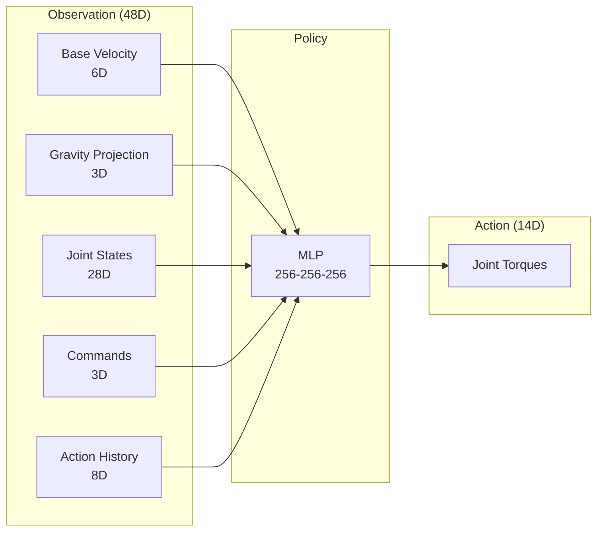

# Chapter 4: Humanoid Training Environment

**Duration**: 5-6 hours
**Difficulty**: Intermediate-Advanced

---

## Learning Objectives

After completing this chapter, you will be able to:

- Design observation space for humanoid locomotion
- Configure action space for torque control
- Implement humanoid task class
- Integrate with IsaacGymEnvs framework
- Run parallel training environments

---

## 4.1 Environment Design Overview

### Humanoid Locomotion Task

The goal is to train a policy that controls a humanoid to walk:



### Design Principles

| Principle | Implementation |
|-----------|----------------|
| Markov Property | Include velocities and history |
| Scale Invariance | Normalize observations |
| Action Smoothness | Include previous actions |
| Command Following | Velocity commands as input |

---

## 4.2 Observation Space Design

### Observation Components

```python
class HumanoidObservation:
    """
    Observation space for humanoid locomotion.

    Total dimension: 48
    - Base linear velocity (local frame): 3
    - Base angular velocity (local frame): 3
    - Gravity projection: 3
    - Joint positions: 14
    - Joint velocities: 14
    - Commands (vx, vy, yaw_rate): 3
    - Previous actions: 14 (optional, adds to total)
    """

    def __init__(self, cfg, num_envs, device):
        self.cfg = cfg
        self.num_envs = num_envs
        self.device = device

        # Scaling factors
        self.lin_vel_scale = cfg.obs_scales.lin_vel
        self.ang_vel_scale = cfg.obs_scales.ang_vel
        self.dof_pos_scale = cfg.obs_scales.dof_pos
        self.dof_vel_scale = cfg.obs_scales.dof_vel

        # Default DOF positions (standing pose)
        self.default_dof_pos = torch.tensor(
            cfg.init_state.default_joint_angles,
            device=device
        )

    def compute(self, root_states, dof_pos, dof_vel, commands, last_actions):
        """
        Compute observation vector.

        Args:
            root_states: (N, 13) - pos, quat, lin_vel, ang_vel
            dof_pos: (N, num_dof) - joint positions
            dof_vel: (N, num_dof) - joint velocities
            commands: (N, 3) - velocity commands
            last_actions: (N, num_dof) - previous actions

        Returns:
            obs: (N, obs_dim) - observation tensor
        """
        base_quat = root_states[:, 3:7]

        # Transform velocities to base frame
        base_lin_vel = quat_rotate_inverse(
            base_quat, root_states[:, 7:10]
        ) * self.lin_vel_scale

        base_ang_vel = quat_rotate_inverse(
            base_quat, root_states[:, 10:13]
        ) * self.ang_vel_scale

        # Gravity vector in base frame
        gravity = torch.tensor([0., 0., -1.], device=self.device)
        projected_gravity = quat_rotate_inverse(
            base_quat, gravity.expand(self.num_envs, -1)
        )

        # Normalize DOF positions around default
        dof_pos_scaled = (dof_pos - self.default_dof_pos) * self.dof_pos_scale
        dof_vel_scaled = dof_vel * self.dof_vel_scale

        # Concatenate observation
        obs = torch.cat([
            base_lin_vel,         # 3
            base_ang_vel,         # 3
            projected_gravity,    # 3
            dof_pos_scaled,       # 14
            dof_vel_scaled,       # 14
            commands,             # 3
            last_actions,         # 14 (optional)
        ], dim=-1)

        # Clip to prevent extreme values
        obs = torch.clip(obs, -self.cfg.clip_obs, self.cfg.clip_obs)

        return obs
```

### Observation Scaling

```python
class ObservationScales:
    """Observation scaling factors."""
    lin_vel = 2.0       # m/s -> normalized
    ang_vel = 0.25      # rad/s -> normalized
    dof_pos = 1.0       # Already in radians
    dof_vel = 0.05      # rad/s -> normalized
    height = 5.0        # m -> normalized
```

### Why Each Component Matters

| Component | Purpose | Without It |
|-----------|---------|------------|
| Base lin vel | Know movement direction | Can't track velocity |
| Base ang vel | Detect rotation | Falls when turning |
| Gravity proj | Know orientation | Can't stay upright |
| DOF positions | Know joint configuration | Random poses |
| DOF velocities | Predict dynamics | Jerky motion |
| Commands | Know target velocity | Wanders aimlessly |
| Last actions | Smooth transitions | Jittery control |

---

## 4.3 Action Space Design

### Torque Control

```python
class HumanoidAction:
    """
    Action space for humanoid torque control.

    Dimension: 14 (one per actuated DOF)
    Range: [-1, 1] scaled to torque limits
    """

    def __init__(self, cfg, num_envs, num_dofs, device):
        self.cfg = cfg
        self.num_envs = num_envs
        self.num_dofs = num_dofs
        self.device = device

        # Torque limits per joint (Nm)
        self.torque_limits = torch.tensor(
            cfg.control.torque_limits,
            device=device
        )

        # Action scaling
        self.action_scale = cfg.control.action_scale

    def process(self, actions):
        """
        Process raw actions to torques.

        Args:
            actions: (N, num_dofs) in [-1, 1]

        Returns:
            torques: (N, num_dofs) in Nm
        """
        # Scale by action scale factor
        scaled_actions = actions * self.action_scale

        # Apply joint-specific torque limits
        torques = scaled_actions * self.torque_limits

        # Clip to absolute limits
        torques = torch.clamp(
            torques,
            -self.torque_limits,
            self.torque_limits
        )

        return torques
```

### Joint Mapping

```python
# Humanoid DOF mapping (14 DOF)
DOF_NAMES = [
    # Left leg (5 DOF)
    "left_hip_pitch",
    "left_hip_roll",
    "left_hip_yaw",
    "left_knee",
    "left_ankle",

    # Right leg (5 DOF)
    "right_hip_pitch",
    "right_hip_roll",
    "right_hip_yaw",
    "right_knee",
    "right_ankle",

    # Left arm (2 DOF)
    "left_shoulder",
    "left_elbow",

    # Right arm (2 DOF)
    "right_shoulder",
    "right_elbow",
]

# Torque limits per joint (Nm)
TORQUE_LIMITS = [
    # Legs (higher torque for locomotion)
    100.0, 100.0, 50.0, 100.0, 50.0,  # Left
    100.0, 100.0, 50.0, 100.0, 50.0,  # Right
    # Arms (lower torque)
    50.0, 30.0,  # Left
    50.0, 30.0,  # Right
]
```

### PD Control Alternative

```python
def pd_control(self, actions, dof_pos, dof_vel):
    """
    PD position control (alternative to direct torque).

    Args:
        actions: Target positions in [-1, 1]
        dof_pos: Current positions
        dof_vel: Current velocities

    Returns:
        torques: Computed torques
    """
    # Scale actions to position targets
    pos_targets = self.default_dof_pos + actions * self.pos_scale

    # PD control
    pos_error = pos_targets - dof_pos
    vel_error = -dof_vel

    torques = self.kp * pos_error + self.kd * vel_error

    return torch.clamp(torques, -self.torque_limits, self.torque_limits)
```

---

## 4.4 Task Configuration

### Configuration Structure

```python
from dataclasses import dataclass, field
from typing import List, Tuple

@dataclass
class HumanoidCfg:
    """Complete configuration for humanoid training."""

    @dataclass
    class Env:
        num_envs: int = 4096
        episode_length_s: float = 20.0
        env_spacing: float = 2.5

    @dataclass
    class Terrain:
        mesh_type: str = "plane"  # plane, trimesh
        friction: float = 1.0
        restitution: float = 0.0

    @dataclass
    class InitState:
        pos: Tuple[float, float, float] = (0.0, 0.0, 1.0)
        rot: Tuple[float, float, float, float] = (0.0, 0.0, 0.0, 1.0)
        default_joint_angles: List[float] = field(default_factory=lambda: [
            0.0, 0.0, 0.0, 0.3, 0.0,   # Left leg
            0.0, 0.0, 0.0, 0.3, 0.0,   # Right leg
            0.0, 0.0,                   # Left arm
            0.0, 0.0,                   # Right arm
        ])

    @dataclass
    class Control:
        control_type: str = "torque"  # torque, pd
        action_scale: float = 0.5
        torque_limits: List[float] = field(default_factory=lambda: [
            100.0, 100.0, 50.0, 100.0, 50.0,
            100.0, 100.0, 50.0, 100.0, 50.0,
            50.0, 30.0, 50.0, 30.0,
        ])

    @dataclass
    class ObsScales:
        lin_vel: float = 2.0
        ang_vel: float = 0.25
        dof_pos: float = 1.0
        dof_vel: float = 0.05

    @dataclass
    class Commands:
        num_commands: int = 3
        lin_vel_x: Tuple[float, float] = (-1.0, 2.0)
        lin_vel_y: Tuple[float, float] = (-0.5, 0.5)
        ang_vel_yaw: Tuple[float, float] = (-1.0, 1.0)

    @dataclass
    class Rewards:
        # Weights
        forward_vel: float = 2.0
        lateral_vel: float = 0.5
        angular_vel: float = 0.5
        alive: float = 1.0
        energy: float = -0.0005
        orientation: float = -0.5
        joint_acc: float = -0.0001

    @dataclass
    class Normalization:
        clip_obs: float = 100.0
        clip_actions: float = 1.0

    # Instantiate nested configs
    env: Env = field(default_factory=Env)
    terrain: Terrain = field(default_factory=Terrain)
    init_state: InitState = field(default_factory=InitState)
    control: Control = field(default_factory=Control)
    obs_scales: ObsScales = field(default_factory=ObsScales)
    commands: Commands = field(default_factory=Commands)
    rewards: Rewards = field(default_factory=Rewards)
    normalization: Normalization = field(default_factory=Normalization)
```

### YAML Configuration

```yaml
# humanoid_config.yaml
env:
  num_envs: 4096
  episode_length_s: 20.0
  env_spacing: 2.5

terrain:
  mesh_type: "plane"
  friction: 1.0
  restitution: 0.0

init_state:
  pos: [0.0, 0.0, 1.0]
  rot: [0.0, 0.0, 0.0, 1.0]
  default_joint_angles:
    - 0.0   # left_hip_pitch
    - 0.0   # left_hip_roll
    - 0.0   # left_hip_yaw
    - 0.3   # left_knee
    - 0.0   # left_ankle
    - 0.0   # right_hip_pitch
    - 0.0   # right_hip_roll
    - 0.0   # right_hip_yaw
    - 0.3   # right_knee
    - 0.0   # right_ankle
    - 0.0   # left_shoulder
    - 0.0   # left_elbow
    - 0.0   # right_shoulder
    - 0.0   # right_elbow

control:
  control_type: "torque"
  action_scale: 0.5
  torque_limits: [100, 100, 50, 100, 50, 100, 100, 50, 100, 50, 50, 30, 50, 30]

obs_scales:
  lin_vel: 2.0
  ang_vel: 0.25
  dof_pos: 1.0
  dof_vel: 0.05

commands:
  num_commands: 3
  lin_vel_x: [-1.0, 2.0]
  lin_vel_y: [-0.5, 0.5]
  ang_vel_yaw: [-1.0, 1.0]

rewards:
  forward_vel: 2.0
  lateral_vel: 0.5
  angular_vel: 0.5
  alive: 1.0
  energy: -0.0005
  orientation: -0.5
  joint_acc: -0.0001

normalization:
  clip_obs: 100.0
  clip_actions: 1.0
```

---

## 4.5 Complete Task Implementation

### HumanoidTask Class

```python
"""humanoid_task.py - Complete humanoid training environment."""

from isaacgym import gymapi, gymtorch
import torch
import numpy as np
from typing import Dict, Tuple


class HumanoidTask:
    """
    Vectorized humanoid locomotion environment.

    Observation: 48D (or 62D with action history)
    Action: 14D torques
    """

    def __init__(self, cfg, sim_device, graphics_device, headless=True):
        self.cfg = cfg
        self.device = sim_device
        self.headless = headless

        self.num_envs = cfg.env.num_envs
        self.num_obs = 48  # Base observation
        self.num_actions = 14  # DOF count

        # Initialize gym
        self.gym = gymapi.acquire_gym()

        # Create sim
        self.sim = self._create_sim()

        # Create environments
        self._create_envs()

        # Prepare tensors
        self.gym.prepare_sim(self.sim)
        self._init_buffers()

        # Viewer
        self.viewer = None
        if not headless:
            self._create_viewer()

    def _create_sim(self):
        """Create Isaac Gym simulation."""
        sim_params = gymapi.SimParams()
        sim_params.dt = 1.0 / 120.0
        sim_params.substeps = 2
        sim_params.up_axis = gymapi.UP_AXIS_Z
        sim_params.gravity = gymapi.Vec3(0.0, 0.0, -9.81)

        # PhysX GPU settings
        sim_params.physx.use_gpu = True
        sim_params.physx.solver_type = 1
        sim_params.physx.num_position_iterations = 4
        sim_params.physx.num_velocity_iterations = 1
        sim_params.physx.contact_offset = 0.02
        sim_params.physx.rest_offset = 0.001
        sim_params.physx.bounce_threshold_velocity = 0.2
        sim_params.physx.max_depenetration_velocity = 100.0
        sim_params.physx.default_buffer_size_multiplier = 5.0

        return self.gym.create_sim(
            0, 0, gymapi.SIM_PHYSX, sim_params
        )

    def _create_envs(self):
        """Create parallel environments with humanoid actors."""
        # Ground plane
        plane_params = gymapi.PlaneParams()
        plane_params.normal = gymapi.Vec3(0, 0, 1)
        plane_params.static_friction = self.cfg.terrain.friction
        plane_params.dynamic_friction = self.cfg.terrain.friction
        plane_params.restitution = self.cfg.terrain.restitution
        self.gym.add_ground(self.sim, plane_params)

        # Load humanoid asset
        asset_options = gymapi.AssetOptions()
        asset_options.fix_base_link = False
        asset_options.default_dof_drive_mode = gymapi.DOF_MODE_EFFORT
        asset_options.angular_damping = 0.01
        asset_options.linear_damping = 0.01
        asset_options.max_angular_velocity = 100.0
        asset_options.max_linear_velocity = 100.0
        asset_options.armature = 0.01

        self.humanoid_asset = self.gym.load_asset(
            self.sim, "assets/", "humanoid.urdf", asset_options
        )

        self.num_dof = self.gym.get_asset_dof_count(self.humanoid_asset)
        self.num_bodies = self.gym.get_asset_rigid_body_count(self.humanoid_asset)

        # Get body indices for contacts
        body_names = self.gym.get_asset_rigid_body_names(self.humanoid_asset)
        self.foot_indices = [
            body_names.index("left_foot"),
            body_names.index("right_foot"),
        ]

        # Environment bounds
        spacing = self.cfg.env.env_spacing
        lower = gymapi.Vec3(-spacing, -spacing, 0)
        upper = gymapi.Vec3(spacing, spacing, spacing)

        # Create environments
        self.envs = []
        self.actors = []
        envs_per_row = int(np.sqrt(self.num_envs))

        for i in range(self.num_envs):
            env = self.gym.create_env(self.sim, lower, upper, envs_per_row)

            # Initial pose
            pose = gymapi.Transform()
            pose.p = gymapi.Vec3(*self.cfg.init_state.pos)
            pose.r = gymapi.Quat(*self.cfg.init_state.rot)

            actor = self.gym.create_actor(
                env, self.humanoid_asset, pose,
                f"humanoid_{i}", i, 1
            )

            # Configure DOF properties
            dof_props = self.gym.get_actor_dof_properties(env, actor)
            dof_props['driveMode'].fill(gymapi.DOF_MODE_EFFORT)
            dof_props['stiffness'].fill(0.0)
            dof_props['damping'].fill(0.5)
            self.gym.set_actor_dof_properties(env, actor, dof_props)

            self.envs.append(env)
            self.actors.append(actor)

    def _init_buffers(self):
        """Initialize tensor buffers."""
        # Acquire state tensors
        _root = self.gym.acquire_actor_root_state_tensor(self.sim)
        _dof = self.gym.acquire_dof_state_tensor(self.sim)
        _contact = self.gym.acquire_net_contact_force_tensor(self.sim)

        # Wrap as PyTorch tensors
        self.root_states = gymtorch.wrap_tensor(_root)
        self.dof_states = gymtorch.wrap_tensor(_dof).view(
            self.num_envs, self.num_dof, 2
        )
        self.contact_forces = gymtorch.wrap_tensor(_contact).view(
            self.num_envs, self.num_bodies, 3
        )

        # Separate position and velocity views
        self.dof_pos = self.dof_states[:, :, 0]
        self.dof_vel = self.dof_states[:, :, 1]

        # Base state
        self.base_pos = self.root_states[:, 0:3]
        self.base_quat = self.root_states[:, 3:7]
        self.base_lin_vel = self.root_states[:, 7:10]
        self.base_ang_vel = self.root_states[:, 10:13]

        # Initial states for reset
        self.initial_root_states = self.root_states.clone()
        self.initial_dof_pos = torch.tensor(
            self.cfg.init_state.default_joint_angles,
            device=self.device
        ).unsqueeze(0).expand(self.num_envs, -1)

        # Commands buffer
        self.commands = torch.zeros(
            self.num_envs, 3, device=self.device
        )

        # Action buffers
        self.actions = torch.zeros(
            self.num_envs, self.num_actions, device=self.device
        )
        self.last_actions = torch.zeros_like(self.actions)

        # Torque limits
        self.torque_limits = torch.tensor(
            self.cfg.control.torque_limits, device=self.device
        )

        # Episode tracking
        self.episode_length = torch.zeros(self.num_envs, device=self.device)
        self.max_episode_length = int(
            self.cfg.env.episode_length_s / (1.0 / 120.0)
        )

        # Reset and done buffers
        self.reset_buf = torch.zeros(
            self.num_envs, dtype=torch.bool, device=self.device
        )
        self.timeout_buf = torch.zeros_like(self.reset_buf)

        # Reward buffer
        self.rew_buf = torch.zeros(self.num_envs, device=self.device)

        # Observation buffer
        self.obs_buf = torch.zeros(
            self.num_envs, self.num_obs, device=self.device
        )

    def reset(self) -> torch.Tensor:
        """Reset all environments."""
        all_ids = torch.arange(self.num_envs, device=self.device)
        self._reset_envs(all_ids)
        return self.obs_buf

    def _reset_envs(self, env_ids: torch.Tensor):
        """Reset specified environments."""
        if len(env_ids) == 0:
            return

        # Reset root states
        self.root_states[env_ids] = self.initial_root_states[env_ids]

        # Add random position offset
        self.root_states[env_ids, 0:2] += torch.randn(
            len(env_ids), 2, device=self.device
        ) * 0.1

        # Reset DOF states
        self.dof_pos[env_ids] = self.initial_dof_pos[env_ids]
        self.dof_vel[env_ids] = 0.0

        # Apply reset
        env_ids_int32 = env_ids.to(torch.int32)

        self.gym.set_actor_root_state_tensor_indexed(
            self.sim,
            gymtorch.unwrap_tensor(self.root_states),
            gymtorch.unwrap_tensor(env_ids_int32),
            len(env_ids)
        )

        self.gym.set_dof_state_tensor_indexed(
            self.sim,
            gymtorch.unwrap_tensor(self.dof_states.view(-1, 2)),
            gymtorch.unwrap_tensor(env_ids_int32),
            len(env_ids)
        )

        # Reset episode tracking
        self.episode_length[env_ids] = 0
        self.actions[env_ids] = 0
        self.last_actions[env_ids] = 0

        # Randomize commands
        self._resample_commands(env_ids)

        # Compute initial observations
        self._compute_observations()

    def _resample_commands(self, env_ids: torch.Tensor):
        """Sample new velocity commands."""
        n = len(env_ids)

        # Linear velocity x
        self.commands[env_ids, 0] = torch.rand(n, device=self.device) * (
            self.cfg.commands.lin_vel_x[1] - self.cfg.commands.lin_vel_x[0]
        ) + self.cfg.commands.lin_vel_x[0]

        # Linear velocity y
        self.commands[env_ids, 1] = torch.rand(n, device=self.device) * (
            self.cfg.commands.lin_vel_y[1] - self.cfg.commands.lin_vel_y[0]
        ) + self.cfg.commands.lin_vel_y[0]

        # Angular velocity yaw
        self.commands[env_ids, 2] = torch.rand(n, device=self.device) * (
            self.cfg.commands.ang_vel_yaw[1] - self.cfg.commands.ang_vel_yaw[0]
        ) + self.cfg.commands.ang_vel_yaw[0]

    def step(self, actions: torch.Tensor) -> Tuple[torch.Tensor, torch.Tensor, torch.Tensor, Dict]:
        """
        Execute one environment step.

        Args:
            actions: (N, num_actions) in [-1, 1]

        Returns:
            obs: (N, num_obs) observations
            rewards: (N,) rewards
            dones: (N,) done flags
            info: dict with additional info
        """
        # Store actions
        self.last_actions = self.actions.clone()
        self.actions = torch.clamp(
            actions, -self.cfg.normalization.clip_actions,
            self.cfg.normalization.clip_actions
        )

        # Scale to torques
        torques = self.actions * self.cfg.control.action_scale * self.torque_limits

        # Apply torques
        self.gym.set_dof_actuation_force_tensor(
            self.sim, gymtorch.unwrap_tensor(torques.flatten())
        )

        # Step simulation
        self.gym.simulate(self.sim)
        self.gym.fetch_results(self.sim, True)

        # Refresh tensors
        self.gym.refresh_actor_root_state_tensor(self.sim)
        self.gym.refresh_dof_state_tensor(self.sim)
        self.gym.refresh_net_contact_force_tensor(self.sim)

        # Update episode length
        self.episode_length += 1

        # Compute observations
        self._compute_observations()

        # Compute rewards
        self._compute_rewards()

        # Check termination
        self._check_termination()

        # Reset terminated environments
        reset_ids = self.reset_buf.nonzero(as_tuple=False).squeeze(-1)
        if len(reset_ids) > 0:
            self._reset_envs(reset_ids)

        # Render if viewer exists
        if self.viewer is not None:
            self.gym.step_graphics(self.sim)
            self.gym.draw_viewer(self.viewer, self.sim, True)

        info = {
            "episode_length": self.episode_length.clone(),
            "timeout": self.timeout_buf.clone(),
        }

        return self.obs_buf, self.rew_buf, self.reset_buf, info

    def _compute_observations(self):
        """Compute observation vector."""
        # Base velocities in local frame
        base_lin_vel_local = quat_rotate_inverse(
            self.base_quat, self.base_lin_vel
        ) * self.cfg.obs_scales.lin_vel

        base_ang_vel_local = quat_rotate_inverse(
            self.base_quat, self.base_ang_vel
        ) * self.cfg.obs_scales.ang_vel

        # Gravity projection
        gravity = torch.tensor([0., 0., -1.], device=self.device)
        projected_gravity = quat_rotate_inverse(
            self.base_quat,
            gravity.expand(self.num_envs, -1)
        )

        # Scaled DOF state
        dof_pos_scaled = (
            self.dof_pos - self.initial_dof_pos
        ) * self.cfg.obs_scales.dof_pos

        dof_vel_scaled = self.dof_vel * self.cfg.obs_scales.dof_vel

        # Build observation
        self.obs_buf = torch.cat([
            base_lin_vel_local,      # 3
            base_ang_vel_local,      # 3
            projected_gravity,       # 3
            dof_pos_scaled,          # 14
            dof_vel_scaled,          # 14
            self.commands,           # 3
            self.last_actions,       # 14 (optional)
        ], dim=-1)

        # Clip
        self.obs_buf = torch.clip(
            self.obs_buf,
            -self.cfg.normalization.clip_obs,
            self.cfg.normalization.clip_obs
        )

    def _compute_rewards(self):
        """Compute reward components."""
        # Velocity tracking
        lin_vel_error = torch.sum(
            torch.square(self.commands[:, :2] - self.base_lin_vel[:, :2]),
            dim=-1
        )
        ang_vel_error = torch.square(
            self.commands[:, 2] - self.base_ang_vel[:, 2]
        )

        # Forward velocity reward (tracking)
        vel_reward = torch.exp(-lin_vel_error / 0.25) * self.cfg.rewards.forward_vel

        # Angular velocity reward
        ang_reward = torch.exp(-ang_vel_error / 0.25) * self.cfg.rewards.angular_vel

        # Alive bonus
        alive_reward = torch.ones(self.num_envs, device=self.device) * self.cfg.rewards.alive

        # Energy penalty
        energy_penalty = torch.sum(
            torch.square(self.actions), dim=-1
        ) * self.cfg.rewards.energy

        # Orientation penalty (keep upright)
        orientation_penalty = torch.sum(
            torch.square(self.base_quat[:, :2]), dim=-1  # x,y should be 0
        ) * self.cfg.rewards.orientation

        # Total reward
        self.rew_buf = vel_reward + ang_reward + alive_reward + energy_penalty + orientation_penalty

    def _check_termination(self):
        """Check termination conditions."""
        # Fallen (base too low)
        base_height = self.base_pos[:, 2]
        fallen = base_height < 0.3

        # Bad orientation (tilted too much)
        # quat[3] is w, cos(theta/2)
        tilted = torch.abs(self.base_quat[:, 3]) < 0.5

        # Timeout
        self.timeout_buf = self.episode_length >= self.max_episode_length

        # Combine
        self.reset_buf = fallen | tilted | self.timeout_buf

    def _create_viewer(self):
        """Create visualization viewer."""
        cam_props = gymapi.CameraProperties()
        cam_props.width = 1280
        cam_props.height = 720
        self.viewer = self.gym.create_viewer(self.sim, cam_props)

        # Position camera
        cam_pos = gymapi.Vec3(5.0, 5.0, 3.0)
        cam_target = gymapi.Vec3(0.0, 0.0, 1.0)
        self.gym.viewer_camera_look_at(self.viewer, None, cam_pos, cam_target)

    def close(self):
        """Cleanup resources."""
        if self.viewer is not None:
            self.gym.destroy_viewer(self.viewer)
        self.gym.destroy_sim(self.sim)


@torch.jit.script
def quat_rotate_inverse(q: torch.Tensor, v: torch.Tensor) -> torch.Tensor:
    """Rotate vector by inverse quaternion."""
    q_w = q[:, 3:4]
    q_vec = q[:, 0:3]
    a = v * (2.0 * q_w ** 2 - 1.0)
    b = torch.cross(q_vec, v, dim=-1) * q_w * 2.0
    c = q_vec * torch.sum(q_vec * v, dim=-1, keepdim=True) * 2.0
    return a - b + c
```

---

## 4.6 IsaacGymEnvs Integration

### Task Registration

```python
# tasks/__init__.py
from .humanoid_task import HumanoidTask

# Register task
TASKS = {
    "Humanoid": HumanoidTask,
}

def get_task(name):
    return TASKS[name]
```

### IsaacGymEnvs Config

```yaml
# cfg/task/Humanoid.yaml
name: Humanoid

physics_engine: ${..physics_engine}

env:
  numEnvs: ${resolve_default:4096,${...num_envs}}
  envSpacing: 2.5
  episodeLength: 1000
  enableDebugVis: False

  clipObservations: 100.0
  clipActions: 1.0

  asset:
    assetRoot: "assets/"
    assetFileName: "humanoid.urdf"

  plane:
    staticFriction: 1.0
    dynamicFriction: 1.0
    restitution: 0.0

  baseInitState:
    pos: [0.0, 0.0, 1.0]
    rot: [0.0, 0.0, 0.0, 1.0]
    vLinear: [0.0, 0.0, 0.0]
    vAngular: [0.0, 0.0, 0.0]

  control:
    actionScale: 0.5
    controlFrequencyInv: 1  # 120 Hz

  defaultJointAngles:
    left_hip_pitch: 0.0
    left_hip_roll: 0.0
    left_hip_yaw: 0.0
    left_knee: 0.3
    left_ankle: 0.0
    right_hip_pitch: 0.0
    right_hip_roll: 0.0
    right_hip_yaw: 0.0
    right_knee: 0.3
    right_ankle: 0.0
    left_shoulder: 0.0
    left_elbow: 0.0
    right_shoulder: 0.0
    right_elbow: 0.0

  learn:
    linearVelocityScale: 2.0
    angularVelocityScale: 0.25
    dofPositionScale: 1.0
    dofVelocityScale: 0.05

sim:
  dt: 0.0083  # 1/120
  substeps: 2
  up_axis: "z"
  use_gpu_pipeline: ${eq:${...pipeline},"gpu"}
  gravity: [0.0, 0.0, -9.81]

  physx:
    num_threads: ${....num_threads}
    solver_type: ${....solver_type}
    use_gpu: ${contains:"cuda",${....sim_device}}
    num_position_iterations: 4
    num_velocity_iterations: 1
    contact_offset: 0.02
    rest_offset: 0.001
    bounce_threshold_velocity: 0.2
    max_depenetration_velocity: 100.0
    default_buffer_size_multiplier: 5.0
```

---

## 4.7 Running the Environment

### Training Script

```python
#!/usr/bin/env python3
"""train_humanoid.py - Train humanoid locomotion policy."""

import torch
from humanoid_task import HumanoidTask
from humanoid_config import HumanoidCfg


def main():
    # Configuration
    cfg = HumanoidCfg()
    cfg.env.num_envs = 4096

    # Create environment
    env = HumanoidTask(
        cfg=cfg,
        sim_device="cuda:0",
        graphics_device="cuda:0",
        headless=True
    )

    print(f"Created {env.num_envs} environments")
    print(f"Observation dim: {env.num_obs}")
    print(f"Action dim: {env.num_actions}")

    # Reset
    obs = env.reset()
    print(f"Observation shape: {obs.shape}")

    # Random policy test
    total_reward = 0
    num_steps = 1000

    for step in range(num_steps):
        # Random actions
        actions = torch.randn(
            env.num_envs, env.num_actions,
            device=env.device
        ) * 0.5

        # Step
        obs, rewards, dones, info = env.step(actions)
        total_reward += rewards.mean().item()

        if step % 100 == 0:
            print(f"Step {step}: mean_reward={rewards.mean():.3f}, "
                  f"resets={dones.sum()}")

    print(f"Average reward: {total_reward / num_steps:.3f}")

    env.close()


if __name__ == "__main__":
    main()
```

### Visualization Mode

```python
# Run with viewer
env = HumanoidTask(
    cfg=cfg,
    sim_device="cuda:0",
    graphics_device="cuda:0",
    headless=False  # Enable viewer
)

# Simulation will render in window
while True:
    actions = torch.zeros(env.num_envs, env.num_actions, device=env.device)
    obs, rewards, dones, info = env.step(actions)
```

---

## Hands-On Exercises

### Exercise 4.1: Custom Observation Space

1. Add foot contact states to observations
2. Include base height
3. Add previous 2 actions (history)
4. Verify dimensions match

### Exercise 4.2: Modify Action Space

1. Change to PD control mode
2. Tune kp and kd gains
3. Compare behavior with torque control
4. Measure energy efficiency

### Exercise 4.3: Create Custom Task

1. Create standing balance task
2. Modify reward to penalize movement
3. Add perturbations during training
4. Evaluate balance recovery

---

## Summary

In this chapter, you learned:

- Design observation space for locomotion (48D)
- Configure action space for torque control (14D)
- Implement complete HumanoidTask class
- Integrate with IsaacGymEnvs framework
- Run and visualize training environment

## Next Chapter

In [Chapter 5](ch05-reward-design.md), you will design reward functions for stable walking.

---

## Quick Reference

```python
# Observation components (48D)
obs = [
    base_lin_vel_local,  # 3
    base_ang_vel_local,  # 3
    gravity_projection,  # 3
    dof_positions,       # 14
    dof_velocities,      # 14
    commands,            # 3
    last_actions,        # 14 (optional)
]

# Action space (14D)
torques = actions * action_scale * torque_limits

# Key tensors
root_states  # (N, 13): pos, quat, lin_vel, ang_vel
dof_states   # (N, D, 2): position, velocity
contact_forces  # (N, B, 3): force per body
```

| Buffer | Shape | Contents |
|--------|-------|----------|
| `obs_buf` | (N, 48) | Observations |
| `rew_buf` | (N,) | Rewards |
| `reset_buf` | (N,) | Done flags |
| `actions` | (N, 14) | Actions |
| `commands` | (N, 3) | Velocity targets |
