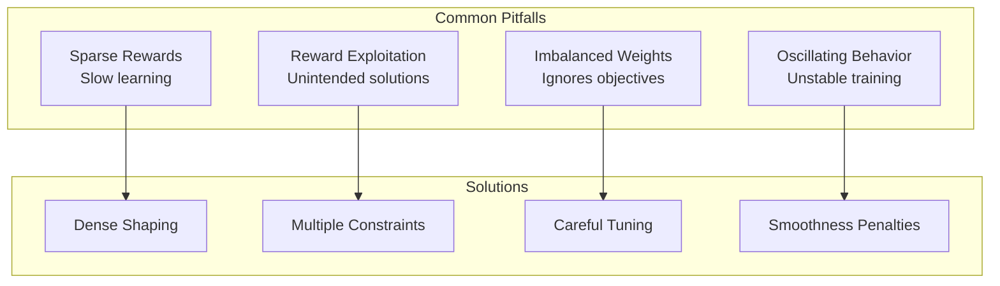
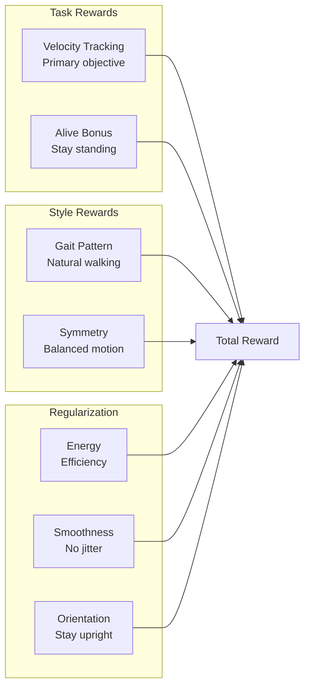
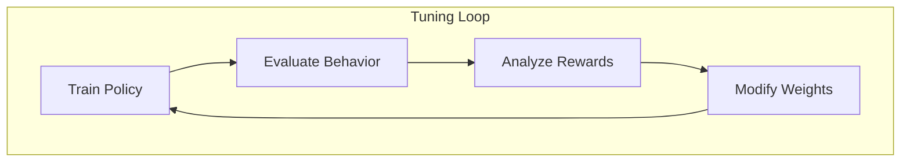

# Chapter 5: Reward Design for Locomotion

**Duration**: 4-5 hours
**Difficulty**: Intermediate-Advanced

---

## Learning Objectives

After completing this chapter, you will be able to:

- Apply reward shaping principles
- Implement modular reward components
- Design velocity tracking rewards
- Add regularization penalties
- Tune reward weights for stable walking

---

## 5.1 Reward Shaping Principles

### The Reward Hypothesis

The agent learns to maximize cumulative reward:

```
J(π) = E[∑_{t=0}^{∞} γ^t r_t]
```

### Key Principles

| Principle | Description | Example |
|-----------|-------------|---------|
| Dense Rewards | Frequent feedback | Per-step velocity reward |
| Sparse Rewards | Goal completion only | +1 when reaching target |
| Shaped Rewards | Guide learning | Reward progress |
| Natural Rewards | Physics-based | Energy efficiency |

### Reward Design Pitfalls



### Humanoid Reward Structure



---

## 5.2 Velocity Tracking Reward

### Forward Velocity

```python
def compute_velocity_reward(self):
    """
    Reward for tracking commanded velocity.

    r_vel = exp(-||v_cmd - v_actual||^2 / σ^2)
    """
    # Get commanded and actual velocities
    cmd_vel = self.commands[:, :2]  # vx, vy
    actual_vel = self.base_lin_vel[:, :2]

    # Squared error
    vel_error = torch.sum(torch.square(cmd_vel - actual_vel), dim=-1)

    # Exponential reward (smooth, bounded [0, 1])
    sigma = 0.25
    vel_reward = torch.exp(-vel_error / sigma)

    return vel_reward * self.cfg.rewards.velocity_weight
```

### Angular Velocity

```python
def compute_angular_velocity_reward(self):
    """
    Reward for tracking yaw rate command.
    """
    cmd_yaw_rate = self.commands[:, 2]
    actual_yaw_rate = self.base_ang_vel[:, 2]

    yaw_error = torch.square(cmd_yaw_rate - actual_yaw_rate)

    sigma = 0.25
    yaw_reward = torch.exp(-yaw_error / sigma)

    return yaw_reward * self.cfg.rewards.angular_velocity_weight
```

### Why Exponential Rewards?

| Reward Type | Formula | Properties |
|-------------|---------|------------|
| Linear | `-|e|` | Unbounded negative |
| Quadratic | `-e²` | Strong penalty far from target |
| Exponential | `exp(-e²/σ²)` | Bounded [0,1], smooth gradient |

```python
# Comparison
import matplotlib.pyplot as plt
import numpy as np

error = np.linspace(-2, 2, 100)

linear = -np.abs(error)
quadratic = -error**2
exponential = np.exp(-error**2 / 0.25)

# Exponential provides smooth gradient and bounded reward
```

---

## 5.3 Alive and Termination Rewards

### Alive Bonus

```python
def compute_alive_reward(self):
    """
    Constant reward for staying alive.

    Encourages survival over falling quickly.
    """
    alive_reward = torch.ones(self.num_envs, device=self.device)
    return alive_reward * self.cfg.rewards.alive_weight
```

### Termination Penalty

```python
def compute_termination_penalty(self):
    """
    Penalty when terminated (not timeout).
    """
    # Check if terminated due to falling (not timeout)
    fell = self.reset_buf & ~self.timeout_buf

    penalty = torch.zeros(self.num_envs, device=self.device)
    penalty[fell] = -self.cfg.rewards.termination_penalty

    return penalty
```

### Height Reward

```python
def compute_height_reward(self):
    """
    Reward for maintaining target height.
    """
    target_height = 0.9  # meters
    actual_height = self.base_pos[:, 2]

    height_error = torch.square(target_height - actual_height)

    return torch.exp(-height_error / 0.1) * self.cfg.rewards.height_weight
```

---

## 5.4 Energy and Efficiency Rewards

### Torque Penalty

```python
def compute_energy_penalty(self):
    """
    Penalize large torques for energy efficiency.

    r_energy = -Σ τ²
    """
    torque_squared = torch.sum(torch.square(self.torques), dim=-1)
    return torque_squared * self.cfg.rewards.energy_weight  # Negative weight
```

### Power Consumption

```python
def compute_power_penalty(self):
    """
    Penalize mechanical power (torque × velocity).

    More physically meaningful than torque alone.
    """
    power = torch.sum(
        torch.abs(self.torques * self.dof_vel),
        dim=-1
    )
    return power * self.cfg.rewards.power_weight  # Negative weight
```

### Action Rate Penalty

```python
def compute_action_rate_penalty(self):
    """
    Penalize rapid changes in actions (smoothness).

    r_smooth = -Σ (a_t - a_{t-1})²
    """
    action_diff = self.actions - self.last_actions
    action_rate = torch.sum(torch.square(action_diff), dim=-1)

    return action_rate * self.cfg.rewards.action_rate_weight  # Negative
```

### Joint Acceleration Penalty

```python
def compute_joint_acc_penalty(self):
    """
    Penalize joint accelerations for smooth motion.
    """
    # Approximate acceleration from velocity change
    # Assuming constant dt
    joint_acc = (self.dof_vel - self.last_dof_vel) / self.dt
    acc_magnitude = torch.sum(torch.square(joint_acc), dim=-1)

    return acc_magnitude * self.cfg.rewards.joint_acc_weight  # Negative
```

---

## 5.5 Orientation and Stability Rewards

### Upright Orientation

```python
def compute_orientation_penalty(self):
    """
    Penalize deviation from upright orientation.

    Quaternion: if upright, q = [0, 0, 0, 1]
    Penalty based on x,y components (roll, pitch)
    """
    # Extract x,y components of quaternion
    quat_xy = self.base_quat[:, :2]

    # Squared magnitude (should be near 0 when upright)
    orientation_error = torch.sum(torch.square(quat_xy), dim=-1)

    return orientation_error * self.cfg.rewards.orientation_weight  # Negative
```

### Gravity Alignment

```python
def compute_gravity_alignment_reward(self):
    """
    Reward for body z-axis aligned with world up.
    """
    # Get projected gravity in body frame
    gravity = torch.tensor([0., 0., -1.], device=self.device)
    projected_gravity = quat_rotate_inverse(
        self.base_quat,
        gravity.expand(self.num_envs, -1)
    )

    # Alignment: dot product with [0, 0, -1]
    alignment = -projected_gravity[:, 2]  # Should be +1 when upright

    return alignment * self.cfg.rewards.alignment_weight
```

### Base Motion Penalty

```python
def compute_base_motion_penalty(self):
    """
    Penalize unnecessary lateral and vertical base motion.
    """
    # Lateral velocity (not commanded)
    lateral_vel = torch.abs(self.base_lin_vel[:, 1])

    # Vertical velocity (should be stable)
    vertical_vel = torch.abs(self.base_lin_vel[:, 2])

    motion_penalty = lateral_vel + vertical_vel

    return motion_penalty * self.cfg.rewards.base_motion_weight  # Negative
```

---

## 5.6 Contact and Gait Rewards

### Foot Contact Reward

```python
def compute_contact_reward(self):
    """
    Reward for proper foot contacts during walking.
    """
    # Get contact forces on feet
    left_contact = self.contact_forces[:, self.left_foot_idx, 2] > 1.0
    right_contact = self.contact_forces[:, self.right_foot_idx, 2] > 1.0

    # At least one foot should be in contact
    any_contact = left_contact | right_contact

    contact_reward = any_contact.float()

    return contact_reward * self.cfg.rewards.contact_weight
```

### Alternating Gait Reward

```python
def compute_gait_reward(self):
    """
    Reward for alternating foot contacts (walking gait).
    """
    left_contact = self.contact_forces[:, self.left_foot_idx, 2] > 1.0
    right_contact = self.contact_forces[:, self.right_foot_idx, 2] > 1.0

    # XOR: reward when exactly one foot is in contact
    alternating = left_contact ^ right_contact

    return alternating.float() * self.cfg.rewards.gait_weight
```

### Air Time Reward

```python
def compute_air_time_reward(self):
    """
    Reward for achieving swing phases (foot in air).
    """
    left_in_air = self.contact_forces[:, self.left_foot_idx, 2] < 1.0
    right_in_air = self.contact_forces[:, self.right_foot_idx, 2] < 1.0

    # Update air time counters
    self.left_air_time[left_in_air] += self.dt
    self.left_air_time[~left_in_air] = 0

    self.right_air_time[right_in_air] += self.dt
    self.right_air_time[~right_in_air] = 0

    # Reward for achieving minimum air time
    target_air_time = 0.2  # seconds
    left_reward = torch.clamp(self.left_air_time - target_air_time, 0, 0.5)
    right_reward = torch.clamp(self.right_air_time - target_air_time, 0, 0.5)

    return (left_reward + right_reward) * self.cfg.rewards.air_time_weight
```

### Foot Clearance Reward

```python
def compute_foot_clearance_reward(self):
    """
    Reward for lifting feet during swing phase.
    """
    # Get foot heights (z position relative to ground)
    left_foot_height = self.rigid_body_states[:, self.left_foot_idx, 2]
    right_foot_height = self.rigid_body_states[:, self.right_foot_idx, 2]

    # During swing, feet should be lifted
    left_in_air = self.contact_forces[:, self.left_foot_idx, 2] < 1.0
    right_in_air = self.contact_forces[:, self.right_foot_idx, 2] < 1.0

    # Clearance reward only during swing
    target_clearance = 0.05  # 5 cm
    left_clearance = torch.clamp(left_foot_height - target_clearance, 0, 0.1)
    right_clearance = torch.clamp(right_foot_height - target_clearance, 0, 0.1)

    clearance_reward = (
        left_clearance * left_in_air.float() +
        right_clearance * right_in_air.float()
    )

    return clearance_reward * self.cfg.rewards.clearance_weight
```

---

## 5.7 Symmetry and Style Rewards

### Joint Symmetry

```python
def compute_symmetry_reward(self):
    """
    Reward for symmetric joint positions between left/right.
    """
    # Assumes mirrored joint ordering
    left_joints = self.dof_pos[:, :5]   # Left leg
    right_joints = self.dof_pos[:, 5:10]  # Right leg

    # Phase-shifted symmetry (180 degrees out of phase for walking)
    # For simplicity, just penalize large asymmetry
    asymmetry = torch.mean(torch.square(left_joints - right_joints), dim=-1)

    return -asymmetry * self.cfg.rewards.symmetry_weight
```

### Joint Limit Penalty

```python
def compute_joint_limit_penalty(self):
    """
    Penalize joints near their limits.
    """
    # Distance to limits
    lower_dist = self.dof_pos - self.dof_lower_limits
    upper_dist = self.dof_upper_limits - self.dof_pos

    # Penalty when within margin of limit
    margin = 0.1  # radians
    lower_penalty = torch.clamp(margin - lower_dist, min=0)
    upper_penalty = torch.clamp(margin - upper_dist, min=0)

    limit_penalty = torch.sum(lower_penalty + upper_penalty, dim=-1)

    return limit_penalty * self.cfg.rewards.limit_weight  # Negative
```

---

## 5.8 Complete Reward Implementation

### RewardManager Class

```python
"""reward_manager.py - Modular reward computation."""

import torch
from typing import Dict


class RewardManager:
    """
    Manages modular reward computation for humanoid locomotion.
    """

    def __init__(self, cfg, env):
        self.cfg = cfg
        self.env = env
        self.device = env.device

        # Reward component weights
        self.weights = {
            "velocity": cfg.rewards.velocity,
            "angular_velocity": cfg.rewards.angular_velocity,
            "alive": cfg.rewards.alive,
            "height": cfg.rewards.height,
            "energy": cfg.rewards.energy,
            "action_rate": cfg.rewards.action_rate,
            "orientation": cfg.rewards.orientation,
            "contact": cfg.rewards.contact,
            "gait": cfg.rewards.gait,
            "termination": cfg.rewards.termination,
        }

        # Tracking for logging
        self.reward_components = {}

    def compute_rewards(self) -> torch.Tensor:
        """
        Compute total reward from all components.

        Returns:
            rewards: (N,) total reward per environment
        """
        rewards = torch.zeros(self.env.num_envs, device=self.device)

        # Task rewards
        rewards += self._velocity_reward()
        rewards += self._angular_velocity_reward()
        rewards += self._alive_reward()

        # Style rewards
        rewards += self._height_reward()
        rewards += self._contact_reward()
        rewards += self._gait_reward()

        # Regularization
        rewards += self._energy_penalty()
        rewards += self._action_rate_penalty()
        rewards += self._orientation_penalty()

        # Termination
        rewards += self._termination_penalty()

        return rewards

    def _velocity_reward(self) -> torch.Tensor:
        """Forward velocity tracking reward."""
        cmd = self.env.commands[:, :2]
        actual = self.env.base_lin_vel[:, :2]
        error = torch.sum(torch.square(cmd - actual), dim=-1)
        reward = torch.exp(-error / 0.25) * self.weights["velocity"]
        self.reward_components["velocity"] = reward.mean().item()
        return reward

    def _angular_velocity_reward(self) -> torch.Tensor:
        """Yaw rate tracking reward."""
        cmd = self.env.commands[:, 2]
        actual = self.env.base_ang_vel[:, 2]
        error = torch.square(cmd - actual)
        reward = torch.exp(-error / 0.25) * self.weights["angular_velocity"]
        self.reward_components["angular_velocity"] = reward.mean().item()
        return reward

    def _alive_reward(self) -> torch.Tensor:
        """Survival bonus."""
        reward = torch.ones(self.env.num_envs, device=self.device)
        reward *= self.weights["alive"]
        self.reward_components["alive"] = reward.mean().item()
        return reward

    def _height_reward(self) -> torch.Tensor:
        """Height maintenance reward."""
        target = 0.9
        actual = self.env.base_pos[:, 2]
        error = torch.square(target - actual)
        reward = torch.exp(-error / 0.1) * self.weights["height"]
        self.reward_components["height"] = reward.mean().item()
        return reward

    def _contact_reward(self) -> torch.Tensor:
        """Foot contact reward."""
        left = self.env.contact_forces[:, self.env.left_foot_idx, 2] > 1.0
        right = self.env.contact_forces[:, self.env.right_foot_idx, 2] > 1.0
        any_contact = (left | right).float()
        reward = any_contact * self.weights["contact"]
        self.reward_components["contact"] = reward.mean().item()
        return reward

    def _gait_reward(self) -> torch.Tensor:
        """Alternating gait reward."""
        left = self.env.contact_forces[:, self.env.left_foot_idx, 2] > 1.0
        right = self.env.contact_forces[:, self.env.right_foot_idx, 2] > 1.0
        alternating = (left ^ right).float()
        reward = alternating * self.weights["gait"]
        self.reward_components["gait"] = reward.mean().item()
        return reward

    def _energy_penalty(self) -> torch.Tensor:
        """Energy consumption penalty."""
        torque_sq = torch.sum(torch.square(self.env.torques), dim=-1)
        penalty = torque_sq * self.weights["energy"]  # Already negative
        self.reward_components["energy"] = penalty.mean().item()
        return penalty

    def _action_rate_penalty(self) -> torch.Tensor:
        """Action smoothness penalty."""
        diff = self.env.actions - self.env.last_actions
        rate = torch.sum(torch.square(diff), dim=-1)
        penalty = rate * self.weights["action_rate"]  # Already negative
        self.reward_components["action_rate"] = penalty.mean().item()
        return penalty

    def _orientation_penalty(self) -> torch.Tensor:
        """Upright orientation penalty."""
        quat_xy = self.env.base_quat[:, :2]
        error = torch.sum(torch.square(quat_xy), dim=-1)
        penalty = error * self.weights["orientation"]  # Already negative
        self.reward_components["orientation"] = penalty.mean().item()
        return penalty

    def _termination_penalty(self) -> torch.Tensor:
        """Penalty for falling."""
        fell = self.env.reset_buf & ~self.env.timeout_buf
        penalty = torch.zeros(self.env.num_envs, device=self.device)
        penalty[fell] = self.weights["termination"]  # Already negative
        self.reward_components["termination"] = penalty.mean().item()
        return penalty

    def get_components(self) -> Dict[str, float]:
        """Get reward component values for logging."""
        return self.reward_components.copy()
```

### Reward Configuration

```python
@dataclass
class RewardsCfg:
    """Reward weight configuration."""

    # Task rewards (positive weights)
    velocity: float = 2.0
    angular_velocity: float = 0.5
    alive: float = 1.0
    height: float = 0.5
    contact: float = 0.2
    gait: float = 0.3

    # Regularization penalties (negative weights)
    energy: float = -0.0005
    action_rate: float = -0.01
    orientation: float = -0.5
    termination: float = -10.0

    # Optional style rewards
    symmetry: float = 0.0
    clearance: float = 0.0
    air_time: float = 0.0
```

---

## 5.9 Reward Tuning Guidelines

### Initial Weights

Start with a minimal reward:

```python
# Stage 1: Basic standing
weights = {
    "alive": 1.0,
    "orientation": -1.0,
    "height": 1.0,
}

# Stage 2: Add velocity tracking
weights.update({
    "velocity": 2.0,
    "angular_velocity": 0.5,
})

# Stage 3: Add efficiency
weights.update({
    "energy": -0.0005,
    "action_rate": -0.01,
})

# Stage 4: Add gait quality
weights.update({
    "contact": 0.2,
    "gait": 0.3,
})
```

### Tuning Process



### Common Issues and Fixes

| Issue | Symptom | Fix |
|-------|---------|-----|
| Falls immediately | Low alive reward | Increase orientation penalty |
| Slides/shuffles | No foot lifting | Add gait reward |
| Jerky motion | High action changes | Increase action_rate penalty |
| High energy use | Large torques | Increase energy penalty |
| Ignores commands | Random velocity | Increase velocity reward |
| Stands still | No forward motion | Reduce alive, increase velocity |

### Reward Scaling

```python
# Ensure rewards are similar magnitude
def normalize_weights(weights):
    """Scale weights so components contribute equally."""
    # Typical reward magnitudes
    magnitudes = {
        "velocity": 0.5,      # exp(-error) ≈ 0.5
        "alive": 1.0,         # Always 1
        "energy": 1000.0,     # Sum of squared torques
        "orientation": 0.1,   # Small when upright
    }

    normalized = {}
    for name, weight in weights.items():
        if name in magnitudes:
            normalized[name] = weight / magnitudes[name]
        else:
            normalized[name] = weight

    return normalized
```

---

## 5.10 Advanced Reward Techniques

### Curriculum Rewards

```python
def curriculum_velocity_reward(self, progress: float):
    """
    Scale velocity command based on training progress.

    Args:
        progress: Training progress [0, 1]
    """
    # Start with small velocities, increase over time
    max_vel = 0.5 + 1.5 * progress  # 0.5 → 2.0 m/s

    self.commands[:, 0] = torch.rand(self.num_envs) * max_vel
```

### Reward Annealing

```python
def anneal_weight(self, name: str, start: float, end: float, progress: float):
    """
    Linearly anneal reward weight during training.
    """
    self.weights[name] = start + (end - start) * progress
```

### Auxiliary Rewards

```python
def compute_auxiliary_rewards(self):
    """
    Rewards that help learning but aren't final objective.
    """
    aux_rewards = {}

    # Encourage exploration early
    aux_rewards["entropy"] = self.compute_action_entropy()

    # Penalize large activations
    aux_rewards["activation"] = -torch.mean(torch.abs(self.hidden_states))

    return aux_rewards
```

---

## Hands-On Exercises

### Exercise 5.1: Implement Basic Rewards

1. Implement velocity tracking reward
2. Add alive bonus
3. Add energy penalty
4. Verify reward magnitudes

### Exercise 5.2: Add Gait Rewards

1. Implement foot contact detection
2. Add alternating gait reward
3. Implement air time tracking
4. Test with different weights

### Exercise 5.3: Tune Reward Weights

1. Start with minimal rewards
2. Train policy for 1000 iterations
3. Analyze reward components
4. Adjust weights and retrain
5. Document optimal weights

---

## Summary

In this chapter, you learned:

- Reward shaping principles for locomotion
- Modular reward component design
- Velocity tracking with exponential rewards
- Regularization penalties for efficiency
- Contact and gait rewards for natural walking
- Systematic weight tuning process

## Next Chapter

In [Chapter 6](ch06-ppo-training.md), you will implement PPO training for humanoid locomotion.

---

## Quick Reference

```python
# Core reward components
r_total = (
    r_velocity * w_vel +           # Track commanded velocity
    r_angular * w_ang +            # Track yaw rate
    r_alive * w_alive +            # Stay standing
    r_height * w_height +          # Maintain height
    r_energy * w_energy +          # Minimize torques
    r_action_rate * w_rate +       # Smooth actions
    r_orientation * w_orient +     # Stay upright
    r_contact * w_contact +        # Foot contacts
    r_gait * w_gait                # Alternating gait
)

# Exponential reward
r = exp(-error² / σ²)  # Bounded [0, 1], smooth

# Common weight ranges
velocity:      1.0 - 3.0
alive:         0.5 - 2.0
energy:       -0.001 - -0.0001
orientation:  -1.0 - -0.1
```

| Reward Type | Purpose | Sign |
|-------------|---------|------|
| Velocity | Track commands | + |
| Alive | Survive | + |
| Height | Stay tall | + |
| Energy | Efficiency | - |
| Action rate | Smoothness | - |
| Orientation | Stability | - |
| Contact | Grounding | + |
| Gait | Walking pattern | + |
