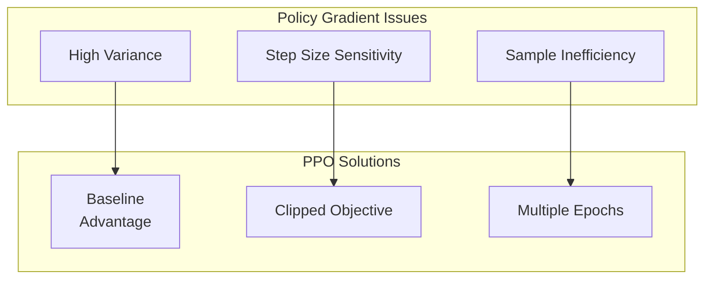
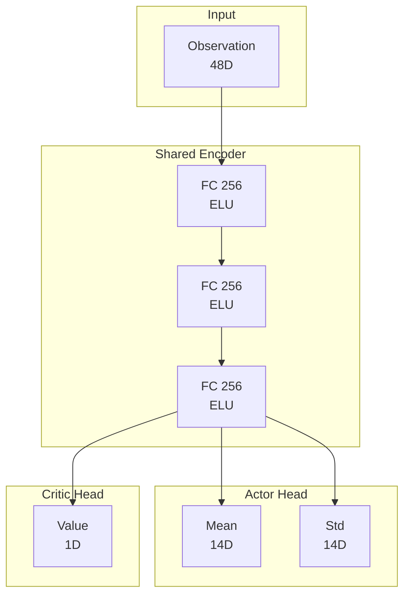
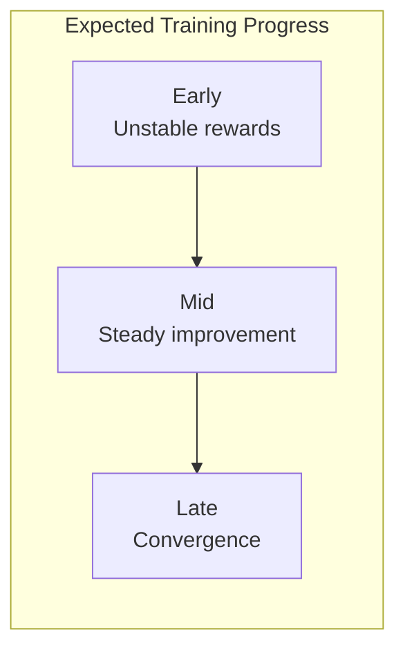

# Chapter 6: PPO Training

**Duration**: 5-6 hours
**Difficulty**: Advanced

---

## Learning Objectives

After completing this chapter, you will be able to:

- Explain PPO algorithm mechanics
- Implement actor-critic networks
- Configure PPO hyperparameters
- Train humanoid locomotion policy
- Monitor training with TensorBoard

---

## 6.1 PPO Algorithm Overview

### Policy Gradient Fundamentals

**Reinforcement Learning Objective:**

```
J(θ) = E_π[∑_t γ^t r_t]
```

**Policy Gradient:**

```
∇J(θ) = E_π[∇_θ log π_θ(a|s) A(s,a)]
```

where `A(s,a)` is the advantage function.

### PPO Motivation



### PPO Clipped Objective

```
L_CLIP(θ) = E[min(r_t(θ)A_t, clip(r_t(θ), 1-ε, 1+ε)A_t)]
```

where:
- `r_t(θ) = π_θ(a|s) / π_θ_old(a|s)` is the probability ratio
- `ε` is the clip range (typically 0.2)
- `A_t` is the advantage estimate

### Why Clipping Works

```python
import matplotlib.pyplot as plt
import numpy as np

ratio = np.linspace(0, 2, 100)
advantage = 1.0  # Positive advantage
clip_range = 0.2

# Unclipped objective
unclipped = ratio * advantage

# Clipped ratio
clipped_ratio = np.clip(ratio, 1 - clip_range, 1 + clip_range)
clipped = clipped_ratio * advantage

# PPO objective (min of both)
ppo = np.minimum(unclipped, clipped)

# Clipping prevents too large policy updates
```

---

## 6.2 Actor-Critic Architecture

### Network Design



### Implementation

```python
import torch
import torch.nn as nn
from torch.distributions import Normal


class ActorCritic(nn.Module):
    """
    Actor-Critic network for PPO.

    Actor: outputs action distribution parameters
    Critic: outputs state value estimate
    """

    def __init__(
        self,
        obs_dim: int,
        action_dim: int,
        hidden_dims: list = [256, 256, 256],
        activation: str = "elu",
        init_noise_std: float = 1.0,
    ):
        super().__init__()

        self.obs_dim = obs_dim
        self.action_dim = action_dim

        # Activation function
        if activation == "elu":
            self.activation = nn.ELU()
        elif activation == "relu":
            self.activation = nn.ReLU()
        elif activation == "tanh":
            self.activation = nn.Tanh()

        # Build shared encoder
        encoder_layers = []
        prev_dim = obs_dim
        for hidden_dim in hidden_dims:
            encoder_layers.append(nn.Linear(prev_dim, hidden_dim))
            encoder_layers.append(self.activation)
            prev_dim = hidden_dim

        self.encoder = nn.Sequential(*encoder_layers)

        # Actor head (action mean)
        self.actor_mean = nn.Linear(hidden_dims[-1], action_dim)

        # Learnable action std (log scale)
        self.actor_log_std = nn.Parameter(
            torch.ones(action_dim) * torch.log(torch.tensor(init_noise_std))
        )

        # Critic head
        self.critic = nn.Linear(hidden_dims[-1], 1)

        # Initialize weights
        self._init_weights()

    def _init_weights(self):
        """Initialize network weights."""
        for m in self.modules():
            if isinstance(m, nn.Linear):
                nn.init.orthogonal_(m.weight, gain=np.sqrt(2))
                nn.init.constant_(m.bias, 0)

        # Actor output layer smaller init
        nn.init.orthogonal_(self.actor_mean.weight, gain=0.01)

    def forward(self, obs: torch.Tensor):
        """
        Forward pass through network.

        Args:
            obs: (batch, obs_dim) observations

        Returns:
            actions: (batch, action_dim) sampled actions
            log_probs: (batch,) log probabilities
            values: (batch,) value estimates
        """
        # Shared encoding
        features = self.encoder(obs)

        # Actor: action distribution
        action_mean = self.actor_mean(features)
        action_std = torch.exp(self.actor_log_std)

        # Sample action
        dist = Normal(action_mean, action_std)
        actions = dist.sample()
        log_probs = dist.log_prob(actions).sum(dim=-1)

        # Critic: value estimate
        values = self.critic(features).squeeze(-1)

        return actions, log_probs, values

    def evaluate(self, obs: torch.Tensor, actions: torch.Tensor):
        """
        Evaluate actions for PPO update.

        Args:
            obs: (batch, obs_dim) observations
            actions: (batch, action_dim) actions taken

        Returns:
            log_probs: (batch,) log probabilities
            values: (batch,) value estimates
            entropy: (batch,) action entropy
        """
        features = self.encoder(obs)

        # Action distribution
        action_mean = self.actor_mean(features)
        action_std = torch.exp(self.actor_log_std)
        dist = Normal(action_mean, action_std)

        # Log probability of taken actions
        log_probs = dist.log_prob(actions).sum(dim=-1)

        # Entropy for exploration bonus
        entropy = dist.entropy().sum(dim=-1)

        # Value estimate
        values = self.critic(features).squeeze(-1)

        return log_probs, values, entropy

    def act(self, obs: torch.Tensor, deterministic: bool = False):
        """
        Get action for inference.

        Args:
            obs: (batch, obs_dim) observations
            deterministic: if True, return mean action

        Returns:
            actions: (batch, action_dim)
        """
        features = self.encoder(obs)
        action_mean = self.actor_mean(features)

        if deterministic:
            return action_mean
        else:
            action_std = torch.exp(self.actor_log_std)
            dist = Normal(action_mean, action_std)
            return dist.sample()
```

### Separate Actor-Critic Networks

```python
class SeparateActorCritic(nn.Module):
    """
    Separate networks for actor and critic.

    May provide better training stability.
    """

    def __init__(self, obs_dim, action_dim, hidden_dims=[256, 256, 256]):
        super().__init__()

        # Actor network
        actor_layers = []
        prev_dim = obs_dim
        for hidden_dim in hidden_dims:
            actor_layers.extend([
                nn.Linear(prev_dim, hidden_dim),
                nn.ELU(),
            ])
            prev_dim = hidden_dim
        actor_layers.append(nn.Linear(prev_dim, action_dim))
        self.actor = nn.Sequential(*actor_layers)

        # Critic network
        critic_layers = []
        prev_dim = obs_dim
        for hidden_dim in hidden_dims:
            critic_layers.extend([
                nn.Linear(prev_dim, hidden_dim),
                nn.ELU(),
            ])
            prev_dim = hidden_dim
        critic_layers.append(nn.Linear(prev_dim, 1))
        self.critic = nn.Sequential(*critic_layers)

        self.actor_log_std = nn.Parameter(torch.zeros(action_dim))
```

---

## 6.3 PPO Algorithm Implementation

### Rollout Buffer

```python
class RolloutBuffer:
    """
    Buffer for storing rollout data.
    """

    def __init__(
        self,
        num_envs: int,
        num_steps: int,
        obs_dim: int,
        action_dim: int,
        device: str = "cuda",
    ):
        self.num_envs = num_envs
        self.num_steps = num_steps
        self.device = device

        # Storage tensors
        self.observations = torch.zeros(
            num_steps, num_envs, obs_dim, device=device
        )
        self.actions = torch.zeros(
            num_steps, num_envs, action_dim, device=device
        )
        self.rewards = torch.zeros(
            num_steps, num_envs, device=device
        )
        self.dones = torch.zeros(
            num_steps, num_envs, device=device
        )
        self.values = torch.zeros(
            num_steps, num_envs, device=device
        )
        self.log_probs = torch.zeros(
            num_steps, num_envs, device=device
        )

        # Computed values
        self.advantages = torch.zeros(
            num_steps, num_envs, device=device
        )
        self.returns = torch.zeros(
            num_steps, num_envs, device=device
        )

        self.step = 0

    def add(self, obs, action, reward, done, value, log_prob):
        """Add transition to buffer."""
        self.observations[self.step] = obs
        self.actions[self.step] = action
        self.rewards[self.step] = reward
        self.dones[self.step] = done
        self.values[self.step] = value
        self.log_probs[self.step] = log_prob
        self.step += 1

    def compute_returns_and_advantages(
        self,
        last_values: torch.Tensor,
        gamma: float = 0.99,
        gae_lambda: float = 0.95,
    ):
        """
        Compute returns and GAE advantages.
        """
        last_gae = 0

        for t in reversed(range(self.num_steps)):
            if t == self.num_steps - 1:
                next_values = last_values
            else:
                next_values = self.values[t + 1]

            next_non_terminal = 1.0 - self.dones[t]

            # TD error
            delta = (
                self.rewards[t] +
                gamma * next_values * next_non_terminal -
                self.values[t]
            )

            # GAE
            last_gae = delta + gamma * gae_lambda * next_non_terminal * last_gae
            self.advantages[t] = last_gae

        # Returns = advantages + values
        self.returns = self.advantages + self.values

    def get_minibatch_generator(self, minibatch_size: int):
        """
        Generate minibatches for training.
        """
        total_size = self.num_steps * self.num_envs
        indices = torch.randperm(total_size, device=self.device)

        # Flatten tensors
        obs_flat = self.observations.view(-1, self.observations.shape[-1])
        actions_flat = self.actions.view(-1, self.actions.shape[-1])
        log_probs_flat = self.log_probs.view(-1)
        advantages_flat = self.advantages.view(-1)
        returns_flat = self.returns.view(-1)

        for start in range(0, total_size, minibatch_size):
            end = start + minibatch_size
            batch_indices = indices[start:end]

            yield (
                obs_flat[batch_indices],
                actions_flat[batch_indices],
                log_probs_flat[batch_indices],
                advantages_flat[batch_indices],
                returns_flat[batch_indices],
            )

    def reset(self):
        """Reset buffer for next rollout."""
        self.step = 0
```

### PPO Trainer

```python
class PPOTrainer:
    """
    PPO training algorithm.
    """

    def __init__(
        self,
        env,
        network: ActorCritic,
        cfg,
    ):
        self.env = env
        self.network = network
        self.cfg = cfg
        self.device = env.device

        # Optimizer
        self.optimizer = torch.optim.Adam(
            network.parameters(),
            lr=cfg.learning_rate,
            eps=1e-5,
        )

        # Learning rate scheduler
        if cfg.schedule == "adaptive":
            self.scheduler = None  # Manual adaptation
        elif cfg.schedule == "linear":
            self.scheduler = torch.optim.lr_scheduler.LinearLR(
                self.optimizer,
                start_factor=1.0,
                end_factor=0.1,
                total_iters=cfg.max_iterations,
            )

        # Rollout buffer
        self.buffer = RolloutBuffer(
            num_envs=env.num_envs,
            num_steps=cfg.num_steps_per_env,
            obs_dim=env.num_obs,
            action_dim=env.num_actions,
            device=self.device,
        )

        # Tracking
        self.iteration = 0
        self.total_timesteps = 0

    def collect_rollouts(self):
        """
        Collect rollout data from environment.
        """
        self.buffer.reset()
        obs = self.env.obs_buf

        for step in range(self.cfg.num_steps_per_env):
            # Get action from policy
            with torch.no_grad():
                actions, log_probs, values = self.network(obs)

            # Step environment
            next_obs, rewards, dones, info = self.env.step(actions)

            # Store transition
            self.buffer.add(
                obs=obs,
                action=actions,
                reward=rewards,
                done=dones.float(),
                value=values,
                log_prob=log_probs,
            )

            obs = next_obs

        # Compute final value for bootstrapping
        with torch.no_grad():
            _, _, last_values = self.network(obs)

        # Compute advantages
        self.buffer.compute_returns_and_advantages(
            last_values,
            gamma=self.cfg.gamma,
            gae_lambda=self.cfg.gae_lambda,
        )

        self.total_timesteps += self.cfg.num_steps_per_env * self.env.num_envs

    def update(self):
        """
        Perform PPO update.
        """
        # Normalize advantages
        advantages = self.buffer.advantages.view(-1)
        advantages = (advantages - advantages.mean()) / (advantages.std() + 1e-8)
        self.buffer.advantages = advantages.view(
            self.cfg.num_steps_per_env, self.env.num_envs
        )

        # Training metrics
        total_loss = 0
        total_policy_loss = 0
        total_value_loss = 0
        total_entropy = 0
        num_updates = 0

        # Multiple epochs over collected data
        for epoch in range(self.cfg.num_epochs):
            for batch in self.buffer.get_minibatch_generator(self.cfg.minibatch_size):
                obs, actions, old_log_probs, advantages, returns = batch

                # Evaluate actions with current policy
                new_log_probs, values, entropy = self.network.evaluate(obs, actions)

                # Policy loss (clipped)
                ratio = torch.exp(new_log_probs - old_log_probs)
                surr1 = ratio * advantages
                surr2 = torch.clamp(
                    ratio,
                    1 - self.cfg.clip_range,
                    1 + self.cfg.clip_range
                ) * advantages
                policy_loss = -torch.min(surr1, surr2).mean()

                # Value loss (optionally clipped)
                if self.cfg.clip_value:
                    values_clipped = self.buffer.values.view(-1) + torch.clamp(
                        values - self.buffer.values.view(-1),
                        -self.cfg.clip_range,
                        self.cfg.clip_range,
                    )
                    value_loss1 = (values - returns) ** 2
                    value_loss2 = (values_clipped - returns) ** 2
                    value_loss = 0.5 * torch.max(value_loss1, value_loss2).mean()
                else:
                    value_loss = 0.5 * ((values - returns) ** 2).mean()

                # Entropy bonus
                entropy_loss = -entropy.mean()

                # Total loss
                loss = (
                    policy_loss +
                    self.cfg.value_coef * value_loss +
                    self.cfg.entropy_coef * entropy_loss
                )

                # Update
                self.optimizer.zero_grad()
                loss.backward()

                # Gradient clipping
                if self.cfg.max_grad_norm > 0:
                    torch.nn.utils.clip_grad_norm_(
                        self.network.parameters(),
                        self.cfg.max_grad_norm
                    )

                self.optimizer.step()

                # Track metrics
                total_loss += loss.item()
                total_policy_loss += policy_loss.item()
                total_value_loss += value_loss.item()
                total_entropy += entropy.mean().item()
                num_updates += 1

        # Learning rate schedule
        if self.scheduler is not None:
            self.scheduler.step()

        self.iteration += 1

        return {
            "loss": total_loss / num_updates,
            "policy_loss": total_policy_loss / num_updates,
            "value_loss": total_value_loss / num_updates,
            "entropy": total_entropy / num_updates,
        }

    def train(self, max_iterations: int):
        """
        Main training loop.
        """
        # Reset environment
        self.env.reset()

        for iteration in range(max_iterations):
            # Collect rollouts
            self.collect_rollouts()

            # Update policy
            metrics = self.update()

            # Logging
            if iteration % self.cfg.log_interval == 0:
                mean_reward = self.buffer.rewards.mean().item()
                print(
                    f"Iter {iteration}: "
                    f"reward={mean_reward:.3f}, "
                    f"loss={metrics['loss']:.4f}, "
                    f"entropy={metrics['entropy']:.3f}"
                )

            # Save checkpoint
            if iteration % self.cfg.save_interval == 0:
                self.save_checkpoint(f"checkpoint_{iteration}.pt")

    def save_checkpoint(self, path: str):
        """Save training checkpoint."""
        torch.save({
            "iteration": self.iteration,
            "total_timesteps": self.total_timesteps,
            "network_state": self.network.state_dict(),
            "optimizer_state": self.optimizer.state_dict(),
        }, path)

    def load_checkpoint(self, path: str):
        """Load training checkpoint."""
        checkpoint = torch.load(path)
        self.iteration = checkpoint["iteration"]
        self.total_timesteps = checkpoint["total_timesteps"]
        self.network.load_state_dict(checkpoint["network_state"])
        self.optimizer.load_state_dict(checkpoint["optimizer_state"])
```

---

## 6.4 PPO Configuration

### Hyperparameters

```python
@dataclass
class PPOConfig:
    """PPO training configuration."""

    # Environment
    num_envs: int = 4096
    num_steps_per_env: int = 24  # Steps per rollout

    # Training
    max_iterations: int = 10000
    learning_rate: float = 3e-4
    schedule: str = "adaptive"  # "fixed", "linear", "adaptive"

    # PPO specific
    gamma: float = 0.99
    gae_lambda: float = 0.95
    clip_range: float = 0.2
    clip_value: bool = True
    num_epochs: int = 5
    minibatch_size: int = 4096

    # Loss coefficients
    value_coef: float = 1.0
    entropy_coef: float = 0.01

    # Optimization
    max_grad_norm: float = 1.0

    # Network
    hidden_dims: list = field(default_factory=lambda: [256, 256, 256])
    activation: str = "elu"
    init_noise_std: float = 1.0

    # Logging
    log_interval: int = 10
    save_interval: int = 500
```

### Hyperparameter Guidelines

| Parameter | Typical Range | Effect |
|-----------|--------------|--------|
| `learning_rate` | 1e-4 to 1e-3 | Higher = faster, unstable |
| `clip_range` | 0.1 to 0.3 | Lower = more conservative |
| `num_epochs` | 3 to 10 | More = better use of data |
| `minibatch_size` | 2048 to 8192 | Larger = more stable |
| `gae_lambda` | 0.9 to 0.99 | Higher = less bias |
| `entropy_coef` | 0.0 to 0.01 | Higher = more exploration |

---

## 6.5 Training Script

### Complete Training Script

```python
#!/usr/bin/env python3
"""train_humanoid_ppo.py - Train humanoid with PPO."""

import torch
import numpy as np
from datetime import datetime
from torch.utils.tensorboard import SummaryWriter

from humanoid_task import HumanoidTask
from humanoid_config import HumanoidCfg
from actor_critic import ActorCritic
from ppo_trainer import PPOTrainer, PPOConfig


def train():
    # Configuration
    env_cfg = HumanoidCfg()
    ppo_cfg = PPOConfig()

    # Create environment
    env = HumanoidTask(
        cfg=env_cfg,
        sim_device="cuda:0",
        graphics_device="cuda:0",
        headless=True
    )

    print(f"Environment created with {env.num_envs} parallel envs")
    print(f"Observation dim: {env.num_obs}")
    print(f"Action dim: {env.num_actions}")

    # Create network
    network = ActorCritic(
        obs_dim=env.num_obs,
        action_dim=env.num_actions,
        hidden_dims=ppo_cfg.hidden_dims,
        activation=ppo_cfg.activation,
        init_noise_std=ppo_cfg.init_noise_std,
    ).to(env.device)

    print(f"Network parameters: {sum(p.numel() for p in network.parameters()):,}")

    # Create trainer
    trainer = PPOTrainer(
        env=env,
        network=network,
        cfg=ppo_cfg,
    )

    # TensorBoard
    log_dir = f"runs/humanoid_{datetime.now().strftime('%Y%m%d_%H%M%S')}"
    writer = SummaryWriter(log_dir)

    # Training loop
    print(f"Starting training for {ppo_cfg.max_iterations} iterations...")

    for iteration in range(ppo_cfg.max_iterations):
        # Collect and update
        trainer.collect_rollouts()
        metrics = trainer.update()

        # Logging
        writer.add_scalar("Loss/total", metrics["loss"], iteration)
        writer.add_scalar("Loss/policy", metrics["policy_loss"], iteration)
        writer.add_scalar("Loss/value", metrics["value_loss"], iteration)
        writer.add_scalar("Training/entropy", metrics["entropy"], iteration)
        writer.add_scalar("Training/reward", trainer.buffer.rewards.mean(), iteration)

        if iteration % ppo_cfg.log_interval == 0:
            mean_reward = trainer.buffer.rewards.mean().item()
            mean_ep_len = env.episode_length.float().mean().item()
            print(
                f"[{iteration:5d}] "
                f"reward={mean_reward:7.3f}, "
                f"ep_len={mean_ep_len:6.1f}, "
                f"loss={metrics['loss']:.4f}, "
                f"lr={trainer.optimizer.param_groups[0]['lr']:.2e}"
            )

        # Save
        if iteration % ppo_cfg.save_interval == 0 and iteration > 0:
            trainer.save_checkpoint(f"{log_dir}/checkpoint_{iteration}.pt")

    # Final save
    trainer.save_checkpoint(f"{log_dir}/final.pt")
    torch.save(network.state_dict(), f"{log_dir}/policy.pt")

    print(f"Training complete! Logs saved to {log_dir}")

    env.close()
    writer.close()


if __name__ == "__main__":
    train()
```

---

## 6.6 Monitoring Training

### TensorBoard Metrics

```python
# Key metrics to monitor
writer.add_scalar("Reward/mean", rewards.mean(), step)
writer.add_scalar("Reward/std", rewards.std(), step)
writer.add_scalar("Episode/length", ep_lengths.mean(), step)
writer.add_scalar("Episode/return", ep_returns.mean(), step)

# PPO specific
writer.add_scalar("PPO/clip_fraction", clip_frac, step)
writer.add_scalar("PPO/kl_divergence", kl_div, step)
writer.add_scalar("PPO/explained_variance", expl_var, step)

# Network stats
writer.add_scalar("Network/action_std", action_std.mean(), step)
writer.add_scalar("Network/value_mean", values.mean(), step)
```

### Training Curves



### Debugging Tips

| Symptom | Possible Cause | Fix |
|---------|---------------|-----|
| Rewards don't improve | LR too low | Increase learning rate |
| Rewards oscillate | LR too high | Decrease learning rate |
| NaN in loss | Exploding gradients | Reduce clip range, add grad clipping |
| Policy collapses | Too many epochs | Reduce num_epochs |
| Slow learning | Low entropy | Increase entropy_coef |

---

## 6.7 Adaptive Learning Rate

### KL-Based Adaptation

```python
def adaptive_lr_update(self, kl_divergence: float):
    """
    Adjust learning rate based on KL divergence.
    """
    target_kl = self.cfg.target_kl

    if kl_divergence > target_kl * 1.5:
        # KL too high, reduce LR
        for param_group in self.optimizer.param_groups:
            param_group['lr'] = max(
                param_group['lr'] / 1.5,
                self.cfg.min_lr
            )
    elif kl_divergence < target_kl / 1.5:
        # KL too low, increase LR
        for param_group in self.optimizer.param_groups:
            param_group['lr'] = min(
                param_group['lr'] * 1.5,
                self.cfg.max_lr
            )

def compute_kl_divergence(self, old_log_probs, new_log_probs):
    """
    Compute approximate KL divergence.
    """
    log_ratio = new_log_probs - old_log_probs
    kl = torch.mean((torch.exp(log_ratio) - 1) - log_ratio)
    return kl.item()
```

---

## Hands-On Exercises

### Exercise 6.1: Implement Actor-Critic

1. Create ActorCritic class
2. Test forward pass shapes
3. Verify gradient flow
4. Compare shared vs separate networks

### Exercise 6.2: Train Basic Policy

1. Configure PPO hyperparameters
2. Train for 1000 iterations
3. Monitor TensorBoard metrics
4. Identify learning curve phases

### Exercise 6.3: Hyperparameter Tuning

1. Experiment with learning rates
2. Test different clip ranges
3. Vary number of epochs
4. Document best configuration

---

## Summary

In this chapter, you learned:

- PPO algorithm and clipped objective
- Actor-critic network architecture
- Rollout buffer and GAE computation
- PPO training loop implementation
- Monitoring and debugging training

## Next Chapter

In [Chapter 7](ch07-domain-randomization.md), you will implement domain randomization for robust policies.

---

## Quick Reference

```python
# PPO Loss
policy_loss = -min(ratio * adv, clip(ratio, 1-ε, 1+ε) * adv)
value_loss = 0.5 * (V - returns)²
total_loss = policy_loss + c1 * value_loss - c2 * entropy

# Key hyperparameters
lr = 3e-4
clip_range = 0.2
gamma = 0.99
gae_lambda = 0.95
num_epochs = 5
minibatch_size = 4096

# Training loop
for iteration in range(max_iters):
    collect_rollouts()  # num_steps × num_envs
    compute_advantages()  # GAE
    for epoch in range(num_epochs):
        for batch in minibatches:
            update_policy()  # Clipped PPO
```

| Component | Purpose |
|-----------|---------|
| Actor | Action distribution π(a\|s) |
| Critic | Value function V(s) |
| GAE | Advantage estimation |
| Clipping | Stable policy updates |
| Entropy | Exploration bonus |
