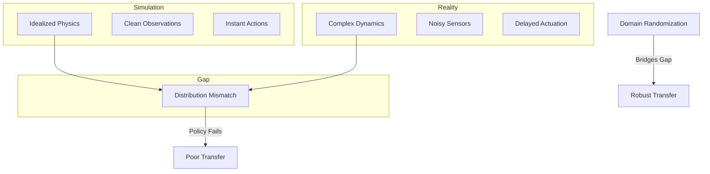
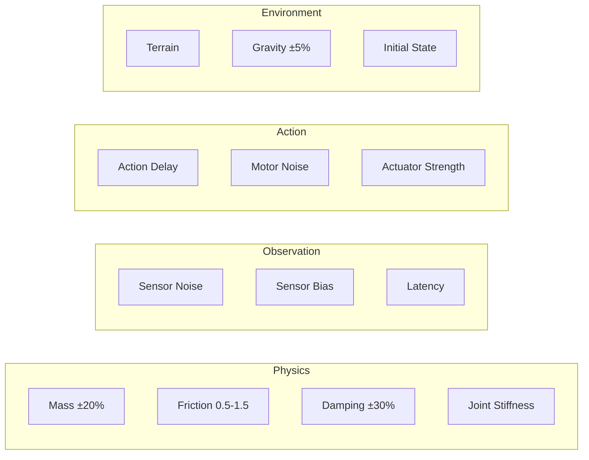

# Chapter 7: Domain Randomization

**Duration**: 4-5 hours
**Difficulty**: Advanced

---

## Learning Objectives

After completing this chapter, you will be able to:

- Explain domain randomization principles
- Implement physics parameter randomization
- Add observation noise
- Apply action delays and disturbances
- Configure randomization ranges for sim-to-real

---

## 7.1 Domain Randomization Principles

### The Sim-to-Real Gap



### Why Domain Randomization Works

| Principle | Explanation |
|-----------|-------------|
| **Distribution Coverage** | Train on broad distribution that includes reality |
| **Invariance Learning** | Policy learns to ignore irrelevant variations |
| **Robustness** | Exposure to extremes builds tolerance |
| **Emergent Adaptation** | Policy learns to handle uncertainty |

### Randomization Categories



---

## 7.2 Physics Randomization

### Mass Randomization

```python
class MassRandomizer:
    """Randomize link masses."""

    def __init__(self, cfg, env):
        self.cfg = cfg
        self.env = env
        self.gym = env.gym
        self.sim = env.sim

        # Get nominal masses
        self.nominal_masses = self._get_nominal_masses()

    def _get_nominal_masses(self):
        """Get default masses from asset."""
        masses = []
        for env, actor in zip(self.env.envs, self.env.actors):
            body_props = self.gym.get_actor_rigid_body_properties(env, actor)
            masses.append([prop.mass for prop in body_props])
        return torch.tensor(masses, device=self.env.device)

    def randomize(self, env_ids: torch.Tensor):
        """
        Randomize masses for specified environments.

        Args:
            env_ids: Indices of environments to randomize
        """
        for env_id in env_ids:
            env = self.env.envs[env_id]
            actor = self.env.actors[env_id]

            body_props = self.gym.get_actor_rigid_body_properties(env, actor)

            for i, prop in enumerate(body_props):
                # Random scale factor
                scale = 1.0 + (
                    torch.rand(1).item() * 2 - 1
                ) * self.cfg.mass_range  # e.g., ±20%

                prop.mass = self.nominal_masses[env_id, i].item() * scale

                # Also scale inertia
                prop.inertia.x *= scale
                prop.inertia.y *= scale
                prop.inertia.z *= scale

            self.gym.set_actor_rigid_body_properties(env, actor, body_props)
```

### Friction Randomization

```python
class FrictionRandomizer:
    """Randomize ground and contact friction."""

    def __init__(self, cfg, env):
        self.cfg = cfg
        self.env = env

    def randomize(self, env_ids: torch.Tensor):
        """Randomize friction coefficients."""
        for env_id in env_ids:
            env = self.env.envs[env_id]
            actor = self.env.actors[env_id]

            shape_props = self.env.gym.get_actor_rigid_shape_properties(env, actor)

            for prop in shape_props:
                # Random friction in range [0.5, 1.5]
                friction = (
                    self.cfg.friction_range[0] +
                    torch.rand(1).item() *
                    (self.cfg.friction_range[1] - self.cfg.friction_range[0])
                )

                prop.friction = friction
                prop.rolling_friction = friction * 0.1
                prop.torsion_friction = friction * 0.01

            self.env.gym.set_actor_rigid_shape_properties(env, actor, shape_props)
```

### Joint Properties Randomization

```python
class JointRandomizer:
    """Randomize joint properties."""

    def __init__(self, cfg, env):
        self.cfg = cfg
        self.env = env

        # Store nominal values
        self.nominal_damping = self._get_nominal_damping()
        self.nominal_armature = self._get_nominal_armature()

    def _get_nominal_damping(self):
        dof_props = self.env.gym.get_actor_dof_properties(
            self.env.envs[0], self.env.actors[0]
        )
        return torch.tensor([prop['damping'] for prop in dof_props], device=self.env.device)

    def _get_nominal_armature(self):
        dof_props = self.env.gym.get_actor_dof_properties(
            self.env.envs[0], self.env.actors[0]
        )
        return torch.tensor([prop['armature'] for prop in dof_props], device=self.env.device)

    def randomize(self, env_ids: torch.Tensor):
        """Randomize joint damping and armature."""
        for env_id in env_ids:
            env = self.env.envs[env_id]
            actor = self.env.actors[env_id]

            dof_props = self.env.gym.get_actor_dof_properties(env, actor)

            for i in range(len(dof_props)):
                # Damping: ±30%
                damping_scale = 1.0 + (
                    torch.rand(1).item() * 2 - 1
                ) * self.cfg.damping_range

                dof_props['damping'][i] = (
                    self.nominal_damping[i].item() * damping_scale
                )

                # Armature: ±50%
                armature_scale = 1.0 + (
                    torch.rand(1).item() * 2 - 1
                ) * self.cfg.armature_range

                dof_props['armature'][i] = (
                    self.nominal_armature[i].item() * armature_scale
                )

            self.env.gym.set_actor_dof_properties(env, actor, dof_props)
```

---

## 7.3 Observation Noise

### Gaussian Noise

```python
class ObservationNoise:
    """Add noise to observations."""

    def __init__(self, cfg, env):
        self.cfg = cfg
        self.env = env
        self.device = env.device

        # Noise scales per observation component
        self.noise_scales = self._build_noise_scales()

    def _build_noise_scales(self):
        """Build noise scale vector matching observation."""
        scales = []

        # Base linear velocity noise
        scales.extend([self.cfg.lin_vel_noise] * 3)

        # Base angular velocity noise
        scales.extend([self.cfg.ang_vel_noise] * 3)

        # Gravity projection noise
        scales.extend([self.cfg.gravity_noise] * 3)

        # DOF position noise
        scales.extend([self.cfg.dof_pos_noise] * self.env.num_dof)

        # DOF velocity noise
        scales.extend([self.cfg.dof_vel_noise] * self.env.num_dof)

        # Command noise (usually none)
        scales.extend([0.0] * 3)

        return torch.tensor(scales, device=self.device)

    def apply(self, obs: torch.Tensor) -> torch.Tensor:
        """
        Add noise to observations.

        Args:
            obs: (N, obs_dim) clean observations

        Returns:
            noisy_obs: (N, obs_dim) noisy observations
        """
        noise = torch.randn_like(obs) * self.noise_scales
        return obs + noise
```

### IMU Noise Model

```python
class IMUNoiseModel:
    """Realistic IMU noise simulation."""

    def __init__(self, cfg):
        self.cfg = cfg

        # Accelerometer noise parameters
        self.acc_noise_density = cfg.acc_noise_density  # m/s^2/sqrt(Hz)
        self.acc_random_walk = cfg.acc_random_walk      # m/s^2

        # Gyroscope noise parameters
        self.gyro_noise_density = cfg.gyro_noise_density  # rad/s/sqrt(Hz)
        self.gyro_random_walk = cfg.gyro_random_walk      # rad/s

        # Bias
        self.acc_bias = None
        self.gyro_bias = None

    def reset(self, num_envs, device):
        """Reset biases on environment reset."""
        # Random bias
        self.acc_bias = torch.randn(num_envs, 3, device=device) * self.acc_random_walk
        self.gyro_bias = torch.randn(num_envs, 3, device=device) * self.gyro_random_walk

    def apply(self, lin_acc, ang_vel, dt):
        """
        Apply IMU noise model.

        Args:
            lin_acc: (N, 3) linear acceleration
            ang_vel: (N, 3) angular velocity
            dt: timestep

        Returns:
            noisy_acc: (N, 3) noisy acceleration
            noisy_gyro: (N, 3) noisy angular velocity
        """
        # White noise
        acc_noise = torch.randn_like(lin_acc) * self.acc_noise_density / np.sqrt(dt)
        gyro_noise = torch.randn_like(ang_vel) * self.gyro_noise_density / np.sqrt(dt)

        # Bias random walk
        self.acc_bias += torch.randn_like(self.acc_bias) * self.acc_random_walk * dt
        self.gyro_bias += torch.randn_like(self.gyro_bias) * self.gyro_random_walk * dt

        # Apply noise and bias
        noisy_acc = lin_acc + acc_noise + self.acc_bias
        noisy_gyro = ang_vel + gyro_noise + self.gyro_bias

        return noisy_acc, noisy_gyro
```

---

## 7.4 Action Randomization

### Action Delay

```python
class ActionDelay:
    """Simulate actuator delay."""

    def __init__(self, cfg, env):
        self.cfg = cfg
        self.env = env
        self.device = env.device

        # Delay buffer (circular)
        self.max_delay = cfg.max_delay_steps
        self.delay_buffer = torch.zeros(
            self.max_delay,
            env.num_envs,
            env.num_actions,
            device=self.device
        )
        self.buffer_idx = 0

        # Per-environment delay (in steps)
        self.delays = torch.zeros(env.num_envs, dtype=torch.long, device=self.device)

    def randomize(self, env_ids: torch.Tensor):
        """Randomize delay for specified environments."""
        n = len(env_ids)
        self.delays[env_ids] = torch.randint(
            self.cfg.min_delay_steps,
            self.cfg.max_delay_steps + 1,
            (n,),
            device=self.device
        )

    def apply(self, actions: torch.Tensor) -> torch.Tensor:
        """
        Apply action delay.

        Args:
            actions: (N, action_dim) current actions

        Returns:
            delayed_actions: (N, action_dim) delayed actions
        """
        # Store current action
        self.delay_buffer[self.buffer_idx] = actions

        # Get delayed actions for each environment
        delayed_actions = torch.zeros_like(actions)
        for delay in range(self.max_delay + 1):
            mask = self.delays == delay
            if mask.any():
                delayed_idx = (self.buffer_idx - delay) % self.max_delay
                delayed_actions[mask] = self.delay_buffer[delayed_idx, mask]

        # Advance buffer index
        self.buffer_idx = (self.buffer_idx + 1) % self.max_delay

        return delayed_actions
```

### Motor Strength Variation

```python
class MotorStrengthRandomizer:
    """Randomize motor strength/torque limits."""

    def __init__(self, cfg, env):
        self.cfg = cfg
        self.env = env

        # Nominal torque limits
        self.nominal_limits = env.torque_limits.clone()

        # Per-environment scaling
        self.strength_scale = torch.ones(
            env.num_envs, env.num_actions, device=env.device
        )

    def randomize(self, env_ids: torch.Tensor):
        """Randomize motor strength."""
        n = len(env_ids)

        # Scale factor: e.g., [0.8, 1.2]
        self.strength_scale[env_ids] = (
            self.cfg.strength_range[0] +
            torch.rand(n, self.env.num_actions, device=self.env.device) *
            (self.cfg.strength_range[1] - self.cfg.strength_range[0])
        )

    def apply(self, torques: torch.Tensor) -> torch.Tensor:
        """
        Apply motor strength scaling.

        Args:
            torques: (N, action_dim) commanded torques

        Returns:
            scaled_torques: (N, action_dim) scaled torques
        """
        return torques * self.strength_scale
```

### External Perturbations

```python
class ExternalPerturbations:
    """Apply random external forces."""

    def __init__(self, cfg, env):
        self.cfg = cfg
        self.env = env
        self.device = env.device

        # Force application
        self.force_prob = cfg.force_probability
        self.force_magnitude = cfg.force_magnitude
        self.force_duration = cfg.force_duration

        # Active forces
        self.active_forces = torch.zeros(
            env.num_envs, 3, device=self.device
        )
        self.force_countdown = torch.zeros(
            env.num_envs, device=self.device
        )

    def step(self):
        """Apply perturbations for one timestep."""
        # Decrement countdown
        self.force_countdown -= 1
        self.force_countdown = torch.clamp(self.force_countdown, min=0)

        # Clear expired forces
        expired = self.force_countdown == 0
        self.active_forces[expired] = 0

        # Randomly trigger new forces
        trigger = torch.rand(self.env.num_envs, device=self.device) < self.force_prob
        trigger = trigger & (self.force_countdown == 0)

        if trigger.any():
            n = trigger.sum()

            # Random force direction
            direction = torch.randn(n, 3, device=self.device)
            direction = direction / direction.norm(dim=-1, keepdim=True)

            # Random magnitude
            magnitude = (
                torch.rand(n, device=self.device) * self.force_magnitude
            ).unsqueeze(-1)

            self.active_forces[trigger] = direction * magnitude
            self.force_countdown[trigger] = self.force_duration

        return self.active_forces

    def apply_to_bodies(self, body_idx: int = 0):
        """
        Apply forces to specified body (e.g., torso).

        Args:
            body_idx: Index of body to apply force to
        """
        forces = self.step()

        # Apply using Isaac Gym API
        force_tensor = torch.zeros(
            self.env.num_envs,
            self.env.num_bodies,
            3,
            device=self.device
        )
        force_tensor[:, body_idx] = forces

        self.env.gym.apply_rigid_body_force_tensors(
            self.env.sim,
            gymtorch.unwrap_tensor(force_tensor),
            None,  # No torques
            gymapi.ENV_SPACE
        )
```

---

## 7.5 Domain Randomization Manager

### Complete Implementation

```python
class DomainRandomizer:
    """
    Manages all domain randomization.
    """

    def __init__(self, cfg, env):
        self.cfg = cfg
        self.env = env

        # Initialize randomizers
        self.mass_randomizer = MassRandomizer(cfg.mass, env)
        self.friction_randomizer = FrictionRandomizer(cfg.friction, env)
        self.joint_randomizer = JointRandomizer(cfg.joint, env)
        self.obs_noise = ObservationNoise(cfg.observation, env)
        self.action_delay = ActionDelay(cfg.action, env)
        self.motor_randomizer = MotorStrengthRandomizer(cfg.motor, env)
        self.perturbations = ExternalPerturbations(cfg.perturbation, env)

        # Randomization intervals
        self.physics_interval = cfg.physics_interval
        self.step_count = 0

    def randomize_on_reset(self, env_ids: torch.Tensor):
        """
        Apply randomization when environments reset.
        """
        if len(env_ids) == 0:
            return

        # Physics properties (heavy operation)
        if self.cfg.randomize_physics:
            self.mass_randomizer.randomize(env_ids)
            self.friction_randomizer.randomize(env_ids)
            self.joint_randomizer.randomize(env_ids)

        # Action randomization
        if self.cfg.randomize_actions:
            self.action_delay.randomize(env_ids)
            self.motor_randomizer.randomize(env_ids)

    def apply_observation_noise(self, obs: torch.Tensor) -> torch.Tensor:
        """Add noise to observations."""
        if self.cfg.randomize_observations:
            return self.obs_noise.apply(obs)
        return obs

    def apply_action_randomization(self, actions: torch.Tensor) -> torch.Tensor:
        """Apply action delay and motor strength."""
        if self.cfg.randomize_actions:
            actions = self.action_delay.apply(actions)
            actions = self.motor_randomizer.apply(actions)
        return actions

    def apply_perturbations(self):
        """Apply external forces."""
        if self.cfg.apply_perturbations:
            self.perturbations.apply_to_bodies(body_idx=0)  # Torso

    def step(self):
        """Called each simulation step."""
        self.step_count += 1
        self.apply_perturbations()
```

### Configuration

```python
@dataclass
class DomainRandomizationCfg:
    """Domain randomization configuration."""

    # Enable flags
    randomize_physics: bool = True
    randomize_observations: bool = True
    randomize_actions: bool = True
    apply_perturbations: bool = True

    # Randomization interval
    physics_interval: int = 1  # Every reset

    @dataclass
    class Mass:
        mass_range: float = 0.2  # ±20%

    @dataclass
    class Friction:
        friction_range: tuple = (0.5, 1.5)

    @dataclass
    class Joint:
        damping_range: float = 0.3   # ±30%
        armature_range: float = 0.5  # ±50%

    @dataclass
    class Observation:
        lin_vel_noise: float = 0.1   # m/s
        ang_vel_noise: float = 0.2   # rad/s
        gravity_noise: float = 0.05
        dof_pos_noise: float = 0.01  # rad
        dof_vel_noise: float = 0.5   # rad/s

    @dataclass
    class Action:
        min_delay_steps: int = 0
        max_delay_steps: int = 2  # Up to 2 steps delay

    @dataclass
    class Motor:
        strength_range: tuple = (0.8, 1.2)

    @dataclass
    class Perturbation:
        force_probability: float = 0.05  # 5% per step
        force_magnitude: float = 50.0    # N
        force_duration: int = 10         # steps

    mass: Mass = field(default_factory=Mass)
    friction: Friction = field(default_factory=Friction)
    joint: Joint = field(default_factory=Joint)
    observation: Observation = field(default_factory=Observation)
    action: Action = field(default_factory=Action)
    motor: Motor = field(default_factory=Motor)
    perturbation: Perturbation = field(default_factory=Perturbation)
```

---

## 7.6 Integration with Training

### Modified Environment Step

```python
class HumanoidTaskWithDR(HumanoidTask):
    """Humanoid task with domain randomization."""

    def __init__(self, cfg, dr_cfg, *args, **kwargs):
        super().__init__(cfg, *args, **kwargs)

        # Initialize domain randomizer
        self.domain_randomizer = DomainRandomizer(dr_cfg, self)

    def step(self, actions: torch.Tensor):
        # Apply action randomization
        randomized_actions = self.domain_randomizer.apply_action_randomization(actions)

        # Store for reward computation
        self.last_actions = self.actions.clone()
        self.actions = randomized_actions

        # Apply torques
        torques = self.actions * self.cfg.control.action_scale * self.torque_limits
        self.gym.set_dof_actuation_force_tensor(
            self.sim, gymtorch.unwrap_tensor(torques.flatten())
        )

        # Apply perturbations
        self.domain_randomizer.step()

        # Step simulation
        self.gym.simulate(self.sim)
        self.gym.fetch_results(self.sim, True)

        # Refresh tensors
        self._refresh_tensors()

        # Compute observations (with noise)
        self._compute_observations()
        self.obs_buf = self.domain_randomizer.apply_observation_noise(self.obs_buf)

        # Compute rewards and check termination
        self._compute_rewards()
        self._check_termination()

        # Reset and randomize
        reset_ids = self.reset_buf.nonzero(as_tuple=False).squeeze(-1)
        if len(reset_ids) > 0:
            self._reset_envs(reset_ids)
            self.domain_randomizer.randomize_on_reset(reset_ids)

        return self.obs_buf, self.rew_buf, self.reset_buf, {}
```

---

## 7.7 Randomization Guidelines

### Recommended Ranges

| Parameter | Sim Training | Sim-to-Real |
|-----------|--------------|-------------|
| Mass | ±10% | ±20% |
| Friction | 0.7-1.3 | 0.5-1.5 |
| Damping | ±20% | ±30% |
| Obs noise (vel) | 0.05 | 0.1-0.2 |
| Action delay | 0-1 step | 0-2 steps |
| Motor strength | 0.9-1.1 | 0.8-1.2 |

### Progressive Randomization

```python
def get_randomization_strength(iteration, max_iterations, warmup=0.2):
    """
    Gradually increase randomization during training.
    """
    if iteration < max_iterations * warmup:
        # Linear warmup
        progress = iteration / (max_iterations * warmup)
        return 0.5 * progress  # Start at 50% strength
    else:
        return 1.0  # Full randomization

# Usage
strength = get_randomization_strength(iteration, 10000)
cfg.mass.mass_range = 0.2 * strength
cfg.observation.lin_vel_noise = 0.1 * strength
```

---

## Hands-On Exercises

### Exercise 7.1: Implement Mass Randomization

1. Add mass randomization to environment
2. Test with ±20% range
3. Verify robot still learns
4. Compare training curves

### Exercise 7.2: Add Observation Noise

1. Implement Gaussian noise on observations
2. Start with small noise (0.05)
3. Increase gradually
4. Find noise tolerance limit

### Exercise 7.3: Action Delay

1. Implement 1-2 step action delay
2. Train policy with delay
3. Test policy without delay
4. Document robustness improvement

---

## Summary

In this chapter, you learned:

- Domain randomization bridges sim-to-real gap
- Physics randomization (mass, friction, joints)
- Observation noise for sensor uncertainty
- Action delays and motor variations
- External perturbations for robustness
- Integration with training pipeline

## Next Chapter

In [Chapter 8](ch08-curriculum-learning.md), you will implement curriculum learning for progressive difficulty.

---

## Quick Reference

```python
# Physics randomization
mass: ±20%           # Robust to weight changes
friction: [0.5, 1.5] # Various surfaces
damping: ±30%        # Joint dynamics

# Observation noise
lin_vel: 0.1 m/s     # Velocity estimation error
ang_vel: 0.2 rad/s   # Gyro noise
dof_pos: 0.01 rad    # Encoder noise

# Action randomization
delay: 0-2 steps     # Actuator latency
strength: [0.8, 1.2] # Motor variation

# Perturbations
force: 50N           # Push disturbance
prob: 0.05           # 5% per step
duration: 10 steps   # ~83ms at 120Hz
```

| Randomization | Purpose |
|--------------|---------|
| Mass | Weight uncertainty |
| Friction | Surface variation |
| Obs noise | Sensor noise |
| Action delay | Actuator latency |
| Perturbations | External forces |
