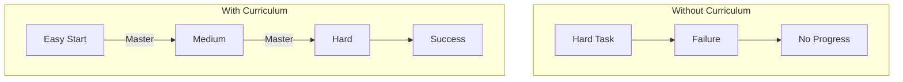
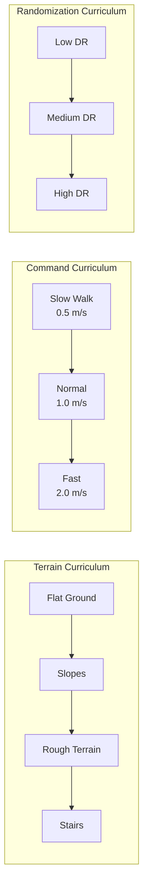

# Chapter 8: Curriculum Learning

**Duration**: 3-4 hours
**Difficulty**: Advanced

---

## Learning Objectives

After completing this chapter, you will be able to:

- Explain curriculum learning principles
- Implement terrain curriculum
- Design command curriculum
- Create adaptive difficulty adjustment
- Monitor curriculum progression

---

## 8.1 Curriculum Learning Principles

### Why Curriculum Learning?



### Key Concepts

| Concept | Description |
|---------|-------------|
| **Progressive Difficulty** | Start easy, increase gradually |
| **Mastery Criterion** | Advance when performance threshold met |
| **Multiple Dimensions** | Commands, terrain, physics |
| **Adaptive Pacing** | Adjust based on learning speed |

### Curriculum Dimensions



---

## 8.2 Terrain Curriculum

### Terrain Types

```python
class TerrainType(Enum):
    """Available terrain types."""
    FLAT = 0
    SLOPE = 1
    ROUGH = 2
    STAIRS = 3
    DISCRETE = 4


class TerrainGenerator:
    """Generate various terrain types."""

    def __init__(self, cfg):
        self.cfg = cfg
        self.horizontal_scale = cfg.horizontal_scale
        self.vertical_scale = cfg.vertical_scale

    def flat_terrain(self, width, length):
        """Generate flat terrain."""
        heightfield = np.zeros((width, length), dtype=np.int16)
        return heightfield

    def slope_terrain(self, width, length, slope_angle):
        """Generate sloped terrain."""
        heightfield = np.zeros((width, length), dtype=np.int16)

        slope = np.tan(np.radians(slope_angle))

        for i in range(length):
            height = int(i * self.horizontal_scale * slope / self.vertical_scale)
            heightfield[:, i] = height

        return heightfield

    def rough_terrain(self, width, length, amplitude):
        """Generate rough terrain with random bumps."""
        heightfield = np.zeros((width, length), dtype=np.int16)

        # Perlin noise for smooth variation
        from noise import snoise2

        for i in range(width):
            for j in range(length):
                noise_val = snoise2(
                    i * 0.1, j * 0.1,
                    octaves=4, persistence=0.5
                )
                heightfield[i, j] = int(
                    noise_val * amplitude / self.vertical_scale
                )

        return heightfield

    def stairs_terrain(self, width, length, step_height, step_width):
        """Generate stairs terrain."""
        heightfield = np.zeros((width, length), dtype=np.int16)

        num_steps = length * self.horizontal_scale // step_width
        step_height_scaled = int(step_height / self.vertical_scale)

        for i in range(length):
            step_idx = int(i * self.horizontal_scale / step_width)
            heightfield[:, i] = step_idx * step_height_scaled

        return heightfield
```

### Terrain Curriculum Manager

```python
class TerrainCurriculum:
    """
    Manages terrain difficulty progression.
    """

    def __init__(self, cfg, env):
        self.cfg = cfg
        self.env = env
        self.device = env.device

        # Curriculum levels
        self.num_levels = cfg.num_levels
        self.level_thresholds = cfg.level_thresholds

        # Per-environment level tracking
        self.terrain_levels = torch.zeros(
            env.num_envs, dtype=torch.long, device=self.device
        )

        # Performance tracking
        self.episode_rewards = torch.zeros(env.num_envs, device=self.device)
        self.level_performance = torch.zeros(
            env.num_envs, self.num_levels, device=self.device
        )

        # Generate terrain
        self.terrain_generator = TerrainGenerator(cfg.terrain)
        self._create_terrains()

    def _create_terrains(self):
        """Create all terrain levels."""
        self.heightfields = []

        # Level 0: Flat
        self.heightfields.append(
            self.terrain_generator.flat_terrain(100, 100)
        )

        # Level 1: Gentle slopes (5 degrees)
        self.heightfields.append(
            self.terrain_generator.slope_terrain(100, 100, 5)
        )

        # Level 2: Steeper slopes (10 degrees)
        self.heightfields.append(
            self.terrain_generator.slope_terrain(100, 100, 10)
        )

        # Level 3: Rough terrain (low amplitude)
        self.heightfields.append(
            self.terrain_generator.rough_terrain(100, 100, 0.05)
        )

        # Level 4: Rough terrain (high amplitude)
        self.heightfields.append(
            self.terrain_generator.rough_terrain(100, 100, 0.1)
        )

        # Level 5: Stairs (small steps)
        self.heightfields.append(
            self.terrain_generator.stairs_terrain(100, 100, 0.05, 0.3)
        )

    def update_performance(self, rewards, dones):
        """
        Update performance metrics and adjust levels.

        Args:
            rewards: (N,) episode rewards
            dones: (N,) episode termination flags
        """
        # Accumulate episode rewards
        self.episode_rewards += rewards

        # On episode end, record performance
        finished = dones.nonzero(as_tuple=False).squeeze(-1)

        for env_id in finished:
            level = self.terrain_levels[env_id].item()
            reward = self.episode_rewards[env_id].item()

            # Update level performance (moving average)
            alpha = 0.1
            self.level_performance[env_id, level] = (
                (1 - alpha) * self.level_performance[env_id, level] +
                alpha * reward
            )

            # Reset episode reward
            self.episode_rewards[env_id] = 0

    def advance_levels(self):
        """
        Check and advance curriculum levels.
        """
        for env_id in range(self.env.num_envs):
            current_level = self.terrain_levels[env_id].item()
            performance = self.level_performance[env_id, current_level].item()

            # Advance if above threshold and not at max level
            if (performance > self.level_thresholds[current_level] and
                current_level < self.num_levels - 1):

                self.terrain_levels[env_id] += 1
                print(f"Env {env_id}: Advanced to level {current_level + 1}")

            # Regress if performance drops significantly
            elif (performance < self.level_thresholds[current_level] * 0.5 and
                  current_level > 0):

                self.terrain_levels[env_id] -= 1
                print(f"Env {env_id}: Regressed to level {current_level - 1}")

    def get_terrain_for_env(self, env_id: int):
        """Get terrain heightfield for environment."""
        level = self.terrain_levels[env_id].item()
        return self.heightfields[level]
```

---

## 8.3 Command Curriculum

### Velocity Command Scaling

```python
class CommandCurriculum:
    """
    Curriculum for velocity command ranges.
    """

    def __init__(self, cfg, env):
        self.cfg = cfg
        self.env = env
        self.device = env.device

        # Command ranges per level
        self.velocity_ranges = [
            (-0.5, 0.5),   # Level 0: Very slow
            (-0.5, 1.0),   # Level 1: Slow
            (-0.5, 1.5),   # Level 2: Normal
            (-1.0, 2.0),   # Level 3: Fast
            (-1.0, 2.5),   # Level 4: Very fast
        ]

        self.yaw_ranges = [
            (-0.25, 0.25), # Level 0: Small turns
            (-0.5, 0.5),   # Level 1: Medium turns
            (-1.0, 1.0),   # Level 2: Large turns
        ]

        # Per-environment levels
        self.vel_level = torch.zeros(env.num_envs, dtype=torch.long, device=self.device)
        self.yaw_level = torch.zeros(env.num_envs, dtype=torch.long, device=self.device)

        # Performance tracking
        self.tracking_errors = torch.zeros(env.num_envs, device=self.device)
        self.episode_count = torch.zeros(env.num_envs, device=self.device)

    def sample_commands(self, env_ids: torch.Tensor) -> torch.Tensor:
        """
        Sample commands based on curriculum level.

        Args:
            env_ids: Environment indices to sample for

        Returns:
            commands: (len(env_ids), 3) velocity commands
        """
        n = len(env_ids)
        commands = torch.zeros(n, 3, device=self.device)

        for i, env_id in enumerate(env_ids):
            vel_level = self.vel_level[env_id].item()
            yaw_level = self.yaw_level[env_id].item()

            vel_range = self.velocity_ranges[vel_level]
            yaw_range = self.yaw_ranges[yaw_level]

            # Sample forward velocity
            commands[i, 0] = (
                vel_range[0] +
                torch.rand(1, device=self.device).item() *
                (vel_range[1] - vel_range[0])
            )

            # Sample lateral velocity (smaller range)
            commands[i, 1] = (
                torch.rand(1, device=self.device).item() * 0.6 - 0.3
            )

            # Sample yaw rate
            commands[i, 2] = (
                yaw_range[0] +
                torch.rand(1, device=self.device).item() *
                (yaw_range[1] - yaw_range[0])
            )

        return commands

    def update(self, tracking_error, dones):
        """
        Update curriculum based on tracking performance.

        Args:
            tracking_error: (N,) velocity tracking error
            dones: (N,) episode termination flags
        """
        # Accumulate tracking error
        self.tracking_errors += tracking_error

        # On episode end, evaluate performance
        finished = dones.nonzero(as_tuple=False).squeeze(-1)

        for env_id in finished:
            avg_error = self.tracking_errors[env_id].item()

            # Good tracking → advance level
            if avg_error < self.cfg.advance_threshold:
                self._advance_level(env_id)

            # Poor tracking → regress level
            elif avg_error > self.cfg.regress_threshold:
                self._regress_level(env_id)

            # Reset tracking
            self.tracking_errors[env_id] = 0
            self.episode_count[env_id] += 1

    def _advance_level(self, env_id):
        """Advance curriculum level."""
        if self.vel_level[env_id] < len(self.velocity_ranges) - 1:
            self.vel_level[env_id] += 1

        if self.yaw_level[env_id] < len(self.yaw_ranges) - 1:
            self.yaw_level[env_id] += 1

    def _regress_level(self, env_id):
        """Regress curriculum level."""
        if self.vel_level[env_id] > 0:
            self.vel_level[env_id] -= 1

        if self.yaw_level[env_id] > 0:
            self.yaw_level[env_id] -= 1
```

---

## 8.4 Adaptive Curriculum

### Performance-Based Adaptation

```python
class AdaptiveCurriculum:
    """
    Curriculum that adapts based on policy performance.
    """

    def __init__(self, cfg, env):
        self.cfg = cfg
        self.env = env
        self.device = env.device

        # Global difficulty (0-1)
        self.difficulty = torch.zeros(env.num_envs, device=self.device)

        # Performance history (moving average)
        self.performance_history = torch.zeros(
            env.num_envs, cfg.history_length, device=self.device
        )
        self.history_idx = 0

        # Adaptation parameters
        self.target_success_rate = cfg.target_success_rate
        self.min_difficulty = cfg.min_difficulty
        self.max_difficulty = cfg.max_difficulty
        self.adaptation_rate = cfg.adaptation_rate

    def get_difficulty_params(self):
        """
        Get difficulty-scaled parameters.

        Returns:
            Dict of difficulty-scaled parameters
        """
        d = self.difficulty.unsqueeze(-1)  # (N, 1)

        return {
            # Command ranges scale with difficulty
            "max_velocity": 0.5 + d * 1.5,           # 0.5 → 2.0
            "max_yaw_rate": 0.25 + d * 0.75,         # 0.25 → 1.0

            # Terrain roughness
            "terrain_amplitude": d * 0.1,            # 0 → 0.1

            # Domain randomization
            "mass_range": d * 0.2,                   # 0 → 0.2
            "friction_range": 0.3 + d * 0.4,         # 0.3 → 0.7

            # Noise levels
            "obs_noise_scale": d * 1.0,              # 0 → 1.0
        }

    def update(self, success_flags: torch.Tensor, dones: torch.Tensor):
        """
        Update difficulty based on success rate.

        Args:
            success_flags: (N,) True if episode was successful
            dones: (N,) Episode termination flags
        """
        finished = dones.nonzero(as_tuple=False).squeeze(-1)

        if len(finished) == 0:
            return

        # Record success in history
        self.performance_history[finished, self.history_idx] = success_flags[finished].float()

        # Compute success rate
        success_rate = self.performance_history[finished].mean(dim=-1)

        # Adapt difficulty
        for i, env_id in enumerate(finished):
            rate = success_rate[i].item()

            if rate > self.target_success_rate + 0.1:
                # Too easy, increase difficulty
                self.difficulty[env_id] = min(
                    self.difficulty[env_id] + self.adaptation_rate,
                    self.max_difficulty
                )
            elif rate < self.target_success_rate - 0.1:
                # Too hard, decrease difficulty
                self.difficulty[env_id] = max(
                    self.difficulty[env_id] - self.adaptation_rate,
                    self.min_difficulty
                )

        # Advance history index
        self.history_idx = (self.history_idx + 1) % self.cfg.history_length

    def get_metrics(self):
        """Get curriculum metrics for logging."""
        return {
            "mean_difficulty": self.difficulty.mean().item(),
            "min_difficulty": self.difficulty.min().item(),
            "max_difficulty": self.difficulty.max().item(),
            "success_rate": self.performance_history.mean().item(),
        }
```

---

## 8.5 Integrated Curriculum System

### Complete Implementation

```python
class CurriculumManager:
    """
    Manages all curriculum components.
    """

    def __init__(self, cfg, env):
        self.cfg = cfg
        self.env = env

        # Initialize curricula
        self.terrain_curriculum = TerrainCurriculum(cfg.terrain, env)
        self.command_curriculum = CommandCurriculum(cfg.command, env)
        self.adaptive_curriculum = AdaptiveCurriculum(cfg.adaptive, env)

        # Global progress tracking
        self.total_episodes = 0
        self.successful_episodes = 0

    def on_reset(self, env_ids: torch.Tensor):
        """
        Called when environments reset.
        """
        # Sample new commands
        commands = self.command_curriculum.sample_commands(env_ids)
        self.env.commands[env_ids] = commands

    def on_step(self, rewards, dones, infos):
        """
        Called each environment step.
        """
        # Compute tracking error
        tracking_error = torch.sum(
            torch.square(self.env.commands[:, :2] - self.env.base_lin_vel[:, :2]),
            dim=-1
        )

        # Update command curriculum
        self.command_curriculum.update(tracking_error, dones)

        # Update terrain curriculum
        self.terrain_curriculum.update_performance(rewards, dones)

        # Check for success (completed episode without falling)
        success = dones & (self.env.episode_length >= self.env.max_episode_length * 0.9)

        # Update adaptive curriculum
        self.adaptive_curriculum.update(success, dones)

        # Track global progress
        self.total_episodes += dones.sum().item()
        self.successful_episodes += success.sum().item()

    def periodic_update(self, iteration: int):
        """
        Called periodically during training.
        """
        # Advance terrain levels
        if iteration % self.cfg.level_advance_interval == 0:
            self.terrain_curriculum.advance_levels()

    def get_metrics(self):
        """Get curriculum metrics for logging."""
        return {
            "terrain_mean_level": self.terrain_curriculum.terrain_levels.float().mean().item(),
            "command_vel_level": self.command_curriculum.vel_level.float().mean().item(),
            "command_yaw_level": self.command_curriculum.yaw_level.float().mean().item(),
            **self.adaptive_curriculum.get_metrics(),
            "global_success_rate": (
                self.successful_episodes / max(self.total_episodes, 1)
            ),
        }
```

### Training Integration

```python
class HumanoidTaskWithCurriculum(HumanoidTask):
    """Humanoid task with curriculum learning."""

    def __init__(self, cfg, curriculum_cfg, *args, **kwargs):
        super().__init__(cfg, *args, **kwargs)

        # Initialize curriculum
        self.curriculum = CurriculumManager(curriculum_cfg, self)

    def step(self, actions):
        obs, rewards, dones, info = super().step(actions)

        # Update curriculum
        self.curriculum.on_step(rewards, dones, info)

        return obs, rewards, dones, info

    def _reset_envs(self, env_ids):
        super()._reset_envs(env_ids)

        # Curriculum reset
        self.curriculum.on_reset(env_ids)
```

---

## 8.6 Curriculum Configuration

```python
@dataclass
class CurriculumConfig:
    """Complete curriculum configuration."""

    # Update intervals
    level_advance_interval: int = 500  # iterations

    @dataclass
    class Terrain:
        num_levels: int = 6
        level_thresholds: list = field(default_factory=lambda: [
            50.0,   # Level 0 → 1
            75.0,   # Level 1 → 2
            100.0,  # Level 2 → 3
            125.0,  # Level 3 → 4
            150.0,  # Level 4 → 5
            float('inf'),  # Max level
        ])

    @dataclass
    class Command:
        advance_threshold: float = 0.2   # Low tracking error
        regress_threshold: float = 0.5   # High tracking error

    @dataclass
    class Adaptive:
        history_length: int = 100
        target_success_rate: float = 0.7
        min_difficulty: float = 0.1
        max_difficulty: float = 1.0
        adaptation_rate: float = 0.05

    terrain: Terrain = field(default_factory=Terrain)
    command: Command = field(default_factory=Command)
    adaptive: Adaptive = field(default_factory=Adaptive)
```

---

## Hands-On Exercises

### Exercise 8.1: Implement Terrain Curriculum

1. Create flat → slope → rough progression
2. Implement level advancement logic
3. Track per-environment level
4. Visualize terrain distribution

### Exercise 8.2: Command Curriculum

1. Start with slow velocities (0.5 m/s)
2. Advance to normal (1.0 m/s)
3. Progress to fast (2.0 m/s)
4. Track tracking error improvement

### Exercise 8.3: Adaptive Difficulty

1. Implement success rate tracking
2. Create difficulty scaling
3. Test adaptation response
4. Plot difficulty over training

---

## Summary

In this chapter, you learned:

- Curriculum learning accelerates training
- Terrain curriculum for surface variety
- Command curriculum for velocity ranges
- Adaptive difficulty based on performance
- Integration with training pipeline

## Next Chapter

In [Chapter 9](ch09-policy-deployment.md), you will export and deploy trained policies.

---

## Quick Reference

```python
# Terrain curriculum levels
Level 0: Flat ground
Level 1: Gentle slopes (5°)
Level 2: Steep slopes (10°)
Level 3: Light roughness
Level 4: Heavy roughness
Level 5: Stairs

# Command curriculum
Level 0: 0.5 m/s max velocity
Level 1: 1.0 m/s max velocity
Level 2: 1.5 m/s max velocity
Level 3: 2.0 m/s max velocity

# Advancement criteria
Advance: success_rate > 0.8
Regress: success_rate < 0.5

# Adaptive difficulty
difficulty = clamp(
    difficulty + rate * (success - target),
    min_difficulty,
    max_difficulty
)
```

| Curriculum | Dimension | Progression |
|------------|-----------|-------------|
| Terrain | Surface type | Flat → Rough → Stairs |
| Command | Velocity | Slow → Normal → Fast |
| Randomization | Variation | Low → High |
| Adaptive | All | Performance-based |
