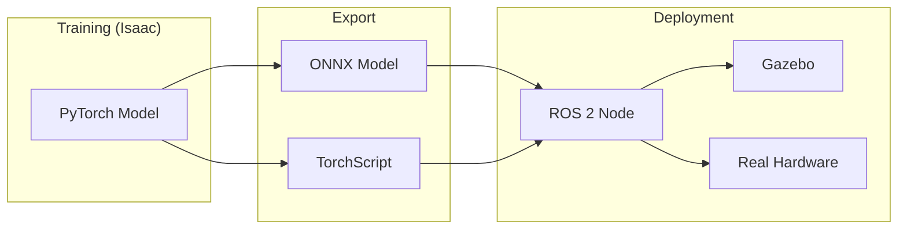

# Chapter 9: Policy Export and Deployment

**Duration**: 4-5 hours
**Difficulty**: Advanced

---

## Learning Objectives

After completing this chapter, you will be able to:

- Export trained policies to ONNX format
- Create ROS 2 policy inference node
- Deploy policy to Gazebo simulation
- Implement real-time inference pipeline
- Benchmark inference performance

---

## 9.1 Policy Export Overview

### Deployment Pipeline



### Export Format Comparison

| Format | Pros | Cons | Use Case |
|--------|------|------|----------|
| ONNX | Portable, optimized | Limited ops | Production |
| TorchScript | PyTorch native | Requires PyTorch | Development |
| TensorRT | Fastest inference | NVIDIA only | Edge deployment |

---

## 9.2 ONNX Export

### Basic Export

```python
import torch
import torch.onnx


def export_policy_onnx(
    model: torch.nn.Module,
    obs_dim: int,
    output_path: str,
    opset_version: int = 11,
):
    """
    Export trained policy to ONNX format.

    Args:
        model: Trained PyTorch model
        obs_dim: Observation dimension
        output_path: Path to save ONNX file
        opset_version: ONNX opset version
    """
    model.eval()

    # Create dummy input
    dummy_input = torch.randn(1, obs_dim, device="cuda")

    # Export to ONNX
    torch.onnx.export(
        model,
        dummy_input,
        output_path,
        export_params=True,
        opset_version=opset_version,
        do_constant_folding=True,
        input_names=["observation"],
        output_names=["action"],
        dynamic_axes={
            "observation": {0: "batch_size"},
            "action": {0: "batch_size"},
        },
    )

    print(f"Exported ONNX model to {output_path}")

    # Verify export
    import onnx
    onnx_model = onnx.load(output_path)
    onnx.checker.check_model(onnx_model)
    print("ONNX model verified successfully")
```

### Export Actor Only

```python
class ActorForExport(torch.nn.Module):
    """
    Wrapper to export only the actor (policy) part.
    """

    def __init__(self, actor_critic: ActorCritic):
        super().__init__()
        self.encoder = actor_critic.encoder
        self.actor_mean = actor_critic.actor_mean

    def forward(self, obs: torch.Tensor) -> torch.Tensor:
        """
        Forward pass for deterministic action.

        Args:
            obs: (batch, obs_dim) observations

        Returns:
            actions: (batch, action_dim) deterministic actions
        """
        features = self.encoder(obs)
        actions = self.actor_mean(features)
        return actions


def export_actor_onnx(actor_critic, obs_dim, output_path):
    """Export only the actor network."""
    actor = ActorForExport(actor_critic)
    actor.eval()

    dummy_input = torch.randn(1, obs_dim, device="cuda")

    torch.onnx.export(
        actor,
        dummy_input,
        output_path,
        export_params=True,
        opset_version=11,
        input_names=["observation"],
        output_names=["action"],
        dynamic_axes={
            "observation": {0: "batch_size"},
            "action": {0: "batch_size"},
        },
    )

    return output_path
```

### TorchScript Export

```python
def export_policy_torchscript(
    model: torch.nn.Module,
    obs_dim: int,
    output_path: str,
):
    """
    Export policy to TorchScript format.

    Args:
        model: Trained PyTorch model
        obs_dim: Observation dimension
        output_path: Path to save TorchScript file
    """
    model.eval()

    # Trace the model
    dummy_input = torch.randn(1, obs_dim, device="cuda")

    with torch.no_grad():
        traced_model = torch.jit.trace(model, dummy_input)

    # Optimize for inference
    traced_model = torch.jit.freeze(traced_model)

    # Save
    traced_model.save(output_path)
    print(f"Exported TorchScript model to {output_path}")

    return output_path
```

---

## 9.3 ONNX Runtime Inference

### Python Inference

```python
import onnxruntime as ort
import numpy as np


class ONNXPolicyInference:
    """
    ONNX Runtime policy inference.
    """

    def __init__(self, model_path: str, device: str = "cuda"):
        # Configure session options
        sess_options = ort.SessionOptions()
        sess_options.graph_optimization_level = (
            ort.GraphOptimizationLevel.ORT_ENABLE_ALL
        )

        # Select execution provider
        if device == "cuda":
            providers = [
                ("CUDAExecutionProvider", {
                    "device_id": 0,
                    "arena_extend_strategy": "kNextPowerOfTwo",
                    "gpu_mem_limit": 2 * 1024 * 1024 * 1024,  # 2GB
                }),
                "CPUExecutionProvider",
            ]
        else:
            providers = ["CPUExecutionProvider"]

        # Create session
        self.session = ort.InferenceSession(
            model_path,
            sess_options,
            providers=providers,
        )

        # Get input/output names
        self.input_name = self.session.get_inputs()[0].name
        self.output_name = self.session.get_outputs()[0].name

        # Warm up
        dummy = np.zeros((1, 48), dtype=np.float32)
        self.session.run([self.output_name], {self.input_name: dummy})

    def infer(self, observation: np.ndarray) -> np.ndarray:
        """
        Run inference on observation.

        Args:
            observation: (obs_dim,) or (batch, obs_dim) numpy array

        Returns:
            action: (action_dim,) or (batch, action_dim) numpy array
        """
        # Ensure batch dimension
        if observation.ndim == 1:
            observation = observation[np.newaxis, :]

        # Ensure float32
        observation = observation.astype(np.float32)

        # Run inference
        outputs = self.session.run(
            [self.output_name],
            {self.input_name: observation},
        )

        return outputs[0].squeeze()


# Usage
policy = ONNXPolicyInference("policy.onnx", device="cuda")
obs = np.random.randn(48).astype(np.float32)
action = policy.infer(obs)
print(f"Action: {action}")
```

---

## 9.4 ROS 2 Policy Node

### Node Implementation

```python
#!/usr/bin/env python3
"""humanoid_policy_node.py - ROS 2 policy inference node."""

import rclpy
from rclpy.node import Node
from rclpy.qos import QoSProfile, ReliabilityPolicy

import numpy as np
import onnxruntime as ort

from sensor_msgs.msg import JointState, Imu
from geometry_msgs.msg import Twist
from std_msgs.msg import Float64MultiArray


class HumanoidPolicyNode(Node):
    """
    ROS 2 node for humanoid policy inference.

    Subscribes:
        - /joint_states: Joint positions and velocities
        - /imu: IMU sensor data
        - /cmd_vel: Velocity commands

    Publishes:
        - /joint_commands: Joint torque commands
    """

    def __init__(self):
        super().__init__("humanoid_policy_node")

        # Declare parameters
        self.declare_parameter("model_path", "policy.onnx")
        self.declare_parameter("inference_rate", 100.0)  # Hz
        self.declare_parameter("action_scale", 0.5)

        # Get parameters
        model_path = self.get_parameter("model_path").value
        self.inference_rate = self.get_parameter("inference_rate").value
        self.action_scale = self.get_parameter("action_scale").value

        # Load ONNX model
        self.policy = ONNXPolicyInference(model_path, device="cpu")
        self.get_logger().info(f"Loaded policy from {model_path}")

        # Robot configuration
        self.num_dofs = 14
        self.obs_dim = 48

        # State buffers
        self.joint_positions = np.zeros(self.num_dofs, dtype=np.float32)
        self.joint_velocities = np.zeros(self.num_dofs, dtype=np.float32)
        self.base_lin_vel = np.zeros(3, dtype=np.float32)
        self.base_ang_vel = np.zeros(3, dtype=np.float32)
        self.gravity_proj = np.array([0., 0., -1.], dtype=np.float32)
        self.commands = np.zeros(3, dtype=np.float32)
        self.last_actions = np.zeros(self.num_dofs, dtype=np.float32)

        # Default joint positions (standing pose)
        self.default_dof_pos = np.array([
            0.0, 0.0, 0.0, 0.3, 0.0,  # Left leg
            0.0, 0.0, 0.0, 0.3, 0.0,  # Right leg
            0.0, 0.0,                  # Left arm
            0.0, 0.0,                  # Right arm
        ], dtype=np.float32)

        # Observation scales
        self.lin_vel_scale = 2.0
        self.ang_vel_scale = 0.25
        self.dof_pos_scale = 1.0
        self.dof_vel_scale = 0.05

        # QoS profile
        qos = QoSProfile(depth=10, reliability=ReliabilityPolicy.BEST_EFFORT)

        # Subscribers
        self.joint_sub = self.create_subscription(
            JointState, "/joint_states", self.joint_callback, qos
        )
        self.imu_sub = self.create_subscription(
            Imu, "/imu", self.imu_callback, qos
        )
        self.cmd_sub = self.create_subscription(
            Twist, "/cmd_vel", self.cmd_callback, qos
        )

        # Publisher
        self.cmd_pub = self.create_publisher(
            Float64MultiArray, "/joint_commands", 10
        )

        # Timer for inference
        period = 1.0 / self.inference_rate
        self.timer = self.create_timer(period, self.inference_callback)

        self.get_logger().info(
            f"Policy node started at {self.inference_rate} Hz"
        )

    def joint_callback(self, msg: JointState):
        """Process joint state message."""
        # Assume joints are in order
        for i, (pos, vel) in enumerate(zip(msg.position, msg.velocity)):
            if i < self.num_dofs:
                self.joint_positions[i] = pos
                self.joint_velocities[i] = vel

    def imu_callback(self, msg: Imu):
        """Process IMU message."""
        # Linear acceleration (approximates body-frame velocity derivative)
        self.base_lin_vel[0] = msg.linear_acceleration.x * 0.01
        self.base_lin_vel[1] = msg.linear_acceleration.y * 0.01
        self.base_lin_vel[2] = msg.linear_acceleration.z * 0.01

        # Angular velocity
        self.base_ang_vel[0] = msg.angular_velocity.x
        self.base_ang_vel[1] = msg.angular_velocity.y
        self.base_ang_vel[2] = msg.angular_velocity.z

        # Gravity projection from orientation
        q = msg.orientation
        self.gravity_proj = self._quat_rotate_inverse(
            np.array([q.x, q.y, q.z, q.w]),
            np.array([0., 0., -1.])
        )

    def cmd_callback(self, msg: Twist):
        """Process velocity command."""
        self.commands[0] = msg.linear.x   # Forward velocity
        self.commands[1] = msg.linear.y   # Lateral velocity
        self.commands[2] = msg.angular.z  # Yaw rate

    def inference_callback(self):
        """Run policy inference and publish commands."""
        # Build observation vector
        obs = self._build_observation()

        # Run inference
        action = self.policy.infer(obs)

        # Scale action to torques
        torques = action * self.action_scale * 100.0  # Assuming 100 Nm max

        # Update last actions
        self.last_actions = action.copy()

        # Publish
        msg = Float64MultiArray()
        msg.data = torques.tolist()
        self.cmd_pub.publish(msg)

    def _build_observation(self) -> np.ndarray:
        """Build observation vector from sensor data."""
        obs = np.concatenate([
            self.base_lin_vel * self.lin_vel_scale,
            self.base_ang_vel * self.ang_vel_scale,
            self.gravity_proj,
            (self.joint_positions - self.default_dof_pos) * self.dof_pos_scale,
            self.joint_velocities * self.dof_vel_scale,
            self.commands,
            self.last_actions,
        ])

        # Clip observations
        obs = np.clip(obs, -100.0, 100.0)

        return obs.astype(np.float32)

    def _quat_rotate_inverse(self, q, v):
        """Rotate vector by inverse of quaternion."""
        q_w = q[3]
        q_vec = q[:3]
        a = v * (2.0 * q_w ** 2 - 1.0)
        b = np.cross(q_vec, v) * q_w * 2.0
        c = q_vec * np.dot(q_vec, v) * 2.0
        return a - b + c


def main(args=None):
    rclpy.init(args=args)
    node = HumanoidPolicyNode()
    rclpy.spin(node)
    node.destroy_node()
    rclpy.shutdown()


if __name__ == "__main__":
    main()
```

### Package Configuration

```xml
<!-- package.xml -->
<?xml version="1.0"?>
<package format="3">
  <name>humanoid_policy</name>
  <version>0.1.0</version>
  <description>Humanoid locomotion policy inference</description>

  <maintainer email="user@example.com">User</maintainer>
  <license>MIT</license>

  <buildtool_depend>ament_python</buildtool_depend>

  <exec_depend>rclpy</exec_depend>
  <exec_depend>std_msgs</exec_depend>
  <exec_depend>sensor_msgs</exec_depend>
  <exec_depend>geometry_msgs</exec_depend>

  <export>
    <build_type>ament_python</build_type>
  </export>
</package>
```

```python
# setup.py
from setuptools import setup

package_name = "humanoid_policy"

setup(
    name=package_name,
    version="0.1.0",
    packages=[package_name],
    data_files=[
        ("share/ament_index/resource_index/packages", ["resource/" + package_name]),
        ("share/" + package_name, ["package.xml"]),
        ("share/" + package_name + "/launch", ["launch/policy.launch.py"]),
        ("share/" + package_name + "/models", ["models/policy.onnx"]),
    ],
    install_requires=["setuptools", "onnxruntime", "numpy"],
    entry_points={
        "console_scripts": [
            "policy_node = humanoid_policy.humanoid_policy_node:main",
        ],
    },
)
```

### Launch File

```python
# launch/policy.launch.py
from launch import LaunchDescription
from launch_ros.actions import Node
from launch.actions import DeclareLaunchArgument
from launch.substitutions import LaunchConfiguration


def generate_launch_description():
    return LaunchDescription([
        DeclareLaunchArgument(
            "model_path",
            default_value="/path/to/policy.onnx",
            description="Path to ONNX policy model",
        ),
        DeclareLaunchArgument(
            "inference_rate",
            default_value="100.0",
            description="Policy inference rate in Hz",
        ),
        Node(
            package="humanoid_policy",
            executable="policy_node",
            name="humanoid_policy",
            output="screen",
            parameters=[{
                "model_path": LaunchConfiguration("model_path"),
                "inference_rate": LaunchConfiguration("inference_rate"),
                "action_scale": 0.5,
            }],
            remappings=[
                ("/joint_states", "/humanoid/joint_states"),
                ("/imu", "/humanoid/imu"),
                ("/cmd_vel", "/humanoid/cmd_vel"),
                ("/joint_commands", "/humanoid/joint_effort_controller/commands"),
            ],
        ),
    ])
```

---

## 9.5 Gazebo Integration

### Controller Configuration

```yaml
# config/humanoid_controllers.yaml
controller_manager:
  ros__parameters:
    update_rate: 1000  # Hz

    joint_state_broadcaster:
      type: joint_state_broadcaster/JointStateBroadcaster

    joint_effort_controller:
      type: effort_controllers/JointGroupEffortController

joint_effort_controller:
  ros__parameters:
    joints:
      - left_hip_pitch
      - left_hip_roll
      - left_hip_yaw
      - left_knee
      - left_ankle
      - right_hip_pitch
      - right_hip_roll
      - right_hip_yaw
      - right_knee
      - right_ankle
      - left_shoulder
      - left_elbow
      - right_shoulder
      - right_elbow
```

### Complete Launch

```python
# launch/gazebo_policy.launch.py
from launch import LaunchDescription
from launch.actions import IncludeLaunchDescription, ExecuteProcess
from launch.launch_description_sources import PythonLaunchDescriptionSource
from launch_ros.actions import Node
from ament_index_python.packages import get_package_share_directory
import os


def generate_launch_description():
    pkg_dir = get_package_share_directory("humanoid_policy")
    gazebo_dir = get_package_share_directory("gazebo_ros")

    return LaunchDescription([
        # Gazebo
        IncludeLaunchDescription(
            PythonLaunchDescriptionSource(
                os.path.join(gazebo_dir, "launch", "gazebo.launch.py")
            ),
        ),

        # Spawn robot
        Node(
            package="gazebo_ros",
            executable="spawn_entity.py",
            arguments=["-entity", "humanoid", "-file", "/path/to/humanoid.urdf"],
            output="screen",
        ),

        # Controller manager
        Node(
            package="controller_manager",
            executable="ros2_control_node",
            parameters=["/path/to/humanoid_controllers.yaml"],
            output="screen",
        ),

        # Load controllers
        ExecuteProcess(
            cmd=["ros2", "control", "load_controller", "--set-state", "active",
                 "joint_state_broadcaster"],
            output="screen",
        ),
        ExecuteProcess(
            cmd=["ros2", "control", "load_controller", "--set-state", "active",
                 "joint_effort_controller"],
            output="screen",
        ),

        # Policy node
        Node(
            package="humanoid_policy",
            executable="policy_node",
            name="humanoid_policy",
            output="screen",
            parameters=[{
                "model_path": os.path.join(pkg_dir, "models", "policy.onnx"),
                "inference_rate": 100.0,
            }],
        ),
    ])
```

---

## 9.6 Performance Benchmarking

### Inference Latency Test

```python
import time
import numpy as np
import onnxruntime as ort


def benchmark_inference(model_path, num_iterations=1000):
    """Benchmark inference latency."""

    # Load model
    policy = ONNXPolicyInference(model_path, device="cpu")

    # Generate test observations
    obs = np.random.randn(48).astype(np.float32)

    # Warm up
    for _ in range(100):
        policy.infer(obs)

    # Benchmark
    latencies = []
    for _ in range(num_iterations):
        start = time.perf_counter()
        policy.infer(obs)
        end = time.perf_counter()
        latencies.append((end - start) * 1000)  # ms

    latencies = np.array(latencies)

    print(f"Inference Benchmark ({num_iterations} iterations):")
    print(f"  Mean: {latencies.mean():.3f} ms")
    print(f"  Std:  {latencies.std():.3f} ms")
    print(f"  Min:  {latencies.min():.3f} ms")
    print(f"  Max:  {latencies.max():.3f} ms")
    print(f"  P95:  {np.percentile(latencies, 95):.3f} ms")
    print(f"  P99:  {np.percentile(latencies, 99):.3f} ms")

    max_rate = 1000 / latencies.mean()
    print(f"  Max inference rate: {max_rate:.1f} Hz")

    return latencies


# Run benchmark
benchmark_inference("policy.onnx")
```

### Expected Performance

| Device | Mean Latency | Max Rate |
|--------|--------------|----------|
| CPU (i7) | ~0.5 ms | ~2000 Hz |
| GPU (RTX 3080) | ~0.2 ms | ~5000 Hz |
| Jetson Orin | ~1.0 ms | ~1000 Hz |
| Raspberry Pi 4 | ~5.0 ms | ~200 Hz |

---

## Hands-On Exercises

### Exercise 9.1: Export Policy to ONNX

1. Train a basic policy
2. Export to ONNX format
3. Verify with ONNX checker
4. Test inference accuracy

### Exercise 9.2: Create ROS 2 Node

1. Implement policy node
2. Test with dummy data
3. Connect to Gazebo
4. Verify robot responds

### Exercise 9.3: Benchmark Performance

1. Measure inference latency
2. Profile CPU/GPU usage
3. Optimize if needed
4. Document requirements

---

## Summary

In this chapter, you learned:

- Export PyTorch policies to ONNX
- ONNX Runtime inference setup
- ROS 2 policy node implementation
- Gazebo controller integration
- Performance benchmarking

## Next Chapter

In [Chapter 10](ch10-sim-to-real.md), you will analyze the sim-to-real gap and mitigation strategies.

---

## Quick Reference

```python
# ONNX Export
torch.onnx.export(model, dummy_input, "policy.onnx",
                  input_names=["observation"],
                  output_names=["action"])

# ONNX Runtime Inference
session = ort.InferenceSession("policy.onnx")
action = session.run(["action"], {"observation": obs})[0]

# ROS 2 Node
class PolicyNode(Node):
    def __init__(self):
        self.policy = ONNXPolicyInference("policy.onnx")
        self.timer = self.create_timer(0.01, self.callback)  # 100 Hz

    def callback(self):
        obs = self.get_observation()
        action = self.policy.infer(obs)
        self.publish_action(action)
```

| Component | File | Purpose |
|-----------|------|---------|
| ONNX Model | policy.onnx | Portable policy |
| Policy Node | policy_node.py | ROS 2 inference |
| Launch | policy.launch.py | Deployment config |
| Controllers | controllers.yaml | Joint control |
