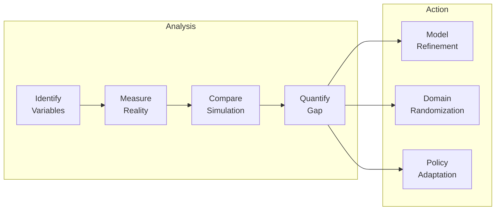
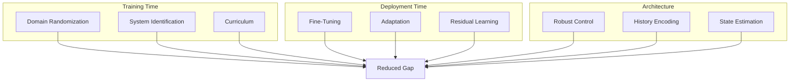

# Chapter 10: Sim-to-Real Analysis

**Duration**: 3-4 hours
**Difficulty**: Advanced

---

## Learning Objectives

After completing this chapter, you will be able to:

- Identify sources of sim-to-real gap
- Apply systematic gap analysis
- Implement mitigation strategies
- Evaluate transfer performance
- Create deployment checklist

---

## 10.1 Understanding the Sim-to-Real Gap

### Gap Sources

```mermaid
graph TB
    subgraph "Sim-to-Real Gap"
        PHYS[Physics Gap]
        SENS[Sensor Gap]
        ACT[Actuator Gap]
        ENV[Environment Gap]
    end

    subgraph "Physics"
        MASS[Mass/Inertia]
        FRIC[Friction Models]
        CONT[Contact Dynamics]
        DAMP[Damping]
    end

    subgraph "Sensors"
        NOISE[Sensor Noise]
        BIAS[Calibration Bias]
        DELAY[Measurement Delay]
        DROP[Dropout/Failures]
    end

    subgraph "Actuators"
        LAT[Latency]
        SAT[Saturation]
        NONLIN[Nonlinearity]
        WEAR[Wear/Backlash]
    end

    subgraph "Environment"
        LIGHT[Lighting]
        SURF[Surfaces]
        OBST[Obstacles]
        PERTURB[Disturbances]
    end

    PHYS --> MASS
    PHYS --> FRIC
    PHYS --> CONT
    PHYS --> DAMP

    SENS --> NOISE
    SENS --> BIAS
    SENS --> DELAY
    SENS --> DROP

    ACT --> LAT
    ACT --> SAT
    ACT --> NONLIN
    ACT --> WEAR

    ENV --> LIGHT
    ENV --> SURF
    ENV --> OBST
    ENV --> PERTURB
```



### Gap Quantification

| Gap Category | Typical Magnitude | Impact |
|--------------|-------------------|--------|
| Mass error | 5-20% | Medium |
| Friction mismatch | 20-50% | High |
| Actuator delay | 5-20 ms | High |
| Sensor noise | 5-10% | Medium |
| Contact modeling | Variable | Very High |

---

## 10.2 Gap Analysis Framework

### Systematic Analysis Process



### Analysis Implementation

```python
class SimToRealAnalyzer:
    """
    Systematic sim-to-real gap analysis.
    """

    def __init__(self, sim_env, real_robot):
        self.sim_env = sim_env
        self.real_robot = real_robot
        self.gap_metrics = {}

    def analyze_physics(self):
        """Analyze physics parameter gaps."""
        # Collect data
        sim_masses = self.sim_env.get_link_masses()
        real_masses = self.real_robot.measure_link_masses()

        mass_error = np.abs(sim_masses - real_masses) / real_masses
        self.gap_metrics["mass_error"] = mass_error

        # Joint friction
        sim_friction = self.sim_env.get_joint_friction()
        real_friction = self.real_robot.estimate_joint_friction()

        friction_error = np.abs(sim_friction - real_friction) / real_friction
        self.gap_metrics["friction_error"] = friction_error

        return {
            "mass_error_mean": mass_error.mean(),
            "mass_error_max": mass_error.max(),
            "friction_error_mean": friction_error.mean(),
            "friction_error_max": friction_error.max(),
        }

    def analyze_sensors(self):
        """Analyze sensor gap."""
        # Collect sensor data with known motion
        sim_imu, real_imu = self._collect_imu_data()

        # Noise analysis
        sim_noise = np.std(sim_imu, axis=0)
        real_noise = np.std(real_imu, axis=0)

        noise_gap = real_noise - sim_noise
        self.gap_metrics["imu_noise_gap"] = noise_gap

        # Bias analysis
        sim_mean = np.mean(sim_imu, axis=0)
        real_mean = np.mean(real_imu, axis=0)

        bias_gap = np.abs(real_mean - sim_mean)
        self.gap_metrics["imu_bias_gap"] = bias_gap

        return {
            "imu_noise_gap": noise_gap,
            "imu_bias_gap": bias_gap,
        }

    def analyze_actuators(self):
        """Analyze actuator gap."""
        # Measure response to step commands
        sim_response = self._measure_step_response(self.sim_env)
        real_response = self._measure_step_response(self.real_robot)

        # Delay estimation
        sim_delay = self._estimate_delay(sim_response)
        real_delay = self._estimate_delay(real_response)

        delay_gap = real_delay - sim_delay
        self.gap_metrics["actuator_delay_gap"] = delay_gap

        # Torque tracking error
        sim_tracking = sim_response["tracking_error"]
        real_tracking = real_response["tracking_error"]

        tracking_gap = real_tracking - sim_tracking
        self.gap_metrics["tracking_gap"] = tracking_gap

        return {
            "delay_gap_ms": delay_gap * 1000,
            "tracking_gap": tracking_gap,
        }

    def generate_report(self):
        """Generate comprehensive gap report."""
        physics = self.analyze_physics()
        sensors = self.analyze_sensors()
        actuators = self.analyze_actuators()

        report = {
            "physics": physics,
            "sensors": sensors,
            "actuators": actuators,
            "recommendations": self._generate_recommendations(),
        }

        return report

    def _generate_recommendations(self):
        """Generate mitigation recommendations."""
        recommendations = []

        # Physics recommendations
        if self.gap_metrics.get("mass_error", np.array([0])).max() > 0.1:
            recommendations.append({
                "category": "physics",
                "issue": "Mass error > 10%",
                "action": "Increase mass DR range to ±20%",
            })

        if self.gap_metrics.get("friction_error", np.array([0])).max() > 0.3:
            recommendations.append({
                "category": "physics",
                "issue": "Friction error > 30%",
                "action": "Expand friction DR range to [0.4, 1.6]",
            })

        # Sensor recommendations
        if np.any(self.gap_metrics.get("imu_noise_gap", np.array([0])) > 0.1):
            recommendations.append({
                "category": "sensors",
                "issue": "IMU noise underestimated",
                "action": "Increase observation noise to match real values",
            })

        # Actuator recommendations
        delay_gap = self.gap_metrics.get("actuator_delay_gap", 0)
        if delay_gap > 0.005:  # 5ms
            recommendations.append({
                "category": "actuators",
                "issue": f"Actuator delay gap: {delay_gap*1000:.1f}ms",
                "action": f"Add {int(delay_gap/0.0083)+1} step action delay",
            })

        return recommendations
```

---

## 10.3 Mitigation Strategies

### Strategy Overview



### Domain Randomization Tuning

```python
def tune_domain_randomization(analyzer_report):
    """
    Tune DR parameters based on gap analysis.

    Args:
        analyzer_report: Gap analysis report

    Returns:
        Updated DR configuration
    """
    dr_config = DomainRandomizationCfg()

    # Physics tuning
    physics = analyzer_report["physics"]

    # Mass range: 1.5x measured error
    mass_error = physics["mass_error_max"]
    dr_config.mass.mass_range = min(mass_error * 1.5, 0.3)

    # Friction range: centered on measured, expanded
    friction_error = physics["friction_error_max"]
    dr_config.friction.friction_range = (
        max(0.3, 1.0 - friction_error),
        min(2.0, 1.0 + friction_error)
    )

    # Sensor tuning
    sensors = analyzer_report["sensors"]
    noise_gap = sensors["imu_noise_gap"]

    dr_config.observation.lin_vel_noise = float(noise_gap[0]) * 1.2
    dr_config.observation.ang_vel_noise = float(noise_gap[1]) * 1.2

    # Actuator tuning
    actuators = analyzer_report["actuators"]
    delay_ms = actuators["delay_gap_ms"]

    # Convert to simulation steps
    dt = 1.0 / 120.0  # Simulation timestep
    delay_steps = int(delay_ms / (dt * 1000)) + 1
    dr_config.action.max_delay_steps = delay_steps

    return dr_config
```

### Residual Policy Learning

```python
class ResidualPolicy(torch.nn.Module):
    """
    Learn residual correction on top of base policy.

    Deployed: action = base_policy(obs) + residual_policy(obs)
    """

    def __init__(self, base_policy, obs_dim, action_dim):
        super().__init__()

        # Frozen base policy
        self.base_policy = base_policy
        for param in self.base_policy.parameters():
            param.requires_grad = False

        # Learnable residual
        self.residual = nn.Sequential(
            nn.Linear(obs_dim, 128),
            nn.ELU(),
            nn.Linear(128, 128),
            nn.ELU(),
            nn.Linear(128, action_dim),
        )

        # Scale residual (start small)
        self.residual_scale = nn.Parameter(torch.tensor(0.1))

    def forward(self, obs):
        with torch.no_grad():
            base_action = self.base_policy(obs)

        residual = self.residual(obs) * self.residual_scale
        return base_action + residual
```

### Online Adaptation

```python
class OnlineAdaptation:
    """
    Online adaptation during deployment.
    """

    def __init__(self, policy, adaptation_rate=0.001):
        self.policy = policy
        self.adaptation_rate = adaptation_rate

        # Running statistics for observation normalization
        self.obs_mean = None
        self.obs_var = None
        self.obs_count = 0

    def adapt_observation(self, obs):
        """
        Update observation normalization statistics.
        """
        if self.obs_mean is None:
            self.obs_mean = obs.copy()
            self.obs_var = np.ones_like(obs)
        else:
            # Welford's online algorithm
            self.obs_count += 1
            delta = obs - self.obs_mean
            self.obs_mean += delta / self.obs_count
            delta2 = obs - self.obs_mean
            self.obs_var += (delta * delta2 - self.obs_var) / self.obs_count

        # Normalize
        normalized = (obs - self.obs_mean) / (np.sqrt(self.obs_var) + 1e-8)
        return normalized

    def adapt_action(self, action, feedback):
        """
        Adapt action based on feedback (e.g., tracking error).

        Simple proportional correction.
        """
        correction = -self.adaptation_rate * feedback
        return action + correction
```

---

## 10.4 Transfer Evaluation

### Evaluation Metrics

```python
class TransferEvaluator:
    """
    Evaluate policy transfer performance.
    """

    def __init__(self):
        self.metrics = {}

    def evaluate_tracking(self, commanded, actual):
        """
        Evaluate velocity tracking performance.

        Args:
            commanded: (N, 3) commanded velocities
            actual: (N, 3) actual velocities

        Returns:
            Tracking metrics
        """
        error = commanded - actual

        self.metrics["tracking"] = {
            "mae": np.mean(np.abs(error), axis=0),
            "rmse": np.sqrt(np.mean(error**2, axis=0)),
            "max_error": np.max(np.abs(error), axis=0),
            "correlation": [
                np.corrcoef(commanded[:, i], actual[:, i])[0, 1]
                for i in range(3)
            ],
        }

        return self.metrics["tracking"]

    def evaluate_stability(self, base_orientation, fall_count, total_steps):
        """
        Evaluate stability performance.

        Args:
            base_orientation: (N, 4) quaternion history
            fall_count: Number of falls
            total_steps: Total timesteps

        Returns:
            Stability metrics
        """
        # Orientation deviation from upright
        upright = np.array([0, 0, 0, 1])
        orientation_error = np.abs(base_orientation - upright).mean(axis=0)

        self.metrics["stability"] = {
            "fall_rate": fall_count / total_steps,
            "mean_tilt": orientation_error[:2].mean(),
            "max_tilt": orientation_error[:2].max(),
            "survival_rate": 1.0 - (fall_count / total_steps),
        }

        return self.metrics["stability"]

    def evaluate_energy(self, torques, velocities, dt):
        """
        Evaluate energy efficiency.

        Args:
            torques: (N, num_dof) torque history
            velocities: (N, num_dof) velocity history
            dt: Timestep

        Returns:
            Energy metrics
        """
        # Mechanical power
        power = np.abs(torques * velocities)

        # Cost of transport (power / weight / velocity)
        weight = 50.0 * 9.81  # Assuming 50kg robot
        velocity = np.linalg.norm(velocities[:, :2].mean(axis=0))  # XY velocity

        cot = power.sum() / (weight * velocity + 1e-8)

        self.metrics["energy"] = {
            "mean_power": power.mean(),
            "peak_power": power.max(),
            "cost_of_transport": cot,
            "total_energy": power.sum() * dt,
        }

        return self.metrics["energy"]

    def generate_report(self):
        """Generate comprehensive evaluation report."""
        return {
            "tracking": self.metrics.get("tracking", {}),
            "stability": self.metrics.get("stability", {}),
            "energy": self.metrics.get("energy", {}),
            "overall_score": self._compute_overall_score(),
        }

    def _compute_overall_score(self):
        """Compute weighted overall transfer score."""
        score = 0.0

        # Tracking (40%)
        if "tracking" in self.metrics:
            tracking_score = 1.0 - min(
                self.metrics["tracking"]["rmse"].mean() / 0.5, 1.0
            )
            score += 0.4 * tracking_score

        # Stability (40%)
        if "stability" in self.metrics:
            stability_score = self.metrics["stability"]["survival_rate"]
            score += 0.4 * stability_score

        # Energy (20%)
        if "energy" in self.metrics:
            # Lower CoT is better (normalize to typical range)
            energy_score = max(0, 1.0 - self.metrics["energy"]["cost_of_transport"] / 10.0)
            score += 0.2 * energy_score

        return score
```

---

## 10.5 Deployment Checklist

### Pre-Deployment Verification

```python
class DeploymentChecklist:
    """
    Pre-deployment verification checklist.
    """

    def __init__(self):
        self.checks = []
        self.passed = []
        self.failed = []

    def check_model_export(self, model_path):
        """Verify model export."""
        import onnx

        try:
            model = onnx.load(model_path)
            onnx.checker.check_model(model)
            self._pass("Model export valid")
            return True
        except Exception as e:
            self._fail(f"Model export: {e}")
            return False

    def check_inference_latency(self, policy, target_ms=10.0):
        """Verify inference meets latency requirements."""
        import time

        obs = np.random.randn(48).astype(np.float32)

        latencies = []
        for _ in range(100):
            start = time.perf_counter()
            policy.infer(obs)
            latencies.append((time.perf_counter() - start) * 1000)

        p99 = np.percentile(latencies, 99)

        if p99 < target_ms:
            self._pass(f"Inference latency: {p99:.2f}ms < {target_ms}ms")
            return True
        else:
            self._fail(f"Inference latency: {p99:.2f}ms > {target_ms}ms")
            return False

    def check_observation_bounds(self, policy, obs_dim):
        """Verify policy handles observation bounds."""
        # Test extreme observations
        extreme_obs = [
            np.ones(obs_dim) * 100,     # Large positive
            np.ones(obs_dim) * -100,    # Large negative
            np.zeros(obs_dim),          # Zero
            np.random.randn(obs_dim) * 50,  # Random large
        ]

        for i, obs in enumerate(extreme_obs):
            try:
                action = policy.infer(obs.astype(np.float32))
                if np.any(np.isnan(action)) or np.any(np.isinf(action)):
                    self._fail(f"NaN/Inf action on test {i}")
                    return False
            except Exception as e:
                self._fail(f"Inference failed on test {i}: {e}")
                return False

        self._pass("Observation bounds handling OK")
        return True

    def check_action_bounds(self, policy, obs_dim, action_limits):
        """Verify actions are within limits."""
        obs = np.random.randn(1000, obs_dim).astype(np.float32)

        actions = []
        for o in obs:
            actions.append(policy.infer(o))

        actions = np.array(actions)

        if np.all(np.abs(actions) <= action_limits):
            self._pass("Action bounds satisfied")
            return True
        else:
            max_action = np.abs(actions).max()
            self._fail(f"Action out of bounds: {max_action} > {action_limits}")
            return False

    def check_ros_connectivity(self):
        """Verify ROS 2 connectivity."""
        try:
            import rclpy
            rclpy.init()

            # Check essential topics exist
            # (implementation depends on robot setup)

            rclpy.shutdown()
            self._pass("ROS 2 connectivity OK")
            return True
        except Exception as e:
            self._fail(f"ROS 2 connectivity: {e}")
            return False

    def run_all(self, policy, model_path, obs_dim=48, action_limits=1.0):
        """Run all checks."""
        self.check_model_export(model_path)
        self.check_inference_latency(policy)
        self.check_observation_bounds(policy, obs_dim)
        self.check_action_bounds(policy, obs_dim, action_limits)

        return self.generate_report()

    def _pass(self, msg):
        self.passed.append(msg)
        print(f"✓ {msg}")

    def _fail(self, msg):
        self.failed.append(msg)
        print(f"✗ {msg}")

    def generate_report(self):
        """Generate checklist report."""
        total = len(self.passed) + len(self.failed)
        return {
            "passed": self.passed,
            "failed": self.failed,
            "pass_rate": len(self.passed) / total if total > 0 else 0,
            "ready_for_deployment": len(self.failed) == 0,
        }
```

### Deployment Checklist Summary

| Category | Check | Requirement |
|----------|-------|-------------|
| Model | Export valid | ONNX passes checker |
| Performance | Inference latency | < 10ms P99 |
| Robustness | Observation bounds | No NaN/Inf |
| Safety | Action limits | Within actuator limits |
| Integration | ROS connectivity | Topics available |
| Verification | Sim test | > 90% success rate |

---

## 10.6 Best Practices

### Training Best Practices

1. **Start with domain randomization**
   - Begin with conservative ranges
   - Expand based on real-world testing

2. **Use observation noise early**
   - Helps policy become robust to sensor uncertainty

3. **Include action delays**
   - Matches real actuator latency

4. **Apply perturbations**
   - Improves disturbance rejection

### Deployment Best Practices

1. **Gradual deployment**
   - Start with constrained motion
   - Increase range as confidence grows

2. **Monitor in real-time**
   - Track key metrics during operation
   - Set up safety limits

3. **Have fallback controllers**
   - Switch to safe controller on failure

4. **Log everything**
   - Record all sensor/action data
   - Enables post-hoc analysis

---

## Hands-On Exercises

### Exercise 10.1: Gap Analysis

1. Compare sim vs real physics
2. Measure sensor noise levels
3. Estimate actuator delays
4. Document all gaps

### Exercise 10.2: Tune Domain Randomization

1. Based on gap analysis, adjust DR
2. Retrain policy
3. Evaluate in simulation
4. Compare transfer performance

### Exercise 10.3: Deployment Checklist

1. Run all verification checks
2. Fix any failures
3. Document deployment config
4. Create safety protocols

---

## Summary

In this chapter, you learned:

- Sim-to-real gap sources and impact
- Systematic gap analysis framework
- Mitigation strategies (DR, adaptation)
- Transfer evaluation metrics
- Deployment checklist and best practices

---

## Module 3 Conclusion

Congratulations! You have completed Module 3: AI-Robot Brain with NVIDIA Isaac.

### Key Accomplishments

- Installed and configured Isaac Sim and Isaac Gym
- Created vectorized humanoid training environment
- Designed modular reward functions
- Trained locomotion policy with PPO
- Implemented domain randomization
- Applied curriculum learning
- Exported and deployed policy to ROS 2
- Analyzed sim-to-real transfer

### Next Steps

- Module 4: Real Hardware Integration
- Advanced locomotion (stairs, rough terrain)
- Multi-task learning
- Imitation learning from demonstrations

---

## Quick Reference

```python
# Gap Analysis
analyzer = SimToRealAnalyzer(sim_env, real_robot)
report = analyzer.generate_report()

# Mitigation
dr_config = tune_domain_randomization(report)

# Evaluation
evaluator = TransferEvaluator()
tracking = evaluator.evaluate_tracking(cmd, actual)
stability = evaluator.evaluate_stability(orient, falls, steps)
score = evaluator.generate_report()["overall_score"]

# Deployment
checklist = DeploymentChecklist()
result = checklist.run_all(policy, "policy.onnx")
```

| Gap Source | Typical Value | Mitigation |
|------------|---------------|------------|
| Mass error | ±10-20% | DR mass range |
| Friction | ±30-50% | DR friction range |
| Sensor noise | +50-100% | Observation noise |
| Action delay | 5-20ms | Action delay DR |
| Motor variation | ±10-20% | Motor strength DR |
