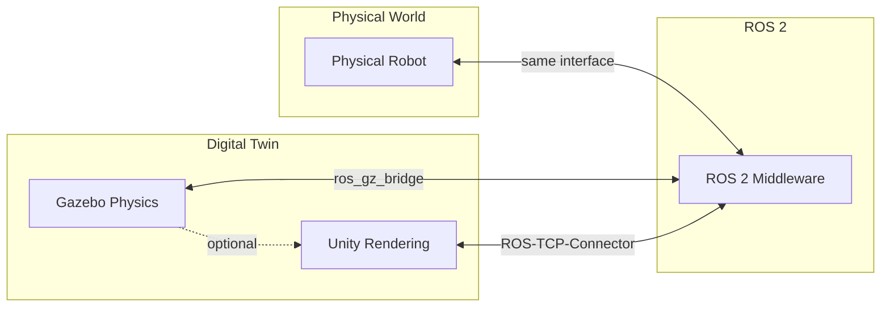
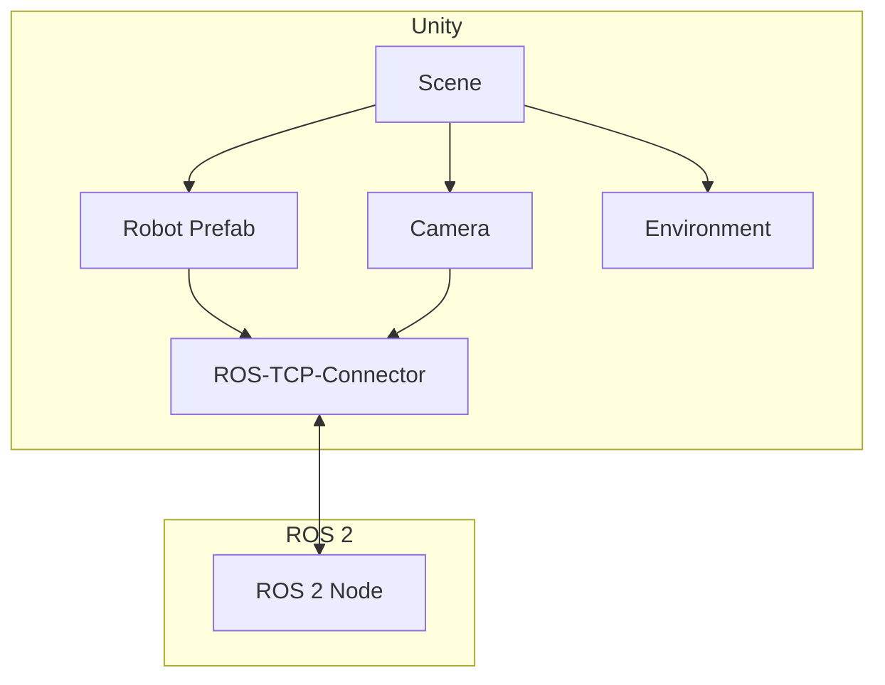

# Module 2 Specification: Digital Twin – Gazebo & Unity

**Parent**: `specs/book.spec.md`
**Created**: 2026-01-07
**Status**: Draft
**Constitution**: `specs/constitution.md` (v1.0.0)
**Duration**: Weeks 3-4
**Prerequisites**: Module 1 (ROS 2 Nervous System)

---

## Overview

The Digital Twin module teaches simulation-first development using Gazebo for physics simulation and Unity for high-fidelity rendering. Students create virtual humanoids that mirror physical robot behavior, enabling safe testing before hardware deployment.

A **digital twin** is a virtual replica that:
- Matches physical robot kinematics and dynamics
- Simulates sensors (cameras, IMU, force/torque)
- Responds to the same ROS 2 interfaces as real hardware
- Enables rapid iteration without hardware risk

---

## Learning Objectives

By completing this module, students will be able to:

| ID | Objective | Assessment |
|----|-----------|------------|
| LO-2.1 | Explain digital twin concepts and benefits | Quiz |
| LO-2.2 | Configure Gazebo worlds with physics properties | Working simulation |
| LO-2.3 | Spawn and control robots in Gazebo | Robot moves on command |
| LO-2.4 | Implement sensor plugins (camera, IMU, force/torque) | Sensor data on topics |
| LO-2.5 | Tune physics parameters for realistic behavior | Stable walking |
| LO-2.6 | Set up Unity with ROS 2 TCP Connector | Unity-ROS bridge working |
| LO-2.7 | Create photorealistic environments in Unity | Rendered scene |
| LO-2.8 | Stream synthetic sensor data from Unity | Camera images received |
| LO-2.9 | Implement domain randomization for training | Varied environments |
| LO-2.10 | Debug simulation issues using Gazebo tools | Issue identified and fixed |

---

## Concepts

### Core Simulation Concepts

| Concept | Definition | Why It Matters |
|---------|------------|----------------|
| **Digital Twin** | Virtual replica of physical system | Safe testing, rapid iteration |
| **Physics Engine** | Computes forces, collisions, dynamics | Realistic robot behavior |
| **Timestep** | Simulation update interval | Stability vs performance |
| **Real-time Factor** | Sim time / wall time ratio | Training speed |
| **Collision Geometry** | Simplified shapes for contact | Performance optimization |

### Gazebo Concepts

| Concept | Definition | Why It Matters |
|---------|------------|----------------|
| **World** | Environment with physics, models, plugins | Simulation container |
| **Model** | Robot or object with links and joints | Entities in simulation |
| **Plugin** | Custom code for sensors, control | Extensibility |
| **SDF** | Simulation Description Format | Gazebo-native format |
| **gz-sim** | Gazebo Sim (Ignition) | Modern Gazebo version |

### Unity Concepts

| Concept | Definition | Why It Matters |
|---------|------------|----------------|
| **Scene** | 3D environment with objects | Visual workspace |
| **Prefab** | Reusable object template | Robot instantiation |
| **Shader** | GPU rendering program | Visual fidelity |
| **ROS-TCP-Connector** | Unity-ROS 2 bridge | Message passing |
| **HDRP** | High Definition Render Pipeline | Photorealism |

### Sensor Concepts

| Concept | Definition | Why It Matters |
|---------|------------|----------------|
| **Camera** | RGB/depth image sensor | Vision input |
| **IMU** | Inertial Measurement Unit | Orientation, acceleration |
| **Force/Torque** | Contact force sensor | Manipulation feedback |
| **Lidar** | Laser range scanner | 3D environment mapping |
| **Noise Model** | Simulated sensor imperfections | Realistic training |

---

## System Architecture

### Digital Twin Pipeline



### Gazebo Architecture

```mermaid
graph TB
    subgraph "Gazebo Sim"
        W[World]
        P[Physics Engine]
        S[Sensor Manager]
        PL[Plugin System]
    end

    subgraph "ROS 2 Bridge"
        B[ros_gz_bridge]
    end

    subgraph "ROS 2 Topics"
        CMD[/cmd_vel]
        JS[/joint_states]
        IMG[/camera/image]
        IMU_T[/imu/data]
    end

    W --> P
    W --> S
    W --> PL
    PL --> B
    S --> B
    B <--> CMD
    B <--> JS
    B --> IMG
    B --> IMU_T
```

### Unity Architecture



### Package Structure

```
humanoid_simulation_ws/
├── src/
│   ├── humanoid_gazebo/           # Gazebo simulation
│   │   ├── worlds/
│   │   │   ├── empty.sdf
│   │   │   └── humanoid_world.sdf
│   │   ├── models/
│   │   │   └── humanoid/
│   │   ├── launch/
│   │   │   ├── gazebo.launch.py
│   │   │   └── spawn_robot.launch.py
│   │   ├── config/
│   │   │   └── gazebo_params.yaml
│   │   └── package.xml
│   │
│   ├── humanoid_sensors/          # Sensor configurations
│   │   ├── config/
│   │   │   ├── camera.yaml
│   │   │   ├── imu.yaml
│   │   │   └── force_torque.yaml
│   │   ├── launch/
│   │   └── package.xml
│   │
│   └── humanoid_unity/            # Unity bridge
│       ├── launch/
│       │   └── unity_bridge.launch.py
│       ├── config/
│       └── package.xml
│
└── unity_project/                 # Unity project (separate)
    ├── Assets/
    │   ├── Robots/
    │   ├── Environments/
    │   └── Scripts/
    └── Packages/
```

---

## Chapter Breakdown

### Chapter 1: Digital Twin Fundamentals

**Duration**: 2-3 hours

**Topics**:
- What is a digital twin?
- Simulation-first development philosophy
- Physics simulation vs rendering
- Gazebo vs Unity: when to use each
- Real-time factor and training speed

**Hands-On**:
- Install Gazebo Harmonic
- Run demo simulation
- Measure real-time factor

**Required Output**:
- Gazebo running with demo world
- Understanding of sim vs real time

---

### Chapter 2: Gazebo World Setup

**Duration**: 4-5 hours

**Topics**:
- SDF world format
- Ground plane and lighting
- Physics engine configuration (ODE, Bullet, DART)
- Gravity, friction, contact parameters
- World plugins

**Hands-On**:
- Create `humanoid_world.sdf` with:
  - Ground plane with friction
  - Ambient and directional lighting
  - Physics parameters for stability
- Configure physics timestep

**Required Output**:
- File: `humanoid_gazebo/worlds/humanoid_world.sdf`
- Stable physics with 1ms timestep

---

### Chapter 3: Spawning Robots in Gazebo

**Duration**: 4-5 hours

**Topics**:
- Converting URDF to SDF
- Gazebo model directory structure
- ros_gz_bridge for topic bridging
- Joint state publisher integration
- Controlling joints via ROS 2

**Hands-On**:
- Convert Module 1 URDF to Gazebo model
- Create spawn launch file
- Bridge joint commands and states
- Control humanoid via ROS 2 topics

**Required Output**:
- Humanoid spawned in Gazebo
- Joint commands work via `/joint_commands`
- Joint states published to `/joint_states`

---

### Chapter 4: Sensor Simulation

**Duration**: 5-6 hours

**Topics**:
- Camera sensor plugin
- IMU sensor plugin
- Force/torque sensor plugin
- Noise models for realism
- Sensor update rates and QoS

**Hands-On**:
- Add head camera to humanoid:
  - 640x480 RGB
  - 30 Hz update rate
  - Gaussian noise
- Add torso IMU:
  - Accelerometer + gyroscope
  - Realistic noise parameters
- Add foot force/torque sensors

**Required Output**:
- `/camera/image_raw` topic with images
- `/imu/data` topic with IMU readings
- `/left_foot/ft_sensor` with force data

---

### Chapter 5: Physics Tuning

**Duration**: 3-4 hours

**Topics**:
- Contact parameters (kp, kd, mu)
- Joint damping and friction
- Inertia verification
- Stable locomotion requirements
- Common physics issues and fixes

**Hands-On**:
- Tune foot-ground contact for walking
- Adjust joint damping for smooth motion
- Verify inertia values match URDF
- Achieve stable standing pose

**Required Output**:
- Humanoid stands stably
- Walking motion doesn't explode
- Documented parameter values

---

### Chapter 6: Unity Setup and ROS 2 Bridge

**Duration**: 4-5 hours

**Topics**:
- Unity Hub and project setup
- ROS-TCP-Connector installation
- ROS-TCP-Endpoint configuration
- Message types in Unity
- Bi-directional communication

**Hands-On**:
- Create Unity project with HDRP
- Install ROS-TCP-Connector package
- Configure endpoint for ROS 2
- Test message round-trip

**Required Output**:
- Unity project with ROS 2 bridge
- Messages flow between Unity and ROS 2

---

### Chapter 7: Photorealistic Environments

**Duration**: 4-5 hours

**Topics**:
- HDRP lighting and shadows
- PBR materials
- Environment assets (floors, walls, objects)
- Skybox and ambient lighting
- Performance optimization

**Hands-On**:
- Create indoor environment:
  - Room with realistic lighting
  - PBR floor and wall materials
  - Furniture objects
- Import humanoid model
- Set up main camera

**Required Output**:
- Photorealistic room in Unity
- Humanoid robot visible in scene

---

### Chapter 8: Synthetic Sensor Data

**Duration**: 4-5 hours

**Topics**:
- Unity camera to ROS 2 image
- Depth camera simulation
- Segmentation masks
- Streaming performance
- Image compression

**Hands-On**:
- Configure Unity camera for ROS 2:
  - RGB image publisher
  - Depth image publisher
  - 30 Hz streaming
- Optimize for performance

**Required Output**:
- `/unity/camera/image_raw` topic
- `/unity/camera/depth` topic
- Stable 30 Hz streaming

---

### Chapter 9: Domain Randomization

**Duration**: 3-4 hours

**Topics**:
- Why domain randomization?
- Texture randomization
- Lighting randomization
- Object placement randomization
- Physics parameter randomization

**Hands-On**:
- Implement texture randomizer:
  - Random floor textures
  - Random wall colors
- Implement lighting randomizer:
  - Random light positions
  - Random intensities
- Create randomization controller

**Required Output**:
- Environment changes each episode
- Randomization controllable via ROS 2

---

### Chapter 10: Integration and Debugging

**Duration**: 2-3 hours

**Topics**:
- Gazebo debugging tools
- Physics visualization
- TF verification in simulation
- Common simulation issues
- Performance profiling

**Hands-On**:
- Debug provided buggy simulation
- Profile physics performance
- Verify TF tree matches real robot

**Required Output**:
- Debug report documenting fixes
- Performance baseline documented

---

## Required Outputs Summary

### Gazebo Deliverables

| Chapter | Deliverable | Verification |
|---------|-------------|--------------|
| Ch 2 | `humanoid_world.sdf` | World loads in Gazebo |
| Ch 3 | Spawn launch file | Robot appears in simulation |
| Ch 3 | ros_gz_bridge config | Topics bridged correctly |
| Ch 4 | Camera sensor | Images on topic |
| Ch 4 | IMU sensor | IMU data on topic |
| Ch 4 | Force/torque sensors | FT data on topic |
| Ch 5 | Tuned physics params | Stable standing |

### Unity Deliverables

| Chapter | Deliverable | Verification |
|---------|-------------|--------------|
| Ch 6 | Unity project with ROS bridge | Messages flow |
| Ch 7 | Photorealistic environment | Visual quality |
| Ch 8 | Camera streaming | 30 Hz images |
| Ch 9 | Domain randomization | Varied environments |

### Package Deliverables

```
humanoid_simulation_ws/src/
├── humanoid_gazebo/        # Gazebo integration
├── humanoid_sensors/       # Sensor configs
└── humanoid_unity/         # Unity bridge
```

---

## User Scenarios & Testing

### User Story 1 - Simulate Before Build (Priority: P1)

Student wants to test humanoid behavior before accessing physical hardware.

**Why this priority**: Core principle of simulation-first development.

**Independent Test**: Humanoid moves in Gazebo when commanded via ROS 2.

**Acceptance Scenarios**:

1. **Given** Gazebo installed, **When** launching simulation, **Then** humanoid spawns in world
2. **Given** humanoid spawned, **When** sending joint command, **Then** robot moves in simulation
3. **Given** robot moving, **When** checking `/joint_states`, **Then** simulated states match commands

---

### User Story 2 - Sensor Data Stream (Priority: P1)

Student wants to receive simulated sensor data for perception development.

**Why this priority**: Required for AI training and perception algorithms.

**Independent Test**: Camera images appear on ROS 2 topic.

**Acceptance Scenarios**:

1. **Given** simulation running, **When** checking camera topic, **Then** images stream at 30 Hz
2. **Given** IMU configured, **When** robot moves, **Then** IMU data reflects motion
3. **Given** foot contacts ground, **When** checking FT sensor, **Then** force data shows contact

---

### User Story 3 - Photorealistic Training Data (Priority: P2)

Student wants high-quality synthetic images for vision model training.

**Why this priority**: Enables sim-to-real transfer for perception.

**Independent Test**: Unity renders photorealistic scene with robot.

**Acceptance Scenarios**:

1. **Given** Unity project set up, **When** running scene, **Then** realistic room renders
2. **Given** camera configured, **When** streaming to ROS 2, **Then** images received
3. **Given** randomization enabled, **When** resetting scene, **Then** environment changes

---

### User Story 4 - Stable Walking Simulation (Priority: P2)

Student wants humanoid to walk stably in simulation.

**Why this priority**: Validates Module 3 locomotion before real hardware.

**Independent Test**: Humanoid completes 10 walking steps without falling.

**Acceptance Scenarios**:

1. **Given** physics tuned, **When** sending walk commands, **Then** robot walks forward
2. **Given** walking robot, **When** monitoring stability, **Then** no physics explosions
3. **Given** 10 steps completed, **When** checking pose, **Then** robot still upright

---

### Edge Cases

- What if Gazebo physics explodes? (Timestep and damping tuning guide)
- What if Unity-ROS bridge disconnects? (Reconnection handling)
- What if sensor data lags? (QoS and buffering configuration)
- What if real-time factor < 1.0? (Performance optimization guide)

---

## Requirements

### Functional Requirements

- **FR-M2-001**: Simulation MUST use Gazebo Harmonic (gz-sim)
- **FR-M2-002**: Physics timestep MUST be configurable
- **FR-M2-003**: Camera sensor MUST publish `sensor_msgs/Image`
- **FR-M2-004**: IMU sensor MUST publish `sensor_msgs/Imu`
- **FR-M2-005**: ros_gz_bridge MUST bridge all control topics
- **FR-M2-006**: Unity MUST use ROS-TCP-Connector for communication
- **FR-M2-007**: Sensor noise MUST be configurable
- **FR-M2-008**: Domain randomization MUST be controllable via ROS 2

### Non-Functional Requirements

- **NFR-M2-001**: Real-time factor >= 1.0 on recommended hardware
- **NFR-M2-002**: Camera streaming latency < 100ms
- **NFR-M2-003**: Physics stable at 1ms timestep
- **NFR-M2-004**: Unity rendering at 30+ FPS

---

## Success Criteria

- **SC-M2-001**: Humanoid spawns in Gazebo within 30 seconds
- **SC-M2-002**: Joint commands control robot with < 50ms latency
- **SC-M2-003**: Camera streams at stable 30 Hz
- **SC-M2-004**: IMU publishes at 100 Hz
- **SC-M2-005**: Walking motion stable for 10+ steps
- **SC-M2-006**: Unity-ROS bridge maintains connection for 1 hour
- **SC-M2-007**: Domain randomization changes scene each reset

---

## Dependencies

### Prerequisites

- Module 1 completed (ROS 2 fundamentals)
- Humanoid URDF from Module 1
- Ubuntu 22.04
- GPU recommended (NVIDIA for Unity HDRP)

### Software Dependencies

- Gazebo Harmonic (gz-sim)
- ros_gz packages
- Unity 2022.3 LTS
- ROS-TCP-Connector
- ROS-TCP-Endpoint

### Hardware Requirements

| Component | Minimum | Recommended |
|-----------|---------|-------------|
| CPU | 4 cores | 8 cores |
| RAM | 8 GB | 16 GB |
| GPU | Integrated | NVIDIA RTX 3060 |
| Storage | 50 GB | 100 GB SSD |

### Next Module

This module is prerequisite for **Module 3: AI-Robot Brain (NVIDIA Isaac)**.

---

## Related Files

- `specs/module2-digital-twin.spec.md` - This specification
- `specs/digital-twin/plan.md` - Architecture decisions (to create)
- `specs/digital-twin/tasks.md` - Implementation tasks (to create)

---

**Governed by**: `specs/constitution.md` v1.0.0
