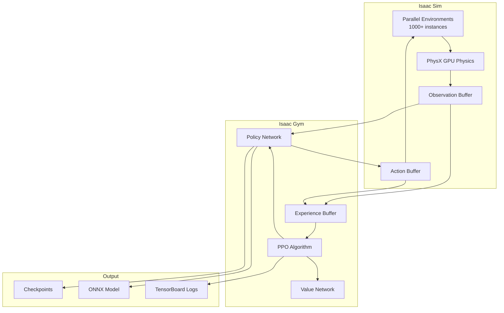
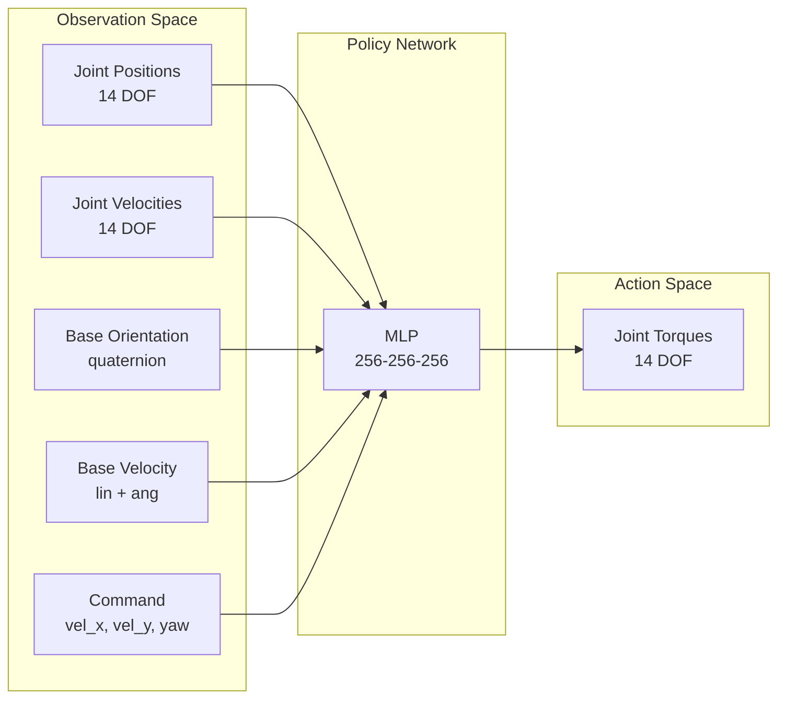
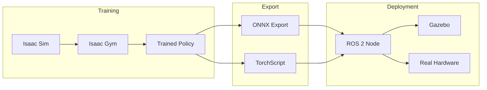

# Module 3 Specification: AI-Robot Brain – NVIDIA Isaac

**Parent**: `specs/book.spec.md`
**Created**: 2026-01-07
**Status**: Draft
**Constitution**: `specs/constitution.md` (v1.0.0)
**Duration**: Weeks 5-6
**Prerequisites**: Module 2 (Digital Twin – Gazebo & Unity)

---

## Overview

The AI-Robot Brain module teaches how to deploy AI models on NVIDIA Isaac Sim for intelligent humanoid behavior. Students train reinforcement learning policies for locomotion and manipulation, then transfer learned behaviors to other simulators and real hardware.

**NVIDIA Isaac** provides:
- GPU-accelerated physics simulation
- Massively parallel training environments
- Reinforcement learning framework (Isaac Gym)
- Domain randomization at scale
- Sim-to-real transfer pipelines

---

## Learning Objectives

By completing this module, students will be able to:

| ID | Objective | Assessment |
|----|-----------|------------|
| LO-3.1 | Install and configure NVIDIA Isaac Sim | Isaac Sim running |
| LO-3.2 | Explain GPU-accelerated physics simulation | Quiz |
| LO-3.3 | Import humanoid robot into Isaac Sim | Robot visible in scene |
| LO-3.4 | Configure Isaac Gym training environment | Environment initializes |
| LO-3.5 | Train locomotion policy using PPO algorithm | Policy achieves walking |
| LO-3.6 | Implement reward shaping for stable walking | Improved gait quality |
| LO-3.7 | Apply domain randomization during training | Robust policy |
| LO-3.8 | Export trained policy for deployment | ONNX model exported |
| LO-3.9 | Deploy policy to Gazebo simulation | Policy runs in Gazebo |
| LO-3.10 | Analyze sim-to-real gap and mitigation strategies | Gap analysis report |

---

## Concepts

### Core Isaac Concepts

| Concept | Definition | Why It Matters |
|---------|------------|----------------|
| **Isaac Sim** | NVIDIA's robot simulation platform | GPU-accelerated physics |
| **Isaac Gym** | RL training framework for Isaac | Parallel environment training |
| **PhysX** | NVIDIA physics engine | Fast, GPU-based simulation |
| **USD** | Universal Scene Description | Scene interchange format |
| **Omniverse** | NVIDIA collaboration platform | Isaac Sim foundation |

### Reinforcement Learning Concepts

| Concept | Definition | Why It Matters |
|---------|------------|----------------|
| **Policy** | Neural network mapping observations to actions | Robot controller |
| **Reward** | Scalar feedback signal | Guides learning |
| **Episode** | One simulation rollout | Training unit |
| **PPO** | Proximal Policy Optimization | Stable RL algorithm |
| **Actor-Critic** | Policy + value network | Variance reduction |

### Training Concepts

| Concept | Definition | Why It Matters |
|---------|------------|----------------|
| **Parallel Environments** | Many simulations running simultaneously | Training speed |
| **Domain Randomization** | Varying simulation parameters | Robust policies |
| **Curriculum Learning** | Progressive difficulty increase | Stable training |
| **Reward Shaping** | Designing informative rewards | Learning efficiency |
| **Early Termination** | Ending failed episodes | Training efficiency |

### Sim-to-Real Concepts

| Concept | Definition | Why It Matters |
|---------|------------|----------------|
| **Sim-to-Real Gap** | Difference between sim and real behavior | Transfer challenge |
| **System Identification** | Matching sim to real parameters | Gap reduction |
| **Action Smoothing** | Filtering jerky actions | Hardware safety |
| **Observation Noise** | Adding noise during training | Robustness |
| **Dynamics Randomization** | Varying physics parameters | Transfer robustness |

---

## System Architecture

### Isaac Training Pipeline



### Humanoid Training Architecture



### Deployment Pipeline



### Package Structure

```
humanoid_isaac_ws/
├── src/
│   ├── humanoid_isaac/              # Isaac Sim integration
│   │   ├── envs/
│   │   │   ├── humanoid_env.py      # Training environment
│   │   │   └── humanoid_cfg.py      # Environment config
│   │   ├── tasks/
│   │   │   ├── locomotion.py        # Walking task
│   │   │   └── standing.py          # Balance task
│   │   ├── rewards/
│   │   │   └── locomotion_rewards.py
│   │   ├── launch/
│   │   └── package.xml
│   │
│   ├── humanoid_learning/           # RL training
│   │   ├── algorithms/
│   │   │   └── ppo.py
│   │   ├── networks/
│   │   │   ├── actor_critic.py
│   │   │   └── mlp.py
│   │   ├── configs/
│   │   │   └── train_locomotion.yaml
│   │   └── scripts/
│   │       ├── train.py
│   │       └── play.py
│   │
│   └── humanoid_policy/             # Policy deployment
│       ├── models/
│       │   └── locomotion.onnx
│       ├── src/
│       │   └── policy_node.py
│       ├── launch/
│       └── package.xml
│
└── IsaacGymEnvs/                    # Isaac Gym (cloned)
    └── ...
```

---

## Chapter Breakdown

### Chapter 1: Introduction to NVIDIA Isaac

**Duration**: 3-4 hours

**Topics**:
- NVIDIA robotics ecosystem overview
- Isaac Sim vs Isaac Gym vs Isaac ROS
- GPU-accelerated simulation benefits
- Omniverse and USD basics
- When to use Isaac vs Gazebo

**Hands-On**:
- Install Isaac Sim 2023.1+
- Launch sample humanoid scene
- Explore Isaac Sim interface

**Required Output**:
- Isaac Sim installed and running
- Sample humanoid loaded

---

### Chapter 2: Isaac Sim Environment Setup

**Duration**: 4-5 hours

**Topics**:
- Creating Isaac Sim stages
- Importing URDF to USD
- Articulation configuration
- Physics scene setup
- Camera and sensor setup

**Hands-On**:
- Convert humanoid URDF to USD
- Configure articulation properties
- Set up physics scene with GPU
- Add camera sensor

**Required Output**:
- `humanoid.usd` asset file
- Humanoid loads in Isaac Sim
- Physics simulation runs

---

### Chapter 3: Isaac Gym Fundamentals

**Duration**: 4-5 hours

**Topics**:
- Isaac Gym architecture
- Vectorized environments
- Observation and action spaces
- Tensor-based API
- Parallel environment creation

**Hands-On**:
- Clone IsaacGymEnvs repository
- Run Cartpole example
- Understand environment structure
- Modify observation space

**Required Output**:
- IsaacGymEnvs running
- Cartpole training works
- Understanding of env structure

---

### Chapter 4: Humanoid Training Environment

**Duration**: 5-6 hours

**Topics**:
- Designing humanoid environment
- Observation space definition
- Action space (torques vs positions)
- Environment reset logic
- Terrain generation

**Hands-On**:
- Create `HumanoidEnv` class:
  - 14-DOF observation
  - Torque-based control
  - Command interface
- Configure parallel instances (1024+)
- Test environment initialization

**Required Output**:
- `humanoid_env.py` working
- 1024 parallel environments
- Random actions don't crash

---

### Chapter 5: Reward Design for Locomotion

**Duration**: 4-5 hours

**Topics**:
- Reward function principles
- Velocity tracking rewards
- Energy efficiency rewards
- Stability rewards (no falling)
- Termination conditions

**Hands-On**:
- Implement reward components:
  ```python
  r_velocity = -|cmd_vel - actual_vel|
  r_energy = -||torques||²
  r_alive = +1 per timestep
  r_orientation = -||base_tilt||²
  ```
- Balance reward weights
- Add early termination

**Required Output**:
- `locomotion_rewards.py` module
- Reward plots showing learning
- Termination working correctly

---

### Chapter 6: PPO Training

**Duration**: 5-6 hours

**Topics**:
- PPO algorithm overview
- Actor-critic architecture
- Hyperparameter selection
- Training loop implementation
- Logging and visualization

**Hands-On**:
- Configure PPO hyperparameters:
  - Learning rate: 3e-4
  - Batch size: 4096
  - Epochs: 5
  - Clip range: 0.2
- Train for 1000 iterations
- Monitor with TensorBoard

**Required Output**:
- Training converges
- TensorBoard logs
- Robot shows walking behavior

---

### Chapter 7: Domain Randomization

**Duration**: 4-5 hours

**Topics**:
- Why domain randomization?
- Physical parameter randomization
- Observation noise injection
- Action delay simulation
- Terrain randomization

**Hands-On**:
- Implement randomization:
  - Mass: ±20%
  - Friction: 0.5-1.5
  - Joint damping: ±30%
  - Observation noise: Gaussian
  - Action delay: 1-3 steps
- Train with randomization
- Compare to non-randomized

**Required Output**:
- `domain_randomization.py`
- Policy trained with DR
- Improved robustness shown

---

### Chapter 8: Curriculum Learning

**Duration**: 3-4 hours

**Topics**:
- Curriculum learning principles
- Progressive difficulty increase
- Adaptive curriculum
- Terrain curriculum
- Command curriculum

**Hands-On**:
- Implement terrain curriculum:
  - Level 0: Flat ground
  - Level 1: Small slopes
  - Level 2: Steps
  - Level 3: Rough terrain
- Track student progress
- Auto-advance on success

**Required Output**:
- Curriculum system working
- Robot handles varied terrain
- Progress tracking logs

---

### Chapter 9: Policy Export and Deployment

**Duration**: 4-5 hours

**Topics**:
- PyTorch to ONNX export
- TorchScript compilation
- ROS 2 policy node
- Real-time inference
- Gazebo deployment

**Hands-On**:
- Export trained policy to ONNX
- Create ROS 2 inference node:
  - Subscribe to `/joint_states`
  - Publish to `/joint_commands`
  - Run at 100 Hz
- Deploy to Gazebo simulation

**Required Output**:
- `locomotion.onnx` model
- `policy_node.py` ROS node
- Robot walks in Gazebo

---

### Chapter 10: Sim-to-Real Analysis

**Duration**: 3-4 hours

**Topics**:
- Understanding sim-to-real gap
- System identification basics
- Real-world considerations
- Safety constraints
- Debugging transfer issues

**Hands-On**:
- Analyze gap sources:
  - Actuator dynamics
  - Sensor noise
  - Contact modeling
  - Latency
- Document mitigation strategies
- Create deployment checklist

**Required Output**:
- Gap analysis document
- Mitigation strategy list
- Deployment checklist

---

## Required Outputs Summary

### Isaac Sim Deliverables

| Chapter | Deliverable | Verification |
|---------|-------------|--------------|
| Ch 1 | Isaac Sim installation | Launches successfully |
| Ch 2 | `humanoid.usd` asset | Loads in Isaac Sim |
| Ch 3 | IsaacGymEnvs setup | Cartpole trains |
| Ch 4 | `humanoid_env.py` | 1024 envs run |

### Training Deliverables

| Chapter | Deliverable | Verification |
|---------|-------------|--------------|
| Ch 5 | Reward functions | Learning curves improve |
| Ch 6 | Trained policy | Robot walks |
| Ch 7 | Domain randomization | Policy robust |
| Ch 8 | Curriculum system | Terrain handling |

### Deployment Deliverables

| Chapter | Deliverable | Verification |
|---------|-------------|--------------|
| Ch 9 | ONNX model | Inference works |
| Ch 9 | ROS 2 node | Runs at 100 Hz |
| Ch 9 | Gazebo deployment | Robot walks |
| Ch 10 | Gap analysis | Document complete |

### Package Deliverables

```
humanoid_isaac_ws/src/
├── humanoid_isaac/         # Isaac Sim integration
├── humanoid_learning/      # RL training code
└── humanoid_policy/        # Deployment package
```

---

## User Scenarios & Testing

### User Story 1 - Train Walking Policy (Priority: P1)

Student wants to train a neural network policy for stable humanoid walking.

**Why this priority**: Core learning objective of the module.

**Independent Test**: Policy enables 10-step walking in Isaac Sim.

**Acceptance Scenarios**:

1. **Given** Isaac Gym configured, **When** training starts, **Then** environments initialize without error
2. **Given** training running, **When** 500 iterations complete, **Then** reward curve shows improvement
3. **Given** trained policy, **When** testing, **Then** robot walks 10+ steps without falling

---

### User Story 2 - Robust Policy via DR (Priority: P1)

Student wants policy that works across varied conditions.

**Why this priority**: Essential for sim-to-real transfer.

**Independent Test**: Policy works with ±20% mass variation.

**Acceptance Scenarios**:

1. **Given** DR enabled, **When** training, **Then** mass/friction vary each episode
2. **Given** trained policy, **When** testing with heavy robot, **Then** still walks stably
3. **Given** trained policy, **When** testing on slopes, **Then** maintains balance

---

### User Story 3 - Deploy to Gazebo (Priority: P2)

Student wants to run trained policy outside Isaac Sim.

**Why this priority**: Demonstrates practical deployment.

**Independent Test**: ONNX policy runs in Gazebo via ROS 2.

**Acceptance Scenarios**:

1. **Given** trained policy, **When** exporting to ONNX, **Then** model file created
2. **Given** ROS 2 node, **When** loading ONNX, **Then** inference runs at 100 Hz
3. **Given** Gazebo simulation, **When** running policy, **Then** robot walks

---

### User Story 4 - Curriculum Training (Priority: P2)

Student wants robot to handle complex terrain progressively.

**Why this priority**: Advanced training technique.

**Independent Test**: Robot walks on rough terrain after curriculum.

**Acceptance Scenarios**:

1. **Given** flat terrain mastered, **When** advancing curriculum, **Then** slopes introduced
2. **Given** slopes mastered, **When** advancing, **Then** steps introduced
3. **Given** full curriculum, **When** testing rough terrain, **Then** robot navigates

---

### Edge Cases

- What if GPU memory is insufficient? (Reduce parallel envs, batch size guide)
- What if training diverges? (Hyperparameter tuning guide)
- What if policy doesn't transfer to Gazebo? (Debugging sim-to-sim transfer)
- What if real-time inference is too slow? (Model optimization guide)

---

## Requirements

### Functional Requirements

- **FR-M3-001**: Training MUST use Isaac Gym vectorized environments
- **FR-M3-002**: Policy MUST output joint torques or positions
- **FR-M3-003**: Training MUST support 1000+ parallel environments
- **FR-M3-004**: Reward function MUST be modular and configurable
- **FR-M3-005**: Domain randomization MUST be toggleable
- **FR-M3-006**: Policy MUST export to ONNX format
- **FR-M3-007**: ROS 2 node MUST run inference at 100+ Hz
- **FR-M3-008**: Training MUST log to TensorBoard

### Non-Functional Requirements

- **NFR-M3-001**: Training throughput >= 50,000 steps/second on RTX 3060
- **NFR-M3-002**: Policy inference latency < 5ms
- **NFR-M3-003**: Training should converge within 2 hours
- **NFR-M3-004**: GPU memory usage < 8GB for 1024 envs

---

## Success Criteria

- **SC-M3-001**: Isaac Sim launches within 60 seconds
- **SC-M3-002**: 1024 parallel environments run at RTF > 10
- **SC-M3-003**: Walking policy trained in < 2 hours (1000 iterations)
- **SC-M3-004**: Robot walks 10+ steps without falling (success rate > 80%)
- **SC-M3-005**: Domain randomized policy handles ±20% mass variation
- **SC-M3-006**: ONNX export completes without errors
- **SC-M3-007**: ROS 2 inference achieves 100 Hz
- **SC-M3-008**: Policy runs in Gazebo with same behavior as Isaac

---

## Dependencies

### Prerequisites

- Module 2 completed (Digital Twin)
- Humanoid URDF from Module 1
- Ubuntu 22.04
- NVIDIA GPU with CUDA

### Software Dependencies

- NVIDIA Isaac Sim 2023.1+
- Isaac Gym (Preview 4)
- PyTorch 2.0+
- CUDA 11.8+
- rl_games or similar RL library
- ONNX Runtime

### Hardware Requirements

| Component | Minimum | Recommended |
|-----------|---------|-------------|
| CPU | 8 cores | 16 cores |
| RAM | 32 GB | 64 GB |
| GPU | RTX 3060 (12GB) | RTX 4080 (16GB) |
| Storage | 100 GB SSD | 200 GB NVMe |
| CUDA | 11.8 | 12.0+ |

### Next Module

This module is prerequisite for **Module 4: Vision-Language-Action (VLA)**.

---

## Glossary

| Term | Definition |
|------|------------|
| PPO | Proximal Policy Optimization, stable RL algorithm |
| Actor-Critic | Architecture with policy (actor) and value (critic) networks |
| Domain Randomization | Varying simulation parameters for robustness |
| Curriculum Learning | Progressive difficulty increase during training |
| Sim-to-Real | Transferring policies from simulation to real hardware |
| USD | Universal Scene Description, Pixar's scene format |
| PhysX | NVIDIA's GPU-accelerated physics engine |
| ONNX | Open Neural Network Exchange format |

---

## Related Files

- `specs/module3-isaac.spec.md` - This specification
- `specs/module3-isaac.plan.md` - Architecture decisions (to create)
- `specs/module3-isaac.tasks.md` - Implementation tasks (to create)

---

**Governed by**: `specs/constitution.md` v1.0.0
