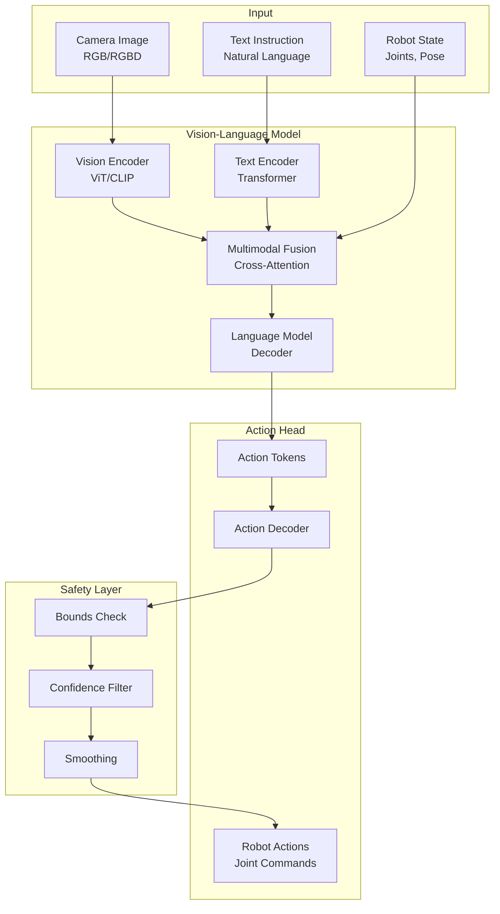
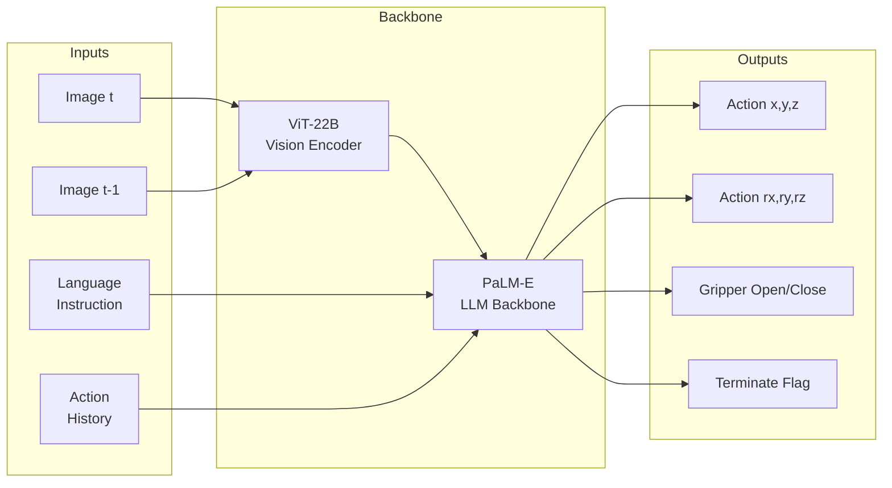
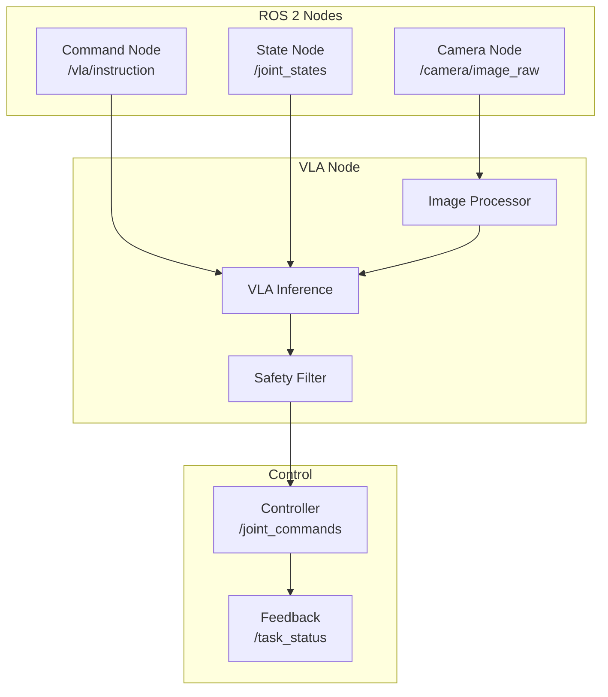

# Module 4 Specification: Physical AI – Vision-Language-Action Models

**Parent**: `specs/book.spec.md`
**Created**: 2026-01-07
**Status**: Draft
**Constitution**: `specs/constitution.md` (v1.0.0)
**Duration**: Weeks 7-8
**Prerequisites**: Module 3 (AI-Robot Brain – NVIDIA Isaac)

---

## Overview

The Physical AI module teaches how to integrate vision-language models with robot actions for natural language task execution. Students build systems where robots understand multimodal instructions and execute physical tasks in simulation and real-world environments.

**Vision-Language-Action (VLA) Models** enable:
- Natural language understanding for robot commands
- Visual scene interpretation and grounding
- Action sequence generation from instructions
- End-to-end learning from demonstrations
- Zero-shot generalization to new tasks

---

## Learning Objectives

By completing this module, students will be able to:

| ID | Objective | Assessment |
|----|-----------|------------|
| LO-4.1 | Explain VLA architectures and design principles | Quiz |
| LO-4.2 | Set up vision-language model inference pipeline | VLM running |
| LO-4.3 | Implement action tokenization for robot control | Action tokens generated |
| LO-4.4 | Ground language instructions to robot observations | Grounding working |
| LO-4.5 | Build end-to-end VLA inference pipeline | Pipeline processes commands |
| LO-4.6 | Integrate VLA with ROS 2 for robot control | Robot responds to text |
| LO-4.7 | Apply safety constraints to VLA outputs | Constraints enforced |
| LO-4.8 | Fine-tune VLA on custom robot data | Improved task success |
| LO-4.9 | Evaluate VLA performance on manipulation tasks | Metrics computed |
| LO-4.10 | Deploy VLA system for real-time operation | <2s latency achieved |

---

## Concepts

### Vision-Language Model Concepts

| Concept | Definition | Why It Matters |
|---------|------------|----------------|
| **VLM** | Vision-Language Model | Multimodal understanding |
| **CLIP** | Contrastive Language-Image Pre-training | Image-text alignment |
| **LLaVA** | Large Language-and-Vision Assistant | Visual reasoning |
| **PaLM-E** | Embodied multimodal model | Robot instruction following |
| **Tokenization** | Converting inputs to discrete tokens | Model processing |

### VLA Architecture Concepts

| Concept | Definition | Why It Matters |
|---------|------------|----------------|
| **RT-1** | Robotics Transformer | Large-scale robot learning |
| **RT-2** | Vision-Language-Action Model | Language-conditioned actions |
| **OpenVLA** | Open-source VLA implementation | Accessible VLA research |
| **Action Tokens** | Discretized robot actions | Enables autoregressive generation |
| **Co-fine-tuning** | Joint vision-language-action training | Embodied understanding |

### Grounding Concepts

| Concept | Definition | Why It Matters |
|---------|------------|----------------|
| **Language Grounding** | Connecting words to physical world | Task understanding |
| **Visual Grounding** | Localizing objects from descriptions | Target identification |
| **Spatial Reasoning** | Understanding 3D relationships | Navigation/manipulation |
| **Affordance** | Action possibilities of objects | Appropriate actions |
| **Object Detection** | Finding objects in images | Scene understanding |

### Safety Concepts

| Concept | Definition | Why It Matters |
|---------|------------|----------------|
| **Action Bounds** | Limits on robot movements | Hardware safety |
| **Workspace Limits** | Operational boundaries | Environment safety |
| **Confidence Thresholds** | Minimum certainty for actions | Reliable execution |
| **Human Override** | Emergency stop mechanisms | Operator safety |
| **Anomaly Detection** | Identifying unexpected situations | Failure prevention |

---

## System Architecture

### VLA Pipeline Architecture



### RT-2 Style Architecture



### ROS 2 Integration Architecture



### Package Structure

```
humanoid_vla_ws/
├── src/
│   ├── humanoid_vla/               # VLA integration
│   │   ├── models/
│   │   │   ├── openvla_wrapper.py  # OpenVLA interface
│   │   │   ├── action_tokenizer.py # Action discretization
│   │   │   └── vision_encoder.py   # Image processing
│   │   ├── inference/
│   │   │   ├── vla_pipeline.py     # End-to-end pipeline
│   │   │   └── batch_inference.py  # Batched processing
│   │   ├── safety/
│   │   │   ├── action_filter.py    # Safety constraints
│   │   │   └── workspace_bounds.py # Workspace limits
│   │   ├── launch/
│   │   │   └── vla_demo.launch.py
│   │   └── package.xml
│   │
│   ├── humanoid_vla_ros/           # ROS 2 interface
│   │   ├── src/
│   │   │   ├── vla_node.py         # Main inference node
│   │   │   ├── camera_processor.py # Image preprocessing
│   │   │   └── command_interface.py# Text command handling
│   │   ├── msg/
│   │   │   ├── VLACommand.msg
│   │   │   └── VLAAction.msg
│   │   ├── srv/
│   │   │   └── ExecuteTask.srv
│   │   └── package.xml
│   │
│   └── humanoid_vla_sim/           # Simulation testing
│       ├── worlds/
│       │   └── manipulation_scene.world
│       ├── scenarios/
│       │   ├── pick_place.yaml
│       │   └── object_search.yaml
│       └── package.xml
│
├── models/                          # Pretrained models
│   ├── openvla-7b/
│   └── clip-vit-large/
│
└── data/                           # Training data
    ├── demonstrations/
    └── evaluation/
```

---

## Chapter Breakdown

### Chapter 1: Introduction to Vision-Language-Action Models

**Duration**: 3-4 hours

**Topics**:
- Evolution from VLMs to VLAs
- Key architectures: RT-1, RT-2, OpenVLA, PaLM-E
- Embodied AI principles
- Comparison with traditional robot control
- Current state and limitations

**Hands-On**:
- Survey of VLA papers and demos
- Run OpenVLA demo inference
- Visualize attention maps

**Required Output**:
- Understanding of VLA landscape
- OpenVLA demo running
- Attention visualization

---

### Chapter 2: Vision-Language Model Foundations

**Duration**: 4-5 hours

**Topics**:
- CLIP architecture and training
- Vision Transformers (ViT)
- Large Language Models for embodiment
- Multimodal fusion strategies
- Pre-training objectives

**Hands-On**:
- Load and run CLIP inference
- Extract image and text embeddings
- Compute similarity scores
- Visualize embedding spaces

**Required Output**:
- CLIP inference working
- Embedding extraction code
- Similarity computation demo

---

### Chapter 3: Action Tokenization and Representation

**Duration**: 4-5 hours

**Topics**:
- Why discretize continuous actions?
- Tokenization strategies (bins, k-means, learned)
- Action vocabulary design
- Temporal action sequences
- Decoding action tokens

**Hands-On**:
- Implement action tokenizer:
  - Position bins (256 per axis)
  - Rotation bins (256 per axis)
  - Gripper states (open/close)
- Train tokenizer on robot data
- Evaluate reconstruction error

**Required Output**:
- `action_tokenizer.py` module
- Trained tokenizer checkpoint
- Reconstruction evaluation

---

### Chapter 4: Language Grounding for Robotics

**Duration**: 5-6 hours

**Topics**:
- Grounding natural language to observations
- Object detection and localization
- Spatial relationship understanding
- Reference resolution ("the red block")
- Ambiguity handling

**Hands-On**:
- Build grounding pipeline:
  - Object detection (YOLO/DETR)
  - Text-image matching
  - Bounding box extraction
- Test on manipulation scenes
- Handle referring expressions

**Required Output**:
- Grounding pipeline working
- Object localization demo
- Referring expression tests

---

### Chapter 5: Building the VLA Inference Pipeline

**Duration**: 5-6 hours

**Topics**:
- VLA model architecture deep dive
- Input preprocessing
- Forward pass implementation
- Output postprocessing
- Batching and optimization

**Hands-On**:
- Implement VLA pipeline:
  ```python
  class VLAPipeline:
      def __init__(self, model_path):
          self.vision_encoder = load_vision_encoder()
          self.text_encoder = load_text_encoder()
          self.action_decoder = load_action_decoder()

      def predict(self, image, instruction, state):
          vis_tokens = self.vision_encoder(image)
          txt_tokens = self.text_encoder(instruction)
          action_tokens = self.action_decoder(vis_tokens, txt_tokens, state)
          return self.decode_actions(action_tokens)
  ```
- Optimize for inference speed
- Profile GPU memory usage

**Required Output**:
- `vla_pipeline.py` working
- Inference benchmark results
- Memory usage report

---

### Chapter 6: ROS 2 VLA Node Implementation

**Duration**: 5-6 hours

**Topics**:
- ROS 2 node design for VLA
- Camera and sensor integration
- Command interfaces (topics, services)
- Real-time considerations
- State machine for task execution

**Hands-On**:
- Implement VLA ROS 2 node:
  - Subscribe to `/camera/image_raw`
  - Subscribe to `/vla/instruction`
  - Subscribe to `/joint_states`
  - Publish to `/joint_commands`
  - Service for task execution
- Test with simulation

**Required Output**:
- `vla_node.py` implementation
- Message/service definitions
- Launch file
- Simulation test

---

### Chapter 7: Safety Constraints and Action Filtering

**Duration**: 4-5 hours

**Topics**:
- Why safety constraints matter
- Joint limit enforcement
- Workspace boundary checking
- Velocity and acceleration limits
- Confidence-based filtering
- Human-in-the-loop mechanisms

**Hands-On**:
- Implement safety layer:
  ```python
  class SafetyFilter:
      def __init__(self, config):
          self.joint_limits = config.joint_limits
          self.workspace = config.workspace_bounds
          self.max_velocity = config.max_velocity

      def filter(self, action, confidence):
          if confidence < self.min_confidence:
              return self.safe_stop()
          action = self.clip_joints(action)
          action = self.check_workspace(action)
          action = self.smooth_action(action)
          return action
  ```
- Test with adversarial inputs
- Implement emergency stop

**Required Output**:
- Safety filter module
- Adversarial test results
- Emergency stop demo

---

### Chapter 8: Fine-tuning VLA on Custom Data

**Duration**: 5-6 hours

**Topics**:
- Data collection for VLA
- Demonstration formats
- Fine-tuning strategies (LoRA, full)
- Training infrastructure
- Evaluation metrics

**Hands-On**:
- Collect demonstration data:
  - Record robot teleoperation
  - Pair with language instructions
  - Create train/val splits
- Fine-tune OpenVLA:
  - LoRA adaptation
  - 100-500 demonstrations
  - Monitor training loss
- Evaluate on held-out tasks

**Required Output**:
- Demonstration dataset
- Fine-tuned model checkpoint
- Evaluation results

---

### Chapter 9: Evaluation and Benchmarking

**Duration**: 4-5 hours

**Topics**:
- VLA evaluation metrics
- Task success rate measurement
- Generalization testing
- Failure mode analysis
- Comparison with baselines

**Hands-On**:
- Create evaluation suite:
  - Pick and place tasks
  - Object search tasks
  - Multi-step instructions
- Run systematic evaluation
- Analyze failure cases

**Required Output**:
- Evaluation suite code
- Benchmark results table
- Failure analysis report

---

### Chapter 10: End-to-End VLA Demo

**Duration**: 4-5 hours

**Topics**:
- System integration best practices
- Demo scenario design
- Real-time performance tuning
- Presentation and documentation
- Future directions

**Hands-On**:
- Build complete demo:
  - Gazebo manipulation scene
  - Multiple objects on table
  - Text command interface
  - Visual feedback display
- Record demo video
- Document system

**Required Output**:
- Working end-to-end demo
- Demo video recording
- System documentation

---

## Required Outputs Summary

### Model Deliverables

| Chapter | Deliverable | Verification |
|---------|-------------|--------------|
| Ch 1 | OpenVLA demo | Inference runs |
| Ch 2 | CLIP embeddings | Similarity works |
| Ch 3 | Action tokenizer | Reconstruction < 5% error |
| Ch 4 | Grounding pipeline | Objects localized |
| Ch 5 | VLA pipeline | End-to-end inference |

### ROS 2 Deliverables

| Chapter | Deliverable | Verification |
|---------|-------------|--------------|
| Ch 6 | VLA node | Responds to commands |
| Ch 6 | Custom messages | Build succeeds |
| Ch 7 | Safety filter | Constraints enforced |

### Training Deliverables

| Chapter | Deliverable | Verification |
|---------|-------------|--------------|
| Ch 8 | Demonstration data | 100+ episodes |
| Ch 8 | Fine-tuned model | Task success improves |
| Ch 9 | Evaluation suite | Metrics computed |
| Ch 10 | Complete demo | Video recorded |

### Package Deliverables

```
humanoid_vla_ws/src/
├── humanoid_vla/          # VLA models and inference
├── humanoid_vla_ros/      # ROS 2 integration
└── humanoid_vla_sim/      # Simulation scenarios
```

---

## User Scenarios & Testing

### User Story 1 - Text-to-Action (Priority: P1)

Student wants robot to execute actions from natural language commands.

**Why this priority**: Core VLA functionality, primary learning objective.

**Independent Test**: Robot picks up specified object when instructed.

**Acceptance Scenarios**:

1. **Given** VLA pipeline running, **When** "pick up the red block" sent, **Then** action sequence generated
2. **Given** action sequence, **When** executed in simulation, **Then** robot grasps red block
3. **Given** ambiguous instruction, **When** processed, **Then** system requests clarification

---

### User Story 2 - Visual Grounding (Priority: P1)

Student wants system to locate objects from text descriptions.

**Why this priority**: Foundation for task execution.

**Independent Test**: Correct bounding box returned for object query.

**Acceptance Scenarios**:

1. **Given** scene image, **When** "find the blue cup" queried, **Then** blue cup localized
2. **Given** multiple similar objects, **When** "the cup on the left" queried, **Then** correct cup identified
3. **Given** object not present, **When** queried, **Then** system reports "not found"

---

### User Story 3 - Safe Execution (Priority: P1)

Student wants robot actions to respect safety constraints.

**Why this priority**: Essential for any physical deployment.

**Independent Test**: Actions outside limits are rejected or clipped.

**Acceptance Scenarios**:

1. **Given** action exceeding joint limit, **When** filtered, **Then** action clipped to limit
2. **Given** low confidence prediction, **When** filtered, **Then** safe stop triggered
3. **Given** workspace violation, **When** detected, **Then** trajectory modified

---

### User Story 4 - Custom Fine-tuning (Priority: P2)

Student wants to adapt VLA to custom robot and tasks.

**Why this priority**: Enables practical applications.

**Independent Test**: Fine-tuned model outperforms base on custom tasks.

**Acceptance Scenarios**:

1. **Given** demonstration data collected, **When** fine-tuning runs, **Then** loss decreases
2. **Given** fine-tuned model, **When** tested on custom task, **Then** success rate > base model
3. **Given** limited data (100 demos), **When** fine-tuned, **Then** still improves

---

### User Story 5 - Real-time Operation (Priority: P2)

Student wants VLA system to run in real-time for closed-loop control.

**Why this priority**: Practical deployment requirement.

**Independent Test**: End-to-end latency < 2 seconds.

**Acceptance Scenarios**:

1. **Given** optimized pipeline, **When** processing single frame, **Then** latency < 500ms
2. **Given** command sent, **When** robot starts moving, **Then** response time < 2s
3. **Given** continuous operation, **When** running 5 minutes, **Then** no memory leaks

---

### Edge Cases

- What if object is occluded? (Report partial visibility, request viewpoint change)
- What if instruction is ambiguous? (Clarification request mechanism)
- What if model hallucinates actions? (Confidence filtering, bounds checking)
- What if GPU memory insufficient? (Model quantization guide, CPU fallback)

---

## Requirements

### Functional Requirements

- **FR-M4-001**: VLA pipeline MUST accept image + text + state inputs
- **FR-M4-002**: Action output MUST be in robot-executable format
- **FR-M4-003**: System MUST support both open and closed vocabulary tasks
- **FR-M4-004**: Safety filter MUST enforce joint limits
- **FR-M4-005**: Safety filter MUST enforce workspace boundaries
- **FR-M4-006**: System MUST provide confidence scores for actions
- **FR-M4-007**: ROS 2 integration MUST use standard message types
- **FR-M4-008**: System MUST support emergency stop

### Non-Functional Requirements

- **NFR-M4-001**: End-to-end latency < 2 seconds
- **NFR-M4-002**: GPU memory usage < 16GB
- **NFR-M4-003**: Model loading time < 60 seconds
- **NFR-M4-004**: Task success rate > 60% on benchmark tasks
- **NFR-M4-005**: System MUST run stable for 30+ minutes

---

## Success Criteria

- **SC-M4-001**: OpenVLA inference runs successfully
- **SC-M4-002**: Action tokenizer achieves < 5% reconstruction error
- **SC-M4-003**: Grounding localizes objects with > 80% accuracy
- **SC-M4-004**: VLA pipeline processes commands in < 2 seconds
- **SC-M4-005**: Safety filter catches 100% of limit violations
- **SC-M4-006**: ROS 2 node runs at stable 10 Hz
- **SC-M4-007**: Fine-tuned model improves task success by > 20%
- **SC-M4-008**: End-to-end demo completes pick-place task

---

## Dependencies

### Prerequisites

- Module 3 completed (NVIDIA Isaac)
- Humanoid simulation environment
- Understanding of transformers and LLMs

### Software Dependencies

- PyTorch 2.0+
- Transformers library (Hugging Face)
- OpenVLA or similar VLA implementation
- CLIP (openai/clip)
- ROS 2 Humble
- Gazebo Fortress/Garden
- CUDA 11.8+

### Hardware Requirements

| Component | Minimum | Recommended |
|-----------|---------|-------------|
| CPU | 8 cores | 16 cores |
| RAM | 32 GB | 64 GB |
| GPU | RTX 3080 (10GB) | RTX 4090 (24GB) |
| VRAM | 16 GB | 24 GB |
| Storage | 200 GB SSD | 500 GB NVMe |

### Model Requirements

| Model | Size | Purpose |
|-------|------|---------|
| OpenVLA-7B | ~15GB | Main VLA model |
| CLIP ViT-L | ~1.5GB | Vision encoder |
| LLaMA-7B | ~13GB | Optional LLM backbone |

---

## Glossary

| Term | Definition |
|------|------------|
| VLA | Vision-Language-Action model |
| VLM | Vision-Language Model |
| RT-2 | Robotics Transformer 2, Google's VLA |
| OpenVLA | Open-source VLA implementation |
| CLIP | Contrastive Language-Image Pre-training |
| ViT | Vision Transformer |
| Grounding | Connecting language to physical world |
| Action Token | Discretized representation of robot action |
| LoRA | Low-Rank Adaptation for fine-tuning |
| CoT | Chain-of-Thought reasoning |

---

## Research References

1. **RT-1**: Brohan et al., "RT-1: Robotics Transformer for Real-World Control at Scale" (2022)
2. **RT-2**: Brohan et al., "RT-2: Vision-Language-Action Models Transfer Web Knowledge to Robotic Control" (2023)
3. **PaLM-E**: Driess et al., "PaLM-E: An Embodied Multimodal Language Model" (2023)
4. **OpenVLA**: Kim et al., "OpenVLA: An Open-Source Vision-Language-Action Model" (2024)
5. **CLIP**: Radford et al., "Learning Transferable Visual Models From Natural Language Supervision" (2021)
6. **Gato**: Reed et al., "A Generalist Agent" (2022)

---

## Related Files

- `specs/module4-vla.spec.md` - This specification
- `specs/module4-vla.plan.md` - Architecture decisions (to create)
- `specs/module4-vla.tasks.md` - Implementation tasks (to create)

---

**Governed by**: `specs/constitution.md` v1.0.0
